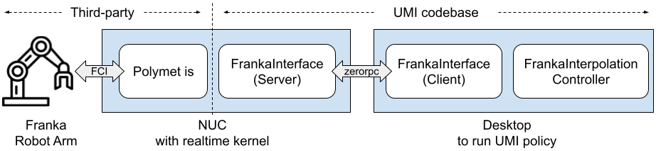

# AM_UMI：手持夹爪与 AM2Pro 项目文档

> **本文档是项目的唯一进度档案**：记录所有已完成工作、关键决策、文件变更和待办。
> **规则：之后的每次修改、测试、决策都必须同步更新本文档**（尤其「更新日志」一节）。
> **快速了解当前进展**：[PROJECT_SUMMARY.md](https://github.com/Zzzuuu111/AM_UMI/blob/am-umi-docs/umi/PROJECT_SUMMARY.md)；本文件保留完整依据。
>
> **文档入口**：本文件同时收录项目说明、运行手册、当前清单、标定、故障与历史设计。可直接跳到[合并文档目录](#project-doc-index)。
> 旧文档名仅作为历史来源标识；执行前应优先核对第 16 节和对应章节的更新日期。
> **当前采集硬件**：手持夹爪 + EMEET UVC 相机 + JY901B IMU。Osmo Action 4 是早期试验路线，相关问题和排查记录保留在历史章节。
>
> 仓库地址（2026-08-25 起）：
> - 主仓库（私有）：https://github.com/Zzzuuu111/umi-ampro2
> - ORB_SLAM3 fork（IMU 初始化开关等 4 个补丁）：https://github.com/Zzzuuu111/ORB_SLAM3
> - [新机搭建清单](#archive-04)：代码、环境、大文件与验证步骤

---

## 1. 项目目标

**一句话目标**：用装有 EMEET UVC 相机和 JY901B IMU 的手持夹爪采集示教数据，训练操作策略，再由 AM2Pro 机器人自主执行桌面任务。

**完整数据闭环**：

```
① 采集端        ② 数据处理        ③ 训练           ④ 部署
手持夹爪   →   UMI 管线      →   训练策略模型   →   驱动 AM2Pro
+ EMEET/IMU   （轨迹/标定 +      （diffusion     （先单臂验证，
（第一视角采集）  数据集打包）      policy）        后续双臂部署）
```

**三段硬件与目的**：

| 阶段 | 硬件 | 目的 |
|---|---|---|
| ① 数据采集 | **手持夹爪 + EMEET UVC 相机 + JY901B IMU** | 录制人类演示：视频、IMU、夹爪轨迹与开合 |
| ②③ 数据处理与训练 | 电脑（conda `AM_UMI` 环境 + UMI 管线）| 演示数据 → replay buffer → 训练扩散策略 |
| ④ 策略部署 | **单臂 AM2Pro**（USB 直连电脑）或 **双臂树莓派 AM2Pro**（LeRobot AlohaMini2/pro，Feetech 舵机）| 训练好的策略驱动机器人自主复现任务 |

**迁移背景**：把 UMI（Universal Manipulation Interface）的数据采集和训练管线从原版 GoPro + UR5/Franka 适配到手持 EMEET/JY901B + AM2Pro。Osmo Action 4 的试验和踩坑属于历史记录。**当前阶段**：30 条示教数据训练、离线轨迹评估，以及后续受监督的单臂实机验证；双臂部署留待后续。

---

## 2. 关键决策记录（按时间）

本节前期相机、Gyroflow 和 SLAM 决策记录的是 Osmo Action 4 历史试验；当前 EMEET/JY901B 路线以第 15–16 节及“当前剩余工作清单”章节为准。

| # | 决策 | 结论 | 理由 |
|---|---|---|---|
| 1 | 相机 FOV 模式 | **用 Wide（广角 130°）**，弃用超广角 155° | Gyroflow 只支持 Wide 的陀螺仪；超广角 dbgi 是 DJI 私有编码，逆向多轮无果。Wide 130° 视场对桌面操作够用 |
| 2 | 内参标定方案 | 自写 scipy 鱼眼 BA（`scripts/calibrate_fisheye_intrinsics.py`） | OpenCV `cv2.fisheye.calibrate` 在该相机/板子上反复失败（OpenCV 4.7 已知 bug + 大板子收敛问题）|
| 3 | IMU 提取方案 | **Gyroflow 导出 CSV → 自写转换脚本**，弃用 dbgi 逆向 | Wide 模式 Gyroflow 官方支持；四元数微分出陀螺仪（已验证积分≈90°）；加速度用合成重力近似 |
| 4 | SLAM 模式 | 沿用 fork 的 `IMU_MONOCULAR`（gopro_slam 硬编码，无纯单目）| `--input_imu_json` 必填，故必须提供 IMU 数据 |
| 5 | 尺度来源 | IMU 重力（合成）+ ArUco tag 13 初始化（gopro_slam 默认 `init_tag_id=13`，size=0.16）| fork 自带 tag 初始化 |
| 6 | 机器人接入顺序 | **先单臂 USB 直连电脑 → 验证后再迁树莓派双臂** | 核心代码（URDF/IK/Controller）与连接方式无关；直连调试快、变量少；迁移只是改 lerobot 配置端口 |
| 7 | 训练硬件 | ⚠️ **待确认 GPU 型号**（`nvidia-smi` 未查）| 决定训练方案与速度 |

---

## 3. 当前状态总览

### ✅ 已完成（实测验证）

| 环节 | 状态 | 关键结果 |
|---|---|---|
| Docker + SLAM 镜像 | ✅ | `chicheng/orb_slam3:latest` 已拉取（配国内镜像源）|
| Wide 内参标定 | ✅ | f=1054.20，cx=1344.19，cy=990.63，k1..k4=0.174/0.079/0.002/-0.044，**重投影 0.74px** |
| IMU 管线 | ✅ | Gyroflow CSV → `imu_data.json`（gopro_slam 格式），SLAM 接受无格式错误 |
| SLAM 建图（02）| ✅ 链路通 | 4434 帧处理，**建出 1 个地图（21 KF）**；⚠️ 跟踪仅末尾 ~2.7s（录像动作问题）|
| ArUco 检测（04）| ✅ | Wide 内参 + 0012 视频：**3948/4434 帧（89%）检测到 tag 13** |
| 管线脚本 00~07 | ✅ 全部适配 | 见第 6 节明细 |

### ⏳ 待办（按顺序）

1. ~~AM2Pro 单臂 USB 直连~~ → **✅ 已完成（2026-08-19）：第 1~4 层验证全过，IK 闭环误差 3.6mm**（见第 12 节）
2. 相机装上 AM2Pro → 按实际视场重画 SLAM 掩码
3. 重录规范 mapping 视频（平移为主、慢而稳）
4. 录 gripper calibration（相机在夹爪、开合夹爪）
5. 双臂迁树莓派 → 录遥操作 demo（每任务 50~100 条）
6. 跑完整管线 02→07 → 训练 → `eval_real.py` 部署

### ⚠️ 已知遗留问题（不阻塞，影响精度）

1. **加速度是合成重力**（无真实线性加速度）→ SLAM 偶发 `scale too small`。~~后续可选：解 dbgi field5 真加速度~~ / 外置 IMU。**2026-08-25 定论：dbgi 不含真加速度（见第 13 节），文件内只能拿到 ~1000Hz 融合姿态；真加速度只能外置 IMU**
2. **`IMU.T_b_c1` 是单位矩阵占位**（settings YAML）——手持慢速扫图可容忍，精度要求高时需 Kalibr
3. **SLAM 掩码按 GoPro 腕带结构画的**（mirror/finger 区域），AM2Pro 实装后需重画
4. 当前 mapping 视频跟踪短 → 录像动作需改进（见第 8 节）

---

## 4. 环境配置

- **系统**：Ubuntu 22.04.5 LTS，x86_64，ASUS V16 笔记本
- **Python**：conda env `umi`（`/home/zzzjh/anaconda3/envs/umi`）
- **Docker**：已安装 + 用户已加入 docker 组 + 国内镜像源（`/etc/docker/daemon.json`）
- **PyExifTool**：`pip install PyExifTool==0.5`（导入名 `from exiftool import ExifToolHelper`）
- **exiftool 修复**：`ln -sfn ~/anaconda3/envs/umi/lib/perl5/site_perl ~/anaconda3/envs/umi/bin/lib`
- **Gyroflow**：Linux 版装在 `~/Gyroflow/`，启动：`cd ~/Gyroflow && LD_LIBRARY_PATH=$PWD/lib ./gyroflow`（依赖 `libc++1`/`libc++abi1`，apt 安装）
- **lerobot**：`/home/zzzjh/lerobot_alohamini`（AM2Pro 专用分支）

---

## 5. 相机与标定

### 相机设置（所有录制统一）

| 参数 | 值 |
|---|---|
| FOV | **广角（Wide）** |
| 画幅 | **4:3**，2.7K（2688×2016）|
| 帧率 | 60fps（实际 59.94）|
| 防抖 | **关闭**（RockSteady/EIS 全关）|
| 畸变校正 | 关 |

### Wide 内参（当前有效）

- 文件：`calibration/osmo4_intrinsics_wide.json`（UMI `FISHEYE/focal_length` 格式）
- f=1054.1976，cx=1344.1871，cy=990.6321，k1..k4 = 0.17367/0.07852/0.00181/-0.04352
- 标定视频：`DJI_20260819095555_0008_D.MP4`，重投影误差 0.74px（最佳 0.45px）
- SLAM 用 960×720 缩尺版本：`calibration/osmo4_fisheye_setting_v1_720.yaml`（fx=fy=376.5，cx=480.07，cy=353.80）

### 标定重录条件

相机设置不变则内参长期有效。以下情况需重录标定视频并重跑标定：
- 改了 FOV/画幅/防抖设置；换镜头；机械碰撞后
- 对精度不满意（当前 0.74px 已接近原版 0.29px 水平，够用）

---

## 6. 管线脚本适配明细（00→07）

| 脚本 | 改动 | 验证 |
|---|---|---|
| `scripts_slam_pipeline/00_process_videos.py` | ① `timecode_util.py` 支持 DJI 时间码 `;` 分隔 ② 序列号缺失回退 `'OSMO4'` | ✅ 实测：视频正确归档为 mapping.mp4 |
| `01_extract_gopro_imu.py` | **弃用**，由 Gyroflow 工作流替代（见第 7 节）| — |
| `scripts_slam_pipeline/02_create_map.py` | ① 掩码尺寸 2028×2704→**2016×2688** ② 挂载 `osmo4_fisheye_setting_v1_720.yaml` 进容器 | ✅ 实测：建出 21 KF 地图 + 轨迹 CSV |
| `scripts_slam_pipeline/03_batch_slam.py` | 同 02（掩码 + settings 挂载）| ✅ 语法检查通过 |
| `scripts_slam_pipeline/04_detect_aruco.py` | 无需改（内参 json 已兼容）| ✅ 实测：3948/4434 帧检出 tag 13 |
| `scripts_slam_pipeline/05_run_calibrations.py` | 无需改 | ✅ 核查无相机硬编码 |
| `scripts_slam_pipeline/06_generate_dataset_plan.py` | 序列号 `.get(..., 'OSMO4')` 回退（2 处）| ✅ 语法检查通过 |
| `scripts_slam_pipeline/07_generate_replay_buffer.py` | 内参文件名自动查找（gopro → osmo4_wide → osmo4_2_7k）| ✅ 语法检查通过 |

其他修改：
- `umi/common/timecode_util.py`：时间码 `;` → `:` 修复
- `umi/common/cv_util.py`：charuco 板默认 30mm 方格/18mm tag（A4 可打印）
- `calibration/aruco_config.yaml`：修复 `predefind` 拼写错误
- `scripts/gen_aruco_tag_pdf.py`：修复同款拼写错误

---

## 7. IMU 工作流（每段视频都要走）

```
1. Gyroflow 打开视频 → 确认波形 → Export data 导出 CSV
2. python scripts/gyroflow_csv_to_imu_json.py -i <csv> -o <video同级目录>/imu_data.json
3. 02_create_map.py / 03_batch_slam.py 自动使用同目录的 imu_data.json
```

- 原理：CSV 的 `org_quat` 四元数**微分**→ 陀螺仪（rad/s）；加速度 = **合成重力**（R⁻¹×[0,0,-9.81]）
- 输出格式满足 gopro_slam `LoadTelemetry`：`{"1":{"streams":{"ACCL":{"samples":[...]}, "GYRO":{...}, "CORI":{...}}}}`
- 已用 009 视频验证：四元数积分 -83.7° ≈ 90° ✓；SLAM 接受无格式错误 ✓

---

## 8. 录像规范

### mapping（建图）视频

- Wide、4:3、2.7K、60fps、防抖关
- 桌面贴 **tag 13（160mm）**，放有纹理的物体（SLAM 要特征点，纯白桌面会失败）
- 手持/机上相机朝下 ~45° 看桌面
- **平移为主**（前后左右移动），慢而稳，**不要原地旋转、不要甩动**
- 全程 tag 尽量入画，1~2 分钟

### gripper calibration 视频

- 相机装在夹爪上，画面能看见 tag
- 缓慢移动 + **开合夹爪**（供夹爪开度标定）

### 标定（内参）视频

- 固定相机不动，**只移动 charuco 板**（卷帘快门：相机动会毁标定）
- 板子扫满画面四角 + 倾斜，1~2 分钟

---

## 9. 工作速查命令

```bash
# 环境
conda activate umi
export PERL5LIB=~/anaconda3/envs/umi/lib/perl5/site_perl   # 若未做 symlink

# 内参标定
python scripts/calibrate_fisheye_intrinsics.py -i "<标定视频.mp4>" -o calibration/osmo4_intrinsics_wide.json

# IMU 转换
python scripts/gyroflow_csv_to_imu_json.py -i "<Gyroflow导出.csv>" -o "<视频同目录>/imu_data.json"

# 建图（session 目录结构: <session>/demos/mapping/{raw_video.mp4, imu_data.json}）
python scripts_slam_pipeline/02_create_map.py -i <session>/demos/mapping -np

# tag 检测（-i 指向 demos 目录）
python scripts_slam_pipeline/04_detect_aruco.py -i <session>/demos -ci calibration/osmo4_intrinsics_wide.json -ac calibration/aruco_config.yaml

# 手眼标定
python scripts_slam_pipeline/05_run_calibrations.py <session>
```

---

## 10. 文件清单

### 新建（本项目中）

| 文件 | 用途 |
|---|---|
| `PROJECT_PROGRESS.md` | 本文档（项目进度唯一档案）|
| `OSMO_ACTION4_ADAPTATION_PLAN.md` | 相机适配计划 + 状态表 |
| `HARDWARE_ADAPTATION_PLAN.md` | AM2Pro 机器人适配计划 |
| `scripts/calibrate_fisheye_intrinsics.py` | scipy 鱼眼 BA 内参标定（输出 UMI 格式 json）|
| `scripts/gyroflow_csv_to_imu_json.py` | Gyroflow CSV → gopro_slam imu json |
| `scripts/extract_dji_imu.py` | DJI dbgi 提取器（**已弃用**，保留供参考）|
| `calibration/osmo4_intrinsics_wide.json` | Wide 内参（当前有效）|
| `calibration/osmo4_intrinsics_2_7k.json` | 超广角内参（已弃用）|
| `calibration/osmo4_fisheye_setting_v1_720.yaml` | SLAM settings（Wide 960×720）|

### 修改（UMI 原版）

`umi/common/cv_util.py`、`umi/common/timecode_util.py`、`scripts_slam_pipeline/00_process_videos.py`、`02_create_map.py`、`03_batch_slam.py`、`06_generate_dataset_plan.py`、`07_generate_replay_buffer.py`、`calibration/aruco_config.yaml`、`scripts/gen_aruco_tag_pdf.py`

### 测试数据

- `DJI_20260819095555_0008_D.MP4` —— Wide 标定视频
- `DJI_20260819100546_0009_D.MP4` —— Wide 90° 旋转（IMU 验证）
- `DJI_20260819110551_0012_D.MP4` —— Wide mapping 尝试（跟踪短）
- `Osma Action 4 Wide.csv` / `Osma Action 4 Wide2.csv` —— Gyroflow 导出
- `example_slam_test/` —— SLAM 测试 session

---

## 11. 更新日志

| 日期 | 内容 |
|---|---|
| 2026-08（前期）| 内参标定脚本（scipy BA）、超广角尝试、charuco 板、tag 打印 |
| 2026-08-18 | 00 脚本适配 + 测试通过；docker 安装 + 镜像拉取；发现超广角陀螺仪不可用 |
| 2026-08-18 | 决策切 Wide；重录标定（0.74px）；Gyroflow 验证波形 + 导出 CSV |
| 2026-08-18 | 写 `gyroflow_csv_to_imu_json.py`（四元数微分 + 合成重力）；02 适配 + SLAM 冒烟测试 |
| 2026-08-19 | 0012 mapping 视频：SLAM 建出 21 KF 地图（跟踪短，录像动作问题）|
| 2026-08-19 | 04 实测通过（3948/4434 帧检出 tag）；03/06/07 适配完成；session calibration 目录建好 |
| 2026-08-19 | 确立后续路线：机器人控制先行（单臂直连 → 树莓派双臂）；建本文档 |
| 2026-08-19 | **AM2Pro 单臂直连验证全过**：串口 ttyACM0 ✅、7 舵机标定读取 ✅、位置读回 ✅、**IK 闭环 3.6mm 误差** ✅、**夹爪开合误差 <0.3mm** ✅（详见第 12 节）|
| 2026-08-24 | 相机装机完成（`DJI_20260824094153_0013_D.MP4` 测试视频）；**SLAM 掩码定制**：用帧时序方差分析测得"相机刚体区（夹爪+臂）"= 画面底部 ~30%，据此把 02/03 掩码改为**底部 35% 横条**、**去掉 mirror 遮罩**（AM2Pro 无反光镜）；`detect_aruco.py` 同步去掉 mirror 遮罩 |
| 2026-08-24 | 新建 **`mapping_run/` 一键建图文件夹**：`run_mapping.sh`（视频+CSV → session → IMU → 02 建图 → 04 tag 检测 → 05 手眼标定 → 结果摘要）+ README；待用 0014 视频 + Wide3.csv 跑正式建图 |
| 2026-08-24 | **0014 建图结果：地图仅 5 KF、跟踪 1%**。定位根因：合成加速度=纯重力 → IMU 初始化不收敛 → Tracking.cc:1832 的"IMU 未初始化即重置地图"逻辑反复清图（tag 检测 20%、05 标定因轨迹差而崩）。**纠正录制建议：合成 IMU 需要旋转激励**（重力方向变化才有加速度信号），"平移为主"对合成 IMU 是错的。定两条路：A=重录旋转丰富的建图视频（免费快试）；B=改 fork C++ 去掉 IMU 初始化硬要求（tag 13 定尺度），重编自定义 docker 镜像（根治）。顺手修 `05_run_calibrations.py` 不检查子进程返回码的 bug |
| 2026-08-24 | **路线 B 补丁完成（共 5 处，3 个 commit）**：克隆 fork 至 `ORB_SLAM3_umi/`。commit da8bb68（Tracking.cc×3）：TrackLocalMap 统一 15 内点；丢跟踪<1s 且 IMU 未初始化不重置；LOST 时小图重置阈值 10→2 KF。commit 4a67541→151be71（LocalMapping/LoopClosing）：**IMU 初始化改为环境变量开关** `ORB_SLAM3_DISABLE_IMU_INIT=1`（合成重力会污染 tag 定好的尺度；同一镜像真 IMU 时不设变量即恢复原版行为）+ 地图合并惯性优化仅 IMU 已初始化时执行。02/03 新增 `--disable_imu_init/--enable_imu_init` 选项（默认开，自动给 docker 传环境变量，对官方镜像无害）。新增 `mapping_run/build_nomu_image.sh`；`run_mapping.sh` 自动优先用新镜像、无则回退官方。**效果：建图不再需要 IMU 初始化，尺度由 tag 13 锚定；代价是单目尺度漂移 ~1~3%（桌面任务可接受）；真 IMU 拿到后无需重编镜像** |
| 2026-08-24 | **镜像构建踩坑**：首次构建 Step 6 失败——`Thirdparty/Pangolin` 是 git 子模块，浅克隆未拉取（目录为空）。GitHub 直连超时，经 **ghfast.top 镜像**克隆并 checkout 到父仓库要求的精确版本 d4844946（install_prerequisites.sh 确认存在）。`build_nomu_image.sh` 已加子模块缺失检查 + 修复提示。**二次踩坑：`make -j` 无限并行 → 12 核 15GB 内存机器卡死**，改 `make -j4`（commit a128050）后重跑 |
| 2026-08-25 | **镜像构建成功 ✅**：`umi_orb_slam3_nomu:latest`（built d422ca329ff3）。三次踩坑全解决：① Pangolin 子模块经 ghfast.top 镜像补齐；② `make -j2` 防主机卡死；③ `--memory 6g` 太小导致 `Killed cc1plus` → 放宽 9g；④ Dockerfile 拆 6 个独立 RUN 步（DBoW2/g2o/Sophus/Pangolin/词袋/ORB-SLAM3 各自缓存，失败不重头编译）。**下一步：用 0014+Wide3 重跑建图验证补丁效果（免重录）** |
| 2026-08-25 | **补丁镜像建图验证成功 🎉**（session_0824_152417，0014 平移视频）：跟踪 **68%（2925/4283 帧，此前 1%）**、最大地图 **19 KF**、日志确认 `[patch] IMU initialization disabled; map scale is tag-anchored` + `keeping map (patched)`、**05 手眼标定成功产出 `tx_slam_tag.json`**（tag≈11cm，物理合理）。整条建图链路（视频→IMU→SLAM→tag→手眼标定）全部打通。遗留：atlas 含 4 个子图（3 次丢跟踪后重定位建新图），更平滑的录制可收敛为单图 |
| 2026-08-25 | **dbgi 深度逆向定论：文件里没有原始 IMU（见第 13 节）**。`imu_work/` 新增分析脚本与数据：`analyze_dbgi.py`、`analyze2.py`、`grid_search.py`、`parse_djmd.py`、`gyro_stream_0009.npz`、`dbgi_0009.bin`、`djmd_0009.bin` |
| 2026-08-25 | **代码上传 GitHub**：主仓库 `Zzzuuu111/umi-ampro2`（私有，适配 commit 5f4aa3f，73 文件）+ ORB_SLAM3 fork（4 补丁，master→a128050）。`.gitignore` 新增：超 100MB 原始视频、`ORB_SLAM3_umi/`、`spnav/`；推送方式 `git push github main` |
| 2026-08-25 | **环境/代码整合补全**：新增 `environment_umi_full.yml`、`environment_lerobot_alohamini.yml`、`environment_lerobot.yml`（3 个 conda 环境完整导出）、`SETUP.md`（新机一站式搭建清单）、`patches/lerobot_config_alohamini.patch`（lerobot 本地未提交改动备份，apply 方式见 SETUP.md）；git 增加 >100MB 文件 pre-commit 拦截钩子（本地生效） |
| 2026-08-26 | **重写第 1 节「项目目标」**：明确完整数据闭环——手持夹爪 + Action 4 采集演示 → UMI 管线处理 → 训练扩散策略 → 驱动单臂 AM2Pro / 双臂树莓派 AM2Pro 自主执行 |
| 2026-09-24 | 新建 `PROJECT_SUMMARY.md`，概括当前 V12 数据、epoch 140 离线评估、已知失败窗口与下一步；本文件继续保存完整实验与历史记录。 |
| 2026-10-08 | 第 16.15 节新增相同 32 个 train/val 窗口上的静止动作基线；模型整体优于静止，但少数验证窗口的启动与夹爪闭合选择明显错误。同步更新项目摘要。 |
| 2026-10-08 | 第 16.16 节增加 epoch 140 的 CPU 离线分段评估：训练与验证各 32 窗口，分别比较未来 1–4、5–8、9–16 点及静止基线。 |

## 13. DJI dbgi 逆向结论（2026-08-25，路径 A 定论）

**问题**：能否从 OA4 文件解出真 IMU（原始陀螺仪/加速度）？

**方法**（0009 视频，8.44s）：解析 MP4 `dbgi`/`djmd`/`tmcd` 流 → 逐字节结构分析 + 以 CSV 四元数微分角速度 ω(t) 与重力分量 R(t)·g 为"预言机"做布局网格搜索（~2000 种步长×相位×编码组合，含低通）→ 与官方 proto（telemetry-parser `dvtm_library.proto`）交叉验证。

**复查（同日二次确认，dbgi 包体 15 字段逐一枚举）**：

| 字段 | 内容 | 变化率 |
|---|---|---|
| 1 | 时间戳 varint (µs) | 每帧 |
| 2 | 传感器配置串 `OV48C40_BIN2_4032_3024_5994P_CPHY` | 恒定 |
| 3 | 拓扑串 `TPLG_OV48C40_VIDEO_4X3_2_7K_5994_QE` | 恒定 |
| 4 | 原"gyro 块"：`[8192Hz时钟24bit][段索引][int16]` 表格 | 30Hz，与运动无关 |
| 5 | 原"accel 块"：33B 头 + 低刷新数据 | 与运动无关（相关≤0.205）|
| 8 | 逐帧 float，按 ±1/256 单调斜坡（时钟漂移类）| 与 ω 无关 |
| 9 | 空 | — |
| 11 | **每帧姿态：vsync 计数 + 融合四元数 + 稳定化四元数**（与 djmd 一致的 60fps 版）| 每帧 |
| 13 | 小整数计数器组 | 与 ω 无关 |
| 14/17 | 静态查找表（65534×16、0/4/8/12…斜坡）| 恒定 |
| 15/16/18/19 | 校准曲线/参数表/64位计数器 | 缓慢更新 |

其余流与文件也已查尽：`djmd` = ~1000Hz 融合姿态 + 曝光/ISO/变焦/WB/朝向 + "DJI AC003" 设备元数据（无 accel/gyro 字段）；`tmcd` = SMPTE 时间码；SD 卡无 .dbgi/.srt 旁车文件；exiftool 无 IMU 标签。

**0014 深度交叉验证（2026-08-25）**：0014（71.5s，4283 帧）的 dbgi/djmd 结构与 0009 逐字段一致——dbgi 包体同样 15 字段（field 2/3 配置串、field 4 表头 `4064653333b340800101a001...` 与 0009 逐字节相同、field 5=3570B、field 11 逐帧姿态+vsync）；djmd FrameMeta 同样 [1,2,3,4] 字段、每帧 16-17 个融合四元数（~1000Hz）。**结论对全部录制数据成立，0009 非特例**。

**结论**：

| 流 | 内容 | 证据 |
|---|---|---|
| `djmd` | **~1000Hz 融合姿态四元数**（每帧 DeviceAttitude 数组 ≈19 个，全程 8426 个；ClipMeta `imu_sampling_rate=1000`）+ 每帧相机元数据（曝光/ISO/变焦/WB/朝向）+ "DJI AC003" 设备元数据 | protobuf 按 `dvtm_ac203.proto` 结构成功解析；四元数物理合理（初始倾角 ~60°）；**CSV 的 org_quat 与其相对旋转恒定**（同信号不同坐标系）|
| `dbgi` field 4（原称"gyro 块"）| **传感器校准/调试表，非 IMU**：6B 记录 `[A24 时钟][段索引][int16]`，A24 以 2^19 步进（8192Hz 时钟），内容 30Hz 刷新但**与运动无关** | 静止/旋转包统计不变；全部布局与 ω 相关 ≤0.48（噪声）；记录内部呈表格分段结构 |
| `dbgi` field 5（原称"accel 块"）| **同属校准表**：33B 固定头 + 低刷新数据 | 与旋转幅度相关 ≤0.205；无重力签名；逐字节位置变化率 ≤17% |

**含义**：
1. **相机不记录原始 IMU，只记录融合姿态**——独立印证了 Gyroflow 官方文档（"DJI doesn't record the IMU data directly. It only contains Quaternions"）。
2. **路径 A（解 dbgi 真加速度）判定不可行**：数据不存在于文件中。真加速度只能靠外置 IMU。
3. 现有管线（Gyroflow CSV → 四元数微分陀螺仪 + 合成重力）**已经拿到了相机能提供的最好数据**（~1000Hz 融合姿态）；可优化项：写 `djmd 直解析脚本`替代 Gyroflow GUI 导出（免 GUI 步骤、拿精确 µs 时间戳），但不增加新信息。
4. **SLAM 侧根治**（路线 B，已实现）：`ORB_SLAM3_DISABLE_IMU_INIT=1` 环境变量开关 + 自定义镜像，尺度由 tag 13 锚定。与本节结论一致：没有真 IMU 可用时这就是终点方案。

**遗留**：若未来精度仍不足 → 外置 IMU（ESP32+BNO085 等，刚性装于相机，LED 闪光/时间码同步，Kalibr 标 T_b_c1）。

## 14. 外置 IMU 路线（JY901B，2026-08-25 起）

**背景**：第 13 节定论 OA4 文件无原始 IMU → 真加速度只能外置。用户现有 **维特智能 JY901B**（亚博渠道，CP2102 USB 串口）。

**已攻克**：
| 项 | 结果 |
|---|---|
| 设备识别 | ✅ CP2102 → `/dev/ttyUSB0`（ModemManager 曾抢占端口，已 stop+disable；sudo 配置文件属主曾损坏，已修复）|
| 数据协议 | WitMotion JY901 系：`0x55 0x51/0x52/0x53/0x54` 11 字节帧+校验和 |
| **速率** | ⚠️ 串口写寄存器 0x03 无效（官方时序/双字节序/9 个地址全试）→ **Windows 官方 MiniIMU 上位机改成功**：200Hz+460800 已保存 |
| 输出内容 | 加速度+角速度+欧拉角（3 类，6600B/s @460800 容量内）|
| 摇晃测试 | ✅ **202.2Hz；加速度峰值 9.38g（>1.3g 门禁通过，含真实线性加速度）；角速度峰值 1031°/s** |

**脚本**（`imu_work/`）：`read_imu_serial.py`（扫描/解析）、`record_jy901b.py`（录制+主机时间戳+读秒提示+摇晃测试）、`jy901b_config*.py`/`jy901b_diag.py`/`jy901b_ack.py`/`jy901b_bruteforce.py`（配置尝试，存档）。

**待办（按顺序）**：
1. 刚性安装到 OA4 相机（双面胶/扎带初版，正式版 3D 打印支架）；
2. **视频-IMU 时间同步**：拍击尖峰法（视频见手拍、IMU 加速度见尖峰对齐）或 LED 闪光法；
3. 转换脚本：JY901B 记录 → gopro_slam `imu_data.json`（ACCL/GYRO，µs 时间戳对齐视频）；
4. **T_b_c 标定**：Kalibr（亚博 ROS 驱动出 topic + 相机 rosbag）；
5. 接入 `02_create_map.py`：真 IMU + 关闭 `ORB_SLAM3_DISABLE_IMU_INIT`，对比路线 B（tag 定尺度）效果。

**踩坑（2026-08-25 冒烟测试）**：`--enable_imu_init` 首跑段错误（returncode 139）。根因：`gopro_slam.cc` 主循环读 IMU **无越界检查**（原版假设 GoPro IMU 与视频同长覆盖全程）；我们的 IMU 因对齐偏移只覆盖视频 [0, 56.26s]/60.66s，播到尾部越界崩溃。修复：① `align_imu_video.py` 尾部用末样本填充至视频全长；② fork `gopro_slam.cc` 加 `last_imu_idx < imuTimestamps.size()` 越界保护（**需重建自定义镜像生效**）。正式录制规范：**IMU 先于视频开始、晚于视频停止，各留 ≥5s 余量**。

**踩坑 2（时间戳压缩 bug）**：填充后二跑仍崩 + "Empty IMU measurements vector!!!" 刷屏。仿真定位：录制脚本按 `波特率/10` 给字节赋时间戳，而模块实际数据流仅 ~6.6kB/s（差 7 倍）→ 时间轴被压缩、每帧样本不足。修复：`record_sync_session.py`/`record_jy901b.py` 改为按**每次读操作的 [t_before, t_after] 区间**给包均分时间戳（自适应速率）。需重录验证。

**真 IMU 建图验证（2026-08-25）**：
- 正式建图视频（63s，tag 13 桌面扫视）：对齐峰 0.641（峰形尖锐，±30ms→0.59）✓；IMU 全覆盖视频 ✓
- 官方镜像 + `--enable_imu_init`：72 次地图重置、14 KF → 元凶 = 原版"IMU 未初始化即重置"逻辑
- 自定义镜像 `umi_orb_slam3_nomu`：**IMU 初始化成功**，但撞上新坑——补丁分支"IMU 已初始化但 InertialBA2 未完成 → 丢跟踪重置地图"（Tracking.cc:1836）反复清图 → 2 KF
- **修复**：Tracking.cc 两处补丁改为"IMU_MONOCULAR 丢跟踪一律保留地图靠重定位"（1836 处去重置 + LOST 分支跳过 ResetActiveMap/CreateMapInAtlas）；镜像重建中（job 后台）
- 新增 `calib_accel.py`：六面静态标定加速度计 scale/bias（待跑，修正 ~14% 尺度误差）

**真 IMU 建图全链路收官（2026-08-25）**：
- 时间戳修复 + 标定方向修正（`a_true=(a-b)/s`，曾写反导致轨迹飞 15m/92% 丢帧）后重跑：
  - session2（黑胶带格子桌面，63s）：**305 KFs、丢帧 0.8%、0 重置、VIBA1/2 完成**；但收尾 13s 轨迹漂移 → tag 一致性 σ≈14/10/8.5cm、首尾漂 20~74cm
  - session4（重录 62s）：**249 KFs**；tag σ≈13.6/16.7/12.5cm、无单调漂移 → **05 标定成功，tx_slam_tag.json 生成**（tag std 0.9 分位 [11.2, 15.3, 11.6]cm）
- 剩余已知限制：① T_b_c 仍为单位阵占位（Kalibr 后置）；② `calibrate_slam_tag.py` 已适配 Osmo（画面 2688×2016、中心距离阈值 0.6→1.1，否则 95% 帧被滤掉）；③ 开局需**横向平移**制造视差（原地晃动视差不足 → Wrong initialization 清图）；④ 录制定式：IMU 先开后停、全程慢、tag 常驻、收尾更要稳
- 工具链就绪：录制（`record_sync_session.py` 带读秒/Ctrl+C）→ 对齐（`align_imu_video.py` 互相关+标定+尾部填充）→ 建图（新镜像 `umi_orb_slam3_nomu` + `--enable_imu_init`）→ 04/05 标定

**建图质量改进清单（已归档，按收益排序，暂缓执行）**：
1. **回环录制**（最高收益、零成本）：录制定式加"结尾回到开头视角"——开放式扫视漂移无法修正（session5 尾 20s 漂 4m 即此因）；黑胶带格子重复纹理还会干扰回环检测，建议格子略不规则
2. **Kalibr 标 T_b_c**（精度天花板）：当前外参单位阵占位；用亚博 ROS 驱动出 topic + 相机 rosbag 跑标准流程
3. **只录 45 秒**：时长越短漂移越少（60s+ 收尾漂移是本次主要失败模式）
4. 网格桌面若仍反复漂移 → 改"哑光不规则图案 + 立体固定物"，减少重复纹理
5. 开局横向平移 10~15cm（已验证有效：对齐峰 0.859）；原地旋转无效
6. `calibrate_slam_tag.py` 已适配 Osmo（0.6→1.1 中心阈值）；`05_run_calibrations.py` 需 PATH 含 umi env（子进程用裸 python，缺 skfda/av 即此因）
7. fork 仍有未补丁的 reset 路径（Tracking.cc:2293 Wrong initialization、1634 LOST 小图重置）——当前用录制规范规避；根治需补丁+重编译
8. session 结论：**采用 session4（249 KF、σ12~17cm、已出 tx_slam_tag.json）**；session2 尾漂、session5 尾漂 4m 弃用

**demo 重定位死锁根因与修复（2026-08-25）**：
- 现象：demo 视频（真 IMU）重定位成功但随即丢跟踪 → 反复"丢-重定位-插新 KF"循环 → 地图膨胀 + BA 每轮重跑 → 11s 视频 30 分钟跑不完；官方镜像同现象（排除补丁）；A/B 测试（建图视频重定位自己地图）同样循环
- 根因链：fork `INIT_RELOCALIZE` 成功分支的**时间戳平移 hack**（地图 KF 时间轴整体平移至负数以衔接当前帧）+ 分体 IMU 的毫秒级时间误差 → 边界处预积分 dt 失真 → 新 KF 继承垃圾速度（日志实测 1324 m/s）→ `PredictStateIMU` 逐帧外推垃圾 Vwb → 每帧运动模型预测崩 → 立即再丢
- **修复（Tracking.cc INIT_RELOCALIZE 分支）**：① 建 KF 前 `mCurrentFrame.SetVelocity(Zero)`；② 建 KF 后 `pKFcur->SetVelocity(Zero)`；③ `mLastFrame.SetPose(当前位姿)` + `mbVelocity=false` 中和 SE3 运动模型——重定位后从干净视觉状态重新起步
- 备选方案（已实现工具，未采用）：`djmd_to_imu_json.py` 从视频自带 djmd 直出合成 IMU（demo 免 JY901B/免对齐），钝化该 bug
- 镜像重建中；重建后 demo 用真 IMU + `--enable_imu_init` + `-ml 600` 重测

**demo 重定位最终根治（2026-08-25，三层补丁 + 定位模式）**：
- 诊断打印（TLMDBG）定位：重定位后前 3 帧视觉优化内点健康（58/37/15），**第 4 帧切到惯性位姿优化后内点崩到 2**（mnFramesToResetIMU=3 窗口结束）→ 位姿被坏预积分拉崩
- **最终修复：`gopro_slam.cc` 加载地图时启用 `ActivateLocalizationMode()`**（上游备而未用的正统"复用地图"模式）：纯视觉优化 + 关闭局部建图 + 不再插新 KF/不平移时间戳 → hack 整条绕过
- 三层补丁全览：① 重定位新 KF 速度清零；② TrackLocalMap 重定位后内点闸门 30→10；③ 定位模式
- 验证：demo 11s 视频 **31 秒跑完**（此前 30+ 分钟/死循环）；重定位 195→23 次；轨迹有真实运动（米级）但该首条 demo 录制偏快（IMU 中位角速度 14°/s、峰值 71°/s），丢帧 60%——**录制规范改为任务节奏的平稳动作后应显著改善**

**session6 回环建图 + demo 重验（2026-08-26）**：
- 回环配方重录（77s IMU / 70s 视频，对齐峰 **0.959** 历史最佳）：**277 KF、丢帧 0.2%**；但 LoopClosing 未触发回环（0 次 loop detected）
- 05 标定成功：tag σ 0.9 分位 [15.9, 10.7, 5.2]cm；稳健 σ x16.8/y7.5/z6.6cm（与 session4 同量级）
- **demo 2 用 session6 地图重处理：丢帧 45%（原 59%），但轨迹仍不可用**（范围 5.4m、最大跳变 5m）→ 位姿跳变来自**网格对称性误匹配**（规则黑胶带格子 BoW 认错格 → PnP 位姿飞走）+ 地图局部扭曲 σ10-17cm
- **下一杠杆（按序）**：① 胶带格子改不规则（斜线/双线/不等距，消除误匹配）；② Kalibr T_b_c；③ 回环真正触发（结尾慢扫开头区域更久）
- 遗留：Tracking.cc 的 TLMDBG 诊断打印待清理（无害）；demo 采集简化——定位模式对 IMU 依赖弱

**session7 不规则标记建图（2026-08-26，失败）+ 多子图 atlas 真 bug 修复**：
- 用户给格子胶带加了不规则标记后重录（90s）：**建图 57.5% 丢帧**（前 52s 初始化一直失败 → keep-map 补丁陆续建了 4 张子图，最后 38.5s 才跟踪成功，158 KF）；tag σ [22.3, 23.2, 18.2]cm 劣于 session6
- demo2 用 session7 图：**0 内点、600/600 全丢**。根因：`System.cc` 加载 atlas 写死 `ChangeMap(map_vector.at(0))`，而多子图图集里 map 0 是初始化失败留下的空图；重定位只在当前子图搜 → 必挂。session6 单子图所以从未暴露
- **修复**：加载 atlas 改为选**关键帧最多的子图**（`System.cc`）；顺手清理 Tracking.cc 的 TLMDBG/TLMDBG2 逐帧调试打印 → 重建镜像 `umi_orb_slam3_nomu:latest`
- **session7 已删除**（清理磁盘）；session4/6 保留为备用地图

**session8 重录（2026-08-26 10:28，已建出优质地图）**：
- 按修正配方重录（视频 71.8s / IMU 81s，开头横向平移）；IMU↔视频对齐峰 **1.018 历史最佳**，Δ=-6.523s；imu_data.json 14415 样本@200Hz 时间轴 3.5ms-71.7s 完美覆盖
- tag13 检测：**86.2% 帧可见**（0-71.7s 全程），利于 tag 定尺度初始化 + 05 标定
- 教训：**ffmpeg remux 会丢 djmd/dbgi 私有流**（时间戳越界被 mp4 muxer 丢弃），视频处理必须用 `cp` 原文件（用 ffprobe 验证 6 条流齐全再对齐）

**建图初始化根因链 + 补丁（2026-08-26 下午，4 个补丁 + 2 个崩溃修复）**：
- session8 首次建图（真 IMU 初始化）：**100% 丢帧**。对照组（禁用 IMU 初始化）38.9% 丢帧 → 证明 VI 初始化在只有 2 KF/0.55s 数据时草率跑出垃圾尺度，污染后续每帧（`IMU initialized, InertialBA2 pending` 即罪证）
- 补丁①：**tag 优先初始化**（tag 在前两帧都可见时先跑 `ReconstructWithTwoViewsAndTags`，不再让普通双目初始化抢跑——session8 里普通初始化第 0.55s 抢先成功但尺度任意、后续帧只 0-8 内点即死）
- 补丁②：初始化参考帧窗口 **0.3s→1.5s**（60fps 平稳运动攒不够视差）
- 补丁③：TrackLocalMap 内点闸门 **15→10**（新地图后续帧只有 8-14 内点）
- 补丁④：**LOST 不再杀小地图**（上游 `KeyFramesInMap()<10 → ResetActiveMap` 把每个刚初始化的 2-KF 地图立刻清空 → 死循环）；改为保留地图并**重定位回图**；RECENTLY_LOST 在 IMU 未初始化时不再无条件失败
- 崩溃①：LOST 失败分支清空 `mpLastKeyFrame` → 重定位成功后 `NeedNewKeyFrame` 解引用 NULL → segfault（catchsegv 回溯确认 `NeedNewKeyFrame+0x2ef`）；修复：不清空
- 崩溃②：定位模式加载"无 IMU 初始化"地图时 `NeedNewKeyFrame` 的惯性分支在 `mbOnlyTracking` 检查**之前**解引用 `mpLastKeyFrame`（新会话为 NULL）→ segfault；修复：`mbOnlyTracking` 提前返回 + 空指针守卫
- **最终建图结果（disable_imu_init 模式）**：丢帧 46.5%（前 33s），122 KF，帧 2000-4300 连续跟踪；**05 标定 tag σ = [1.46, 1.37, 0.87]cm —— 历史最佳**（session6 为 16/11/5cm，好一个数量级）
- **demo3**（22.1s 视频 + demo_03.npz，对齐峰 1.030）已就绪，待崩溃②修复后重定位验证
- 待办：新镜像建图 → 05 标定 → demo2 重定位验证；若达标则开始批量录 demo

**注意事项**：① 加速度尺度有 ~2-14% 误差（静止读数 1.14g），Kalibr/ORB-SLAM3 初始化会细化；② 拖线问题：USB 线随臂动，采集时沿线夹固定；③ JY901B 轴序/符号需在 T_b_c 标定时一并确定。

**GPU 与 torch 升级计划（2026-08-26 记，待执行）**：
- 硬件：**NVIDIA RTX 5050 8GB**（Blackwell sm_120），驱动 580.173.02 / CUDA 13.0，nvidia-smi 正常（仅本 agent 沙箱不可见；训练须在用户终端跑）
- umi 环境 torch 2.1.0(cu121) 太旧，不支持 Blackwell → 需升 torch≥2.7（cu128 自带）
- 步骤：`conda create -n umi_torch27 --clone umi` → `pip install torch==2.7.1 torchvision==0.22.1 accelerate "huggingface_hub==0.23.2"`（清华/上交镜像；diffusers 0.18.2 与 hub 0.34 不兼容，`cached_download` 被删 → 必须降 hub）→ 冒烟 train.py/eval_real.py → 修 diffusion_policy 旧 API（预计十几行：accelerate/transforms 等）→ 固化 `environment_umi_torch27.yml`
- 训练命令模板：`python train.py --config-name train_diffusion_unet_image_workspace task=umi_image task.dataset_path=imu_work/demo_batch_dataset.zarr training.device=cuda:0 training.num_epochs=... dataloader.batch_size=... exp_name=...`（config 无 pretrained 键，resnet weights 默认 null；zarr 为 ZipStore，UmiImageDataset 直接支持）
- 时机：先用老版本跑通第一个模型（可 CPU 冒烟），再升级，便于区分数据问题 vs 升级问题
- 部署侧（训练后）：AM2Pro FK 位姿 + IK 执行；补机器人基座↔训练系对齐（scripts/record_robot_world_hand_eye.py）；部署相机（150° 非鱼眼）标内参 + 图像预处理适配；必要时用部署相机补录微调

**session9 建图尝试 + 决策回滚（2026-08-26 下午，重要）**：
- session9（78s，近景补拍配方）：三轮建图全部失败。① tag 回退初始化在第 4 帧（基线≈0）成功 → 地图缩成 8cm 小球；② 加"初始化最小年龄 30 帧"后，双目初始化抢在第 13 帧赢 → 无尺度锚，局部 BA 中段塌缩（42 KF 全在原点）；③ 改"30 帧后 tag 优先"仍 KF 全在原点，demo4 重定位输出全零。
- 验证关键事实：**用最新镜像重跑 session8 视频（曾出 σ1.5cm 好图）直接段错误 → 三个初始化守卫补丁引入回归**。
- **决策：回滚守卫补丁，恢复被验证的配置**（tag 优先 → 双目 → tag 回退，无年龄/基线守卫；该配置 = session8 好图 + demo3 0% 丢帧）。镜像重建中（bash-40）。
- **生产路线：用 session8 地图（σ1.5cm）+ demo3 式录制**。demo3（中距离任务节奏）= 0% 丢帧；demo4（抓取阶段凑近物体）= 30% 丢帧（地图缺近景）。**批量录 demo 的录制规范：中距离、任务节奏、避免贴脸凑近物体；夹爪 tag 0/1 尽量入画。**
- 遗留课题（下次会话）：session9 近景补图路线——需先解决"tag 回退初始化在零基线时成功出退化图"+"双目初始化无尺度锚致 BA 塌缩"，再重新录近景建图视频；守卫补丁为何段错误待查（崩溃点在初始化路径）。

**demo4 全链路验证（2026-08-26）**：对齐峰 0.963；**夹爪宽度完美**（开 8.8cm→5-9s 合拢 1.1cm 抓取→9-13s 持物→13-16s 张开 7.8cm 释放）；夹爪标定采用 tag 左右互换配置（json 里 left=1/right=0，06 脚本已支持），不用重贴重录。轨迹用 session8 图 30% 丢帧（近景抓取段）。

**首批批量 demo ×10（2026-08-26 16:52，视频 0038-0047 + demo_05~14.npz）**：
- 批量录制器 `imu_work/record_demo_batch.py`（Enter 结束每条、自动编号保存）交付使用
- 处理结果：**9/10 条完美**（0.0% 丢帧、0 跳变、x 范围 0.40-0.52m）；demo_0038 中段有 ~3s 空洞（29.8% 丢，首批第一条，可 06 时视质量决定保留）
- 全部 10 条夹爪 tag 0/1 检出 100%，宽度曲线完整（合 0.005-0.012m → 开 0.074-0.090m，抓-持-放全程覆盖）
- 数据位于 `imu_work/demo_batch/demos/`（含 gripper_calibration）；IMU 对齐峰 0.48-0.87（demo_13/14 低于 0.5 但定位模式视觉为主，不影响）
- 待办：06+07 生成 zarr → train.py 扩散策略训练（GPU 仍待解决）

## 12. AM2Pro 机器人线验证记录（2026-08-19）

**命名约定（2026-08-26 起）**：手持示教夹爪命名为 **AM2UMI**（AM2Pro 夹爪 + UMI 手持示教范式，纯机械无电子，夹爪宽度用手指 tag 视觉估计，与原版 UGripper 同构）；AM2Pro 指机器人本体，仅在训练后的推理期通过 IK 执行。

**架构**（之前会话已写好代码，本轮实测）：UMI 主进程（umi 环境 py3.9）↔ Unix socket ↔ 硬件服务器（lerobot_alohamini 环境 py3.12，Feetech 舵机 + RobotKinematics IK/FK）。

| 层 | 验证内容 | 结果 |
|---|---|---|
| 1 | USB 串口识别 | ✅ `/dev/ttyACM0`（QinHeng 1a86:55d3）|
| 2 | 7 舵机 ID 映射 + EEPROM 标定读取 | ✅ ID 1~6 关节 + ID 7 夹爪，homing 偏移全部读出 |
| 3 | 位置读回（度）| ✅ 7 个角度连续合理 |
| 4 | **IK 闭环**：命令 6D 位姿 → IK → 舵机 → FK 读回 | ✅ **误差 3.6mm**（目标毫米级）|
| 5 | **夹爪开合**：宽度命令 → 舵机 → 读回 | ✅ 开 0.04m→0.0399，夹 0.005m→0.0052（误差 <0.3mm）|

**舵机标定表（实测，写死在 `am2pro_controller_server.py` 的 `_MOTOR_SPEC` 之前已确认一致）**：
shoulder_pan(ID1)/shoulder_lift(ID2)/elbow_flex(ID3)/wrist_flex(ID4)/wrist_yaw(ID5)/wrist_roll(ID6) 为角度模式，gripper(ID7) 为 0-100 模式；模型 sts3250（pan/wrist*/gripper）+ sts3095（lift/elbow）。

**测试脚本**：
- `scripts/test_am2pro_layer1.py` —— 只读测试（连总线/读标定/读位置），lerobot_alohamini 环境跑
- `scripts/test_am2pro_layer4.py` —— IK 闭环测试（启动控制器→读位姿→+2cm Z→读回误差→移回），umi 环境跑

**踩坑记录**：① lerobot `FeetechMotorsBus` 读取位置前必须先 `bus.calibration = bus.read_calibration()`；② lerobot `Motor` 对象无 `motor_id` 属性（打印时勿用）。

**URDF**：`alohamini2pro_right_arm_kinematics.urdf`（mesh-free 版，placo 可解析）已存在且本次验证通过，无需修改。

## 13. 第二批 demo ×50 处理 + v2 数据集（2026-08-27）

**50 条新 demo（视频 0048-0097，demo_01..50.npz）处理结果**：
- IMU 对齐 49/50 峰>0.5（demo_18=0.475 边缘）；tag 检测 50 条全部完成（tag0/1 检出 99-100%）
- 03 对 session8 图重定位（`umi_orb_slam3_nomu` + `-ml 600` + 3 workers，全部 exit 0）
- **质量报告**（`imu_work/quality_report.py`，阈值 = 06 的"丢帧>10 整条丢弃"）：
  - ✅ **合格 22 条**（全部 0 丢帧，3 条 ≤3 帧）：0048 0049 0051 0052 0053 0057 0060 0063 0064 0066 0067 0069 0070 0071 0073 0078 0082 0083 0085 0086 0089 0097
  - ❌ 28 条中途丢帧（18~470 帧），丢帧段多在中途（0074 丢 29-93% 整段）→ 录制姿态问题（手挡镜头/太近超出地图/镜头朝空白处），非地图问题
  - 宽度曲线全部完整：x 差 0.046-0.129 → 校准后缝 0.7-1.5cm 合 / ~9cm 开，与首批一致；`get_gripper_calibration_interpolator` 证实 actual=measured−0.039（闭=0/开=0.09）
- **决策（用户）**：先用 22+9=31 条训练，训练期间用户补录 28 条，之后合并重训

**⚠️ 重大发现：v1 zarr 图像是垃圾**：
- `imu_work/demo_batch_dataset.zarr` 的 camera0_rgb 解码出来全是近灰色平坦图（chunk0 min121/max147/std9，chunk300 min22/max63），与任何视频帧都不匹配（全视频搜索 MSE>2600），chunk 体积仅 600-3500 字节
- 结论：v1 训练（loss 1.23→0.03）是在垃圾图像上跑的，**模型无效**；lowdim（姿态/宽度）没问题
- 已用当前 07 重新生成并逐 chunk 验证（对照视频帧 MSE 必须很小）后才允许训练

**v2 数据集（imu_work/demo_batch3）**：
- 结构：demos/mapping/tx_slam_tag.json（复用 demo_batch 的 session8 标定）+ gripper_calibration + calibration + 31 条 demo（9 旧 0039-0047 + 22 新）
- 06 修复：demo_0085/0089 的 SLAM CSV 时间戳有重复块（SLAM 输出 bug），用 tag_detection.pkl 的严格递增时间覆写 timestamp 列 → 06 通过（31 集、99% 数据使用、0 丢弃）
- 06 必须用 `-nz 0.088`（tag 深度 z≈0.087，默认 0.072 会把宽度全部滤掉；v1 的宽度正常说明当时也用了 0.088）
- 07 输出 `imu_work/demo_batch3_dataset.zarr`（224×224 中心裁剪，无 rect，与 eval_real 默认一致）
- 待办：验证 zarr（图像对照视频帧、宽度、动作）→ 训练 v2（checkpoint_every=10，电源插着）

**v2 zarr 验证（2026-08-27，全部通过）**：
- 图像对照视频帧 **MSE≈2.5-2.9**（帧级完全一致，仅 JPEG-XL 有损噪声；v1 是 >2600 的垃圾）→ v1 图像损坏已解决，当前 07 管线正确
- 23331 帧 / 32 集（demo_0085 因 2 丢帧被 06 切成 2 集）；ep1-9 结构 = v1 完全一致
- 宽度 0.007-0.090m（=校准范围[闭0/开0.09]），姿态 x[-0.16,0.29] y[-0.62,-0.17] z[-0.12,0.13]，rotvec 有限，action 7D，全部无 NaN
- 训练命令（用户终端，umi_torch27，电源插着）：
  ```
  conda activate umi_torch27
  cd /home/zzzjh/universal_manipulation_interface
  nohup python train.py --config-name train_diffusion_unet_image_workspace \
    task=umi task.dataset_path=imu_work/demo_batch3_dataset.zarr \
    training.device=cuda:0 training.num_epochs=300 training.lr_warmup_steps=100 \
    training.checkpoint_every=10 logging.mode=offline \
    dataloader.batch_size=8 dataloader.num_workers=4 exp_name=am2umi_v2 \
    > imu_work/train_am2umi_v2.log 2>&1 &
  ```
  - 23331 帧 → 每 epoch ~2916 步 ≈ 11 分钟；300 epoch ≈ 57 小时（可随时停，checkpoint 每 10 epoch 保存，之后可 resume）

**v2 训练第一次运行死亡（2026-08-27 13:48-14:02，已定位修复）**：
- 症状：epoch 0 末尾整机冻结→重启，进程无 traceback；上一轮 boot 日志抓到元凶：`NVRM: Check failed: Out of memory [NV_ERR_NO_MEMORY] @ mem_desc.c`（13:49，训练启动 1 分钟）
- 原因：8GB 显卡上 模型~1.1GB + EMA + Adam 状态 ≈5.5GB，batch8 时加上系统侧 4×dataloader worker(~1.3GB/个)+主进程 2.6GB，NVIDIA 驱动系统内存分配失败 → 驱动卡死 → 桌面冻结；且 2.3GB checkpoint 双拷贝（latest+topk 两个后台线程并存）再叠 ~4.6GB 峰值
- 修复：① batch_size 8→4、num_workers 4→2（用户决策）② workspace 两处 `save_checkpoint` 改 `use_thread=False`（串行保存，避免双 payload 峰值）③ base_workspace 保存改**原子写**（tmp+os.replace，防止中断产生截断 ckpt 破坏 resume）④ 已删损坏的 latest.ckpt（PytorchStreamReader "failed finding central directory"）
- 教训：NVIDIA 驱动 OOM 不抛 CUDA OOM 异常，直接整机冻结；这台 15GB/8GB 机器训练期间不要开浏览器等重应用

---

## 14. V 型夹爪固定 Tag → AM2Pro replay 进展（2026-09-15）

### 14.1 当天目标与结论

- 目标：建立手持 V 型夹爪录制、固定桌面 Tag 轨迹、离线重定向、真实六轴安全 replay 的闭环；随后让 J7 的开合也来自同一条 demo。
- 当天结论：**J1–J6 的 fixed-tip 任务空间 replay 已成功；J7 的二值开/合时序回放已通过空载短测。**
- 尚未完成：将手持 Tag 的每帧宽度作为可靠毫米值，逐帧连续控制 J7；当前不得把该候选宽度直接视作正式训练标签。

### 14.2 相机、录制与数据质量

- 两个 EMEET WXSJ GC02 1080P 相机为同型号，但控制器状态不同导致手持画面曾较亮。手持端已改为 `auto_exposure=3`（Aperture Priority）和 `exposure_dynamic_framerate=1`；检查方式：`v4l2-ctl -d /dev/video0 --list-ctrls-menus`。
- 录制网页工具增加只读 IK/关节余量预览、相对 TCP 运动预览，以及 `X` 丢弃本次录制（不保存）的交互；录制不会控制机器人。
- demo 007/008 出现 Tag 缺失，未作为正式样本；demo 009 后固定 Tag 可见性达到 100%。
- 后续尝试 demo 010/011/015/016 时，完整 6D 方向约束会使 IK 触及关节边界；位置-only 可行但缺少工具朝向约束，不能作为最终训练数据。
- demo 030 `vjaw_demo_030_v11_tags_stable`：固定 Tag 轨迹有效；采用 fixed-tip TCP 后，离线 constrained-lookahead 候选通过。该 demo 是当天 J1–J6/J7 测试对象。

### 14.3 TCP 与离线 IK/重定向

- 明确区分：URDF `right_tcp` 是机器人固定爪上的运动学参考帧，不是机器人底座，也不必然是抓取接触点。
- 用户选择的任务点为 `fixed_jaw_inner_front_tip`（固定爪内侧前端）。手持端几何已接受：
  `calibration/handheld_gripper_camera/gripper_geometry/emeet_handheld_vjaw_fixed_tcp_v1_accepted.json`。
- 新增候选桥接变换：
  `calibration/robot_wrist_camera/tcp/vjaw_right_tcp_to_fixed_jaw_inner_front_tip_v1_candidate.json`。
  它仅用于把 fixed-tip demo 目标转换回 URDF `right_tcp` 给 IK；仍需要尺子/低速外点实验验证后才可晋升 accepted。
- `scripts/retarget_vjaw_demo_taskspace.py` 已支持
  `--right-tcp-to-source-tcp` 和 `--allow-provisional-tcp-frame-transform`；保留计划中的 demonstrated TCP 信息。
- demo 030 fixed-tip 候选结果：位置误差 median/max `0.000/0.000 mm`；方向偏差 median/max `5.287/8.922 deg`；最小关节余量 `11.099 deg`。这是当前可 replay 的六轴候选计划。
- lookahead IK 的“无连续安全分支”通常表示给定位置 + 方向 + 余量约束下，连续关节支路不可行；不等同于桌面点本身绝对不可达。完整 6D 方向约束曾在大横向搬运 demo 上触及关节界限，主要受工作空间、起点和姿态共同限制。

### 14.4 六轴真实 replay 与执行策略

- queue/FIFO 模式曾因 J2/J3 在反向段约 `1.5–2 deg` 跟踪滞后而超时；缩小 FIFO 会增加顿挫，增大块又可能无法及时到点。
- 现采用 `adaptive`：以实物读回相对路径锚点的误差连续减速/暂停，并以小前视量连续流式发送；它不会跳过未来路径点，因此比 FIFO 平滑。
- demo 030 fixed-tip 的 120 帧 adaptive 空载段成功，J1–J6 最大命令误差保持在 5° 保护阈值内；完整旧 fixed-tip 六轴 replay 也正常结束并返回基准。当前基准：
  `calibration/robot_wrist_camera/view_references/follow_umi_vjaw_start_v6_safe_midpoint/reference.json`。
- 所有真实 replay 均先 `REFERENCE PREPOSITION`，到位检查通过后再开始；`--return` 在结束、中止或 Ctrl+C 时回到经验证的起始关节位。

### 14.5 J7 物理开口标定与控制

- J7 空载尺量锚点（2026-09-15，候选）：

  | 真实固定爪内前端开口 | J7 0–100 命令 |
  |---:|---:|
  | 0 mm | 4 |
  | 9 mm | 9 |
  | 28 mm | 20 |
  | 47 mm | 30 |
  | 67 mm | 40 |
  | 84 mm | 50 |

- 已写入 `example/eval_robots_config_vjaw_ros2.yaml` 的 `gripper_width_servo_table`。控制器现能做分段线性 `开口 m ↔ J7 servo` 映射，而不是旧的错误 0–100 mm 线性范围。
- `scripts/test_am2pro_gripper.py` 已做配置感知测试：命令 `67 mm` 后读回 `66.8 mm`；命令 `9 mm` 后读回 `9.2 mm`，空载通过。
- `scripts/am2pro_replay_retarget_plan.py` 默认仍禁用夹爪。显式 `--enable-gripper` 时，可在 `adaptive` 模式按 demo dataset 标签和实际路径相位发 J7 命令；不会手工写死第几秒开/关。
- 二值 J7 短测（demo 030 前 140 帧）成功：source frame 87 发闭合 `9 mm`，frame 104 发张开 `67 mm`，轨迹最终误差 `0.37 deg`，正常返回；最后按 `--gripper-final-width-m 0.009` 回到 9 mm。

### 14.6 手持宽度标签的已知限制与修复第一步

- 原手持范围文件 `vjaw_gripper_range_v1_provisional_100mm.json` 将固定爪/活动爪 Tag 相对转角线性映射为 `0–100 mm`，并在上限裁剪。`100 mm` 是旧软件上限，不是可靠的实测 100 mm；实际同构 V 型夹爪最大开口约为 `84 mm`。
- 抓住物体后，视觉标签常为约 `16–23 mm`：这表示物体将夹爪撑在该实际缝隙，不应被误解为“没有闭合”。无触觉传感器时仍可发位置闭合命令；物体会机械阻挡夹爪，但系统无法可靠确认接触、夹力或抓取成功。
- 对旧 demo30，二值阈值 `closed<=15 mm` 漏掉了第一次抓取段；改用 `closed<=30 mm`、`open>=45 mm`、连续 10 帧去抖后，离线识别为 frame 9 初始闭合、frame 115 打开、frame 187 闭合。该二值方案仅是安全动作语义测试。
- 新增候选范围文件：
  `calibration/handheld_gripper_camera/gripper_tag_sessions/vjaw_gripper_range_v2_shared_84mm_candidate.json`；它复用两套同构 V 型夹爪的 84 mm 上限。
- `scripts/process_handheld_vjaw_demo.sh` 已改用上述候选文件和 `--gripper-max-m 0.084`，未来不再生成不可能的 100 mm 上限标签。
- 已用 `--resume` 重建：
  `data/handheld_demos_vjaw/vjaw_demo_030_v11_fixed_tip_width84.zarr`；577 帧、fixed Tag 轨迹完整。其 `endpoint_clipped_frames=202`，说明旧相对转角端点仍有大量饱和，**仅改最大值不能证明中间开口准确**。
- 用 width84 zarr 生成的新 offline plan：
  `data/handheld_demos_vjaw/vjaw_demo_030_v11_fixed_tip_width84_constrained_lookahead_v1.json`，结果仍为位置 `0/0 mm`、方向 `5.287/8.922 deg`、最小余量 `11.099 deg`。
- 2026-09-16：`scripts/am2pro_replay_retarget_plan.py` 增加显式
  `--enable-gripper --gripper-mode continuous`。该模式读取计划 dataset 的每帧
  `robot0_gripper_width`，在机械臂重定时后的 path clock 上做**线性**重采样，并只在
  adaptive 路径实际推进时以默认 `10 Hz`、`1 mm` 死区发 J7；arm 因跟踪误差减速时，J7
  同步减速，不会按墙钟提前开合。默认仍为 J7 禁用，旧 binary 模式未改变。
- continuous 模式的无硬件验证通过：demo30 width84 前 120 帧离线预览范围
  `0–84 mm`，代表帧为 `0:24.3 mm, 29:24.7 mm, 59:30.4 mm, 89:1.9 mm, 119:84.0 mm`；
  fake-controller 测试确认仅按路径进度调度首点与末点 J7 目标。未打开串口。

### 14.7 下一次继续的严格顺序

1. 不连接物体，先对 width84 计划执行 J7 的**连续宽度短段空载 replay**：建议前 120 源帧；观察 J7 是否与手持视频的开口变化方向、幅度相符。不可使用旧 100 mm zarr。
2. 若出现 J7 抖动或开口幅度不符，优先检查 Tag 标签及 `10 Hz/1 mm` 命令限速，不要直接提高电机速度或放宽关节保护。
3. 用尺子验证至少 0、28、47、67、84 mm 五个手持 Tag 相对转角对应点；若线性映射不符，替换为多点插值或 V 型夹爪几何模型，再重建正式 zarr。
4. 只有连续宽度与尺量相符、六轴计划通过离线关节余量/位置误差门槛、空载完整 replay 稳定后，才录制/保留含抓取物的正式训练 demo。
5. 训练集中的 J7 标签应采用同一 `fixed_jaw_inner_front_tip` 开口定义；对于夹住物体段，需明确使用“实测实际缝隙”还是“闭合意图”作为 action 标签，不能混用。

### 14.8 手持 V 型夹爪平面 Tag 姿态分支修复（2026-09-16）

- 现象：demo30 的每帧相对 Tag 角本应在约 `7–24°` 连续变化，却有 162/576 个双 Tag 帧突跳到 `100–108°`。旧的线性角度→宽度映射把大于开口端点 `42.586°` 的值裁到物理上限 `84 mm`，因此 continuous J7 replay 会出现无实际对应的反复满开/闭合。
- 根因：小型平面 ArUco 方形 Tag 的 PnP 有两个 IPPE 位姿解；旧的单 Tag pose API 逐帧按重投影误差选解，个别帧切到另一个平面姿态分支。不是 J7 电机、开口尺量或训练标签本身的非线性问题。
- 新增离线脚本 `scripts/fix_vjaw_tag_pose_branches.py`：从现有 `tag_detection.pkl` 的角点重新求每个 Tag 的两个 `IPPE_SQUARE` 候选，按正深度、物理相对角上限（默认 `60°`）和相邻帧连续性选固定爪/活动爪的候选对。没有物理合理候选时仅移除 0/1 工具 Tag，让下游宽度在相邻有效帧间插值；桌面 13/14 Tag 不会改动。
- `scripts/process_handheld_vjaw_demo.sh` 已增加该离线步骤，使用会话内 `tag_detection_vjaw_branch_fixed.pkl` 计算宽度；同时 `convert_handheld_fixed_tag_demo.py` 支持 `--tag-detection-name`，相机轨迹仍可继续使用原始 Tag 检测导出的 CSV。
- 开合标定视频 `vjaw_range_v1_retry` 经同一修复后没有发生分支切换，仍给出闭合/最大张开代理角 `11.284°/42.586°`。已生成 `calibration/handheld_gripper_camera/gripper_tag_sessions/vjaw_gripper_range_v3_branch_fixed_84mm_candidate.json`，并把正常处理流程切换到它；物理上限仍为尺量得到的 `84 mm`。
- 重建 demo30：`data/handheld_demos_vjaw/vjaw_demo_030_v11_fixed_tip_width84_branch_fixed.zarr`。宽度范围为 `0–33.7 mm`、中位数 `16.4 mm`，不再有 `83.5 mm` 以上的伪满开帧；仅 43 帧低于闭合端点而安全裁为 `0 mm`。这个裁剪是物理下限保护，不是把普通值强制变成满开。
- 对应 fixed-tip constrained-lookahead 计划 `vjaw_demo_030_v11_fixed_tip_width84_branch_fixed_constrained_lookahead_v1.json` 通过：位置 `0/0 mm`、方向 `5.287/8.922°`、最小关节余量 `11.099°`、无分支不连续区间。
- 连续 J7 的无硬件预览通过：完整 577 帧经 arm 重定时后 J7 标签仍为 `0–33.7 mm`，按 `10 Hz`、`1 mm` 死区在实际 adaptive 路径进度上调度；`--preview-only` 未打开串口。
- 结论：**可以进行一次低速、无物体的 continuous-J7 + adaptive-J1–J6 实物验证，但该 J7 中间宽度仍是 candidate。** 通过后再用尺子抽查若干实际开口（尤其 0、约 20、约 34 mm）并决定是否把该标签用于正式训练集。

### 14.9 连续 J7 标签的时域平滑（2026-09-16）

- 首次 branch-fixed continuous-J7 空载试验仍观察到小幅反复开合。量化发现原始视觉标签的相邻帧中位变化虽仅 `0.79 mm`，但 95% 为 `5.03 mm`、最大 `15.40 mm`；整段总来回量 `768 mm`，而首尾净变化仅 `1.6 mm`。这是视觉测量噪声被逐帧命令忠实执行的结果。
- `convert_handheld_fixed_tag_demo.py` 新增 `--gripper-smooth-window-frames`：对已经做过姿态分支修复和物理上下限裁剪的宽度，先做居中中值滤波、再做同窗口均值。离线处理允许居中窗口，不会给部署推理添加延迟；最终值仍强制在物理开口范围内。
- `process_handheld_vjaw_demo.sh` 对新正式处理默认传入 9 帧（约 0.3 s）窗口。demo30 已重建为 `vjaw_demo_030_v11_fixed_tip_width84_branch_fixed_smooth9.zarr`：总来回量从 `768 mm` 降至 `125 mm`（约 84%），范围仍为 `0–31.8 mm`；43 个闭合端下界裁剪帧保持不变。
- 对应计划 `vjaw_demo_030_v11_fixed_tip_width84_branch_fixed_smooth9_constrained_lookahead_v1.json` 已离线通过。短段 replay 建议使用更保守的 J7 `5 Hz`、`2 mm` 死区；140 帧预览预计只发 18 次 J7 目标，保留约 `24→32 mm` 的打开和随后至约 `0 mm` 的闭合。
- 若该平滑版本仍出现“已经闭合后又小幅张开”，不要继续降低 J7 电机速度；应在视觉连续值上增加可审计的闭合保持（hysteresis/latch）状态。该属于“闭合意图”标签设计，须与“实际缝隙”训练标签明确区分。

## 15. V12 正式训练候选集：30 条合格 demo 的采集规则（2026-09-16）

### 15.1 当前可冻结并复用的配置

- 机械臂基准：`follow_umi_vjaw_start_v6_safe_midpoint`。
- 手持演示任务点：`fixed_jaw_inner_front_tip`。
- 手持固定 Tag 相机轨迹：桌面 Tag 13/14；录制时优先保证二者均可见，至少不能出现长缺口。
- 手持双 Tag 夹爪宽度：先修正 planar ArUco 的 IPPE 分支，再以 84 mm 物理上限、9 帧视觉宽度平滑生成标签。
- 六轴重定向：fixed-tip constrained-lookahead；使用 `right_tcp → fixed_jaw_inner_front_tip` 候选桥接变换。
- 真实空载执行：`adaptive` J1–J6；J7 连续标签使用 `5 Hz`、`2 mm` 死区。该组合目前方向正确，J7 短段测试可接受。

### 15.2 每条样本的动作和录制要求

1. 从同一 v6 基准画面和同一桌面布置开始；开始录制后再做动作。
2. 靠近左侧物体，张开、夹取、抬起，搬运至右侧，放下；动作可有自然小差异。
3. 避免剧烈翻腕、突然加速、夹爪/手遮住桌面 Tag、移出当前已验证工作区。
4. 录制结束后保留原始目录；不通过的样本不进入训练集合，但不删除原始视频和报告。

### 15.3 三层筛选和保留标准

| 阶段 | 通过条件 | 不通过时处理 |
|---|---|---|
| 视觉/转换 | Tag 轨迹无长丢失、无未修复跳变、zarr 正常生成 | 保留原始会话，标记拒绝；必要时重录 |
| 离线 IK | 位置/方向报告通过、关节余量正、无支路不连续 | 不进入训练集；检查录制姿态或工作区 |
| 空载 replay | 无保护中止、运动方向正确、无明显危险、J7 开合合理 | 不进入训练集；检查标签、TCP 或执行参数 |

只有三层都通过的样本计入“30 条”。因此目标是**30 条通过样本**，实际录制次数预计高于 30。

### 15.4 当前仍是 candidate、允许后续优化但必须留档的项

- `right_tcp → fixed_jaw_inner_front_tip` 固定偏差仍需多点尺量验证。当前小的系统落点偏差可先接受；若出现抓取失败、碰撞风险或明显数厘米偏差，必须先校正再继续采集。
- J7 中间宽度是视觉估计的实际缝隙，尚无触觉/力反馈；夹住物体时不能从标签单独确认夹力或抓取成功。
- 实时策略部署入口尚未接入同一 fixed-tip ↔ right_tcp 变换。训练 smoke test 前必须实现；它不改变已保存的 fixed-tip 训练标签。
- 当前 9 帧宽度平滑和 J7 5 Hz/2 mm 参数用于抑制视觉噪声；若闭合后仍出现不合理小开，需要增加“闭合保持”语义，而不是调快 J7。

### 15.5 批量登记表

正式记录写入 `data/handheld_demos_vjaw/v12_training_manifest.md`。每条样本应填入录制目录、三层结果、问题和最终保留状态。

### 15.6 单程序批量录制

- `scripts/record_handheld_vjaw_demo_batch.sh` 将连续启动多个交互式录制会话，默认生成登记表对应的 30 个名称：`vjaw_demo_031_v12_train_001` 至 `vjaw_demo_060_v12_train_030`。
- 每条在网页中按 `R` 开始、`S` 保存；`X` 删除当前未保存会话并自动重录同一编号；在运行该批处理的终端按 `Ctrl+C` 可提前停止整批。
- 该程序不会自动执行机器人 replay；在当前默认模式下，保存后会自动执行视觉/转换与离线 IK 筛选，只有这两层通过才推进下一编号。实物空载 replay 仍由人在场执行后填写登记表。

### 15.7 自动录制—离线筛选闭环（2026-09-16）

- `scripts/record_handheld_vjaw_demo_batch.sh` 默认已升级为逐条闭环：每次网页 `S` 保存后，自动运行固定 Tag 轨迹/夹爪 Tag 分支修复/zarr 转换，以及 fixed-tip constrained-lookahead 离线 IK；全程不打开串口、不通电、不执行机器人。
- `scripts/check_vjaw_training_episode.py` 是明确的离线判定器：要求固定 Tag 可见率至少 `95%`、refined 轨迹完整且剩余丢失帧为 `0`、计划状态为 `candidate`、最小关节余量至少 `5°`、无关节分支不连续。结果写入每条目录的 `v12_auto_screen.json`。
- 自动通过的样本保留为原登记名称，其 `processed.zarr` 路径追加到 `data/handheld_demos_vjaw/v12_auto_accepted_sessions.txt`，并在 `v12_auto_screen_ledger.jsonl` 追加一条可审计记录；随后才推进到下一条登记编号。
- 自动拒绝的录制不会删除：目录自动重命名为 `__rejected_attempt_XX` 并保留原视频、转换/IK 日志和报告，随后程序重录**同一个**登记编号。这保证目标是 30 条离线通过样本而不是 30 次录制。
- 物理空载 replay 仍不能无人自动化：它涉及真实机械臂、场地和物体状态，必须由人在场监督；因此该闭环仅自动化 15.3 的前两层，不能把“离线通过”误称为最终实物通过。
- 批处理可加 `--collection-dir <单层目录名>`，使一批样本、其 `accepted_sessions.txt` 和 `auto_screen_ledger.jsonl` 完全放在一个新的集合目录下；会话编号可以从 `000` 开始，后续扩容时沿用同一集合目录并继续编号即可。

### 15.8 `right_tcp → fixed-tip` 候选变换的第一项实体验证（2026-09-16）

- 新增 `scripts/plan_vjaw_fixed_tip_pivot_probe.py`。它离线生成一个“尖端定点旋转”计划：在模型中保持 `fixed_jaw_inner_front_tip` 的位置不变，仅将 `right_tcp` 绕其局部轴小幅旋转。若候选变换正确，实物固定爪内前端在纸上十字/尺子参考下应保持不动；若变换偏差存在，尖端会出现可测的弧形漂移。
- 初始只使用局部 `y` 轴的 `±10°`：生成计划 `calibration/robot_wrist_camera/tcp/vjaw_fixed_tip_pivot_probe_y10_v1.json`。离线 FK/IK 误差为 `0.000 mm`，最小关节余量 `18.6°`，最大单关节变化 `12.8°`；尚未执行实体动作。
- `am2pro_replay_retarget_plan.py` 增加 `--pause-after-reference`：机械臂基准到位后停住，操作者可放置纸上十字或视觉尺标，按 Enter 才开始测试；Ctrl+C 进入原有返回流程。该暂停也可用于其他受监督 replay。
- 初步判据：两个端点相对基准纸上标记的实物尖端漂移都不超过约 `2 mm` 才可视为支持该候选；`2–5 mm` 继续保留 candidate 并复测，超过 `5 mm` 则先校正变换，不能晋升 accepted。完成局部 y 后，再做局部 z 的同类测试；单一轴通过不足以验收完整 6D 变换。

### 15.9 夹持圆柱的抓取中心标定：从“点”改为“竖直轴”（2026-09-16）

#### 已做的工作

- 已完成 fixed-tip 旋转 probe 的首次实物观察：局部 y 方向基本符合预期，但固定爪尖端仍可能整体向左约 `7 mm`。用户决定当前先继续采用原有约 `26 mm` 的 `right_tcp → fixed_jaw_inner_front_tip` 固定偏差；**没有**因此修改 URDF、桥接变换或已经通过的 replay 计划。该偏差仍保留为 candidate，后续需独立复测。
- 明确 `right_tcp` 的职责：它是固定爪上的固定运动学参考帧，当前由 `right_Fixed_Jaw` 沿局部 x 偏移 `236 mm` 定义（闭合两指尖中点的候选定义）。它不能因为 J7 开合而移动。
- 对 V 型夹爪，实际“物体抓取中心”会随 J7 宽度改变。因此若未来要改善抓取落点，应建立独立的候选函数 `grasp_center(width)`；不能把它直接写回 URDF `right_tcp`，也不能覆盖已验证的 fixed-tip bridge。
- `scripts/record_am2pro_hand_eye.py` 已增加 `--manual-torque-controls`，用于人工夹住桌面圆柱后采样：
  - `G`：J1–J7 全部失能，可人工摆臂/调 J7；
  - `H`：以各电机当前编码器位置锁住 J1–J7，避免沿用旧目标；
  - `C`：仅在 `H` 后保存一帧图像、J1–J6、固定爪位姿和 J7 原始位置；
  - 保存样本新增 `gripper_position_range_0_100`，旧读取程序可忽略该字段。
  这套工具只采样，不会自动移动机械臂。每次 `G` 前仍必须用手托住机械臂；圆柱只夹持在桌面上，不抬起。
- 新增纯离线脚本
  `scripts/calibrate_am2pro_grasp_center_cylinder_axis.py`。它利用桌面 Tag 13、已验证的腕相机手眼关系和采样关节位姿，拟合“固定爪坐标系中的一点 + 桌面中一根竖直圆柱轴线”。优化只检查该点到圆柱轴的横向（XY）距离，允许不同姿态下沿圆柱高度 Z 的变化。

#### 为什么原 point-pivot 模型不适用

- 传统 point-pivot 的前提是：每个姿态都让**同一个世界固定点**重合（例如球头、尖锥凹槽或圆柱上同一高度的标记点）。
- 当前是从不同姿态、常带倾角地夹住一根竖直圆柱。即使横向抓取中心正确，接触/中心也会落在同一根圆柱的不同高度；把它强行当作一个固定三维点会把正常的 Z 高度差误判为 TCP 大误差。
- 因此“抓取位置看起来没有差很多，但 point-pivot 报几十毫米误差”不必然表示手眼、FK 或夹爪完全错误；对当前夹持方式，轴线模型才匹配几何约束。

#### 当前数据与结果（都**未**被采用为生产标定）

| 采样组 | 文件 | axis 模型最终内点 | 横向残差 mean / max | J7 内点对应实际开口 | 结论 |
|---|---|---:|---:|---:|---|
| 小圆柱 | `calibration/robot_wrist_camera/tcp_pivot/grasp_center_small_cylinder_v2.pkl` | 4 / 9（原序号 3, 4, 5, 8） | 1.845 / 3.609 mm | 约 `30.1 mm`，跨度约 `1.0 mm` | 拒绝：内点不足 |
| 大圆柱 | `calibration/robot_wrist_camera/tcp_pivot/grasp_center_large_cylinder_v1.pkl` | 4 / 10（原序号 4, 6, 7, 9） | 1.344 / 2.301 mm | 约 `54.1 mm`，跨度约 `5.6 mm` | 拒绝：内点不足且宽度不一致 |

- 当前脚本的最低接收条件是：rank 完整、至少 `6` 个内点、内点横向平均误差不超过 `3 mm`、最大误差不超过 `4 mm`。两组均只有 4 个内点，所以输出状态为 `rejected_insufficient_axis_consensus`。
- 旧的固定三维点拟合也不通过：小圆柱 v2 全部样本 mean/max 为 `10.36/20.39 mm`；大圆柱为 `8.47/16.96 mm`。这与上述“圆柱轴而非固定点”的问题一致。
- axis 脚本从各自 4 个内点计算出的局部点仅用于诊断，**禁止**把它们写入 `right_tcp`、fixed-tip bridge 或训练集；它们还没有足够共识来构成 `grasp_center(width)` 的标定点。

#### 目前遇到的问题与后续严格顺序

1. 当前主要瓶颈不是 IK 求解失败，而是手工夹持采样的一致性：横向没有每次夹在同一条圆柱轴线上；大圆柱组的 J7 开口变化尤其大。Tag/手眼噪声也会贡献误差，但现有紧密子集说明轴模型方向正确，不能用少量内点直接下结论。
2. 保留小/大圆柱原始 `.pkl` 和诊断 JSON，不删除、不从中挑选少量样本当正式标定。圆柱在同一 `.pkl` 采样期间必须固定不动；下一组可以换圆柱或换位置。
3. 对小圆柱和大圆柱各补拍/重拍，目标为每组至少 `8–10` 个姿态并得到至少 `6` 个 axis 内点。允许斜着夹、也允许沿圆柱高度不同；关键是从正面把夹爪横向中心对准圆柱轴，并把同一组 J7 实际开口控制在约 `±1 mm`。每次人工摆好后应先 `H` 锁住、确认 Tag 13 可见，再 `C` 采样。
4. 用第三个（中等半径）圆柱做**独立验证**，而不是立即参与拟合。只有小/大两组分别通过后，才拟合候选 `grasp_center(width)`；再由中圆柱确认横向残差和 replay 落点是否改善。
5. 在动态抓取中心通过独立验证前，正式数据采集仍使用当前已通过的 fixed-tip 任务点和 candidate bridge。该新标定是改善抓取接触点的后续优化，不应阻塞已经可用的视觉、IK、J1–J6 adaptive replay 与 J7 连续标签链路。

### 15.10 圆柱轴补采与 TCP 实物叠加诊断（2026-09-20）

- 小圆柱续拍合并后的候选
  `grasp_center_small_cylinder_v3plusv4_axis.json`：15 个可见样本中 7 个内点，横向残差 mean/max 为 `1.84/3.84 mm`，rank=5，满足 axis 候选条件；其 J7 开口约 `27.7 mm`。它仅说明**同一小圆柱、同一夹持规则**下存在稳定的中心点，不是通用 `grasp_center(width)`。
- 大圆柱使用 `v2+v3` 后也得到候选
  `grasp_center_large_cylinder_v2plusv3_axis.json`：7/13 内点、`2.08/3.16 mm`、J7 约 `54.8 mm`。旧 v1 与 v2 的混合组因夹持规则差异而拒绝，不能与新候选混用。
- 中圆柱独立验证组本身可拟合（7/12 内点、`1.37/2.15 mm`、约 `41.2 mm` 开口），但以小/大候选对其做线性宽度插值时误差为 `43.97 mm`，远大于 `5 mm` 限制。因此当前不能把“物体抓取中心”表示为仅由 J7 开口决定的函数；主要原因是三种直径的人工接触深度/固定爪接触规则不一致，而非单组 axis 拟合失败。
- 结论不变：不覆盖 AM_UMI 的 `right_tcp`，不把上述抓取中心写入 fixed-tip bridge。若要建立可泛化的动态抓取中心，必须先增加可重复的物理夹持基准（例如固定爪贴合深度挡块）再采样。
- 已添加 `scripts/preview_am2pro_tcp_overlay.py`：用**活动 AM_UMI FK**、现有腕相机手眼和相机内参，把橙色 `right_tcp` 与浅绿色 `fixed_jaw_inner_front_tip` 候选点实时投影到真实腕部相机画面。它只读 `Present_Position` 和相机画面，不创建控制器、不写目标位置、不开扭矩、不控制 J7。用于直观看候选固定爪点是否落在实际夹爪接触位置。
- `alohamini_ros2` 的可视化 URDF `right_tcp` 与活动 AM_UMI 运动学模型的 TCP 定义不同，因此其 RViz 模型只能用于理解坐标关系，不能替代上述实物相机叠加或用于覆盖活动配置。ROS 静态 TF 对 bridge 数值已可读出；本机 RViz 仍受 GLX/OpenGL 上下文故障阻塞。

### 15.11 Replay 后自动轨迹报告（2026-09-20）

- `scripts/am2pro_replay_retarget_plan.py` 新增可选 `--plot-after-replay`。它要求同时提供 `--trace-out`，并在 replay trace 保存、J7 最终安全开口（如启用）和机械臂返回基准后才调用离线绘图，绝不会在机械臂带扭矩执行期间等待 matplotlib。
- 该选项会在 trace 同目录自动生成一张 `*.trajectory.png` 和一份 `*.trajectory.json`：图中合并显示手持 fixed-tip、离线 IK 计划、实际关节读回 FK 的 3D/分轴对比；若启用 J7，底部面板同时显示视觉开度标签、J7 命令和编码器读回。所有产物拒绝覆盖，绘图失败只报告诊断，不改变已完成的 replay 或返回流程。
- 2026-09-20 完整复跑 `demo030` 的 smooth9 fixed-tip 计划并启用连续 J7：`replay_trace_repeat_full.json` 状态为 `finished`，全 577 源帧、11,097 个 50 Hz 读回样本完成；最大 anchor/command 关节误差为 `1.57°/1.90°`（低于 `5°` 保护阈值）。自动总览报告的 replay-FK 相对离线计划位置误差 median/max 为 `4.22/12.18 mm`，基准到首个读回的模型偏移为 `3.46 mm`；可作为开始 V12 训练**候选**采集的实体回放证据，但每条新样本仍须完成视觉/IK/空载 replay 三层门禁。
- 首条 V12 候选 `vjaw_demo_031_v12_train_001` 已完成三层验证：固定 Tag 可见率与 refined 有效率均为 `100%`、离线 IK 最小余量 `17.87°` 且无支路不连续；全 659 源帧空载 replay 的 `replay_trace_empty_full.json` 状态为 `finished`，11,178 个 50 Hz 读回样本的最大 anchor/command 关节误差为 `1.70°/1.93°`（低于 `5°` 保护阈值），replay-FK 相对计划位置误差 median/max 为 `5.30/12.94 mm`。这说明该样本的标签转换、离线运动学计划和本机执行跟踪闭环均通过；仍不将 FK 读回曲线解释为外部测量的绝对 TCP 精度或抓取成功证据。
- 离线数据回放器 `render_umi_dataset_replay.py` 的轨迹面板升级为默认的组合视图：等比例 X-Y-Z 等距投影与 XY/XZ 正投影同时显示，直接呈现完整 3D TCP 路径及其两个易读的正交分量；仍可用 `--trajectory-view xyz3d` 或 `orthographic` 单独查看其中一种。所有模式都只读取 zarr，不连接机械臂。

### 15.12 V12 离线候选训练集与 6 GB 训练配置（2026-09-20）

- 当前 `accepted_sessions.txt` 中的 11 条 V12 会话（031–041）都已通过视觉/转换和离线 IK 筛选；`scripts/merge_umi_training_sessions.py` 已把它们合并为训练器需要的 ZipStore：`data/handheld_demos_vjaw/v12_train_011.zarr.zip`，共 11 episodes / 5,083 frames。`scripts/validate_umi_dataset.py` 对合并结果为 PASS；训练数据加载 smoke test 的样本形状为 action `(16, 10)`、相机 `(2, 3, 224, 224)`。
- 录制器保存的 action 是绝对 7D（位置、rotvec、宽度），应使用 `task=umi`，而不是 `task=umi_image`；`UmiDataset` 会将它转换为策略的相对 10D（位置、rotation-6D、宽度）表示。
- 新增 `+experiment=am_umi_gpu_6gb`：保留 AdamW，但使用 FP16、batch size 1、8 次梯度累积、关闭 EMA，并把 UNet 降为 `[256, 512, 1024]`、将 CUDA allocator 限制为显存的 90%，为约 6 GB 的设备保留驱动/桌面余量。它是可训练配置，不是 4 GB 配置中仅用于路径验证的 SGD fallback。
- 可在尚未做每条实体 replay 的情况下把这 11 条作为**离线候选训练/流程验证**数据；这不改变 15.3 的实物安全结论：未经受监督空载 replay 的会话不能作为最终实机部署验收数据。训练过程不连接或移动机械臂。

### 15.13 小型视觉 Transformer 的离线策略评估（2026-09-21）

- `vjaw_v12_011_transformer_12h_20260920_183136` 已正常完成 300 epochs（epoch 0–299）；模型为 ViT-Tiny 视觉编码器 + 4 层、256 宽动作 Transformer，共约 `9.81M` 参数。推荐 checkpoint 为 `checkpoints/latest.ckpt`（也等同于 epoch 295 的最后一次保存）。
- 新增 `scripts/evaluate_umi_policy_offline.py`：只读 checkpoint 与 zarr，在固定随机种子下输出 16 步预测与记录目标的 X-Y-Z / XY / XZ / 夹爪宽度对比图，以及位置 RMSE、旋转 MAE、夹爪 RMSE 的 JSON 报告；它不创建相机、串口、控制器或机器人命令。
- 为保证推理与实际部署一致，`TransformerObsEncoder` 中的 RandomCrop/Rotation/ColorJitter 现仅在训练模式使用；`UmiDataset` 的 episode-start pose 噪声保留训练默认值 `0.05`，但离线评估明确设为 `0.0`（真实推理也不添加该噪声）。这两项仅改变评估/推理的随机增强行为，不要求重新训练。
- 在保留验证划分（11 条中随机保留 1 条 episode）均匀抽 8 个上下文的结果：位置 RMSE median/mean 为 `16.90/17.88 mm`，旋转 MAE median 为 `2.55°`，夹爪 RMSE median 为 `3.72 mm`；单段位置 RMSE 范围 `6.52–30.57 mm`。报告为 `data/outputs/vjaw_v12_011_transformer_12h_20260920_183136/offline_eval_val_final/offline_policy_report.json`，中位样本轨迹图同目录。
- 结论：策略已能产生有限、连续且大体合理的相对轨迹，姿态预测相对稳定；但较长预测段的平移转弯与夹爪闭合时序仍会出现明显偏差。此 checkpoint 适合作为离线流程/模型基线，**不应直接用于无保护的实机动作**；应先增加多样示教并在后续受监督低速测试前继续筛选。

### 15.14 V12-30 训练启动、推理安全边界与版本控制（2026-09-21）

- 新集合目录为 `data/handheld_demos_vjaw/v12_train30_20260921/`；30 条离线合格会话（031–060）已合并并验证为 `v12_train_030.zarr.zip`，共 **30 episodes / 13,335 frames**。该 ZipStore 是新的训练输入；原始视频、单条处理结果、W&B 和 checkpoint 继续只保存在本机，不进入 Git。
- 6 GB 级 GPU 的视觉 Transformer 配置是 `+experiment=am_umi_transformer_gpu_6gb`：ViT-Tiny、动作 Transformer `n_emb=256`/4 层/4 头、FP16、batch size 1、梯度累积 8、关闭 EMA，并将 CUDA 可用显存比例限制为 90%。这不是原版 ViT-Base 预训练模型配置。
- 新增 `scripts/start_vjaw_transformer_12h.sh`，在 `AM_UMI` 环境下启动**全新**训练，使用 12 小时硬上限和最多 160 epochs；每 5 epochs 保存 checkpoint，保留 5 个 top-k。启动与看日志：
  ```bash
  conda activate AM_UMI
  cd ~/AM_UMI/umi
  bash scripts/start_vjaw_transformer_12h.sh

  C=data/handheld_demos_vjaw/v12_train30_20260921
  tail -f "$C/latest_transformer_12h.log"
  ```
  训练不连接或移动机械臂。12 小时是硬停止条件，160 是最大 epoch 数而非保证完成数。
- 已明确区分两条执行链路：replay 使用**已知完整** fixed-tip 示教轨迹，经 `right_tcp ↔ fixed-tip` 桥接、离线 constrained-lookahead IK、连续关节支路/限位/裕量检查后才执行；策略推理则按当前相机和机器人状态滚动预测未来短段相对末端动作，模型本身不执行该离线 IK 规划。推理输出仍需转成目标末端位姿并经过 IK/控制器；当前不得把它等同于已验证 replay 的整段安全门禁。实机策略部署前应把预测短轨迹接入同一 TCP 桥接、连续 IK 和限位检查，并先低速、空载、人工监督验证。
- 项目根目录 `~/AM_UMI` 已初始化为 Git 仓库，远程为 `https://github.com/Zzzuuu111/AM_UMI.git`。标准结构为：`main` 保存初始稳定基线，`am-umi-vjaw-training` 为当前开发分支；当前训练启动脚本提交 `e27365d` 位于开发分支，尚需在具有 GitHub 凭据的终端执行 `git push` 后同步该最新提交。`.gitignore` 已排除数据集、视频、W&B、训练输出、权重和本地标定原始文件；环境说明见 `ENVIRONMENT_AM_UMI.md`。

### 15.15 小样本过拟合诊断与启动排错（2026-09-23）

#### V12-30 离线推理评估结论

- 对同一训练运行的 epoch 0125、0145 checkpoint，在 GPU 上分别对 train/val 各抽 32 个窗口评估。`--samples 32` 是 32 个时序窗口，不是 32 条 demo；完整数据集是 30 episodes，`val_ratio=0.05` 按 episode 切分后为 28 条 train、2 条 val（demo 033 与 demo 054）。

  | checkpoint | split | 位置 RMSE 中位数 / 平均值 | 旋转 MAE 中位数 | 夹爪 RMSE 中位数 |
  |---|---|---:|---:|---:|
  | epoch 0125 | train | 16.69 / 18.40 mm | 2.58° | 2.59 mm |
  | epoch 0125 | val | 21.22 / 23.01 mm | 3.48° | 3.18 mm |
  | epoch 0145 | train | 16.89 / 19.11 mm | 2.72° | 2.94 mm |
  | epoch 0145 | val | 22.12 / 23.81 mm | 3.32° | 3.39 mm |

- epoch 0145 相比 epoch 0125 没有明显改善；train 与 val 都有厘米级平移误差，故不能只归因于两条验证 demo。验证集只有两个完整 episode，统计不确定性仍较大。离线图 `median_position_error.trajectory.png` 对应的是位置误差中位样本（index 363，位置 RMSE 22.05 mm），不是最差样本。
- 这项误差是在 IK 之前，直接比较相对当前观测 TCP 的模型 action chunk 与记录目标；因此不能据此修改 IK。Replay 是已知完整示教轨迹经 IK 转关节，模型推理则先从图像/状态预测未来动作，两条流程不能互相替代。该离线指标也不是闭环实机任务成功率。
- 目前较合理的解释是：从头训练的小型 ViT/动作 Transformer 在 30 条示教上的拟合与泛化都有限；数据变化、示教一致性和时间对齐也可能贡献误差。尚无证据把问题确定为单一原因。`task/umi.yaml` 中 `dataset_frequeny: 0` 会使由相机/机器人延迟计算的 `latency_steps` 为 0，这是待核查项，不应在未验证前直接修改。

#### 四条 demo 的全训练集过拟合检查

- 为区分“模型连训练数据都学不下来”与“只是在未见 episode 上泛化差”，建立独立小数据集 `data/handheld_demos_vjaw/v12_train30_20260921/small_overfit_4demo_20260923/vjaw_small_004.zarr.zip`：从 accepted 列表前四条取 demo 031–034，共 4 episodes / 2,200 帧（约 164 MB）。
- 本诊断的目的就是测试模型能否记住少量样本，因此 **4 条全部用于训练，`task.dataset.val_ratio=0.0`**；这不是泛化验证，不能将同一数据上的低误差当作新 demo 表现证据。采用从头训练，不续训 30-demo checkpoint。
- 初次启动失败是因为 `task.dataset_path` 传成了集合目录，而非 ZipStore 文件；多行粘贴又曾将 `.zarr.zip` 文件名拆成独立 shell 命令。训练失败发生在数据集构造阶段，没有产生可续训模型。之后新增 `scripts/start_vjaw_small4_overfit.sh`，固定数据集文件路径、检查环境与覆盖风险，并把每次实验输出放入独立的 `data/outputs/vjaw_transformer_small4_overfit_<timestamp>/`。已通过 `bash -n` 和 `git diff --check`。
- 2026-09-23 10:56 启动的运行目录为 `data/outputs/vjaw_transformer_small4_overfit_20260923_105625/`，训练到 epoch 79 并保存了 checkpoint。对该 run 的 `latest.ckpt` 在相同 4-demo train split 抽 32 个窗口评估，位置 RMSE median/mean 为 `34.01/36.49 mm`、旋转 MAE median `13.51°`、夹爪 RMSE median `7.08 mm`，说明当时 checkpoint 尚未拟合好训练数据。评估用 `latest.ckpt`（最后周期性保存于 epoch 75）；top-k 中 epoch 40 的 train loss `0.071`，尚未用该 checkpoint 单独做离线评估。
- 复盘发现该小样本 run 的训练设置有问题：每轮数据加载器长度为 2,020 batch，但 `training.max_train_steps=128` 在训练循环中截断每轮；原学习率调度器却只按 `len(train_dataloader) * num_epochs / gradient_accumulate_every` 计算总更新步数，没有考虑截断。因此计划步数是 `2020*80/8=20,200`，实际约 `128*80/8=1,280` 次优化更新；epoch 79 学习率仍为 `0.00029746`，接近初始 `0.0003`。这个 run 只相当于约 5 次完整数据遍历，结果不能作为模型无法拟合 4 条 demo 的结论。
- 已修复 `diffusion_policy/workspace/train_diffusion_transformer_timm_workspace.py`：若设置了 `max_train_steps`，学习率调度器会按 `min(len(train_dataloader), max_train_steps)` 计算每 epoch 有效 batch 数。单独模拟 1,280 次更新验证了当前 cosine 调度器会在计划终点把学习率降至 0。
- 复核后把小样本启动脚本中的 `training.max_train_steps=128` 移除：4 条共 2,020 个训练窗口，每轮应完整遍历；只取 128 个窗口跑 80 轮等效约 5 次完整遍历，不足以可靠测试能否拟合。新的配置用 80 个完整 epoch、梯度累积 8，计划约 `2020*80/8=20,200` 次优化更新，仍使用 `val_ratio=0.0`，并按新 timestamp 保存到独立输出目录。后续已完成的运行和离线分析见第 16 节。
- 启动方式：`conda activate AM_UMI` 后运行 `bash scripts/start_vjaw_small4_overfit.sh`；脚本打印具体日志路径后，用 `tail -f <打印的日志路径>` 监视。不要把目录路径与 `vjaw_small_004.zarr.zip` 拆到不同 shell 行。

## 16. V12 训练诊断与后续实验记录（2026-09-23 起）

后续关于 V12 数据、训练、离线推理和模型选择的结论统一追加到本节；区分已验证结果、推测与待运行实验。训练数据、模型权重和生成图表留在 `data/` 下，不另建进度文档。

### 16.1 四条 demo 的完整训练与评估定义

- 完整运行：`data/outputs/vjaw_transformer_small4_overfit_20260923_111739/`。使用 demo 031–034 的 4 episodes / 2,200 帧，训练集 2,020 个时序窗口，`val_ratio=0`，完成 80 epochs；`latest.ckpt` 与 epoch 75 权重相同，因为每 5 epochs 保存一次。最后 epoch 79 的学习率接近零。
- 一个时序窗口是在 T 时刻读取两帧观测（约 T-0.1 s 与 T），一次预测 16 个动作目标，再与记录的 T、T+3、……、T+45 帧逐点比较。数据约 30 fps，因此最后一个目标约在 T+1.5 s。第一个目标就是当前位姿，位置目标按定义为零，单看第一个点不能证明模型有预测能力。
- 离线脚本 `scripts/evaluate_umi_policy_offline.py` 均匀抽取 32 个**窗口**，覆盖四条 demo；这不是 32 条演示，也不是闭环机器人执行。报告：`offline_eval_train_32/offline_policy_report.json`；轨迹图：同目录的 `median_position_error.trajectory.png`。
- epoch 75 在 32 个训练窗口上的位置 RMSE median/mean 为 **16.97/20.55 mm**，旋转 MAE median **2.96°**，夹爪 RMSE median **4.29 mm**。按 demo 031–034 分组的位置 RMSE 中位数约为 **13.77 / 15.52 / 16.87 / 23.36 mm**。训练损失从 epoch 0 的 0.231 降到 epoch 75 的 0.0367，但损失是扩散去噪误差，不能代替轨迹误差。

### 16.2 逐帧核对与预测跨度

- 轨迹例子：典型窗口 1237 为同向但逐渐偏离；demo032 的窗口 781 预测向记录轨迹几乎不走的 X 方向大幅移动，换不同扩散种子后位置 RMSE 为 **83.73 / 48.87 / 47.06 mm**，不是一次偶发采样；demo034 末段窗口 2019 的目标夹爪由约 **4.74 mm** 张开至 **26.24 mm**，预测却保持在约 0–2 mm。对应离线图分别在 `offline_eval_train_32/`、`offline_eval_train_781/`、`offline_eval_train_2019/`。
- 原始画面与标签的逐帧检查图在 `offline_alignment_review/sample_781_images_and_labels.png` 和 `sample_2019_images_and_labels.png`。窗口 781 对应 demo032 第 167 帧到第 212 帧；窗口 2019 对应 demo034 第 464 帧到第 509 帧。两个片段标签连续，检查区间最大相邻帧位置变化分别为 **3.45 / 1.80 mm**。同一帧的 `action` 位置、夹爪值与记录状态在整个合并数据中逐值相同；相关输入帧的视频与轨迹 CSV 时间戳差为毫秒级。未发现明显的窗口索引错位或标签跳变；这些检查不能证明相机曝光与物理动作绝对同步。
- 32 窗口、固定采样种子的逐步误差见 `offline_horizon_diagnostic_32/horizon_diagnostic.json` 和 `error_by_horizon.png`。位置误差中位数在未来第 1、3、7、15 步（从 0 开始计）为 **4.12、9.29、14.34、24.64 mm**，主要随预测时间增大。
- 与简单基线比较：第 15 步位置平均误差，模型 **30.11 mm**，保持当前位姿 **56.45 mm**，按最近两帧匀速外推 **48.17 mm**，说明模型确实学到粗略位置趋势；第 1 步模型 **5.16 mm**，匀速基线 **2.31 mm**，近处并未全面优于基线。夹爪多数步长的模型误差高于保持当前宽度；第 15 步均值模型 **7.18 mm**，保持 **7.37 mm**，改善很小。完整比较在 `offline_horizon_diagnostic_32/baseline_comparison.json`。
- 对同一批 32 个窗口和随机种子，epoch 60/70/75 的 16 步位置平均误差为 **19.40 / 17.29 / 18.12 mm**；epoch 75 的训练损失更低，但位置轨迹略差于 epoch 70。当前仅按 `train_loss` 选 top-k checkpoint，不足以保证目标轨迹最优。

### 16.3 当前判断与边界

- 已验证：模型学到部分位置运动，但较长跨度的转向和夹爪开合阶段未稳定拟合；不能说完全没有学到训练轨迹。错误出现在从记录观测直接推理的相对动作中，尚未经过 IK 或机器人执行。
- 待验证的可能原因：当前只输入两帧（约 0.1 s 间隔），却预测约 1.5 s；`task/umi.yaml` 未启用相对 episode 起点的位置特征，模型主要从图像、短时相对运动、起点相对旋转和夹爪宽度判断任务进度。模型可能在转向/张开阶段缺少明确线索。图像随机裁剪、旋转、颜色扰动与起点位姿噪声继续保留，不把它们认定为已证实原因。
- 数据中的位姿由相机轨迹按同一视频帧生成。`dataset_frequeny: 0` 使采样器的状态延迟补偿为零，仍需与实际部署时序核对，但这次逐帧检查不支持把它认定为训练集内部错位原因。
- 下一次训练对照应保持增强和 4-demo 数据不变，一次只改变一个因素：先比较更短动作预测跨度，再评估是否加入 episode 进度位置特征。选权重时同时报告位置、旋转、夹爪及阶段切换指标，避免只看训练去噪损失。

### 16.4 视觉编码器与预训练对照

- 当前运行的实际 Hydra 配置为 `policy.obs_encoder.model_name=vit_tiny_patch16_224`、`pretrained=false`、`frozen=false`；视觉 ViT-Tiny **从头训练**，不是预训练编码器。覆盖项来自 `diffusion_policy/config/experiment/am_umi_transformer_gpu_6gb.yaml`。动作 Transformer 也是从头训练。
- 仓库原版 `diffusion_policy/config/train_diffusion_transformer_umi_workspace.yaml` 指定 `vit_base_patch16_clip_224.openai`、`pretrained=true`、`frozen=false`，且动作 Transformer 为 768 维、7 层；与当前 256 维、4 层版本同时改变了模型大小。原版预训练 ViT-Base 权重并未在本轮训练使用。
- 已核对 `timm 1.0.28`：它提供同架构的预训练 ViT-Tiny 变体 `vit_tiny_patch16_224.augreg_in21k_ft_in1k`，也提供原版 CLIP ViT-Base。更干净的“预训练是否有帮助”对照应先保持当前 Tiny 架构、动作模型、增强、数据和评估种子不变，只换视觉权重；原版 ViT-Base 可另做资源受限的第二组实验。
- **预处理前置条件**：当前数据管线将图像缩放到 `[0,1]`，图像 normalizer 是恒等变换，视觉编码器没有应用预训练模型自身的均值/标准差。timm 元数据要求预训练 Tiny 使用 mean/std **0.5/0.5**，原版 CLIP ViT-Base 使用 mean **(0.48145, 0.45783, 0.40821)**、std **(0.26863, 0.26130, 0.27578)**。直接把 `pretrained` 改成 `true` 会让输入分布与预训练权重不匹配；应先实现与 checkpoint 一起保存、训练和推理一致的归一化，再做对照。[timm 官方预训练输入说明](https://huggingface.co/docs/timm/en/quickstart)。
- 本机缓存有 `vit_base_patch16_clip_224.openai` 名下的权重文件，但本地离线 `timm.create_model(..., pretrained=True)` 在当前代理配置下未能直接加载；尝试把缓存文件当作 timm state dict 时键名不匹配。这不能证明权重无法获得。预训练试验尚未运行；需先验证可加载的权重来源、归一化和约 8 GB GPU 的实际显存，再启动长时间训练。

### 16.5 原版预训练配置用于 V12-30 的可行性核对（2026-09-23）

- 目标数据集 `data/handheld_demos_vjaw/v12_train30_20260921/v12_train_030.zarr.zip` 存在，约 985 MB，包含 30 条 demo；原版训练入口为 `train.py --config-name train_diffusion_transformer_umi_workspace`，默认使用预训练 `vit_base_patch16_clip_224.openai`、768 维/7 层动作 Transformer、batch size 64、EMA 和 200 epochs。
- 沙箱外 `nvidia-smi` 确认本机 RTX 5050 Laptop 有 8,151 MiB 总显存、检查时约 7,113 MiB 空闲。原版 batch size 64 不能直接视为适合这张卡；应保留原版模型和预训练权重，先用 batch size 1、FP16 和梯度累积做显存冒烟测试，再定正式训练参数。
- 本地缓存的 CLIP ViT-Base 权重已在 CPU 上通过 `HF_HUB_OFFLINE=1` 加载，模型约 85.8M 参数。当前环境的 SOCKS 代理设置会使离线 `timm.create_model(..., pretrained=True)` 报 `ValueError: Unknown scheme for proxy URL`；临时取消 `http_proxy`、`https_proxy`、`all_proxy` 及其大写变量后，离线加载成功。正式启动脚本需处理此环境差异。
- 当前 `TransformerObsEncoder` 仅做裁剪、旋转、颜色扰动，未对输入 `[0,1]` 图像实施 CLIP 预训练权重要求的 mean/std 归一化。正式训练前应在编码器内加入同一归一化，使训练、离线评估和部署都通过 checkpoint 使用相同预处理。尚未启动原版 30-demo 训练，亦未验证 8 GB 显存下的完整优化步。
- 精度核对：原版 YAML 没有设置 `training.mixed_precision`，训练 workspace 用 `cfg.training.get('mixed_precision', 'no')` 传给 Accelerate，所以原版默认是 FP32；FP16 是本机显存适配项。原版 `batch_size=64`、`gradient_accumulate_every=1`、`use_ema=True`。若改为 batch size 1 且梯度累积仍为 1，有效 batch 也变成 1，优化过程不再与原版相同；如需接近原版的有效 batch，应另行设定梯度累积并先核对当前训练循环的更新/调度时机。不能在未做显存测试前承诺只改 batch size 和精度就能完成原版模型训练。

### 16.6 原版预训练模型的 30-demo 训练启动（2026-09-23）

- 新增 `policy.obs_encoder.pretrained_image_norm=true`：`TransformerObsEncoder` 从所加载的 timm 预训练权重读取图像 mean/std，在训练增强后、送入 ViT 前归一化；均值和标准差作为模型 buffer 保存到 checkpoint，离线推理时也自动应用。默认不开启，旧 checkpoint 的输入处理不变。图像仍由数据集先转换为 `[0,1]`。
- 新增 `scripts/start_vjaw_original30_pretrained.sh`。使用原版配置中的预训练 `vit_base_patch16_clip_224.openai`、768 维/7 层动作 Transformer、EMA、原学习率与增强、30-demo 数据及原 5% 验证划分；针对 8 GB GPU 将训练和验证 batch size 均设为 1，使用 FP16，训练梯度累积 64 次以保持名义有效 batch size 64，W&B 设离线。本地缓存的预训练权重通过 `HF_HUB_OFFLINE=1` 并取消当前不兼容的代理变量加载。
- 修正训练循环的梯度累积更新时机：现在每完成一组小 batch 才执行优化器、学习率调度和 EMA 更新；末尾不足 64 个小 batch 的组按实际数量缩放梯度。调度总更新数按每轮组数向上取整。此修正影响设置 `gradient_accumulate_every>1` 的训练，不能把修正后的实验和旧运行看作完全相同的优化过程。
- 单步 GPU 冒烟测试已完成：`data/outputs/vjaw_original30_pretrained_smoke_20260923_145408/`；成功加载本地 ViT-Base 预训练权重，完成 30-demo 归一化扫描、FP16 前向/反向、一次优化器与 EMA 更新、离线采样及 checkpoint 保存。静态检查：`bash -n`、`compileall`、`git diff --check` 通过。
- 正式训练已于 2026-09-23 14:54 启动：输出 `data/outputs/vjaw_original30_pretrained_20260923_145459/`，日志 `data/handheld_demos_vjaw/v12_train30_20260921/vjaw_original30_pretrained_20260923_145459.log`，PID 文件在同目录 `latest_original30_pretrained.pid`。启动后确认 GPU 使用约 4.9 GB、epoch 0 已处理数百个窗口；此时尚无正式训练质量结论。脚本使用 12 小时硬上限，200 epochs 是原版最大轮数而非保证完成数。
- 后续用 `tail -f data/handheld_demos_vjaw/v12_train30_20260921/latest_original30_pretrained.log` 看日志；需要比较预训练与从头训练时，必须在相同数据划分、相同离线评估窗口与随机种子上比较轨迹误差，不能只比较去噪 `train_loss`。

### 16.7 上次 30-demo 训练与原版配置的差异及已知结果（2026-09-23）

这里的“上次训练”指 `scripts/start_vjaw_transformer_12h.sh` 使用 `+experiment=am_umi_transformer_gpu_6gb` 在 V12-30 数据集上运行的模型；不是第 15.15/16.1 节的四条 demo 过拟合实验。“原版默认”指仓库的 `train_diffusion_transformer_umi_workspace.yaml`；“本次实际运行”指第 16.6 节启动的 8 GB 显存适配版本。两次 30-demo 实验使用同一数据集和默认 `val_ratio=0.05`；原版 YAML 自带的 `task.dataset_path` 则是示例路径，必须覆盖为 V12-30 数据文件。

| 项目 | 上次 30-demo：小模型从头训练 | 原版默认配置 | 本次实际运行：原版架构适配 8 GB |
|---|---|---|---|
| 视觉编码器 | `vit_tiny_patch16_224`，随机初始化、参与训练 | `vit_base_patch16_clip_224.openai`，CLIP 预训练、参与训练 | 同原版 |
| 视觉 token | `feature_aggregation=cls`，每帧只取 1 个 CLS token | `feature_aggregation=null`，保留 ViT 全部 token | 同原版 |
| 动作 Transformer | 256 维、4 层、4 头，随机初始化 | 768 维、7 层、8 头，随机初始化 | 同原版；**动作模型没有预训练权重** |
| 训练精度 | FP16 混合精度 | 未指定 mixed precision，默认 FP32 | FP16 混合精度 |
| batch / 梯度累积 | 1 / 8，名义有效 batch 8 | 64 / 1，名义有效 batch 64 | 1 / 64，名义有效 batch 64 |
| EMA | 关闭 | 开启 | 开启 |
| 图像增强 | 原版随机裁剪、旋转、颜色扰动 | 相同 | 相同 |
| 预训练图像 mean/std | 不适用；数据输入为 `[0,1]` | 原版代码未自动应用 CLIP mean/std | 新增 `pretrained_image_norm=true`，训练与推理一致 |
| 轮数与保存 | 最多 160 epochs、12 小时上限；每 5 epochs 保存，top-k=5 | 最多 200 epochs；每 10 epochs 保存，top-k=20 | 最多 200 epochs、12 小时上限；其余沿用原版 |

**差异本身可确定的影响：**上次的 ViT-Tiny 和 4 层动作模型参数量、计算量和显存需求更低，但表达能力也与原版不同；`cls` 将每帧视觉信息汇总为一个 token，而原版保留 patch token 供动作模型使用。上次的有效 batch 约 8，本次约 64，因此即使用同样的学习率和 2,000 次优化更新预热，每轮更新次数和预热跨越的 epoch 数也不同。FP16 降低部分计算/激活显存需求；本次 EMA 额外保存一份平滑后的模型权重并增加显存占用。以上是配置和代码的直接后果，**不是已经测出的轨迹精度提升**。

**上次训练实际测到的结果：**epoch 0125 的 32 个训练/验证窗口位置 RMSE 中位数分别为 **16.69 / 21.22 mm**；epoch 0145 为 **16.89 / 22.12 mm**，没有继续改善。对应 epoch 0145 的旋转 MAE 中位数为 train **2.72°**、val **3.32°**，夹爪 RMSE 中位数为 train **2.94 mm**、val **3.39 mm**。第 15.15 节保留完整表格。模型学到部分粗略轨迹，但长预测跨度和部分夹爪阶段仍有较大偏差；这些观测**不能单独归因于**“没有预训练”，因为视觉模型大小、token 用法、动作模型大小、EMA 和有效 batch 同时改变了。

**尚未得到的结果：**第 16.6 节的预训练原版架构运行尚需用相同 train/val episode、离线评估窗口和随机种子计算轨迹误差，才能与上次训练比较；其损失曲线或 epoch 0 的数值不足以判断模型优劣。即使本次结果更好，也只能说明这组联合配置更好，不能仅据此证明预训练权重是原因。要单独检验预训练的贡献，应保持 ViT-Base 架构、视觉 token、动作模型、归一化、增强、batch 和评估设置一致，仅切换视觉编码器的初始权重；动作 Transformer 在两组中都从头训练。

### 16.8 本次训练的中断与续训限制（2026-09-23）

- 当前 `data/outputs/vjaw_original30_pretrained_20260923_145459/checkpoints/latest.ckpt` 已在 epoch 0 后生成；checkpoint 采用临时文件加原子替换，单次写入中断不应把先前的 `latest.ckpt` 留成半截文件。默认每 10 epochs 保存一次（epoch 0、10、20……）；如果在两次保存之间中断，只能回到最近一次保存的权重。
- **这次运行目前不能严格续训。** 启动脚本使用 `training.resume=false`，workspace 因此从 checkpoint 排除优化器状态；学习率调度器状态、FP16 GradScaler 状态和 EMA 更新计数也未完整保存。EMA 模型权重本身保存在 checkpoint 中。直接重跑启动脚本会生成新的时间戳目录和全新训练；仅把 `training.resume=true` 指向旧目录也不能恢复相同的优化过程，并需核对当前 epoch/全局步数的恢复逻辑。
- 若中断，现有 checkpoint 可用于**从已有模型权重重新开始训练**，但优化器动量等无法从这次运行的旧 checkpoint 恢复，不能称为无缝续训。2026-09-23 后续已为**新启动的运行**补上 `training.save_resume_state=true`：checkpoint 保存模型、EMA、优化器、学习率调度器、FP16 scaler、EMA 更新计数、下一轮 epoch/步数及随机数状态。`scripts/start_vjaw_original30_pretrained.sh --resume <原输出目录>` 在同一目录恢复，并要求完整状态与关键训练配置一致；缺项会报错，防止将旧权重误认为严格续训。恢复只从最近完成的 checkpoint 开始，不保存一轮中途的位置；原后台进程不会因后来改源码而自动获得这项能力。
- 用四条 demo、CPU 上的独立小实验验证了新状态保存与恢复：checkpoint 包含 `model`、`ema_model`、`optimizer`、`lr_scheduler`，恢复后从 epoch 1 而非 epoch 0 继续；再以严格校验模式加载已完成的 epoch 1 checkpoint 也通过。GPU 上的正式续训尚未实际触发；旧运行已按第 16.9 节停止，新运行已按更新后的脚本启动。

### 16.9 重新启动可完整续训的 30-demo 训练（2026-09-23）

- 按用户要求，已向旧训练进程 PID 55870 发送 TERM 并确认进程退出；旧运行 `data/outputs/vjaw_original30_pretrained_20260923_145459/` 的日志和 epoch 0 `latest.ckpt` 保留，未覆盖。旧 checkpoint 缺少优化器等状态，仍只能用于权重热启动。
- 更新 `scripts/start_vjaw_original30_pretrained.sh` 的新运行默认添加 `training.save_resume_state=true`；`--resume <原输出目录>` 在同一目录恢复并启用严格状态/配置校验。新 checkpoint 保存完整训练状态且以原子替换方式写入；只在 epoch 结束的保存点恢复，默认 epoch 0、10、20……保存。脚本会拒绝与仍运行的训练进程并发写入。
- 2026-09-23 15:18 启动全新运行：`data/outputs/vjaw_original30_pretrained_20260923_151807/`，日志 `data/handheld_demos_vjaw/v12_train30_20260921/vjaw_original30_pretrained_20260923_151807.log`，后台 timeout PID 61516、训练 PID 61519。已确认命令包含 `+training.save_resume_state=true`，30-demo 归一化扫描完成，GPU 正常占用。epoch 0 结束后 `checkpoints/latest.ckpt` 已原子保存，约 2.3 GB；抽查包含 `model`、`ema_model`、`optimizer`、`lr_scheduler`，还包含 FP16 scaler、随机数状态、`ema_optimization_step=174` 和 `next_epoch=1`。训练随后进入 epoch 1。GPU 进程尚未实际中断并恢复，完整恢复逻辑在独立 CPU 小实验中已验证。
- 新运行中断并且进程完全退出后，在 `AM_UMI` 环境、`~/AM_UMI/umi` 下执行 `bash scripts/start_vjaw_original30_pretrained.sh --resume data/outputs/vjaw_original30_pretrained_20260923_151807`。默认每次启动/续训有 12 小时上限；续训时加 `--no-time-limit` 可取消墙钟时间限制。`training.num_epochs=200` 是总目标轮数，恢复后不会从 epoch 0 重新计数。

### 16.10 从 epoch 20 无时间上限续训（2026-09-23）

- 18:16 已保存 `data/outputs/vjaw_original30_pretrained_20260923_151807/checkpoints/epoch=0020-train_loss=0.040.ckpt`，`latest.ckpt` 同样记录 `epoch=20`、`next_epoch=21`；包含 `model`、`ema_model`、`optimizer`、`lr_scheduler` 以及 FP16 scaler 等完整状态。核对时旧进程正在 epoch 21，尚无该轮 checkpoint。
- 按用户要求停止旧训练 PID 61519，确认退出并保留 epoch 20 checkpoint；在 `scripts/start_vjaw_original30_pretrained.sh` 增加 `--resume <原输出目录> --no-time-limit`。无时限模式使用独立后台会话，不再通过 `timeout 12h` 包装；仍以原配置的总目标 **200 epochs** 结束。启动脚本的首次后台尝试未留下进程也未写日志；改用独立会话并加启动存活检查后，才确认有效续训。
- 有效续训命令：`bash scripts/start_vjaw_original30_pretrained.sh --resume data/outputs/vjaw_original30_pretrained_20260923_151807 --no-time-limit`。新进程 PID 106603，日志为 `data/handheld_demos_vjaw/v12_train30_20260921/vjaw_original30_pretrained_20260923_151807_resume_20260923_182105.log`；沿用原输出目录和 checkpoint。已看到 `Resuming from checkpoint .../latest.ckpt` 和 `Training epoch 21`，GPU 运行正常。先前 epoch 21 的未保存工作需要重跑，之后仍在 epoch 30、40……保存 checkpoint。

### 16.11 epoch 140 暂停与离线推理评估（2026-09-24）

- `epoch=0140-train_loss=0.017.ckpt` 与 `latest.ckpt` 均于 10:24 完整落盘后，向训练 PID 106603 发送 TERM，并确认进程已退出；输出目录仍为 `data/outputs/vjaw_original30_pretrained_20260923_151807/`。训练目标配置仍是 200 epochs，当前只是在 epoch 140 保存点暂停。
- 使用 `scripts/evaluate_umi_policy_offline.py`、GPU、扩散采样种子 42，对 V12-30 的 train/val 各均匀抽取 32 个时序窗口；评估时起点位姿噪声为 0，策略使用 checkpoint 的 EMA 权重。报告与图分别在 `offline_eval_epoch140_train_32/` 和 `offline_eval_epoch140_val_32/`。未连接相机、串口、控制器或机器人。

  | 模型与划分 | 位置 RMSE 中位数 / 平均值 | 旋转 MAE 中位数 | 夹爪 RMSE 中位数 |
  |---|---:|---:|---:|
  | 本次预训练配置 epoch 140，train | 5.77 / 6.29 mm | 0.79° | 0.69 mm |
  | 本次预训练配置 epoch 140，val | 13.53 / 18.55 mm | 2.07° | 2.26 mm |
  | 上次小型从头训练配置 epoch 145，train | 16.89 / 19.11 mm | 2.72° | 2.94 mm |
  | 上次小型从头训练配置 epoch 145，val | 22.12 / 23.81 mm | 3.32° | 3.39 mm |

- 两次评估使用同一数据集、同一 train/val 划分、相同的 32 个窗口索引和采样种子；本次模型在这些窗口上误差较低，但配置、编码器初始化、模型大小和训练过程均有差异，因此不能单独归因于预训练权重。32 个窗口也不能代表全部动作分布。
- 典型 train 样本 3585 的位置 RMSE `5.91 mm`：预测与目标的整体运动幅度相近，夹爪开度曲线接近，但位置轨迹仍有数毫米偏差。典型 val 样本 279 的位置 RMSE `13.57 mm`：起段方向与幅度接近，后段在 XY 方向逐渐分离，预测夹爪宽度偏大。val 样本 475 的位置 RMSE 达 `59.25 mm`，说明部分未见窗口仍明显失败。图见各评估目录的 `median_position_error.trajectory.png`。
- 这些指标比较的是模型输出的未来相对 TCP 动作与记录目标，发生在 IK 和机器人执行之前；训练集拟合改善与验证集误差下降是离线证据，不代表闭环抓取成功，也不足以直接决定实机部署。

### 16.12 继续训练还是增加数据：checkpoint 趋势（2026-09-24）

- 对本次预训练运行的 epoch 100、120、130、140 checkpoint，使用同一 V12-30 验证划分、相同的 32 个均匀抽取窗口和扩散采样种子 42，分别运行只读 GPU 离线评估。报告位于该训练目录的 `offline_eval_epoch{100,120,130,140}_val_32/offline_policy_report.json`。

  | checkpoint | val 位置 RMSE 中位数 / 平均值 | val 旋转 MAE 中位数 | val 夹爪 RMSE 中位数 |
  |---|---:|---:|---:|
  | epoch 100 | 13.88 / 18.32 mm | 2.16° | 2.33 mm |
  | epoch 120 | 13.48 / 18.62 mm | 1.98° | 2.27 mm |
  | epoch 130 | 13.48 / 18.46 mm | 1.98° | 2.26 mm |
  | epoch 140 | 13.53 / 18.55 mm | 2.07° | 2.26 mm |

- 验证位置与夹爪误差在 epoch 100–140 基本持平；与此同时 epoch 140 的 train 位置 RMSE 中位数为 `5.77 mm`，比 val 的 `13.53 mm` 低。现有证据不支持“只延长当前 30 条数据的训练就会大幅改善泛化”；继续到 200 可作有限成本的对照，但不应把更低的训练损失当作效果改善。
- 优先检查验证集高误差窗口的原始画面、动作标签和任务阶段，再补充**通过同一数据质量门禁**、覆盖这些姿势/物体位置/夹爪开合阶段的独立示教。更多数量本身不能修复错位或噪声标签。当前 val 只有 2 条完整 episode，32 个窗口是稀疏抽样，因此这些趋势仍需用更多未见 episode 验证。
- 为视频复查，已将验证集 demo 054 的完整原视频及位置误差较大的 sample 475、503、671、727、755 所对应的 46 帧视频片段集中到 `data/outputs/vjaw_original30_pretrained_20260923_151807/review_val_demo054_epoch140/`；帧号、时间、误差和观看顺序见该目录的 `README.md`。最先看 sample 475（位置 RMSE `59.25 mm`），再看与它重叠的 sample 503（夹爪 RMSE `18.70 mm`）。这些片段只用于定位模型预测失败的情境，不能仅凭图像判定标签错误。
- 对 sample 475 单独生成同一种子下的预测/目标轨迹图，保存在上述复查目录的 `sample475_prediction/median_position_error.trajectory.png`。图中目标 TCP 在约 1.5 秒窗口内主要停在起点附近、夹爪宽度约 `35 mm`；模型却预测远离起点的大幅 XY 位移，并把夹爪宽度从约 `33 mm` 降到接近 `0 mm`。这次离线预测的主要误差不能仅用手持端小幅自然抖动解释；它也不是 IK 造成的。该结论只针对 sample 475 和本次扩散种子，不替代所有失败窗口的逐段核查。
- 进一步核对：sample 475 是 demo 054 的第 1 帧起点窗口，2 帧图像历史、下采样步长 3 的设置会在此处重复起始图像；早期历史不足可能增加未来动作歧义，但同一 demo 第 29 帧的 sample 503 也有 `31.20 mm` 位置 RMSE，因此这不是已证实的唯一原因。sample 475 在 epoch 100/120/130/140、同一种子下的位置 RMSE 分别为 `57.45/61.75/57.75/59.25 mm`；epoch 140 换另两个扩散种子后为 `39.76/44.83 mm`，并非只在一次随机采样中失败。demo 054 的固定世界 Tag 准入记录为可见率 `100%`、refined 轨迹有效率 `100%`、剩余丢帧 `0`；这排除了明显的 Tag 长缺口，但不构成独立绝对位姿真值。该 demo 夹爪双 Tag 同时可测帧为 `106/439`，宽度标签经过插补/9 帧平滑，夹爪标签质量仍需针对具体时段核对。当前证据更指向模型对该类开头与后续动作的预测/泛化不足，尚不能把根因定为拍摄手法、IMU 缺失、时间对齐或标签错误。

### 16.13 开头补帧是否解释验证误差：离线对照（2026-09-24）

- 保持 epoch 140 checkpoint、相同验证集与扩散种子 42，只从已有 32 窗口报告中排除两条验证示教各自前 3 帧的窗口。32 个窗口实际排除了 sample 0 与 475：位置 RMSE 中位数从 `13.53` 降至 `13.34 mm`，平均值从 `18.55` 降至 `16.81 mm`。均值下降主要是剔除了两个高误差窗口，不等于模型在起始状态预测正确。
- 另对 demo 033 和 demo 054 各自起始帧 0–8 连续做离线推理：帧 0–2 会重复历史图像，帧 3–8 已能取得两张相隔 3 帧的真实图像。位置 RMSE 平均值分别为 demo 033 的 `27.73 mm`（补帧）与 `25.72 mm`（真实历史），以及 demo 054 的 `46.67 mm`（补帧）与 `47.21 mm`（真实历史）。完整报告在 `data/outputs/vjaw_original30_pretrained_20260923_151807/offline_eval_epoch140_val_episode_starts_18/offline_policy_report.json`。
- 这些相邻窗口的目标时间段略有不同，故不是严格的单变量因果实验；但误差在获得真实历史后仍然很大，足以否定“只要跳过前 3 帧就能解决当前大误差”的判断。现阶段不修改 sampler、训练集或实机推理流程；录制开头短暂稳定可以增加示教一致性，但不应将其当成已经验证的修复。原版 UMI 采样器同样对开头缺失的图像历史重复首帧。

### 16.14 高误差窗口的真实输入与训练样本对照（2026-09-24）

- 对 demo 054 的 sample 475（第 1 帧）和 sample 503（第 29 帧），直接从训练用 `v12_train_030.zarr.zip` 读取策略输入的 `224×224` 图像，而非视频的额外裁剪。sample 475 的历史输入为重复的第 1 帧；sample 503 为第 26、29 帧。画面能看到包装物和工作台标记，未见明显的空白帧或错读场景。对照图及逐窗口数据在 `data/outputs/vjaw_original30_pretrained_20260923_151807/review_val_demo054_epoch140/observation_context_475_503.png` 与 `observation_context_report.json`。
- 在 zarr 中逐帧核对，`action` 的 7 列与 TCP 位置、轴角、夹爪宽度数组完全相同，排除这两种存储字段之间的拼接不一致。sample 475 的 16 个目标点覆盖第 1–46 帧：TCP 最大离开起点 `13.64 mm`，夹爪宽度从 `34.43` 到 `33.17 mm`，属于近乎保持张开的缓慢移动。sample 503 覆盖第 29–74 帧：最大位移 `47.75 mm`，夹爪从 `35.33` 到 `32.89 mm`，仍保持张开。此核对不能证明跟踪得到的 TCP 或插补的夹爪宽度就是真实物理值。
- 训练划分共 `11,117` 个可用窗口，其中起始夹爪宽度 `30–40 mm` 的有 `1,122` 个；再要求未来 16 点的最大 TCP 位移不超过 `20 mm`、最小夹爪宽度不少于 `28 mm`，只剩 `20` 个窗口，来自 `4` 条示教。限定到每条训练示教的前 50 帧，`1,400` 个窗口中有 `670` 个夹爪宽度为 `30–40 mm`，同时满足上述近静止且保持张开条件的只有 `6` 个。窗口相互重叠，不可视为 6 或 20 条独立示教。
- 对照图中确实存在与 sample 475 相似的训练开头，例如训练 episode 22 的第 1 帧，未来最大位移约 `19 mm`、夹爪仍张开。故不是“训练集完全没有这种情况”；它的覆盖量很少。sample 503 的近似画面在若干训练示教中也出现，但所列相近画面后面常接 `66–96 mm` 的运动和夹爪闭合，和 demo 054 保持张开的标签不同。图片相似度仅用缩至 `32×32` 的 RGB 均方差作检索，不能当作视觉编码器的语义距离或因果证明。
- 结合既有离线预测在 sample 475 大幅移动并闭合夹爪、不同 checkpoint 与随机种子均持续高误差，当前最有依据的解释是：**相近的开头画面对应不同的后续动作，而保持张开、短时间近静止的示教覆盖偏少**；只有一帧重复的历史输入也难以判断人的下一步意图。sample 503 已有真实图像历史仍误差较大，说明补齐开头历史并不能单独解决。下一步优先增加具有明确、完整任务阶段的独立示教，并检查相似画面下的动作一致性；不要仅凭本次图像或字段一致性断定原始标签、时间同步绝对正确。以上均为离线模型输出与标签的对照，不涉及 IK 或实机执行。

### 16.15 推理误差的静止基线与优先排查顺序（2026-10-08）

- 对 epoch 140 报告里**相同的** 32 个训练窗口和 32 个验证窗口，另计算简单基线：把当前 TCP 位置和夹爪宽度保持不变，与未来 16 个目标点比较；位置误差采用与离线评估相同的逐点欧氏距离 RMSE。训练位置 RMSE 中位数：静止基线 `33.75 mm`，模型 `5.77 mm`；验证：静止基线 `31.91 mm`，模型 `13.53 mm`。因此模型整体学到了运动，不宜称为“完全不会预测轨迹”。但验证集 32 窗口中有 7 个位置窗口，静止基线反而更好。
- 对夹爪，训练集静止基线/模型 RMSE 中位数为 `2.18/0.69 mm`；验证集为 `2.24/2.26 mm`，32 个验证窗口中有 15 个静止基线更好。sample 475 的静止位置/夹爪 RMSE 是 `6.12/0.90 mm`，模型是 `59.25/16.05 mm`；sample 503 分别是 `23.77/1.43 mm` 与 `31.20/18.70 mm`。这进一步定位到部分情境下**何时移动、何时闭合**的动作选择错误，而不是全局轨迹幅度都学不到。
- 上述只是 32 个稀疏窗口上的离线基线，静止基线不是可执行策略，也不能据此确定唯一根因。训练输入为两张相隔 3 帧的图像、相对运动、夹爪宽度和相对起点旋转；配置里没有启用相对起点位置或明确的任务阶段信号。在动作尚未开始的相近画面，未来是停留还是启动可能无法由当前观测唯一判断。验证集只有两条独立示教，且 demo 054 的夹爪标签有插补；标签精度和同步仍需独立核对。
- 建议按顺序做可证伪对照：① 在更多完整留出示教上评估，并分开报告未来第 1–4、5–8、9–16 点及夹爪开合事件，和静止基线对照；② 对高误差窗口逐帧核对图像、TCP、夹爪原始测量与时间戳；③ 在相同任务和安全工作区内补充独立、完整且动作阶段一致的示教，尤其覆盖开始停留与抓取/闭合的转换；④ 若相近观测仍对应多种合法后续动作，才做显式阶段/启动信号或更短预测跨度的受控对照。`dataset_frequeny: 0` 令配置里的低维观测延迟步数为零；手持标签可能与相机同步，故不能直接将它认定为现有离线误差根因。实机部署前另需测量并匹配相机、机器人状态及执行延迟。

### 16.16 CPU 离线分段评估：近端、远端与静止基线（2026-10-08）

- 在 `scripts/evaluate_umi_policy_offline.py` 增加每窗口的 `horizon_groups`，把 16 个预测点分成第 1–4、5–8、9–16 点，分别计算 TCP 位置和夹爪开口 RMSE，并与保持当前 TCP 不动、保持当前夹爪宽度的基线比较。使用 epoch 140 的 EMA checkpoint、固定种子 42、训练/验证各均匀抽取 32 个窗口，在 CPU 上只读推理；未连接相机、控制器或机器人。完整报告在 `data/outputs/vjaw_original30_pretrained_20260923_151807/offline_eval_epoch140_{train,val}_32_horizon_cpu_20261008/offline_policy_report.json`（花括号分别替换为 `train`、`val`）。

| 划分 | 指标，mm，32 窗口中位数 | 第 1–4 点 | 第 5–8 点 | 第 9–16 点 |
|---|---|---:|---:|---:|
| 训练 | TCP 模型 / 静止基线 | 2.46 / 8.10 | 4.41 / 22.72 | 6.30 / 40.94 |
| 验证 | TCP 模型 / 静止基线 | 5.29 / 7.75 | 12.85 / 20.80 | 15.38 / 43.02 |
| 训练 | 夹爪模型 / 静止基线 | 0.45 / 0.73 | 0.64 / 1.43 | 0.82 / 2.43 |
| 验证 | 夹爪模型 / 静止基线 | 1.24 / 0.78 | 1.84 / 1.67 | 1.95 / 2.53 |

- 位置误差随预测距离增加，但目标自身位移也增加；验证集三个时段的模型位置中位数均优于静止基线，不能把所有远期预测概括为“完全不对”。训练与验证差距明显，尤其是中后段；夹爪在验证集前 8 点的中位数甚至不及保持当前开口。验证只含两条独立示教，32 个窗口并非 32 次独立试验。
- 局部失败依然严重：验证 sample 475 的 CPU 位置 RMSE 在三段为 `5.40/16.65/63.78 mm`，对应静止基线 `4.79/3.14/7.65 mm`；夹爪模型为 `2.68/3.58/21.79 mm`，静止基线为 `0.70/1.10/0.88 mm`。这更像该状态下运动/闭合时机的选择错误；仅凭离线误差尚不能判定是意图歧义、标签/同步误差，还是模型表达问题。
- 本次 CPU 使用 FP32；旧报告的 GPU 推理使用 FP16 自动混合精度且扩散采样的 CPU/GPU 随机序列不同，所以不同运行的逐窗口数值不作严格配对。只比较同一次 CPU 运行内的模型、静止基线及训练/验证划分。下一步优先逐帧核对 sample 475 及类似失败窗口的原视频、夹爪原始宽度和时间戳；然后补录动作阶段更明确的独立示教，保留整条新示教作验证。短预测跨度或显式启动信号作为后续受控对照，不应在检查标签前直接定为修复。


<!-- CONSOLIDATED_PROJECT_DOCS_BEGIN -->
<a id="project-doc-index"></a>

## 17. 合并文档目录

以下章节汇集原项目文档，保留原文中的时间背景和命令。相同主题若有冲突，以日期较新的实测记录和当前代码为准。所有后续记录直接更新本文件。

### 入门与当前工作

- [README.md](#archive-01)
- [NEXT_STEPS.md](#archive-02)
- [RUN_FROM_ZERO.md](#archive-03)
- [SETUP.md](#archive-04)
- [ENVIRONMENT_AM_UMI.md](#archive-05)

### 采集、轨迹与标定

- [PIPELINES.md](#archive-06)
- [VIEW_REFERENCE.md](#archive-07)
- [calibration/README.md](#archive-08)
- [calibration/handheld_gripper_camera/README.md](#archive-09)
- [calibration/handheld_gripper_camera/gripper_geometry/README.md](#archive-10)
- [calibration/robot_wrist_camera/README.md](#archive-11)
- [mapping_run/README.md](#archive-12)

### OpenVINS 离线实验

- [OPENVINS_OFFLINE.md](#archive-13)
- [calibration/handheld_gripper_camera/openvins/emeet_jy901b_v1/README.md](#archive-14)
- [calibration/handheld_gripper_camera/openvins/emeet_jy901b_accel_offset_v2_candidate/README.md](#archive-15)
- [calibration/handheld_gripper_camera/openvins/emeet_jy901b_effective50hz_candidate/README.md](#archive-16)
- [calibration/handheld_gripper_camera/openvins/emeet_jy901b_init_disparity3_candidate/README.md](#archive-17)

### 适配设计与历史记录

- [AM2PRO_UMI_ADAPTATION_LOG.md](#archive-18)
- [AM_UMI_MIGRATION.md](#archive-19)
- [HARDWARE_ADAPTATION_PLAN.md](#archive-20)
- [OSMO_ACTION4_ADAPTATION_PLAN.md](#archive-21)
- [UMI_AND_AM2PRO.md](#archive-22)
- [ISSUES_SUMMARY.md](#archive-23)
- [TROUBLESHOOTING.md](#archive-24)

### 上游 UMI 硬件参考

- [franka_instruction.md](#archive-25)


<a id="archive-01"></a>

## 入门与当前工作 · README.md

> 原文来源：`README.md`。本节合并于 2026-09-23；原有标题、时间和待办状态按当时记录保留。

# UMI × Osmo Action 4 × AM2Pro

> 把 [Universal Manipulation Interface(UMI)](https://umi-gripper.github.io/) 的数据采集/训练管线从原版
> **GoPro + UR5/Franka** 迁移到 **DJI Osmo Action 4 + AlohaMini2/pro(AM2Pro)**。
>
> 手持夹爪采集人类遥操作演示 → 训练扩散策略 → 单臂 AM2Pro 通过 IK 自主执行。

[[UMI 项目页]](https://umi-gripper.github.io/) [[论文]](https://umi-gripper.github.io/#paper) [[原版硬件指南]](https://docs.google.com/document/d/1TPYwV9sNVPAi0ZlAupDMkXZ4CA1hsZx7YDMSmcEy6EU)

---

## 管线总览

```
① 采集          ② 处理               ③ 训练             ④ 部署
AM2UMI 手持夹爪  Gyroflow IMU 导出    扩散策略(相对10D)  单臂 AM2Pro
+ Osmo Action 4  SLAM 建图/跟踪       umi_torch27        USB 直连 + IK 执行
录遥操作 demo    00→07 合成 zarr       绝对→相对10D        相对10D × FK → IK → 关节角
```

- **AM2UMI**:手持示教夹爪(纯机械),夹爪宽度由手指 tag 视觉估计,仅用于采集
- **AM2Pro**:机器人本体(6-DOF 臂 + 夹爪,Feetech 舵机),仅在推理期通过 IK 执行
- **坐标系**:数据存储为绝对位姿,训练转为相对 10D 增量,推理时与实时 FK 位姿合成还原

## 快速开始

```bash
# 1. 环境(详见 SETUP.md / RUN_FROM_ZERO.md)
conda env create -f environment_umi_full.yml              # umi: 管线主环境(py3.9)
conda env create -f environment_lerobot_alohamini.yml     # 硬件服务器(py3.12, 舵机+IK)
conda activate lerobot_alohamini && pip install -e <lerobot_alohamini 仓库>
conda create -n umi_torch27 --clone umi && conda activate umi_torch27 \
  && pip install torch==2.7.1 torchvision==0.22.1 accelerate "huggingface_hub==0.23.2"

# 2. SLAM 管线(00→07, 采集后处理)
python run_slam_pipeline.py <session_dir>
python scripts_slam_pipeline/07_generate_replay_buffer.py -o <dataset.zarr> <session_dir>

# 3. 训练
python train.py --config-name train_diffusion_unet_image_workspace \
  task=umi task.dataset_path=<dataset.zarr> training.num_epochs=300

# 4. 部署(AM2Pro 实机推理)
python eval_real.py -i <checkpoint.ckpt> -o data/eval_demo -rc example/eval_robots_config.yaml
```

> ⚠️ 完整命令(含 `-nz 0.088`、batch_size=4 等必带参数与踩坑清单)见
> [RUN_FROM_ZERO.md](#archive-03)。

## 文档索引

| 文档 | 内容 |
|---|---|
| [RUN_FROM_ZERO.md](#archive-03) | **从零运行手册**:环境、代码地图、00→07 全流程命令、训练/部署、13 条避雷清单 |
| [SETUP.md](#archive-04) | 新机环境搭建清单(系统/仓库/conda/docker/大文件) |
| [PROJECT_PROGRESS.md](#project-doc-index) | 项目进度档案:验证记录、历史决策、问题排查 |
| [HARDWARE_ADAPTATION_PLAN.md](#archive-20) | AM2Pro 硬件适配设计(控制器架构、IK 方案) |
| [UMI_AND_AM2PRO.md](#archive-22) | UMI 与 AM2Pro 结合方案说明 |
| [NEXT_STEPS.md](#archive-02) | **当前 EMEET + JY901B + AM2Pro 剩余工作清单** |
| [VIEW_REFERENCE.md](#archive-07) | 起始视角基准：手持画面对齐与机械臂画面/姿态复位 |
| [ENVIRONMENT_AM_UMI.md](#archive-05) | 当前 `AM_UMI` Conda 环境的创建、验证与日常使用 |

## 目录结构

```
scripts_slam_pipeline/   采集后处理管线 00→07(视频归档/SLAM/tag检测/标定/zarr合成)
scripts/                 工具脚本(IMU 转换、内参标定、机器人层测试、手眼标定)
umi/real_world/          AM2Pro 控制器(客户端/服务器/协议)与推理位姿转换
diffusion_policy/        扩散策略训练(dataset/workspace/config)
eval_real.py             实机部署入口
train.py                 训练入口
alohamini2pro_right_arm_kinematics.urdf   AM2Pro 运动学 URDF(placo IK 用)
example/                 标定与机器人配置文件
```

## 与原版 UMI 的差异

- 相机:GoPro → **Osmo Action 4**(Wide/4:3/2.7K/60fps,IMU 经 Gyroflow CSV 导出)
- 机器人:UR5/Franka → **AM2Pro**(LeRobot Feetech 舵机总线;笛卡尔控制,控制器内 placo IK)
- 采集:原版 UMI 手持夹爪 → **AM2UMI**(AM2Pro 夹爪手持化,宽度手指 tag 视觉估计)
- 训练环境:umi(py3.9)与硬件运行时 lerobot_alohamini(py3.12)经 Unix socket 隔离

## 致谢

本项目基于 [Universal Manipulation Interface](https://umi-gripper.github.io/),由
Cheng Chi, Zhenjia Xu, Chuer Pan, Eric Cousineau, Benjamin Burchfiel, Siyuan Feng,
Russ Tedrake, Shuran Song 开发。SLAM 部分基于 UMI fork 的 [ORB_SLAM3](https://github.com/cheng-chi/ORB_SLAM3),
硬件运行时基于 [LeRobot](https://github.com/huggingface/lerobot) 的 AlohaMini 适配。

## License

[MIT](LICENSE)


<a id="archive-02"></a>

## 入门与当前工作 · NEXT_STEPS.md

> 原文来源：`NEXT_STEPS.md`。本节合并于 2026-09-23；原有标题、时间和待办状态按当时记录保留。

# AM_UMI 当前剩余工作清单

本文是当前 **EMEET UVC 相机 + JY901B 外置 IMU + 手持夹爪 + 单臂 AM2Pro** 的工作清单。旧 `PROJECT_PROGRESS.md` 中关于 Osmo/GoPro/Gyroflow 的内容是历史记录；后续现场工作以本清单、`calibration/` 和 [VIEW_REFERENCE.md](#archive-07) 为准。

固定 Tag 正式路线与 IMU/VIO 实验路线的目录、命名与禁止混用规则见
[PIPELINES.md](#archive-06)。

目标闭环为：手持夹爪录制带相机/IMU/夹爪信息的演示 → EMEET 视觉惯性 SLAM 与 Tag 处理 → 生成 zarr 数据集 → 训练策略 → AM2Pro 安全、可重复地部署。

## 当前已验证，不需要重复做

- [x] `AM_UMI` 环境可加载并恢复现有 UMI Diffusion Policy checkpoint。
- [x] GPU 推理在 4 GB 显存约束下可运行；8 次去噪的干运行延迟稳定约 0.46 s。
- [x] EMEET 腕部相机、AM2Pro 状态读取、保持控制器、同步观测和有限时策略实体小幅执行已通过。
- [x] 两台相机的内参文件已按手持/机械臂角色放到 `calibration/`；手持候选内参重投影误差为 0.740 px。
- [x] JY901B 已确认使用 `/dev/ttyUSB0`、`460800` baud，各类数据包回传约 201 Hz；离线检查发现当前加速度/角速度新数值约每 4 包更新一次（约 50 Hz），因此不能把包率直接称为真实采样率。已增加只读配置检查与不保存的 256 Hz 带宽动态测试工具，待手持装置回到现场补测。
- [x] JY901B 六面加速度标定完成并独立验证：`calibration/handheld_gripper_camera/imu/jy901b_accel_v1.json`。
- [x] 最终安装状态下的 JY901B 陀螺零偏和相机-IMU 三轴粗核验完成；EMEET + JY901B 同步原始采集实测 29.90 FPS 且稳定退出。
- [x] EMEET ↔ JY901B 旋转外参和时间偏移已完成并升级到 UVC 源时钟版本：`camera_imu/emeet_jy901b_rotation_time_v4_uvc_source.json`；独立会话角速度相关性 0.9847、RMSE 0.0944 rad/s，采用 IMU 相对相机的时间偏移 -22 ms。
- [x] UVC 的 PTS/SCR 源时钟已接入采集；JY901B 的 0x50 设备时间也已接入 IMU 时间轴。30 分钟静止 Allan 记录与噪声候选已保存于 `imu/allan/`。
- [x] Docker daemon、SLAM 镜像和本机 CPU 环境可用。
- [x] EMEET 手持夹爪遮罩已生成：`calibration/handheld_gripper_camera/slam/emeet_handheld_gripper_mask_960x540_v1.png`。`run_emeet_orbslam3.py` 默认使用它，避免把相机刚性连接的夹爪和夹爪 Tag 当作世界特征。
- [x] 已保存 AM2Pro 起始基准 `calibration/robot_wrist_camera/view_references/task_start_v2/`，并实现手持纯画面对齐、机械臂画面 + 位姿检查两种流程。

## A. 固定硬件与补齐视觉惯性标定（正式采集前必须完成）

- [x] **锁定手持刚体。** 相机、手持夹爪、IMU 和线缆已固定；之后不要拆装或相对转动。
- [x] **确认手持相机内参归属。** 当前使用实际 EMEET 的 1920×1080、30 fps、MJPG 内参 `emeet_handheld_...json`；更换相机或采集模式须重做内参。
- [x] **测陀螺仪静止零偏与坐标轴方向。** 最终刚体安装状态下的零偏和三轴粗核验已完成。
- [x] **标定相机 ↔ IMU 固定旋转外参。** `R_camera_imu` 已由 `session_v5` 求得，并由独立 `session_v6_rotation_validation` 验证。
- [x] **测相机 ↔ IMU 时间偏移。** 已得到 `imu_time_offset_for_camera_s = -0.026 s`；定义和矩阵均保存在同一标定 JSON 中。
- [x] **为 EMEET 创建视觉惯性 SLAM 初始设置与导出器。** `calibration/handheld_gripper_camera/slam/emeet_jy901b_orbslam3_v1.yaml` 已包含 960×540 处理内参、`T_b_c1` 和 JY901B 初始噪声；`imu_work/export_handheld_imu_to_orbslam3.py` 导出真实帧时间与校正 IMU，`am_umi_orb_slam3_emeet:latest` 镜像已通过离线追踪冒烟测试。首段 mapping 后再按实际丢失情况决定是否调整噪声或增加夹爪遮挡 mask。

完成标准：用一小段同步会话可将 JY901B 数据导出为 SLAM 接受的格式，并能启动 EMEET 视觉惯性 SLAM；不要求此时地图已很好。

## 当前 VIO 状态（2026-09-07）

- [x] 相机—IMU 旋转/时间、平移/噪声候选均已完成到 UVC 源时钟版本：`camera_imu/emeet_jy901b_rotation_time_v4_uvc_source.json` 与 `camera_imu/emeet_jy901b_translation_noise_v4_uvc_source.json`；平移标定的独立数学验证已通过。
- [x] ORB-SLAM3 完整惯性模式仍不稳定：曾出现尺度过小、频繁丢失和段错误，因此不作为当前正式链路。
- [x] OpenVINS 离线完整 VIO 可干净结束且覆盖完整后初始化帧。`openvins/audited_runs/final_full_v8` 输出 3,303 个有限状态、111.9 秒轨迹、正常退出；说明输入转换、时间关联、滤波器执行链已经通。
- [ ] **完整 VIO 尚未达到正式标签精度。** `final_full_v8` 与同一会话固定 Tag PnP 轨迹作单个 SE(3) 对齐后，位置 RMSE 为 16.7 mm、P95 为 35.3 mm、姿态 P95 为 6.46°；诊断 Sim(3) 尺度为 0.828。这一比较共享相机内参，仍不是独立计量真值，但已足以说明当前 VIO 不能替代固定 Tag 直测的正式标签。
- [x] JY901B 的包传输约 201 Hz，但加速度/角速度的新数值约每四包更新一次（约 50 Hz）。使用等效 50 Hz 候选的 OpenVINS 虽可完整运行，位置 RMSE 仍约 15.6 mm、P95 33.7 mm，尚未解决精度问题。

当前主路线为“**固定世界 Tag 逐帧直接测量米制相机轨迹**”，不把任何 ORB-SLAM3/OpenVINS 轨迹作为正式 demo 标签。固定 Tag 路线不依赖 IMU；每段正式会话仍保留 IMU 原始数据、JY901B 设备时钟和 UVC PTS/SCR，供以后重处理。

若要继续恢复完整 VIO，应优先取得真正硬件同步、可靠曝光时刻的相机时间戳和真实高频原始 IMU，或用独立运动真值系统对 OpenVINS 做针对性误差诊断。仅继续调当前 YAML/噪声参数预计难以把厘米级误差降到正式抓取标签所需水平。

## B. 手持夹爪 Tag、建图与会话处理（正式 demo 前必须完成）

- [ ] **贴夹爪 Tag。** 单夹爪用 `calibration/shared_tags/aruco_gripper_0_letter.pdf`：最终相机画面左指端是 ID 0，右指端是 ID 1；保持打印比例，Tag 边长 16 mm。
- [ ] **布置固定桌面 Tag。** 选择一个不会被移动、容易看到的位置。它用于把不同示范/地图对齐到同一任务世界坐标，也为后续机械臂手眼标定提供目标。
- [ ] **录制 mapping 会话。** 手持夹爪打开、相机/夹爪/IMU 固定；桌面放有纹理。缓慢平移并从不同角度观察场景，少急转、少纯原地旋转；确保固定桌面 Tag 多次可见。
- [ ] **处理 mapping 并检查质量。** 运行新的 EMEET+JY901B SLAM 处理链，检查连续跟踪、尺度、重投影、Tag 可见率和地图覆盖。地图漂移/丢失时先修正相机-IMU 外参、时间偏移或采集动作，再重录。
- [x] **完成夹爪开度标定。** `gripper_tag_sessions/tag_visibility_v2/gripper_range_v1.json` 使用 977 帧双 Tag 同时检测，采用无符号双 Tag 横向间距；开口标签范围为 0–0.07737 m。后续处理禁止把单 Tag 备用估计混入该范围。
- [ ] **完成 SLAM-Tag 对齐。** 将 SLAM 轨迹转换到固定桌面 Tag 坐标，检查同一静态起点重复录制时的误差。
- [x] **固定 Tag 直接轨迹软件链。** 已实现米制轨迹导出、来源报告、孤立跳变剔除、最多 5 帧短缺口插补和轻量平滑；`mapping_v5` refined v2 有效率 98.22%，长缺口保持 lost。数据集计划脚本可显式选择 `--trajectory-frame fixed_tag` 并记录 provenance。
- [x] **标定手持 EMEET 相机到夹爪 TCP 平移。** 当前有效文件为 `gripper_geometry/emeet_handheld_camera_to_tcp_v2.json`；独立枢轴验证 `tcp_pivot_v3_validation` 得到 85.2% 支点内点、4.65 mm RMSE。fixed_tag 模式可引用该文件，不能沿用原版 GoPro 安装尺寸。相机/支架/夹爪任一拆装后必须重新标定；其中旋转 `[0,0,0]` 仍是当前安装对齐假设，须在首条低风险 demo 中继续观察验证。

完成标准：一段 demo 可得到时间同步的视频、IMU、相机轨迹、夹爪位姿/开度和固定任务坐标，而不只是 `raw_video.mp4`。

## C. 录制正式抓取数据集（在 B 完成后）

- [ ] **定义一个任务版本。** 固定任务物体、容器/目标位置、桌面 Tag、起始夹爪开度和成功判据；一次只做一个清晰任务。
- [ ] **保存并使用起始基准。** 机械臂部署起点保存于 `task_start_vN`；手持录制前先用原始画面和策略画面对齐，稳定后按 `R` 才开始录制。详见 [VIEW_REFERENCE.md](#archive-07)。
- [ ] **录 mapping 与 demo。** 每次改变桌面、相机支架、物体尺寸、镜头模式或 Tag 位置后，重新录 mapping；每条 demo 单独目录、单独会话元数据。
- [ ] **做采集质量检查。** 删除/重录严重模糊、丢帧、SLAM 断轨、Tag 长时间不可见、物体被遮住或任务失败原因不明确的示范。
- [ ] **形成训练/验证划分。** 保留未参与训练的完整 episodes 作验证；不要把同一段录制裁成相邻片段后同时放到训练与验证集。
- [ ] **生成 UMI zarr。** 将已校准的相机、机器人/夹爪轨迹和动作表示打包为当前 UMI 配置所需的 zarr；检查 `shape_meta`、单位（m/rad）、时间顺序和相对动作表示。
- [ ] **执行训练前数据质量门禁。** 在 `AM_UMI` 环境运行 `scripts/validate_umi_dataset.py`；结构、episode 边界、RGB 解码、NaN/Inf、动作与状态一致性、夹爪范围和单帧轨迹跳变全部通过后，数据才能进入训练。它是只读离线检查，不连接机械臂。
- [ ] **分级做 Arm Replay 验证。** 先用 `scripts/render_umi_dataset_replay.py` 生成不连接机械臂的 RGB、TCP 轨迹和夹爪开度同步视频，再做离线可达性/IK 检查；最后才在清空工作区、低速、缩放轨迹和有人急停的条件下，仅回放一条已通过质量门禁的 episode。实体回放是验证运动转换，不代替视觉与时间同步检查。
- [ ] **评估 4DGS/场景重放增强。** 第一版真实数据基线通过后，再评估用 3D/4D Gaussian Splatting 重建并生成新视角、光照、背景或物体位置变化。合成图像必须与变换后的动作标签严格几何一致，并与真实验证集分开；它不能修复原始时间戳、轨迹或夹爪标签错误。

建议先做少量端到端样本验证格式，再逐步扩到足够多且多样的成功示范；不要先批量录很多原始视频、最后才发现 SLAM 或 Tag 链路不正确。

训练数据准入顺序固定为：**原始会话质检 → 固定 Tag 轨迹质检 → zarr 质量门禁 → 离线 Arm Replay/IK → 少量实体慢速回放 → 训练**。4DGS 属于通过准入后的数据增强支线，不作为坏数据修复工具。

## D. 机械臂几何标定与部署准备

- [ ] **完成 AM2Pro 手眼标定。** 相机固定在机械臂，桌面 Tag 固定不动；机械臂携带相机到约 10–20 个不同位置/朝向拍 Tag。求相机↔夹爪以及基座↔任务世界关系。
- [ ] **验证手眼结果。** 用未参与求解的 3–5 个姿态检查 Tag 重投影/空间误差；若支架移动，手眼结果立即失效并需重做。
- [ ] **确定起始位容差。** 使用 `align_umi_view_reference.py` 回到 `task_start_v2`，测真实可重复误差。细抓取可先以约 10–20 mm、3–5°为目标，再由实测成功率调整。
- [ ] **决定人工复位方式。** 当前可“安全控制粗调 → 退出 → 复位检查 → 必要时重复”。若需要一个界面内的连续低速微调，应另行实现带速度/工作空间/急停限制的 AM2Pro jog 工具。
- [ ] **复测端到端时延。** 用真实相机帧和 AM2Pro 动作确认相机、观测、策略、控制器延迟；让频率、`steps_per_inference`、执行点数与推理时间相匹配。
- [ ] **准备现场安全流程。** 明确物理急停/断电位置、软件 `Ctrl+C`、最大位置/旋转/夹爪速度、工作空间、人与机械臂最小距离和每次测试最大时长。

## E. 训练、离线评估与实体分级测试

- [ ] **先训练新的 Diffusion Policy 基线。** 使用新 zarr、当前 AM2Pro 相对动作表示和 4 GB 显存安全配置；训练设置仍可使用 AdamW。保留数据版本、配置、随机种子和 checkpoint。
- [ ] **离线验证。** 检查训练/验证损失、动作量级、夹爪开闭范围、从 checkpoint 恢复和 GPU 推理显存；先做不发动作的 dry run。
- [ ] **重复推理基准测试。** 插电并固定性能模式后，多次测试 6/8/16 去噪步；选择既能在控制周期预算内稳定完成、又保持足够任务质量的步数。
- [ ] **实体分级测试。** 依次进行：保持/观测 → dry run → 1 个受限动作点 → 1–2 秒自动 episode → 完整 episode。每阶段成功且确认安全后才进入下一阶段。
- [ ] **记录任务指标。** 至少记录成功率、失败类型、起始对齐误差、推理时间、每次动作长度、是否发生急停/限速，以及视频证据。

## F. 策略比较（基线成功后再做）

- [ ] **Diffusion Transformer。** 仓库有 UMI 配置，但它仍是扩散策略；需用同一数据重新训练，重新测显存、去噪延迟和实体成功率。
- [ ] **ACT。** 可作为 LeRobot 侧备选；需要把 UMI zarr 转为 ACT 所需数据格式、实现 AM2Pro 观测/动作适配、重新训练，并重新做 dry run 和实体分级测试。现有 Diffusion Policy checkpoint 不能直接转换为 ACT。
- [ ] **确定最终策略。** 用相同任务、相同初始视角误差范围、相同安全限速和未见验证 episodes 比较成功率、延迟、恢复能力与稳定性，而不是只比较训练损失。

## 当前推荐的下一步

当前离线软件已经优先接通**固定 Tag 直接米制轨迹**。夹爪回到现场后的顺序是：补做 JY901B 256 Hz 带宽动态测试 → 标定 EMEET 相机到夹爪 TCP → 完成左右指端 Tag 开度标定 → 先录少量 fixed Tag 持续可见的 demo 做端到端 zarr 验证。完整 JY901B VIO 继续作为独立改进项，不阻塞固定 Tag 主路线；所有会话仍保存原始 IMU 与 UVC 时间数据。


<a id="archive-03"></a>

## 入门与当前工作 · RUN_FROM_ZERO.md

> 原文来源：`RUN_FROM_ZERO.md`。本节合并于 2026-09-23；原有标题、时间和待办状态按当时记录保留。

# 从零运行指南(UMI × Osmo Action 4 × AM2Pro)

> 本文档回答一个问题:**把整个项目从零跑起来,需要哪些环境、哪些代码、按什么顺序操作。**
>
> 与现有文档的关系:
> - `SETUP.md` —— 新机环境搭建清单(本文第 4、5 节的展开版)
> - `PROJECT_PROGRESS.md` —— 项目进度档案(问题排查、历史决策、验证记录)
> - `HARDWARE_ADAPTATION_PLAN.md` / `UMI_AND_AM2PRO.md` —— 硬件适配设计文档
> - 本文 = 从零到跑通"采集 → 处理 → 训练 → 部署"的总入口

---

## 1. 项目全景与数据流

### 1.1 四阶段管线

```
① 采集          ② 处理                ③ 训练              ④ 部署
手持夹爪 AM2UMI  Gyroflow IMU 导出     扩散策略训练        单臂 AM2Pro
+ Osmo Action 4  SLAM 建图/跟踪       (umi_torch27)       USB 直连电脑
录遥操作 demo    00→07 合成 zarr       相对10D动作         推理 + IK 执行
```

- **AM2UMI**:手持示教夹爪(纯机械无电子),夹爪宽度由手指 tag 视觉估计。只在采集阶段出现。
- **AM2Pro**:机器人本体,只在推理期通过 IK 执行。**同一台机器人也提供夹爪用于手持示教**(拆下来当 AM2UMI 用)。

### 1.2 位姿的数据流(绝对/相对,务必理解)

```
合成(zarr)    存【绝对】TCP 位姿: SLAM 相机轨迹 × tag标定 × 相机→TCP固定偏移
              → [pos3, rotvec3, width1] 每帧绝对 (07_generate_replay_buffer.py)

训练时        转【相对10D】: 以当前帧绝对位姿为基准
              pos3 + rot6d + width1 = 相对增量 (diffusion_policy/dataset/umi_dataset.py)

推理时        还原【绝对目标】: 相对10D × 当前FK实测TCP位姿
              (umi/real_world/real_inference_util.py: get_real_umi_action)

执行          绝对目标位姿 → 笛卡尔插值 → IK → 6关节角(度) → 舵机
```

### 1.3 推理闭环(50Hz,每 tick)

```
读舵机 Present_Position(原始tick)
  → 标定换算(减 homing 零点) → 6 关节角
  → FK(URDF/DH 模型矩阵连乘) → 实际TCP位姿  ──┐
                                               │ 上行: 作为策略观测基准
策略输出 相对10D(相对当前TCP的增量)            │
  → × 当前FK位姿 = 绝对目标TCP位姿             │
  → IK(placo, 从当前关节角迭代5次) ──────────┘
  → 6 关节角 → Goal_Position → 串口写舵机
  (夹爪独立一条线: 宽度[0,0.09]m → servo[0,100]线性映射)
```

- **FK(正运动学)**:关节角 → TCP 位姿。输入来自读舵机,本身是纯计算。
- **TCP(工具中心点)**:夹爪上被追踪的物理点(现为 `right_Fixed_Jaw` 定爪)。换夹爪只改这一个偏移,6 关节链不变。
- **IK(逆运动学)**:目标 TCP 位姿 → 6 关节角。策略只会说"手去哪",IK 负责翻译成"关节转多少"。

---

## 2. 硬件清单

| 硬件 | 说明 |
|---|---|
| AM2Pro 单臂 | USB 串口 `/dev/ttyACM0`(QinHeng 1a86:55d3);7 舵机:ID1~6 关节(角度模式)+ ID7 夹爪(0-100 模式);肩 pan/wrist*/gripper = sts3250,肩 lift/elbow = sts3095 |
| Osmo Action 4 | 采集相机,统一设置见 6.1;防抖**必须关** |
| 夹爪 tag | 手指上 tag 0/1(宽度视觉估计;左右互换配置已支持) |
| 桌面 tag | tag 13(160mm),建图/定位基准 |
| charuco 板 | 内参标定(30mm 方格/18mm tag,A4 可打印) |
| SpaceMouse | 部署期人手接管(移动 EE、C 键开始策略、S 键停止) |
| NVIDIA GPU | **仅训练需要**(当前 8GB 显存/15GB 内存,有限制,见 6.7) |
| 部署相机 | 150° 非鱼眼(部署用;需另标内参 + 图像预处理适配,见待办) |

---

## 3. 代码与目录

### 3.1 仓库(3+1 个)

| 仓库 | 本机路径 | 作用 | 必需 |
|---|---|---|---|
| **umi-ampro2**(主仓库,私有) | `~/universal_manipulation_interface`(本文根目录) | 全部管线适配、AM2Pro 控制器、标定、文档 | ✅ |
| ORB_SLAM3 补丁(公开 fork) | 主仓库内 `ORB_SLAM3_umi/` | SLAM(IMU 初始化开关等补丁) | ✅ |
| **lerobot_alohamini**(公开) | `~/lerobot_alohamini` | 物理运行时权威:舵机总线、标定、watchdog、placo IK | ✅ |
| alohamini_ros2 | `~/alohamini_ros2` | 权威机器人描述(URDF/DH/MoveIt)+ 纯 numpy IK | 可选(用作 URDF/TCP 校验参照) |

### 3.2 主仓库关键代码地图

```
scripts_slam_pipeline/          # 采集后处理管线 00→07(umi 环境)
  00_process_videos.py          # 视频归档(DJI 时间码)
  02_create_map.py              # SLAM 建图(容器内)
  03_batch_slam.py              # 批量 SLAM 跟踪
  04_detect_aruco.py            # tag 检测
  05_run_calibrations.py        # 手眼/tag/夹爪标定
  06_generate_dataset_plan.py   # 轨迹→数据集计划(绝对位姿)
  07_generate_replay_buffer.py  # 视频+轨迹 合成 zarr
scripts/
  gyroflow_csv_to_imu_json.py   # Gyroflow CSV → imu_data.json
  calibrate_fisheye_intrinsics.py
  test_am2pro_layer1.py         # 机器人只读测试(lerobot_alohamini 环境)
  test_am2pro_layer4.py         # IK 闭环测试(umi 环境)
  record_robot_world_hand_eye.py# 机器人基座↔训练系对齐
umi/real_world/
  am2pro_interpolation_controller.py  # 客户端:7维位姿→Unix socket(umi 环境)
  am2pro_controller_server.py         # 服务器:插值+IK+舵机写读(lerobot_alohamini 环境)
  am2pro_protocol.py                  # 两端通信协议
  real_inference_util.py              # 相对10D ↔ 绝对位姿 转换
train.py                        # 训练入口(hydra)
eval_real.py                    # 部署/推理入口
diffusion_policy/
  dataset/umi_dataset.py        # 训练时 绝对→相对10D
  workspace/train_diffusion_unet_image_workspace.py  # 训练循环(epoch 日志在此)
alohamini2pro_right_arm_kinematics.urdf  # mesh-free 运动学 URDF(placo 用)
```

### 3.3 数据目录

```
imu_work/          # 正式数据集(imu_work/demo_batch3_dataset.zarr = v2 训练集)
mapping_run/       # 建图 session
data/outputs/      # hydra 训练输出(日志/checkpoint)
wandb/             # wandb 离线日志
calibration/  # 内参/tag 标定文件(当前有效)
```

---

## 4. 环境清单(conda + Docker + 工具)

### 4.1 conda 环境(实际存在的 4 个 + 1 个可选)

| 环境 | Python | 用途 | 定义文件 |
|---|---|---|---|
| `umi` | 3.9 | **主环境**:00→07 管线、eval_real 主进程 | `environment_umi_full.yml` |
| `umi_torch27` | 3.9 | **训练**:torch 2.7.1 + accelerate + hub 0.23.2(由 umi clone 而来) | 见 5.3 步骤 |
| `lerobot_alohamini` | 3.12 | **硬件服务器**:Feetech 舵机 + placo IK/FK | `environment_lerobot_alohamini.yml` |
| `lerobot` | — | 通用 LeRobot(可选,主流程不用) | `environment_lerobot.yml` |
| (FastUMI) | — | 其他实验环境,主流程**不用** | — |

**为什么分两个 Python 环境**:UMI 训练/推理栈要 Python 3.9 + numpy 1.x;lerobot 的电机/运动学代码要 Python 3.12 + numpy 2.x,无法共存。二者靠 **Unix domain socket** 通信(`am2pro_protocol.py`),服务器由客户端用 `robot_python` 参数拉起。

### 4.2 Docker

- `chicheng/orb_slam3:latest`(官方基础镜像)
- `umi_orb_slam3_nomu`(自建,含 IMU 初始化开关补丁;由 `mapping_run/build_nomu_image.sh` 构建)
- SLAM 02/03 脚本在容器内跑;`settings` YAML 和掩码通过挂载进入

### 4.3 系统工具

- Ubuntu 22.04 + conda + docker(用户加入 docker 组;国内配镜像源)
- Gyroflow(Linux 版,`~/Gyroflow/`,依赖 `libc++1`/`libc++abi1`;启动:`cd ~/Gyroflow && LD_LIBRARY_PATH=$PWD/lib ./gyroflow`)
- exiftool 修复:`ln -sfn ~/anaconda3/envs/umi/lib/perl5/site_perl ~/anaconda3/envs/umi/bin/lib`(或 export `PERL5LIB`)
- PyExifTool==0.5(`from exiftool import ExifToolHelper`)

---

## 5. 从零搭建(一台新机)

> 详细版见 `SETUP.md`,此处是完整摘要。

```bash
# 0. 系统: Ubuntu 22.04 + miniconda + docker(+docker组/镜像源) + NVIDIA驱动(训练机)
#    SSH 公钥加入 GitHub(私有仓库)

# 1. 拉代码(3 个仓库)
git clone git@github.com:Zzzuuu111/umi-ampro2.git ~/universal_manipulation_interface
git clone https://github.com/Zzzuuu111/ORB_SLAM3.git ~/universal_manipulation_interface/ORB_SLAM3_umi
git clone https://github.com/liyiteng/lerobot_alohamini.git ~/lerobot_alohamini
cd ~/lerobot_alohamini && git apply ~/universal_manipulation_interface/patches/lerobot_config_alohamini.patch && cd ..

# 2. conda 环境(3 个)
conda env create -f ~/universal_manipulation_interface/environment_umi_full.yml
conda env create -f ~/universal_manipulation_interface/environment_lerobot_alohamini.yml
conda env create -f ~/universal_manipulation_interface/environment_lerobot.yml   # 可选

# 3. lerobot editable 安装(在 lerobot_alohamini 环境里)
conda activate lerobot_alohamini
pip install -e ~/lerobot_alohamini

# 4. 训练环境 umi_torch27(umi clone + 升级 torch)
conda create -n umi_torch27 --clone umi
conda activate umi_torch27
pip install torch==2.7.1 torchvision==0.22.1 accelerate "huggingface_hub==0.23.2"   # hub 必须降级,见坑 8.7

# 5. exiftool 修复
ln -sfn ~/anaconda3/envs/umi/lib/perl5/site_perl ~/anaconda3/envs/umi/bin/lib

# 6. Docker 镜像
bash ~/universal_manipulation_interface/mapping_run/build_nomu_image.sh   # 构建 umi_orb_slam3_nomu,~30min

# 7. 大文件(不在 git 里,老机 rsync 拷贝,见 SETUP.md 第 5 节)
#    example_demo_session / example_slam_test / mapping_run / 标定测试视频 / Gyroflow
```

验证:

```bash
conda activate umi && python -c "import torch, cv2; from exiftool import ExifToolHelper"
docker images | grep orb_slam3
python scripts_slam_pipeline/04_detect_aruco.py --help
ls /dev/ttyACM0   # 机器人串口
```

---

## 6. 全流程操作步骤(按顺序)

### 6.1 相机设置与内参标定

所有录制统一设置:**广角 Wide、4:3、2.7K(2688×2016)、60fps、防抖关、畸变校正关**。

内参标定(相机固定,只移动 charuco 板;扫满四角+倾斜,1~2 分钟):

```bash
conda activate umi
python scripts/calibrate_fisheye_intrinsics.py -i "<标定视频.mp4>" -o calibration/osmo4_intrinsics_wide.json
```

- 当前有效内参:f=1054.20,cx=1344.19,cy=990.63,重投影 0.74px(够用)
- 设置不变则内参长期有效;改 FOV/画幅/防抖/换镜头/碰撞后才需重录重标

### 6.2 录像规范(三类视频)

| 类型 | 规范 |
|---|---|
| mapping(建图) | 桌面贴 tag 13 + 有纹理物体;**平移为主、慢而稳**,不要原地旋转/甩动;tag 尽量入画;1~2 分钟 |
| gripper calibration | 相机在夹爪上、画面见 tag;缓慢移动 + **开合夹爪** |
| demo(遥操作) | **中距离、任务节奏**,避免贴脸凑近物体;夹爪 tag 0/1 尽量入画 |

### 6.3 session 目录结构

```
<session>/demos/
  mapping/{raw_video.mp4, imu_data.json}     # 建图视频(00 归档后)
  demo_XXXX.mp4                              # 遥操作 demo
  <每个视频>/tag_detection.pkl, camera_trajectory.csv   # 04/03 产出
  calibration/                               # 内参 json
  gripper_calibration/                       # 夹爪标定
  mapping/tx_slam_tag.json                   # 手眼/tag 标定(05 产出)
dataset_plan.pkl                             # 06 产出
```

### 6.4 IMU 导出(Gyroflow 工作流,每段视频)

```bash
# 1. Gyroflow GUI 打开视频 → 确认波形 → Export data 导出 CSV
# 2. 转成 gopro_slam 格式
python scripts/gyroflow_csv_to_imu_json.py -i "<导出.csv>" -o "<视频同目录>/imu_data.json"
```

原理:CSV 四元数微分→陀螺仪;加速度=合成重力。**加速度是合成的,非真实线性加速度**(已知限制)。

### 6.5 SLAM 管线 00→07(umi 环境)

```bash
conda activate umi
export PERL5LIB=~/anaconda3/envs/umi/lib/perl5/site_perl   # 若未做 symlink

# 00 视频归档(按 DJI 时间码)
python scripts_slam_pipeline/00_process_videos.py <session>

# 02 建图(容器内跑;session 目录需含 mapping/{raw_video.mp4, imu_data.json})
python scripts_slam_pipeline/02_create_map.py -i <session>/demos/mapping -np

# 03 批量 SLAM 跟踪(用自建镜像 + 地图 + IMU 初始化)
python scripts_slam_pipeline/03_batch_slam.py -i <session>/demos -m <map.osa> \
    -d umi_orb_slam3_nomu -ml 600 -n 3

# 04 tag 检测
python scripts_slam_pipeline/04_detect_aruco.py -i <session>/demos \
    -ci calibration/osmo4_intrinsics_wide.json -ac calibration/aruco_config.yaml

# 05 标定(手眼 tag / 夹爪宽度)
python scripts_slam_pipeline/05_run_calibrations.py <session>

# 06 数据集计划(绝对 TCP 位姿)
python scripts_slam_pipeline/06_generate_dataset_plan.py -i <session> -nz 0.088
#   ⚠️ -nz 0.088 必须带(tag 深度 z≈0.087,默认 0.072 会把夹爪宽度全部滤掉)

# 07 合成 zarr(视频 + 轨迹 → 训练数据集)
python scripts_slam_pipeline/07_generate_replay_buffer.py -o imu_work/dataset.zarr.zip <session>
```

### 6.6 zarr 验证(必做!)

**v1 教训**:v1 zarr 的 `camera0_rgb` 解码后是平坦灰图(与视频帧 MSE>2600),loss 降到 0.03 也是在垃圾图像上跑的,模型无效。**合成后必须逐 chunk 验证**:

- 图像:随机 chunk 解码,与对应视频帧对照,**MSE 必须很小(v2 实测 ≈2.5-2.9,仅 JPEG-XL 有损噪声)**
- 宽度:应在 [0.007, 0.090] m(= 标定范围 闭0/开0.09)
- 动作:7D 无 NaN,姿态范围合理

### 6.7 训练(umi_torch27 环境)

```bash
conda activate umi_torch27
cd /home/zzzjh/universal_manipulation_interface
nohup python train.py --config-name train_diffusion_unet_image_workspace \
  task=umi task.dataset_path=imu_work/demo_batch3_dataset.zarr \
  training.device=cuda:0 training.num_epochs=300 training.lr_warmup_steps=100 \
  training.checkpoint_every=10 logging.mode=offline \
  dataloader.batch_size=4 dataloader.num_workers=2 exp_name=am2umi_v2 \
  > imu_work/train_am2umi_v2.log 2>&1 &
```

注意事项:

- **8GB 显存机器的硬限制**:batch_size=4、num_workers=2(更高会触发 NVIDIA 驱动 OOM → **整机冻结**,不是普通 CUDA OOM);训练期间别开浏览器等重应用
- checkpoint 每 10 epoch 保存,`resume: True` 可中断续训;保存已改串行 + 原子写
- 日志解读:`[epoch X end]` 行里的 `train/val_action_mse_error*` 每 `sample_every=5` 个 epoch(0、5、10…)才出现一次,中间 epoch 只有 train_loss——**正常**
- 训练输出在 `data/outputs/<时间戳>_train_diffusion_unet_image_workspace/checkpoints/`

### 6.8 部署(推理)

**第 0 步:硬件连通验证**

```bash
# 只读测试(lerobot_alohamini 环境)
conda activate lerobot_alohamini
python scripts/test_am2pro_layer1.py

# IK 闭环测试(umi 环境;启动控制器→读位姿→+2cm Z→读回误差)
conda activate umi
python scripts/test_am2pro_layer4.py
```

**第 1 步:机器人配置**(`example/eval_robots_config.yaml` 的 am2pro 块)

```jsonc
{
  "robot_type": "am2pro",
  "robot_usb_port": "/dev/ttyACM0",
  "robot_python": "/home/zzzjh/anaconda3/envs/lerobot_alohamini/bin/python",
  "robot_obs_latency": 0.005, "robot_action_latency": 0.02,
  "gripper_servo_closed": 97.1, "gripper_servo_open": 1.4,
  "gripper_width_min": 0.0, "gripper_width_max": 0.09
}
```

**第 2 步:启动推理**

```bash
conda activate umi
python eval_real.py -i <checkpoint.ckpt> -o data/eval_<名字> -rc example/eval_robots_config.yaml
```

- 人手接管:SpaceMouse 移动 EE(默认锁 xy 平面,右键解锁 z,左键解锁旋转);**C 键**交给策略,**S 键**抢回控制
- 架构:eval 主进程(umi py3.9)自动拉起硬件服务器(lerobot_alohamini py3.12),Unix socket 通信,50Hz 闭环
- **第 3 步(部署前必做)**:机器人基座 ↔ 训练系的位姿对齐(`scripts/record_robot_world_hand_eye.py`);否则策略的"相对动作"从错误的基准点出发,整体偏移
- 部署相机(150° 非鱼眼):标内参 + 图像预处理适配(与训练时 224×224 中心裁剪、无 rect 对齐)

---

## 7. 核心原理速览(团队内传阅用)

| 概念 | 一句话 |
|---|---|
| FK | 关节角 → TCP 位姿(读舵机角度,乘几何模型)。观测上行的入口 |
| TCP | 夹爪上被追踪的物理点(现为定爪 `right_Fixed_Jaw`)。换夹爪只改这个偏移 |
| IK | 目标 TCP 位姿 → 关节角。策略与执行之间的翻译层(每 tick 迭代 5 次) |
| 绝对位姿 | zarr 里存的形式;SLAM 轨迹 × 标定得到 |
| 相对10D | 模型输入/输出的形式;相对当前 TCP 位姿的增量(pos3+rot6d+width1) |
| 推理一步 | 相对10D × 当前FK = 绝对目标 → 插值 → IK → 关节角 → 舵机 |

---

## 8. 常见坑与避雷清单(全部实测)

1. **v1 zarr 图像是垃圾**(灰图,与视频 MSE>2600)→ 合成后必须对照视频帧验证(见 6.6);只有 lowdim 正常不算数
2. **NVIDIA 驱动 OOM 整机冻结**(8GB 卡,batch 8 + 4 workers)→ batch_size=4、num_workers=2,训练时不开重应用
3. **checkpoint 损坏**(双线程拷贝峰值内存 + 中断截断)→ 已改串行保存 + 原子写(tmp+os.replace);resume 时遇到 "failed finding central directory" 删 latest.ckpt
4. **06 必须 `-nz 0.088`**,否则夹爪宽度全被滤掉
5. **SLAM CSV 时间戳重复块**(demo_0085/0089 踩过)→ 用 tag_detection.pkl 的严格递增时间覆写 timestamp 列
6. **SLAM 丢帧 28/50 条**(中途手挡镜头/太近/超出地图)→ 录 demo 保持中距离、tag 入画(见 6.2)
7. **hub 版本**:diffusers 0.18.2 与 huggingface_hub 0.34 不兼容(`cached_download` 被删)→ hub 固定 0.23.2
8. **exiftool**:`from exiftool import ExifToolHelper` 报 perl 错 → symlink 修复(见 4.3)
9. **lerobot 读舵机前**必须先 `bus.calibration = bus.read_calibration()`,否则位置是原始 tick
10. **无反光镜**:AM2Pro 采集掩码用底部 35% 横条,mirror 遮罩已去掉;`04_detect_aruco.py` 同步去掉 mirror
11. **tag 左右互换**:夹爪标定支持 json 里 left=1/right=0 互换,不用重贴重录
12. **推理期换夹爪**:6 关节链不变,只需重测 TCP 偏移(腕法兰→指尖中点)并重标宽度;权威 URDF/DH 参照在 `~/alohamini_ros2/src/alohamini_description/`
13. **SpaceMouse 权限**:部署机 `sudo chmod -R 777 /dev/bus/usb`(USB 设备访问)

---

*最后更新:与 `PROJECT_PROGRESS.md` 2026-08-27 状态一致。数据/命令以各节实测记录为准,新改动请同步更新本文件与 PROJECT_PROGRESS。*


<a id="archive-04"></a>

## 入门与当前工作 · SETUP.md

> 原文来源：`SETUP.md`。本节合并于 2026-09-23；原有标题、时间和待办状态按当时记录保留。

# 新机环境搭建清单（从零到可用）

> 目标：一台新 Ubuntu 22.04 电脑，拉齐本项目（UMI × Osmo Action 4 × AM2Pro）全部代码与环境。
> 项目档案见 `PROJECT_PROGRESS.md`。最后更新：2026-08-25。

## 0. 系统基础（一次性）

- Ubuntu 22.04 + [miniconda](https://docs.conda.io/en/latest/miniconda.html)
- docker 安装并把用户加入 `docker` 组；国内网络需配镜像源 `/etc/docker/daemon.json`（从老机器抄）
- NVIDIA GPU + 驱动 + CUDA 12.x：**仅训练需要**；采集/建图/机器人控制不需要
- SSH 公钥添加到 GitHub（拉私有仓库用）：
  ```bash
  ssh-keygen -t ed25519
  cat ~/.ssh/id_ed25519.pub   # 粘贴到 https://github.com/settings/ssh/new
  ```

## 1. 拉代码（3 个仓库）

```bash
# 主仓库（私有）：全部管线适配 + AM2Pro 控制器 + 文档 + 标定
git clone git@github.com:Zzzuuu111/umi-ampro2.git

# ORB_SLAM3 补丁（公开）：IMU 初始化开关等 4 个 commit
git clone https://github.com/Zzzuuu111/ORB_SLAM3.git umi-ampro2/ORB_SLAM3_umi

# lerobot AM2Pro 版（公开第三方）+ 本地配置补丁
git clone https://github.com/liyiteng/lerobot_alohamini.git
cd lerobot_alohamini && git apply ../umi-ampro2/patches/lerobot_config_alohamini.patch && cd ..
```

## 2. conda 环境（3 个 yaml 都在主仓库里）

```bash
conda env create -f umi-ampro2/environment_umi_full.yml              # umi（py3.9，主环境）
conda env create -f umi-ampro2/environment_lerobot_alohamini.yml     # lerobot_alohamini（py3.12，硬件服务器）
conda env create -f umi-ampro2/environment_lerobot.yml               # lerobot（通用，可选）

# lerobot 本体还需要 editable 安装（在 lerobot_alohamini 环境里）
conda activate lerobot_alohamini && cd lerobot_alohamini && pip install -e . && cd ..

# exiftool perl 修复（老机器踩过的坑，见 PROJECT_PROGRESS §4）
ln -sfn ~/anaconda3/envs/umi/lib/perl5/site_perl ~/anaconda3/envs/umi/bin/lib
```

## 3. Docker

```bash
docker pull chicheng/orb_slam3:latest        # 官方镜像
# 自定义镜像 umi_orb_slam3_nomu（含 IMU 初始化开关补丁），二选一：
#   A（推荐）从脚本重建，自动处理 Pangolin 子模块和 make -j4：
bash umi-ampro2/mapping_run/build_nomu_image.sh
#   B 老机 docker save → 新机 docker load（省编译时间，需大 U 盘/局域网）
```

## 4. 第三方工具

```bash
sudo apt install libc++1 libc++abi1          # Gyroflow 依赖
# Gyroflow：下载 Linux 版解压到 ~/Gyroflow（老机上 ~/Gyroflow 整个拷贝也行）
```

## 5. 不在 git 里的大文件（按需拷贝，U 盘 / rsync 局域网）

| 内容 | 大小 | 用途 |
|---|---|---|
| `example_demo_session/`（官方样例视频） | 731MB | 可选 |
| `example_slam_test/demos/mapping/raw_video.mp4` | 530MB | 复现建图 |
| `mapping_run/session_0824_104746/demos/mapping/raw_video.mp4` | 526MB | 复现建图 |
| 标定/测试原始视频 `DJI_2026*.MP4`（本地视频目录） | ~1GB | 复现标定 |
| Gyroflow 导出的 CSV | 小 | IMU 管线输入 |

```bash
# 老机执行：
rsync -av --progress example_demo_session example_slam_test mapping_run 用户名@新机IP:~/umi-ampro2/
```

## 6. 验证清单

```bash
conda activate umi && python -c "import torch, cv2; from exiftool import ExifToolHelper"  # umi 环境
docker run --rm chicheng/orb_slam3:latest echo ok                                       # docker
python scripts_slam_pipeline/04_detect_aruco.py --help                                   # 管线脚本
ls /dev/ttyACM0                                                                          # 机器人串口
```

## 7. 已整合 vs 未整合（状态总览）

| 内容 | 位置 | 状态 |
|---|---|---|
| 全部适配代码/脚本/控制器 | GitHub `umi-ampro2` | ✅ |
| 全部文档/计划/进度档案 | GitHub `umi-ampro2` | ✅ |
| umi / lerobot / lerobot_alohamini 环境定义 | `environment_*.yml`（3 个） | ✅ |
| ORB_SLAM3 补丁 | GitHub `Zzzuuu111/ORB_SLAM3` | ✅ |
| lerobot 本地配置改动 | `patches/lerobot_config_alohamini.patch` | ✅（备份，需手动 apply） |
| 自定义 docker 镜像 | `mapping_run/build_nomu_image.sh` | ✅（脚本化，重建 ~30min） |
| 超大视频/原始数据 | 仅本地 | ⚠️ 设计如此，见第 5 节清单 |
| Gyroflow / 系统包 | 文档 + 第 4 节 | ✅ 第三方，不捆绑 |


<a id="archive-05"></a>

## 入门与当前工作 · ENVIRONMENT_AM_UMI.md

> 原文来源：`ENVIRONMENT_AM_UMI.md`。本节合并于 2026-09-23；原有标题、时间和待办状态按当时记录保留。

# AM_UMI 环境配置

本项目在当前机器上使用名为 `AM_UMI` 的 Conda 环境。它用于手持数据采集、离线处理、训练和受监督的 AM2Pro replay 工具。

> 设备控制前请先确认机械臂周围无人、无障碍物，并始终从低速、空载和人工监督开始。

## 1. 前置条件

- Ubuntu/Linux，已安装 Miniconda 或 Anaconda；
- NVIDIA 驱动已正确安装（训练需要 GPU）；
- UVC 相机、AM2Pro/ROS2 硬件按项目标定文档连接；
- 在仓库根目录 `AM_UMI/` 下操作。

检查基础环境：

```bash
conda --version
nvidia-smi                 # 仅训练时需要
cd ~/AM_UMI/umi
```

## 2. 创建环境

环境定义文件为 [`environment_lerobot_alohamini.yml`](environment_lerobot_alohamini.yml)，其中固定了 Python 3.12、PyTorch、TorchVision、CUDA 运行时、OpenCV、Zarr、Timm 与 W&B 等依赖。

```bash
cd ~/AM_UMI/umi
conda env create -n AM_UMI -f environment_lerobot_alohamini.yml
conda activate AM_UMI
python -m pip install -r requirements-am-umi.txt
```

`requirements-am-umi.txt` 只补充 UMI/相机/机器人接口所需依赖；不要随意用 `pip install --upgrade` 升级 Torch、TorchVision、NumPy、Zarr、Timm、OpenCV 或 W&B，以免破坏已验证的组合。

如果 `AM_UMI` 已存在，更新补充依赖即可：

```bash
conda activate AM_UMI
cd ~/AM_UMI/umi
python -m pip install -r requirements-am-umi.txt
```

## 3. 验证

```bash
conda activate AM_UMI
cd ~/AM_UMI/umi

python - <<'PY'
import sys
import torch
import cv2
import zarr
import timm

print('python:', sys.version.split()[0])
print('torch:', torch.__version__)
print('cuda available:', torch.cuda.is_available())
if torch.cuda.is_available():
    print('gpu:', torch.cuda.get_device_name(0))
print('opencv:', cv2.__version__)
print('zarr:', zarr.__version__)
print('timm:', timm.__version__)
PY
```

运行数据采集或实机 replay 前，还应分别确认相机设备、ROS2/机器人服务和相关标定文件可用。环境验证通过不代表硬件已安全就绪。

## 4. 日常使用

每次新终端执行：

```bash
conda activate AM_UMI
cd ~/AM_UMI/umi
```

训练、数据集和模型产物均保存在本地 `umi/data/`、`umi/wandb/` 与 `umi/outputs/` 下，默认不会提交到 Git 仓库。代码、脚本、配置和 Markdown 文档才是版本控制对象。

## 5. 可复现性说明

- `environment_lerobot_alohamini.yml` 是环境的锁定式定义；
- `requirements-am-umi.txt` 是项目额外 Python 包清单；
- 显卡驱动由系统安装，通常不会被 Conda 环境文件完整复现；
- 相机编号、机器人 IP/串口、ROS2 服务和真实标定结果均依赖本机硬件，不能仅依靠 Git 克隆恢复；
- 如需导出当前机器的完整快照，可执行：

```bash
conda env export -n AM_UMI > environment_am_umi_snapshot.yml
```

该快照可能包含平台相关的 build 信息，适合备份，不建议替代仓库内的主环境定义文件。


<a id="archive-06"></a>

## 采集、轨迹与标定 · PIPELINES.md

> 原文来源：`PIPELINES.md`。本节合并于 2026-09-23；原有标题、时间和待办状态按当时记录保留。

# 手持夹爪两条轨迹路线：文件与数据隔离

本项目保留两条路线，但它们的**产物绝不能互相替换**。两条路线都可保存同一段
原始视频与 IMU；差别在于用哪一种方式生成相机/夹爪轨迹，以及这些轨迹能否进入
正式训练数据集。

## 1. 正式路线：固定 Tag 13 视觉直测

这是当前唯一可以用于正式 demo、zarr 和训练的路线。

- 世界坐标：固定不动的 ArUco Tag 13。
- 位姿来源：每帧以 Tag 13 PnP 直接测量相机位姿；不是 SLAM 地图。
- 夹爪：Tag 0/1 开度标定
  `calibration/handheld_gripper_camera/gripper_tag_sessions/tag_visibility_v2/gripper_range_v1.json`。
- 相机到 TCP：
  `calibration/handheld_gripper_camera/gripper_geometry/emeet_handheld_camera_to_tcp_v2.json`。
- 正式会话建议保存到：
  `data/handheld_sessions/fixed_tag/<task_name>/<demo_name>/`。
- 轨迹文件必须命名为
  `camera_trajectory_fixed_tag13_metric.csv`，细化后为
  `camera_trajectory_fixed_tag13_metric_refined.csv`；必须保留相邻的
  `.fixed_tag_report.json` 或 `.refinement_report.json`。
- 数据集计划必须显式带 `--trajectory-frame fixed_tag` 和
  `--camera-tcp-geometry ...camera_to_tcp_v2.json`。脚本会写 provenance，避免误把
  其他 CSV 当作固定 Tag 轨迹。

硬约束：Tag 13 在正式演示中应持续可见；长缺口必须丢弃相应片段，不能由 VIO/SLAM
结果补填。

## 2. 实验路线：EMEET + JY901B IMU/VIO

这是保留的研发路线，**当前不能产生正式训练标签**。

- 相机—IMU 标定只在
  `calibration/handheld_gripper_camera/camera_imu/` 中管理。
- ORB-SLAM3/OpenVINS 运行、配置、日志和评估只放在
  `calibration/handheld_gripper_camera/openvins/` 或会话自身的
  `vio_experimental/` 子目录。
- 新的 VIO 采集建议保存到：
  `data/handheld_sessions/vio_experimental/<session_name>/`。
- VIO 的候选输出必须使用明确名称，例如
  `camera_trajectory_openvins_candidate.csv`；不得使用
  `camera_trajectory_fixed_tag13_metric*.csv` 的名字，也不得放进 fixed_tag demo
  目录。
- VIO 结果必须带独立误差报告；在达到验收精度前，禁止传给
  `06_generate_dataset_plan.py --trajectory-frame fixed_tag` 或生成正式 zarr。

当前状态：时间轴、外参与 OpenVINS 运行链已完成，但与固定 Tag 对照仍为厘米级误差，
因此仅供诊断和未来硬件/算法改进使用。

## 3. 共享但不可混淆的文件

以下属于硬件或原始传感器信息，可被两条路线共同保存：

- `raw_video.mp4`、`frame_timestamps.csv`、`frame_timestamps_uvc_source.csv`；
- `imu_raw.npz`、UVC payload header、录制 `metadata.json`；
- 相机内参、Tag 字典、IMU 零偏和 Allan 记录。

共享原始数据不等于共享轨迹标签。正式处理时只以固定 Tag CSV 及其 provenance 为准。

## 4. 旧文件处理

已有的 `data/handheld_mapping/`、`camera_imu_extrinsic_sessions/` 和
`camera_imu_translation_sessions/` 是历史标定/试验档案，保留但不移动，也不作为新的
正式 demo 目录。新数据从本文件规定的两个根目录开始，避免路径和 CSV 名称冲突。


<a id="archive-07"></a>

## 采集、轨迹与标定 · VIEW_REFERENCE.md

> 原文来源：`VIEW_REFERENCE.md`。本节合并于 2026-09-23；原有标题、时间和待办状态按当时记录保留。

# 起始视角基准与两种对齐流程

起始基准用于让手持示范的起点与 AM2Pro 部署的起点尽量一致。它不是自动导航或自动回位功能：当前阶段由人根据实时画面和数值提示调整；后续完成固定桌面 Tag 与机械臂手眼标定后，才能做几何意义上的自动找位。

一个基准目录保存两类信息：

- `policy_input_rgb.png`：经过当前部署配置的裁剪、缩放、RGB 转换及夹爪遮罩后的 **224×224 策略输入**；
- `reference.json`：保存时的相机设置、AM2Pro 实际 TCP 位姿、关节角度和夹爪开度。

因此有两种用途不同的对齐流程，不能把它们混用。

| 场景 | 对齐依据 | 是否读取机械臂状态 |
|---|---|---|
| 手持夹爪建图/示范录制前 | 画面构图、固定背景/Tag、物体尺度 | 否 |
| AM2Pro 重新部署前找回起始位 | 策略画面 + TCP 位置/朝向 + 关节 + 夹爪 | 是 |

## 0. 共同前提

保存和使用基准时，任务物体、容器、桌面固定物和光照应尽量处于同一任务起始状态。抓取任务的待抓物应出现在基准画面中。

手持流程中，相机、夹爪和 IMU 必须固定成一个刚体；机械臂流程中，腕部相机支架不得松动或改变。画面分数会受光照、物体材质和遮挡影响，不能单独当作精确三维位姿误差；优先观察桌沿、固定 Tag 和容器是否重合。

## 1. 保存 AM2Pro 起始基准

先用已有的安全方式把机械臂放到希望部署时采用的起始位置和姿态。停止该控制程序后，运行：

```bash
cd ~/AM_UMI/umi

python -u scripts/save_am2pro_view_reference.py \
  --reference-dir calibration/robot_wrist_camera/view_references/task_start_v2 \
  --preview-first
```

窗口左侧是**原始相机广角画面**，用于人工寻找任务构图；右侧是**策略实际输入画面**。窗口获得焦点后：

- `B`：保存右侧策略画面和此刻完整 AM2Pro 状态；
- `Q` / `Esc`：取消，不写入文件。

该脚本只启动保持控制器，**不发送任何轨迹动作**。运行期间不要启动另一个 AM2Pro 控制程序，也不要徒手硬掰仍在保持扭矩的机械臂。同名基准目录不会被覆盖；新基准请使用 `task_start_v3` 等新目录名。

### 保存命令参数

| 参数 | 含义 | 本次建议 |
|---|---|---|
| `--reference-dir` | 新建基准目录，内含 `policy_input_rgb.png` 与 `reference.json`。已有目录会被拒绝写入，保护旧基准。 | `calibration/robot_wrist_camera/view_references/task_start_v2` |
| `--preview-first` | 保存前弹出双画面预览；按 `B` 才真正保存。不带它会在相机缓冲就绪后直接保存。 | 必须带 |
| `--display-width` | 原始广角画面在窗口中的最大显示宽度，默认 `960` 像素；只影响显示，不改变保存图或策略输入。 | 一般不需要设置 |
| `--robot-config` | AM2Pro、相机路径、分辨率和 `camera_crop` 的配置文件。 | 默认 `example/eval_robots_config.yaml` |

## 2. AM2Pro 重新部署前：画面 + 姿态复位检查

机械臂位置或姿态改变后，使用默认的完整检查模式：

```bash
cd ~/AM_UMI/umi

python -u scripts/align_umi_view_reference.py \
  --reference-dir calibration/robot_wrist_camera/view_references/task_start_v2 \
  --show \
  --seconds 3600 \
  --interval 0.2
```

它会显示两个窗口：原始广角画面，以及 `reference | live | overlay | difference` 策略画面对齐面板。面板和终端还会实时报告：

- `TCP position`：当前末端相对基准的空间位置误差，单位 mm；
- `orientation`：当前末端相对基准的真正旋转角误差，单位 degree；
- `max joint`：任一关节相对基准的最大角度误差，单位 degree；
- `gripper`：夹爪开度误差，单位 mm。

`--seconds 3600` 只代表这个**监视程序**最多持续一小时，不是机械臂动作时限；窗口聚焦后按 `Q` / `Esc`，或终端按 `Ctrl+C`，都可以提前退出。

这个模式只读取和保持当前位置，**不会自动移动机械臂回基准**，也不能与另一个 AM2Pro 控制程序同时运行。实际人工调整可采用“安全控制程序粗调 → 退出 → 本工具检查 → 必要时重复”的方式。若要在同一界面中低速微调并连续显示上述位姿误差，需要单独启用未来的安全 jog 工具，不能由本监视器隐式移动机械臂。

每次结果还会写到：

```text
calibration/robot_wrist_camera/view_references/task_start_v2/live_alignment/
```

其中 `latest_alignment.png` 是最新策略画面对齐面板，`alignment_history.csv` 记录每次画面分数。

### 机械臂复位检查参数

| 参数 | 含义 | 本次建议 |
|---|---|---|
| `--reference-dir` | 读取要找回的机械臂基准；其中必须有 `robot_state`，才会显示 TCP、关节与夹爪误差。 | 指向 `task_start_v2` |
| `--show` | 显示原始相机窗口与对齐面板窗口；不带它只输出终端数值和图片文件。 | 建议带 |
| `--seconds` | 监视程序的最长运行时间，单位秒；不是机械臂运动时间限制。 | `3600`，可随时 `Q`/`Esc`/`Ctrl+C` 退出 |
| `--interval` | 两次对齐计算之间的间隔，单位秒。`0.2` 约为每秒 5 次更新；更小会更频繁并增加 CPU 负担。 | `0.2` |
| `--output-dir` | 保存 `latest_alignment.png` 和 `alignment_history.csv` 的目录。 | 不设置，自动写到该基准目录下的 `live_alignment/` |
| `--robot-config` | AM2Pro 与相机配置。 | 默认 `example/eval_robots_config.yaml` |
| `--camera-only` | **不要用于机械臂完整复位检查**；它不读取 TCP、关节或夹爪，只做画面对齐。 | 不带 |
| `--device` | 仅 `--camera-only` 时指定 UVC 相机设备。 | 本模式不需要 |

## 3. 手持夹爪录制前：纯画面对齐，然后手动开始录制

手持夹爪没有 AM2Pro 基座坐标和关节状态，故只能对齐画面。使用集成录制器：

```bash
cd ~/AM_UMI/umi

python -u imu_work/record_handheld_umi_session.py \
  --output-dir data/handheld_sessions/demo_001 \
  --camera-device /dev/v4l/by-id/usb-EMEET_WXSJ_GC02_1080P_SN0001-video-index0 \
  --imu-port /dev/ttyUSB0 \
  --imu-baud 460800 \
  --reference-dir calibration/robot_wrist_camera/view_references/task_start_v2
```

启动后先进入不录制的预览/对齐阶段。拿着固定好的手持夹爪、相机和 IMU，按固定桌面特征、Tag、物体尺度和朝向对齐；稳定后在窗口按：

- `R`：开始保存视频与 IMU；
- `S`：停止视频录制，程序继续记录约 2 秒 IMU 尾部以便时间对齐；
- `T`：试走/重置，只用于检查构图和动作，不保存正式 demo；
- `X`：取消已经开始的本次录制；录制器会关闭视频/metadata，并删除本次新建的 `--output-dir`，可直接复用同一条命令重录；
- 在未开始录制时退出：不产生正式 demo。

输出为 `raw_video.mp4`、`frame_timestamps.csv` 和 `imu_raw.npz`。这些时间戳使用同一主机单调时钟，但在完成相机-IMU 固定外参和时间偏移标定前，它们仍是原始会话，不能直接作为正式视觉惯性 SLAM 输入。

### V 型夹爪当前标准录制入口（视觉-only）

当前 V 型夹爪正式 demo 不使用 IMU 标签，而使用固定桌面 Tag 13/14 的米制轨迹。请使用包装脚本而不是上面的通用 IMU 示例：

```bash
cd ~/AM_UMI/umi

bash scripts/record_handheld_vjaw_demo_web.sh \
  vjaw_demo_XXX_description \
  calibration/robot_wrist_camera/view_references/follow_umi_vjaw_start_v6_safe_midpoint
```

终端会给出本机网页地址。网页/键盘操作为 `T=试走或重置`、`R=正式录制`、`S=停止并保存`、`X=丢弃本次录制`、`Q=退出`。`R` 的语义很重要：它会把 Tag 相对运动原点和实时 IK 预测的 warm-start 重置为该次正式录制的第一时刻；因此预览时的相对位移或红色提示不会继承为正式 demo 的起点。

该入口在后台约 `5 Hz` 运行 Tag/TCP/IK 的只读预览；后台忙时丢弃诊断帧而非阻塞相机和编码。面板红色表示当前预测关节距安全限位小于 `5°`，它只用于帮助调整录制手法，不连接机械臂、不发机器人命令，也不能替代录制后的完整离线连续 IK 检查。启动过的旧网页不能自动获得新按键；脚本更新后需退出并重启录制器。

对正式 V 型夹爪数据，至少一个已映射的 Tag（13 或 14）必须持续可定位。处理后要求 refined 轨迹没有剩余丢帧；否则 zarr 转换会拒绝该会话。推荐在抓取/放置接触前提早、平缓地完成腕部朝向变化，并在接触和最终下探段保持稳定，避免中途突然转腕造成机器人 IK 分支跳变。

### 手持录制命令参数

| 参数 | 含义 | 本次建议 |
|---|---|---|
| `--output-dir` | 本次会话的新输出目录，保存视频、帧时间戳、IMU 和元数据；每次 demo 使用不同目录。 | `data/handheld_sessions/demo_001`，后续依次递增 |
| `--camera-device` | 手持 EMEET 的稳定 `/dev/v4l/by-id/` 路径；不要写易变化的 `/dev/videoN`。 | 以 `ls -l /dev/v4l/by-id/` 实际结果为准 |
| `--imu-port` | JY901B 的串口设备。 | `/dev/ttyUSB0` |
| `--imu-baud` | JY901B 串口波特率。已实测为 460800。 | `460800` |
| `--reference-dir` | 读入 AM2Pro 基准策略画面，在正式录制前实时显示画面对齐参考。它不会读取机械臂状态。 | 指向 `task_start_v2` |
| `--imu-tail-seconds` | 停止视频后继续采集 IMU 的时长；用于覆盖末帧边界、帮助后续时间对齐。 | 默认 `2` 秒 |
| `--max-record-seconds` | 单个会话允许的最长录制时长；达到后自动停止，避免遗忘录制占满磁盘。 | 默认 `180` 秒，任务较长时再增大 |
| `--width`、`--height`、`--fps`、`--pixel-format` | 手持相机采集模式，必须与相机内参、录制和 SLAM 配置一致。 | 当前为 `1920`、`1080`、`30`、`MJPG` |

## 4. 仅检查手持画面（不录制）

如只想检查手持视角而不录制，可运行：

```bash
python -u scripts/align_umi_view_reference.py \
  --reference-dir calibration/robot_wrist_camera/view_references/task_start_v2 \
  --camera-only --show --seconds 3600 --interval 0.2
```

`--camera-only` 不连接 AM2Pro；它只能与未占用同一 EMEET UVC 设备的程序并行。它输出的 `appearance_score` 越接近 1 越好、`mae` 越接近 0 越好、`correlation` 越接近 1 越好，但没有可通用于所有任务的固定合格阈值。

### 纯手持检查参数

`--reference-dir`、`--show`、`--seconds`、`--interval` 的含义与上表相同。额外参数如下：

| 参数 | 含义 | 本次建议 |
|---|---|---|
| `--camera-only` | 只读 UVC 相机，禁止启动 AM2Pro 控制器；因此只会显示画面对齐。 | 必须带 |
| `--device` | 指定要打开的手持 UVC 相机；不设置时按 `example/eval_robots_config.yaml` 自动寻找 EMEET。 | 有多台 EMEET 时明确指定稳定 by-id 路径 |

## 5. V 型夹爪：低速空载 replay 与自动总览图

以下是当前最新的 demo 030 平滑候选计划的**短段、低速、空载** replay。它会先低速回到
`follow_umi_vjaw_start_v6_safe_midpoint` 基准，暂停等待操作者确认，再回放前 140 帧；结束、
中止或保护 abort 后均会回到基准。`--plot-after-replay` 会在机械臂完成返回、控制器退出后，
自动生成一张轨迹总览图和一份数值报告。

运行前必须清空工作区、移走物体并确认物理急停/断电触手可及。看到
`REFERENCE_PAUSED` 后，确认机械臂处于基准且周围无障碍，再按 Enter；若方向错误、抖动或有
碰撞风险，立即按 `Ctrl+C`。

```bash
conda activate AM_UMI
cd ~/AM_UMI/umi

python -u scripts/am2pro_replay_retarget_plan.py \
  --joint-plan data/handheld_demos_vjaw/vjaw_demo_030_v11_fixed_tip_width84_branch_fixed_smooth9_constrained_lookahead_v1.json \
  --start-reference calibration/robot_wrist_camera/view_references/follow_umi_vjaw_start_v6_safe_midpoint/reference.json \
  --robot-config example/eval_robots_config_vjaw_ros2.yaml \
  --execution-mode adaptive \
  --max-source-frames 140 \
  --enable-gripper \
  --gripper-mode continuous \
  --gripper-continuous-command-hz 5 \
  --gripper-continuous-deadband-mm 2 \
  --gripper-final-width-m 0.009 \
  --pause-after-reference \
  --trace-out data/handheld_demos_vjaw/vjaw_demo_030_v11_tags_stable/replay_trace_repeat_140.json \
  --plot-after-replay
```

正常结束时，终端依次输出 `VJAW_RETARGET_REPLAY_FINISHED`、`Returned.` 和
`VJAW_TRAJECTORY_COMPARISON_OK`。结果保存在 trace 同目录：

```text
replay_trace_repeat_140.json             # 实际关节读回 trace
replay_trace_repeat_140.trajectory.png   # 一张总览：3D/XYZ/J7 开度对比
replay_trace_repeat_140.trajectory.json  # 图的数值报告
```

该图的手持 demo/离线计划曲线是相对运动对比，绿色 replay 曲线是由电机读回经 FK 得到的
轨迹；它用于诊断关节跟踪与模型差异，不等同于外部动作捕捉的绝对 TCP 精度。每次重跑必须更换
`--trace-out` 的文件名，脚本会拒绝覆盖已有 trace、图或报告。


<a id="archive-08"></a>

## 采集、轨迹与标定 · calibration/README.md

> 原文来源：`calibration/README.md`。本节合并于 2026-09-23；原有标题、时间和待办状态按当时记录保留。

# 标定文件中心目录

本目录按**设备角色**隔离文件。不要把手持夹爪相机与机械臂腕部相机的内参、外参或结果混用；即使两者是同型号 EMEET，相机的物理个体和安装位置也不同。

```text
calibration/
├── handheld_gripper_camera/          # 手持夹爪录制、SLAM、夹爪 Tag
├── robot_wrist_camera/               # AM2Pro 腕部部署、机械臂手眼标定
├── shared_tags/                      # 两套流程共用的 Tag 定义与可打印 PDF
└── archive/legacy_handheld_cameras/  # 不再用于新采集的 Osmo / GoPro 历史文件
```

## 手持夹爪相机

请先阅读 [handheld_gripper_camera/README.md](#archive-09)。

当前候选内参为 `handheld_gripper_camera/intrinsics/emeet_handheld_1920x1080_30fps_fisheye_20260831.json`：1920×1080、30 fps、关闭防抖、197 张图、重投影误差 0.740 px。只在实际录制相机与该标定相同的物理设备、录像设置完全一致时使用。

## 机械臂腕部相机

请先阅读 [robot_wrist_camera/README.md](#archive-11)。

部署使用的 1920×1080、30 fps EMEET 内参在 `robot_wrist_camera/intrinsics/emeet_wrist_1920x1080_30fps_fisheye_v1.json`。后续 AM2Pro 手眼标定结果放入 `robot_wrist_camera/hand_eye/`，而不是手持目录。

## 共用 Tag

`shared_tags/` 中包含 ArUco 字典配置和可打印 Tag：

- `aruco_gripper_0_letter.pdf`：手持夹爪指端 Tag；正式示范数据需要它。
- `aruco_cubes_letter.pdf`：固定桌面 / 世界坐标 Tag；手持流程的 SLAM-Tag 对齐，以及机械臂手眼标定都可使用它。
- `aruco_config.yaml`：检测这些 Tag 时传入的配置文件。

单个手持夹爪使用 `aruco_gripper_0_letter.pdf` 中的 **ID 0 与 ID 1** 两张小型指端 Tag（16 mm）：在最终保存的相机画面中，画面左侧的夹爪指端贴 **ID 0**，画面右侧贴 **ID 1**。不要按操作者自身左右手判断。第二个独立夹爪才使用 ID 6（画面左）与 ID 7（画面右）；ID 2–5、8–11 是立方体 Tag，不是指端 Tag。

新文件采用前缀 `emeet_handheld_...` 或 `emeet_wrist_...`，并保留分辨率、帧率、模型和版本/日期。不要覆盖旧文件。

根目录以前遗留但无法确认归属的标定可视化图片已移至 `archive/unknown_source_visual_reports/`；它们不作为任一相机的有效依据。

`example/calibration` 是指向本目录的兼容符号链接；新命令请使用 `calibration/...` 的新分组路径。


<a id="archive-09"></a>

## 采集、轨迹与标定 · calibration/handheld_gripper_camera/README.md

> 原文来源：`calibration/handheld_gripper_camera/README.md`。本节合并于 2026-09-23；原有标题、时间和待办状态按当时记录保留。

# 手持夹爪相机：建图与训练数据准备

此目录只放手持夹爪上的相机文件。相机、手持夹爪和夹爪 Tag 的相对安装关系从建图到全部示范录制结束都必须保持不变。

## 已有 / 待完成

| 项目 | 状态 | 说明 |
|---|---|---|
| 相机内参 | 已有候选 | `intrinsics/emeet_handheld_1920x1080_30fps_fisheye_20260831.json`，误差 0.740 px。先确认它对应实际那台 EMEET。 |
| IMU 加速度标定 | 已完成并独立验证 | `imu/jy901b_accel_v1.json`；独立静止姿态校正后重力为 9.8083±0.0134 m/s²。 |
| IMU 陀螺零偏 | 已完成 | `imu/jy901b_gyro_bias_v1.json`；最终安装状态下测得零偏约 ±0.003°/s。 |
| IMU ↔ 相机轴方向 | 已完成（粗核验） | `imu/jy901b_camera_axis_check_v2.json`：相机 +X→IMU +Y、相机 +Y→IMU -Z、相机 +Z→IMU +X；不替代后续精确相机-IMU 外参标定。 |
| 相机 ↔ IMU 精确旋转与时间偏移 | 已完成并独立验证 | 当前采用 `camera_imu/emeet_jy901b_rotation_time_v4_uvc_source.json`：偏移 -22 ms。独立 `session_v13_uvc_source_rotation_validation/` 验证相关性 0.9847、RMSE 0.0944 rad/s。 |
| 相机 ↔ IMU 平移外参 / 加速度噪声候选 | 已完成并独立验证 | `camera_imu/emeet_jy901b_translation_noise_v4_uvc_source.json`；独立验证的重力拟合 RMSE 0.1025 m/s²。 |
| 相机 + IMU 同步原始采集 | 已通过 | EMEET 1920×1080 MJPG 以 PyAV V4L2 读取，实测 29.90 fps；JY901B 加速度/陀螺同步保存。见 `sync_tests/emeet_jy901b_smoketest_v7/`。 |
| 相机与夹爪固定 | 已完成 | 固定支架后不要再转动或拆卸相机。 |
| EMEET + JY901B SLAM 适配 | 已完成视觉链路与时间轴修复 | UVC PTS/SCR、严格递增帧时间轴、IMU 导出与 ORB-SLAM3 初始化空指针已修复；固定 Tag 视觉路线可用。 |
| 固定 Tag 米制相机轨迹 | 已通过 v5 离线验证 | `data/handheld_mapping/emeet_jy901b_mapping_v5_balanced_motion/camera_trajectory_fixed_tag13_metric_v5.csv`。世界坐标系为桌面 Tag 13，3456/3542 帧有效（97.57%），只适用于 Tag 13 保持可见的录制。 |
| 通用 ORB-SLAM 地图 / 重定位 | 暂不用于正式数据 | 发现 Tag 初始化中存在未初始化畸变参数，已在新的 `am_umi_orb_slam3_emeet_tagfix:latest` 镜像中修复；真米制尺度下，旧的两帧稀疏初始化仍不稳定，需单独改进后再启用。旧 ORB CSV 不可视为米制真值。 |
| 完整 VIO（视觉 + IMU） | 暂不用于正式数据 | 已消除初始化段错误；当前验证集可通过 IMU 初始化和 VIBA1，但 VIBA2 出现 `scale too small`，随后视觉内点不足而掉跟踪。暂时优先使用固定 Tag 的视觉直测轨迹。 |
| 夹爪 Tag / 开度标定 | 待执行 | 正式示范前把指端 Tag 装好；它用于恢复夹爪位姿和开度，不能省略。 |
| SLAM-Tag 对齐 | 待执行 | 用固定的桌面 Tag 将 SLAM 轨迹变为有尺度的任务坐标。 |
| 相机延迟 | 建议测量 | 录制动作很快或要精确时间同步时再做。 |

## 录制会话

使用 `imu_work/record_handheld_umi_session.py`，它先打开实时预览；在预览窗口按 `r` 才会开始保存 `raw_video.mp4`、`frame_timestamps.csv` 与 `imu_raw.npz`，按 `s` 停止视频并保留 2 秒 IMU 尾部。默认还会同时读取 EMEET 的配对 UVCH 元数据节点：保存 `raw_uvc_payload_headers.bin`，并从 PTS/SCR 生成 `frame_timestamps_uvc_source.csv`。原始 `frame_timestamps.csv` 永远保留，便于审计或回退。完成相机-IMU 外参和相机延迟标定前，输出仍是**原始会话**，不能直接当作正式视觉惯性 SLAM 输入。

后续的相机—IMU 旋转/平移标定、IMU 导出与固定 Tag 轨迹导出，会自动优先采用 `frame_timestamps_uvc_source.csv`；旧会话没有该文件时则自动回退到原始主机接收时间轴。可对旧的已录制会话离线补建该文件：`python -u imu_work/align_uvc_payload_timestamps.py --session-dir <会话目录>`。

该派生时间轴必须严格递增：一张解码视频帧只能匹配一条递增的 UVC PTS 事件。旧版本的“逐帧最近邻”配对会偶尔把相邻两帧映射到同一 PTS，导致零时长帧间隔和空 IMU 预积分；当前脚本已改为在录制窗口内一对一、单调匹配。对已经用旧脚本处理过的会话，应重新运行上面的对齐命令，再重新导出 `imu_data`，保留旧 JSON 作为审计记录。

每个 mapping/demo 会话都应先引用已保存的 AM2Pro 任务基准完成画面对齐，再按 `r` 开始保存。手持画面本身可另存为参考，但它不替代包含 AM2Pro TCP/关节状态的机械臂基准。

手持夹爪如何引用 AM2Pro 的任务起始基准、何时按 `R` 开始录制，以及每个命令参数的说明，见
[VIEW_REFERENCE.md](#archive-07) 的“手持夹爪录制前”部分。

## 当前推荐：固定桌面 Tag 13 的米制轨迹

当任务桌面上的 **Tag 13** 在录制全过程中可见时，不必等待通用 SLAM 或 VIO：相机可从已知尺寸的固定 Tag 直接得到米制位姿。该方式的世界原点就是 Tag 13，不依赖 IMU，也不会创建可在无 Tag 画面中重定位的通用地图。

在 `(AM_UMI)` 环境、`~/AM_UMI/umi` 目录中，对一次已录制会话运行：

```bash
python -u imu_work/export_fixed_tag_camera_trajectory.py \
  --session-dir data/handheld_mapping/<session_name> \
  --intrinsics calibration/handheld_gripper_camera/intrinsics/emeet_handheld_1920x1080_30fps_fisheye_20260831.json \
  --tag-id 13 \
  --trajectory-name camera_trajectory_fixed_tag13_metric.csv
```

命令只读取录制文件。它会拒绝覆盖已有 CSV；若 Tag 13 可见率低于 95%，会保留诊断结果但以失败退出，此时不要把轨迹用于正式示范处理。

导出后应生成一个新文件做孤立跳变剔除、短缺口插值和轻量平滑。原始 CSV
不会被覆盖；超过 5 帧的缺口继续标记为 lost：

```bash
python -u imu_work/refine_fixed_tag_camera_trajectory.py \
  --input data/handheld_mapping/<session_name>/camera_trajectory_fixed_tag13_metric.csv \
  --output data/handheld_mapping/<session_name>/camera_trajectory_fixed_tag13_metric_refined.csv \
  --max-gap-frames 5 \
  --smooth-window 5
```

当前 `mapping_v5_balanced_motion` 的 refined v2 结果为：3,479/3,542 帧有效
（98.22%）；剔除 5 个孤立跳变、插补 28 个短缺口，剩余 63 帧分布在四段
12–20 帧的长缺口中并继续保持 lost。99% 的平滑修正小于 3.8 mm 和 0.26°。

### 接入 UMI 数据集计划

固定 Tag CSV 已经位于 Tag 世界坐标系，不需要也不能再次应用
`tx_slam_tag.json`。`06_generate_dataset_plan.py` 已增加显式的轨迹来源选择，并在
fixed_tag 模式检查 `.fixed_tag_report.json` 或 `.refinement_report.json`，防止把
ORB/VIO 轨迹误当成固定 Tag 轨迹。

正式生成前还必须完成 EMEET 手持相机到夹爪 TCP 的固定几何标定，文件说明见
`gripper_geometry/README.md`。标定完成后使用：

```bash
python -u scripts_slam_pipeline/06_generate_dataset_plan.py \
  --input <任务项目目录> \
  --camera-trajectory-name camera_trajectory_fixed_tag13_metric_refined.csv \
  --trajectory-frame fixed_tag \
  --camera-tcp-geometry calibration/handheld_gripper_camera/gripper_geometry/emeet_handheld_camera_to_tcp_v1.json
```

fixed_tag 模式默认允许每个选定视频区间最多 5% lost 帧，但不会使用这些帧：长
缺口会把演示切成多个有效片段，短于 `--min_episode_length` 的片段会被丢弃。
脚本同时生成 `dataset_plan.provenance.json`，记录实际使用的轨迹文件、坐标系与
相机-TCP 几何文件。

### 保留 VIO 的要求

固定 Tag 是当前主路线，但每段新会话仍需保留 `raw_video.mp4`、
`frame_timestamps.csv`、`frame_timestamps_uvc_source.csv`、原始 JY901B 数据和
`metadata.json`。不要把 refined CSV 重命名覆盖原始轨迹；这样以后更新 IMU
带宽、时间模型或 VIO 算法时，可以直接重处理同一段原始数据。

## 原版 UMI 中 IMU 的作用

原版 UMI 从运动相机的视频中提取内置 IMU；它的用途是**离线视觉惯性里程计（VIO）**，用于把手持相机视频恢复为有米制尺度的相机轨迹。视觉负责观察桌面/物体纹理并建立地图；陀螺仪帮助快速转动时的姿态估计，加速度计结合重力帮助单目系统恢复尺度，并在短暂模糊或弱纹理时提供帧间运动预测。

恢复出的相机轨迹再结合相机到夹爪的固定几何关系及指端 Tag，生成训练所需的夹爪动作标签。IMU **不是** Diffusion Policy 当前的观测输入，也**不参与** AM2Pro 的逆运动学或部署控制；部署时使用机器人自身状态和腕部相机。

本项目的 JY901B 对应原版运动相机的内置 IMU。当前已完成原始记录、时间轴、零偏和相机—IMU 外参标定；完整 VIO 仍在验证中。因此固定桌面 Tag 13 直测轨迹是现阶段正式处理路线，IMU 原始数据仍应随每段视频保存，以便未来重新处理为完整 VIO。

### IMU 对训练数据和录制动作的实际收益

IMU 的收益主要发生在**示教轨迹重建阶段**：视觉和陀螺仪、加速度计联合估计每帧相机位姿，再通过相机—TCP 几何关系生成夹爪位姿与动作标签。原版 UMI 报告，视觉惯性跟踪能在快速运动、短暂运动模糊或缺少视觉特征时继续维持一小段时间的跟踪，并帮助恢复米制尺度（[UMI 论文，HD4 与 Fig. 5](https://umi-gripper.github.io/umi.pdf)）。因此，**在标定、同步和轨迹精度均合格的前提下**，训练数据可能得到更连续、尺度更准确的动作标签，少丢弃一些有效示教片段。

对录制者更直接的潜在收益是：若未来 VIO 能在 Tag 暂时出画或被手、物体遮挡时仍产出经验证的准确轨迹，手持夹爪可用更自然的角度靠近目标、绕过物体或调整抓取姿势，不必为了逐帧看到桌面 Tag 而限制所有动作。更多有效姿态与路径也可能增加训练数据的覆盖范围。但 IMU **不能单独提供可靠的长时间位姿**，也不能替代清晰的任务图像、可追踪的视觉环境、正确的起始视角和机器人可达性；动作更自由是否提高最终策略成功率仍需独立验证。

**当前不能据此放宽正式录制门槛。** 本项目正式标签仍使用固定 Tag 13/14 直接测量，录制时至少一个映射 Tag 应持续清晰可见。现有完整 VIO 与同段固定 Tag 轨迹对齐后位置 RMSE 为 `16.7 mm`、P95 为 `35.3 mm`，诊断尺度为 `0.828`；该参考也不是独立计量真值，但足以说明 VIO 暂不能替代正式标签。每段会话继续保存原始 IMU，待自然动作、短暂遮挡等独立会话的轨迹精度和完整率通过验证，再逐步测试放宽 Tag 可见要求。策略训练本身仍输入图像、相对末端位姿和夹爪宽度，不直接输入原始 IMU（[UMI 论文，Fig. 5](https://umi-gripper.github.io/umi.pdf)）。

### 当前完整 VIO 的状态与限制

我们已使用 JY901B 的设备时间轴（约 200 Hz）而不是仅依赖串口到达时间；设备时钟与主机时钟比例稳定在约 `0.9949`，相机角速度与陀螺仪角速度的独立验证相关性约 `0.99`，估计的 IMU 相对相机时间偏移约 `-22 ms`。这证明整体时间轴已经基本正确，但**不等于完整 VIO 已经可用于正式处理**。

当前仍可能限制 VIO 的因素包括：

- EMEET 是普通 UVC 相机，没有与 IMU 共用的硬件触发。它已确认提供 UVC PTS/SCR 源时钟，可显著优于仅使用 Python 解码到达时间；但 SCR 对应源数据进入 USB 链路的时刻，不是可证明的传感器曝光开始/中点，因此真实曝光时刻仍可能有毫秒级偏移与抖动。
- JY901B 的加速度噪声、内部滤波和真实动态响应未必严格符合 ORB-SLAM3 使用的惯性噪声模型；仅有静态噪声估计不足以保证高动态初始化稳定。
- 相机—IMU 平移外参目前仍是经独立验证的候选值，不是硬件测量真值。
- 小范围、近距离和近似平面的桌面场景会使视觉初始化/局部地图脆弱；稳定的非重复纹理与不同深度的固定物体可改善视觉部分，但不能单独修复惯性问题。

因此，“同时按下视频和 IMU 录制”只能减少开始时间的不确定性，不能得到每一帧的真实曝光时刻。现阶段不将 JY901B 数据用于逆运动学、策略输入或正式动作标签；它被保存用于未来的 VIO 重处理与时间质量检查。

即使 EMEET 与 JY901B 都通过 USB 接到同一台电脑，也仍有两条独立的时间链路：

```text
相机：曝光 → 传感器读出 → MJPEG 编码 → UVC 缓冲 → USB → 主机收到帧
IMU ：采样 → 设备打包 → USB 串口缓冲 → USB → 主机收到数据包
```

主机单调时钟只能给两条链路一个共同的“到达电脑”参考。相机的曝光、读出/编码与 UVC 缓冲，以及 IMU 的分包与 USB 串口缓冲，都会让该时间与真实采样时刻不同。JY901B 的设备时间戳已改善 IMU 一侧；EMEET 的 SCR/PTS 则允许在相机侧重建稳定的“源时钟映射到主机单调时钟”时间轴，但仍需要以视觉—陀螺运动相关性估计最终相对偏移和剩余抖动。

当前 EMEET (`/dev/video2`) 已确认支持 `exposure_time_absolute` 控制；按 V4L2 约定其单位是 100 微秒，但该数值只表示**配置的曝光时长**，不是每帧曝光时刻。相机默认处于自动曝光模式时，该控制会标记为 inactive，不能把默认显示值当作实际快门。为使帧间视觉时序更稳定，可在光照稳定后测试固定曝光、关闭动态帧率；任何这类修改都必须先用短视频验证 1920×1080 MJPEG 30 FPS 和图像亮度，不能直接用于正式采集。

设备还声明了 `Metadata Capture` 能力，探测 `emeet_uvch_probe_v1` 已确认 `/dev/video3` 的 UVCH 流在全部 79,127 个有效 payload 中均提供 PTS 与 SCR。正式录制脚本会自动使用该节点（EMEET 图像为 `/dev/video2` 时自动配对 `/dev/video3`）；可用 `--uvc-metadata-device none` 显式关闭。SCR 通常比主机到达时间更接近采集时间，但不必然等于传感器的曝光开始时间。

在 `(AM_UMI)` 环境、项目根目录运行 `scripts/capture_emeet_uvc_metadata_probe.py` 可同时启动 `/dev/video2` 的 MJPEG 30 FPS 流与 `/dev/video3` 的 UVCH 元数据流，并报告 EMEET 是否真的填写了 PTS/SCR。该探测不修改相机控制项。

### VIO 改进路线

先做的软件/标定工作是：用多段旋转视频估计相机—IMU 偏移在不同时间窗口内的分布（得到偏移均值和抖动，而不只得到单个 `-22 ms`）；再使用更丰富、具有深度层次的固定工作区验证视觉与完整 VIO。

若这些步骤后仍不稳定，硬件层面的根治路线是使用带**硬件同步相机与 IMU**的视觉惯性设备，或使用支持外部硬件触发/时间戳的相机与 IMU 组合。仅更换为“更高精度但仍通过 USB/UART 独立传输”的 IMU，可能降低噪声，却不能消除相机曝光时间的不确定性。

## 工作区纹理要求

SLAM/VIO 需要稳定的视觉特征。**纯白板不会增加特征，反而可能使视觉跟踪更差。** 若要加板，使用硬质、哑光、固定不动的白色底板，并在其上粘贴一张不重复的高对比纹理图（照片拼贴、随机图形、文字与图标混合均可）；避免规则棋盘格、重复网格和反光覆膜。

纹理板会提升视觉前端的匹配质量，因此可能间接提高完整 VIO 的成功率；但它不能修复 IMU 时间同步、相机—IMU 外参、IMU 噪声模型或惯性初始化问题。纹理板、桌面 Tag 13 和任务桌面的相对位置应从 mapping 到全部正式 demo 保持不变。

## 不属于本流程

- 不做 AM2Pro 的机械臂手眼标定。
- 不使用 `robot_wrist_camera/` 中的任何内参或手眼结果。

## 重要限制

旧 Osmo/GoPro 设置仍归档在 `../archive/legacy_handheld_cameras/`，不能用于 EMEET。当前完整 VIO 候选设置为 `slam/emeet_jy901b_orbslam3_v6_uvc_source_candidate.yaml`；它使用 UVC 源时钟、独立验证的旋转/平移候选外参和 -22 ms 时间偏移。内参文件本身不能替代 SLAM 设置。


<a id="archive-10"></a>

## 采集、轨迹与标定 · calibration/handheld_gripper_camera/gripper_geometry/README.md

> 原文来源：`calibration/handheld_gripper_camera/gripper_geometry/README.md`。本节合并于 2026-09-23；原有标题、时间和待办状态按当时记录保留。

# 手持相机到夹爪 TCP 几何

固定世界 Tag 能直接给出相机在 Tag 坐标系中的米制位姿，但训练动作需要的是夹爪
TCP 位姿。因此还需要一个固定变换 `T_camera_tcp`：TCP 在相机坐标系中的位置与
姿态。

本目录只存放**手持夹爪**的相机到 TCP 几何，不能放机械臂腕部相机的手眼结果。
相机、夹爪或支架一旦拆装，该结果立即失效。

文件格式：

```json
{
  "schema": "am_umi_camera_tcp_geometry_v1",
  "pose_cam_tcp": [x_m, y_m, z_m, rx_rad, ry_rad, rz_rad]
}
```

前三项是米，后三项是旋转向量（axis-angle，弧度）。该变换的方向是
`camera -> tcp`，即 `T_world_tcp = T_world_camera @ T_camera_tcp`。

`emeet_handheld_camera_to_tcp_TEMPLATE.json` 只是结构模板，`pose_cam_tcp` 为
`null`，不能直接用于生成数据集。等整套夹爪回到现场后，应通过实测/标定生成带
版本号的正式文件，例如 `emeet_handheld_camera_to_tcp_v1.json`，并独立验证。

当前通过独立验证的文件为
`emeet_handheld_camera_to_tcp_v2.json`。其平移由 `tcp_pivot_v2` 拟合，并由
独立的 `tcp_pivot_v3_validation` 验证：1,132/1,329 帧（85.2%）在 8 mm 阈值内，
内点 RMSE 为 4.65 mm。`v1` 因只有 23.4% 支点内点而明确标记为拒绝文件，不能使用。

## 当前 AM_UMI 的实测方法：固定点枢轴标定

先完成一次双指 Tag 开合范围标定（生成的 `gripper_range.json` 必须显示
`schema_version: 2`）。随后录制一段 35–45 秒的枢轴视频：固定世界 Tag 13、
夹爪 Tag 0、夹爪 Tag 1 都必须可见；推荐把小圆珠放进瓶盖/橡皮泥的浅凹槽，
再由夹爪全程以同一开口夹住圆珠。圆珠球心即固定支点，手持装置从至少 8 个
不同方向缓慢转动。不要在这一环节使用任务起始画面基准。

对视频完成 ArUco 检测后，运行：

```bash
python -u scripts/calibrate_handheld_camera_tcp_pivot.py \
  --input calibration/handheld_gripper_camera/gripper_tag_sessions/tcp_pivot_v1/tag_detection.pkl \
  --output calibration/handheld_gripper_camera/gripper_geometry/emeet_handheld_camera_to_tcp_v1.json \
  --world-tag-id 13 \
  --left-finger-tag-id 0 \
  --right-finger-tag-id 1
```

它只读取录像和 Tag 位姿，**不会移动机械臂**。输出的平移部分来自实测；默认的
旋转 `[0,0,0]` 是“相机光轴与夹爪工具轴按当前安装方向对齐”的显式假设。若支架
拆装或该假设后来验证错误，重新采集并以新版本文件替换，不能沿用旧文件。


<a id="archive-11"></a>

## 采集、轨迹与标定 · calibration/robot_wrist_camera/README.md

> 原文来源：`calibration/robot_wrist_camera/README.md`。本节合并于 2026-09-23；原有标题、时间和待办状态按当时记录保留。

# 机械臂腕部相机：AM2Pro 部署与手眼标定

此目录只放固定在 AM2Pro 夹爪/腕部的相机文件。相机支架一旦移动、拆装或松动，应重新检查内参适用性，并重新做手眼标定。

## 已有 / 待完成

| 项目 | 状态 | 说明 |
|---|---|---|
| 部署相机内参 | 已有 | `intrinsics/emeet_wrist_1920x1080_30fps_fisheye_v1.json`，用于当前 1920×1080、30 fps 部署裁剪中心。 |
| 相机采集与实时观测 | 已通过 | EMEET 与 AM2Pro 的实时观测、策略干运行已验证。 |
| 起始视角基准 | 可按任务保存 | 存至 `../view_references/`，用于部署前找回相近视角。 |
| 机械臂手眼标定 | 已完成（当前安装） | `hand_eye/new_gripper_camera_v4_hand_eye.json`：基于固定 Tag 13 与 7 个单关节静态姿态，平均一致性 4.72 mm / 0.63°。相机支架再移动后必须重做。 |
| 机械臂/相机延迟 | 可选 | 若之后追求更精确动态控制再测量。 |

部署起始视角的保存与“画面 + TCP/关节/夹爪”复位检查，见项目根目录的
[VIEW_REFERENCE.md](#archive-07)。

## 不属于本流程

- 不建手持 SLAM 地图。
- 不需要把 Tag 固定在同一相机/夹爪刚体上；手眼标定的 Tag 应固定在桌面。
- 不使用 `handheld_gripper_camera/` 的 SLAM 或夹爪 Tag 标定结果。
## Follow UMI gripper TCP

`tcp/new_gripper_tcp_v1_from_measurement.json` records the active v1 TCP.
The controller uses the `right_tcp` URDF frame: the midpoint between closed
fingertips, provisionally 236 mm along `right_Fixed_Jaw` +Z.  This does not
change arm joints 1–6, the gripper servo mapping, or the camera hand-eye
calibration.  It is a measured starting value and must be refined by a later
visual TCP-pivot check before precision pick/place work.


<a id="archive-12"></a>

## 采集、轨迹与标定 · mapping_run/README.md

> 原文来源：`mapping_run/README.md`。本节合并于 2026-09-23；原有标题、时间和待办状态按当时记录保留。

# mapping_run —— 建图一键运行文件夹

## 文件说明

| 文件 | 作用 |
|---|---|
| `run_mapping.sh` | **唯一入口**。一条命令跑完：建 session → IMU 生成 → SLAM 建图 → tag 检测 → 手眼标定 → 结果摘要 |
| `session_*/` | 每次运行自动生成的输出目录（时间戳命名，互不覆盖）|

依赖脚本（在仓库 `scripts/` 和 `scripts_slam_pipeline/` 中，入口脚本自动调用）：
`gyroflow_csv_to_imu_json.py`、`02_create_map.py`、`04_detect_aruco.py`、`05_run_calibrations.py`

## 使用方法

```bash
conda activate umi
bash mapping_run/run_mapping.sh
```

默认处理 0014 视频 + Wide3.csv；自定义参数：

```bash
bash mapping_run/run_mapping.sh "/path/视频.mp4" "/path/Gyroflow导出.csv"
```

## 运行前提

1. umi conda 环境已激活
2. docker 可用（`docker run hello-world` 能过）
3. 视频：Wide、4:3、2.7K、60fps、防抖关
4. CSV：Gyroflow 打开该视频后 Export data 导出

## 结果怎么看

运行结束会自动打印摘要：

- **SLAM**：`There are 1 maps in the atlas, Map 0 has N KFs` = 地图建成；跟踪成功帧占比越高越好（>50% 理想）
- **tag 检测**：检测到 tag 的帧数 / 总帧数（>50% 为佳）
- **手眼标定**：`mapping/tx_slam_tag.json` 生成即成功

输出目录结构：

```
session_MMDD_HHMMSS/
├── calibration/            # 内参 + tag 配置（跑 06/07 时要用）
└── demos/
    └── mapping/
        ├── raw_video.mp4               # 拷贝的视频
        ├── imu_data.json               # 生成的 IMU
        ├── slam_mask.png               # SLAM 掩码（底部 35%）
        ├── slam_stdout.txt             # SLAM 日志
        ├── map_atlas.osa               # 建出的地图
        ├── mapping_camera_trajectory.csv  # 相机轨迹
        ├── tag_detection.pkl           # tag 检测结果
        └── tx_slam_tag.json            # 手眼标定结果
```


<a id="archive-13"></a>

## OpenVINS 离线实验 · OPENVINS_OFFLINE.md

> 原文来源：`OPENVINS_OFFLINE.md`。本节合并于 2026-09-23；原有标题、时间和待办状态按当时记录保留。

# EMEET + JY901B：OpenVINS 离线验证

更新：2026-09-05。对象是**手持夹爪**，不是机械臂。只读录好的视频/IMU，
不打开相机、串口，不发送机械臂指令，不运行 DP。

本轮结论：**OpenVINS 离线适配与完整回放已完成，正常退出；正式轨迹精度尚未验收。**
最终结果目录：`calibration/handheld_gripper_camera/openvins/audited_runs/final_full_v8`。
后续独立复测及同规则对照见文末 `independent_rotation_v9` / `baseline_global_control_v10`；
两轮均正常退出，但米制尺度一致性仍未确认。

## 环境与隔离

主机使用 `AM_UMI` 虚拟环境启动脚本即可。ROS2 Humble、OpenVINS、Ceres 等
全部在 Docker 内，不安装到 `AM_UMI`、`lerobot_alohamini` 或原 `umi` 环境。
测试使用 CPU、不使用 GPU；每个容器最多 2 核、4 GiB 内存，禁止额外 swap。
相机/IMU/标定目录以只读方式挂载，只有指定的新输出目录可写。
Docker 镜像和结果会占用磁盘，这不等于修改 Conda 包。

默认运行镜像为 **`am_umi_openvins_offline:20260905`**，含节点退出顺序修复。
`am_umi_openvins_built:latest` 是修复前已完成编译的镜像；
`am_umi_openvins_debug:latest` 是单独增加 gdb 的调试镜像，未升级原环境。
基础构建文件为 `third_party/open_vins/Dockerfile.am_umi_ros2`，它只构建
ROS/依赖基础层；当前 OpenVINS 安装是容器内编译后保存的，不应把基础层当成
已编译的运行镜像。构建时 make 应明确 `-j1`，仅限制 colcon worker 不足以限制内存。

本地 OpenVINS 源版本：`69488123ed9362dd44b6f28e7f4680abbff1442b`。
基于已有运行镜像重新增量生成退出修复镜像（不需要重新下载依赖）：

```bash
bash scripts/build_openvins_shutdown_fix.sh
```

该脚本保留已停止的构建容器，失败时不会保存为成功镜像。

## 本轮修正

1. 回放应读取 `frame_timestamps_uvc_source.csv` 的 `uvc_source_relative_s`，
   不是同一文件的 `relative_s`（接收时间）。与已导出 JSON 的 CORI 逐帧核对，
   不一致或不严格递增时拒绝运行。
2. IMU JSON 已应用时间偏移、加速度校正、陀螺零偏；不再重复校正，也不减去重力。
   生效的 OpenVINS 时间偏移字段是相机配置中的 `cam0.timeshift_cam_imu`，
   本回放为 0。之前把 `imu0.time_offset` 的变化说成修正重复偏移是不准确的。
3. 输入从 1920×1080 缩到 960×540，fx/fy/cx/cy 同比除以 2；畸变系数不变。
4. OpenVINS 遮罩白色表示禁止特征。旧遮罩仅盖住中央底部，没有完整盖住左右
   夹爪。`--gripper-envelope` 补充本验证视频的手指/Tag 区域，输出
   `mask_preview.jpg` 供核对。**这个补充区域不是所有安装位置的通用遮罩**。
5. 状态保存通过节点 ROS 参数开启，不能只写 YAML。直接启动实际节点并管理
   生命周期，不再仅向 `ros2 run` 包装进程发退出信号。
6. 等待两个订阅者就绪后才回放；时间戳采用整数秒/纳秒构造，避免大 epoch
   浮点相加损失精度。半速仅降低墙钟回放速度，不改变传感器时间。
7. gdb 复现定位到 `image_transport::Publisher` 在全局析构阶段的段错误。
   `run_subscribe_msckf.cpp` 现在在 main 结束前主动释放 viz/sys，并从 executor
   移除节点；离线不启动后台图像发布线程。没有修改滤波器、优化器或 IMU 模型。

## 启动命令

虚拟环境：`AM_UMI`；工作目录：`/home/zzzjh/AM_UMI/umi`。
以下是离线诊断命令，**不是正式采集/训练/机械臂部署命令**。

```bash
conda activate AM_UMI
cd /home/zzzjh/AM_UMI/umi
python -u scripts/run_emeet_openvins.py \
  --session-dir calibration/handheld_gripper_camera/camera_imu_translation_sessions/vio_full_validation_v4_uvc_source \
  --output-dir calibration/handheld_gripper_camera/openvins/audited_runs/manual_trial_v1 \
  --gripper-envelope
```

| 参数 | 含义 |
| --- | --- |
| `--session-dir` | 已录制目录，要求 raw_video.mp4、UVC 源时间 CSV、imu_data_strict_uvc.json |
| `--output-dir` | 新结果目录，已有目录会拒绝覆盖；每次换新名字 |
| `--config-dir` | 候选标定配置目录，默认 emeet_jy901b_v1；运行时复制快照 |
| `--image` | Docker 运行镜像，不能填未编译的基础镜像 |
| `--speed 0.5` | 默认半速回放，给离线算法足够计算时间 |
| `--max-seconds 30` | 只测视频前 30 秒；默认 0 表示全部 |
| `--gripper-envelope` | 额外屏蔽此验证视频里的左右夹爪；先看 mask_preview.jpg |
| `--without-mask` | 仅做遮罩消融对照，正式候选不要使用 |
| `--gdb` | 调试镜像内捕获调用栈，正常测试不需要 |

运行中可 Ctrl+C，脚本停止本次容器并保留日志；不要 Ctrl+Z。

## 输出与判断

- `replay.log`：实际发送帧数/IMU 数量，完整回放应有 `OPENVINS_REPLAY_FINISHED`。
- `openvins_node.log`：初始化、估计和退出日志。
- `state_estimate.txt` / `state_std.txt`：估计与标准差，状态位置是 **IMU 原点**。
- `config/`、`mask_preview.jpg`、`run_manifest.json`：本次实际配置、遮罩和输入摘要。
- `summary.json`：状态覆盖、速度/位移粗检及进程退出状态；正常退出不代表精度合格。
- `fixed_tag_comparison.json`：相机中心轨迹与固定 Tag 参考的误差。

比较脚本 `imu_work/compare_openvins_fixed_tag.py` 使用已标定杆臂把 IMU 原点
转换为相机中心，处理 OpenVINS 的 JPL 四元数约定，再做一个刚体 SE(3) 对齐。
报告的位置误差**没有缩放轨迹**。另外输出的 Sim(3) 尺度仅用于发现尺度偏差，
不能拿它修饰米制精度。Tag PnP 与 VIO 共用内参，不是独立高精度真值。

## 已确认结果与限制

- 原先 `full_v1/full_v2` 发生公里级发散，回放接口存在问题，旧结果不用于硬件结论。
- `audited_runs/envelope_full_v4`：完整发送 3542 帧，保存 3303 个状态，
  约从 8.135 s 初始化后覆盖至末尾；最大相对位移 0.207 m。
- 与同段固定 Tag 参考对齐后，3295 个匹配状态：位置 RMSE **0.01672 m**，
  P95 **0.03529 m**，最大 **0.05489 m**；姿态误差中位 **5.63°**。
  诊断尺度系数约 **0.828**，提示仍有尺度偏差，不能称为精确抓取轨迹。
- 这一版本回放结束后收到 SIGINT 会段错误（节点退出 -11），独立于估计是否发散。
  关闭后台图像发布线程的短测试仍复现，不能把它归因于相机或 JY901B。
- 修复镜像 `shutdown_fixed_smoke_v7`：同一段视频前 15 s，203 个估计状态，
  回放与节点退出均为 0（`CLEAN_EXIT`），状态与修复前短测数值基本一致。
- **最终完整复测 `final_full_v8`**：3542 帧全部回放，3303 个状态，
  节点和回放程序退出均为 0；没有遗留运行容器。位置 RMSE **1.672 cm**，
  P95 **3.529 cm**，最大 **5.489 cm**；姿态误差中位 **5.627°**，
  诊断尺度系数 **0.82760**。与修复前完整结果基本一致。
  这里的“通过”只指输入/初始化/状态保存/正常退出链路，不等于精确 VIO 验收。
- 无标记泛化、不同动作幅度/遮挡的独立验证尚未完成；当前固定 Tag 可见的验证
  不能代表任意工作区。不要直接替换正式数据轨迹来源。

## 剩余工作（不需要立刻重录）

1. 已补做独立转动视频诊断复测（见下节）；尺度一致性未通过，不能升级为正式轨迹来源。
2. 排查约 0.828 的诊断尺度系数和姿态差：分别检查初始化、噪声候选、
   动态加速度一致性及镜头模型。当前结果不支持把问题简单归结为“JY901B 不行”。
3. 选择独立精度要求后再做验收，不能通过缩放轨迹、调高阈值把结果变成“合格”。
4. 精度通过后才接入相机到夹爪 TCP 的轨迹转换和正式训练数据流水线。
   目前没有替换已有的固定 Tag 路线，也没有修改 DP/机械臂部署控制。

接口单元测试（AM_UMI 环境，无硬件）：

```bash
python scripts/test_openvins_offline_adapters.py
```

固定 Tag 对照命令示例（AM_UMI 环境，同一工作目录）：

```bash
python -u imu_work/compare_openvins_fixed_tag.py \
  --run-dir calibration/handheld_gripper_camera/openvins/audited_runs/final_full_v8 \
  --reference calibration/handheld_gripper_camera/camera_imu_translation_sessions/vio_full_validation_v4_uvc_source/camera_trajectory_fixed_tag_openvins_reference.csv \
  --rotation-calibration calibration/handheld_gripper_camera/camera_imu/emeet_jy901b_rotation_time_v4_uvc_source.json \
  --translation-calibration calibration/handheld_gripper_camera/camera_imu/emeet_jy901b_translation_noise_v4_uvc_source.json
```

`--run-dir` 是这次 OpenVINS 的新结果目录；`--reference` 是同段视频的固定 Tag
轨迹；后两个文件用于旋转与杆臂换算，应与测试时一致。已有对照报告拒绝覆盖。

## 独立视频复测与时间匹配审计

独立素材：`camera_imu_extrinsic_sessions/session_v13_uvc_source_rotation_validation`，
45 秒三轴转动录制。它曾用于旋转外参验证，但没有参与当前旋转/平移参数拟合，
也不是前面的 120 秒 OpenVINS 调试视频。没有重录，没有改动原始录制文件。

复测前发现该素材的旧 UVC CSV 有 **223 个非递增间隔**。之前的贪心一对一
匹配虽然能消除重复，但可能在局部接收抖动时跳过事件，之后无法回退，导致长期
错开帧编号。在此视频上，贪心重建后有 779 帧的源时钟映射值与接收时间差超过 50 ms。

`imu_work/uvc_payload_timing.py` 已改为全局有序一对一最小平方代价匹配，
不移动实际 UVC PTS 值，不人为插造均匀帧间隔。单元测试用小规模穷举检查全局最优。
独立视频重建后严格递增，接收差值中位 -10.47 ms、绝对值 P95 28.77 ms，
仍有 **6 帧**超过 50 ms（最多约 79 ms），未删除。

这些数值是**源事件与主机接收记录的关联残差，不是已测准的曝光同步误差**。
全局匹配降低了关联代价，但不能证明每一帧都关联到了真实曝光事件。
由于仍有异常，准备脚本默认拒绝继续；本轮明确使用
`--allow-timing-outliers` 做离线诊断。它不修改阈值，也不表示时间对齐验收通过。

准备副本的方法（环境 AM_UMI，目录 `/home/zzzjh/AM_UMI/umi`）：

```bash
python -u imu_work/prepare_openvins_validation_session.py \
  --session-dir calibration/handheld_gripper_camera/camera_imu_extrinsic_sessions/session_v13_uvc_source_rotation_validation \
  --output-dir calibration/handheld_gripper_camera/openvins/prepared_sessions/independent_manual_v1 \
  --allow-timing-outliers
```

`--session-dir` 为原素材，`--output-dir` 必须是新目录。脚本复制视频、原始 IMU、
UVCH 和原始时间记录，再在副本内重建时间轴/导出 JSON。这里只使用现有的 v4
旋转时间、v1 加速度和 v1 陀螺零偏校正，不重新拟合。该脚本为当前候选配置准备数据，
将来更换标定时须同步检查它与运行配置的来源。

结果 `audited_runs/independent_rotation_v9`：

- 1328 帧全部回放，1174 个状态；初始化后帧覆盖率 100%，正常退出。
- 与固定 Tag 匹配 1163 个状态，位置 RMSE **1.972 cm**、P95 **2.974 cm**、
  最大 **9.237 cm**；姿态误差中位 **6.715°**。
- 诊断尺度系数 **1.5409**。该视频以转动为主、平移范围较小，尺度指标应谨慎解释，
  但也不能据约 2 cm 的总体误差就宣称位移尺度可靠。
- 与 `final_full_v8` 的三个实际生效 YAML（去除注释）和遮罩二进制一致。
  滤波器、标定、噪声、初始化设置均未调参。

新的匹配规则也用于原 120 秒素材的对照副本，以区分“换视频”和“时间预处理修正”
的影响。`baseline_global_control_v10` 完整回放 3542 帧、保存 3302 个状态，
初始化后覆盖率 100%，正常退出。该副本还有 2 帧源事件/接收时间差超过 50 ms，
同样明确作为诊断保留。三次对照如下，误差均未进行尺度校正：

| 测试 | 位置 RMSE | 位置 P95 | 姿态误差中位 | 诊断尺度系数 |
| --- | --- | --- | --- | --- |
| 原 120 s，旧贪心规则，v8 | 1.672 cm | 3.529 cm | 5.627° | 0.8276 |
| 原 120 s，全局匹配对照，v10 | 1.389 cm | 2.648 cm | 2.714° | 0.8357 |
| 独立 45 s 转动，全局匹配，v9 | 1.972 cm | 2.974 cm | 6.715° | 1.5409 |

新规则改善了原素材相对 Tag 的姿态误差，但没有消除跨视频尺度差异。
两次复测的容器均已退出，5 项接口单元测试通过；未安装或升级任何 Conda 环境包。
这些指标尚不能证明泛化可靠，也不能等同于完成了地图保存/重定位功能。

旧结果和原始时间轴保留不覆盖。接下来应优先在**同一时间匹配规则**下
离线复核已有旋转/延迟标定和尺度约束，再决定是否需要新增采集；暂不接地图后端。

## 2026-09-06 初始化、加速度时间与真实刷新率复核

以下均为已有录制的离线对照，不连接机械臂、不重录，也不替换默认标定。

- 在全局有序 UVC 时间轴上用 90 秒旋转素材重新拟合，得到候选陀螺时间偏移
  `-6 ms`；但在独立 45 秒素材上，其角速度 RMSE 为 `0.0752 rad/s`，略差于
  原 v4 的 `0.0720 rad/s`。所以 v5 只保留为候选，默认仍用 v4 的 `-22 ms`。
- 原 120 秒素材由动态初始化成功；独立转动素材的默认配置则在特征位移约
  7 px 时用了静态初始化。只把静止判定阈值由 15 px 改为 3 px 后，独立素材
  改用动态初始化，诊断尺度从 `1.5409` 改为 `1.3189`，但姿态误差中位从
  `6.715°` 恶化到 `13.435°`。初始化会影响结果，但该阈值不是可接受的修复。
- 在全局时间轴上单独搜索加速度延迟，候选为 `-32 ms`，而陀螺仍为 `-22 ms`。
  独立 120 秒素材的刚体加速度拟合 RMSE 为 `0.1018 m/s²`；默认共用 `-22 ms`
  时约为 `0.1025 m/s²`，改善很小。
- 将这个加速度延迟与重新估计的杆臂用于 OpenVINS 后，120 秒同素材位置 RMSE
  从 `1.389 cm` 降到 `1.188 cm`，诊断尺度从 `0.8357` 改为 `0.9410`；姿态误差
  中位却从 `2.714°` 恶化到 `5.841°`。在独立 45 秒视频上，位置 RMSE 又变为
  `2.150 cm`、姿态中位 `9.234°`、诊断尺度 `0.7105`，没有跨视频复现原素材
  的尺度改善。因此该候选已被排除，不能提升为正式配置。
- 原始 NPZ 进一步显示：多数录制中，JY901B 每秒发送约 201 包，但 accel/gyro
  向量约每 4 包才改变一次，实际数值刷新率约 `50.2 Hz`，连续重复率约 75%。
  这不是丢包；它表示串口输出包率与传感器有效更新率不同。把重复值当作 201 个
  相互独立的新测量，在“每次刷新彼此独立”的简化假设下，会使由样本标准差换算的
  白噪声密度约低估 2 倍；设备内部滤波会让真实关系更复杂。
- 实际将重复段折叠为约 `50.25 Hz`，并把白噪声密度按采样周期换算为 2 倍后，
  同一 120 秒视频的位置 RMSE 为 `1.556 cm`、姿态中位误差 `5.781°`、诊断尺度
  `0.8655`，比未折叠的加速度延迟候选更差。因此“删除重复包并将噪声翻倍”被
  排除为当前修复方案；重复值更适合按原时间网格上的零阶保持测量处理。

为避免把候选混入正式链路，准备脚本现在允许显式指定
`--accel-time-calibration`，并提供仅诊断用的 `--collapse-repeated-imu`。
后者保留每段相同数值的第一个包；对应 OpenVINS 配置必须同时使用约 50.28 Hz
更新率和重新换算的噪声密度。默认不启用该选项。

### 当前结论

OpenVINS 适配器本身已能完整回放、初始化、输出状态并正常退出；问题已经从
“代码能否运行”缩小为“当前异步 UVC + JY901B 能否产生跨视频一致的米制 VIO”。
现有证据表明答案仍是否定的：全局时间匹配改善了部分误差，但初始化、加速度延迟、
杆臂和有效刷新率候选都没有同时通过两段独立视频。不要从单段视频挑一个最好数字
写回默认配置，也不要靠 Sim3 缩放把轨迹伪装成米制正确。

默认 v4 标定与 v1 OpenVINS 配置保持不变；`*_candidate` 目录和 `v11`–`v14`
结果只用于审计。当前可用于工程推进的路线仍是固定 Tag 直接测量（Tag 持续可见）
或更换为带硬件同步/可靠设备时间戳、真实高频原始 IMU 的相机—IMU组合。若坚持
现有硬件，下一轮应先验证/调整 JY901B 的真实内部刷新率与滤波设置，再做一组从
充分静止开始、含大幅三轴平移且有独立尺度参考的全新标定/验收；继续复用现有视频
调参数已经不能提供独立证据。


<a id="archive-14"></a>

## OpenVINS 离线实验 · calibration/handheld_gripper_camera/openvins/emeet_jy901b_v1/README.md

> 原文来源：`calibration/handheld_gripper_camera/openvins/emeet_jy901b_v1/README.md`。本节合并于 2026-09-23；原有标题、时间和待办状态按当时记录保留。

# OpenVINS EMEET + JY901B candidate v1

This configuration is only for offline OpenVINS comparison.  It is isolated
from AM2Pro control and Diffusion Policy deployment.

Inputs fixed here:

- 1920x1080 EMEET fisheye intrinsics;
- camera-to-IMU rotation/time from `emeet_jy901b_rotation_time_v4_uvc_source.json`;
- camera-to-IMU translation and conservative dynamic noise from
  `emeet_jy901b_translation_noise_v4_uvc_source.json`;
- camera clock uses strict UVC source timestamps.  The offline exporter shifts
  JY901B device time onto this camera timeline, therefore this replay config
  uses OpenVINS **`cam0.timeshift_cam_imu: 0.0`**. The previous comment
  referring to `imu0.time_offset` was incorrect: that field did not set the
  OpenVINS camera offset. Changing it did not fix the earlier divergence.

The first experiment keeps calibration fixed.  If it initializes and tracks,
we can separately test OpenVINS online time-offset calibration.  A successful
OpenVINS run is still an experimental VIO result; fixed-Tag metric pose remains
the production trajectory source until independently validated.

## 2026-09-05 接口审计与离线测试

完整使用方法和测试结论见 [OPENVINS_OFFLINE.md](#archive-13)。

不要直接用本目录 YAML 启动旧的后台 `ros2 run` 命令。使用
`scripts/run_emeet_openvins.py`：它会把配置复制到独立输出目录，统一
960×540 图像/内参/遮罩，使用 `uvc_source_relative_s` 并核对 CORI 时间戳，
通过 ROS 参数启用状态保存。原始输入只读，不覆盖标定或旧轨迹。

`runs/full_v1`、`runs/full_v2_camera_timeline` 结果已发散，不能使用。
旧回放误读 `relative_s` 为 UVC 源时间轴，且没有遮罩；两轮结果不能用于
判定 JY901B 硬件不适合 VIO。

修复后的默认镜像为 `am_umi_openvins_offline:20260905`。
最终完整测试 [final_full_v8](calibration/handheld_gripper_camera/openvins/audited_runs/final_full_v8/summary.json)
保存 3303 个状态并正常退出；固定 Tag 对照
位置 RMSE 约 1.67 cm，但尺度与姿态仍有偏差，尚不用于正式训练轨迹。


<a id="archive-15"></a>

## OpenVINS 离线实验 · calibration/handheld_gripper_camera/openvins/emeet_jy901b_accel_offset_v2_candidate/README.md

> 原文来源：`calibration/handheld_gripper_camera/openvins/emeet_jy901b_accel_offset_v2_candidate/README.md`。本节合并于 2026-09-23；原有标题、时间和待办状态按当时记录保留。

# OpenVINS EMEET + JY901B candidate v1

This configuration is only for offline OpenVINS comparison.  It is isolated
from AM2Pro control and Diffusion Policy deployment.

This copied candidate uses the globally rematched v2 acceleration timing and
translation result: acceleration offset -32 ms (baked into the prepared IMU
JSON) and camera-to-IMU translation [-0.067675, 0.034708, 0.082389] m.  The
gyroscope rotation/time and every estimator parameter remain at the v1
defaults.  This directory must not replace the default until an independent
trajectory comparison improves.

The 120 s same-scene comparison produced 1.188 cm position RMSE, 5.841 degree
median rotation error, and diagnostic scale 0.9410. Position and scale improve
over the default, while orientation regresses. On the independent 45 s video
it produced 2.150 cm position RMSE, 9.234 degree median rotation error, and
diagnostic scale 0.7105. The improvement did not generalize, so this candidate
is rejected and retained only as an audit artifact.

Inputs fixed here:

- 1920x1080 EMEET fisheye intrinsics;
- camera-to-IMU rotation/time from `emeet_jy901b_rotation_time_v4_uvc_source.json`;
- camera-to-IMU translation and conservative dynamic noise from
  `emeet_jy901b_translation_noise_v4_uvc_source.json`;
- camera clock uses strict UVC source timestamps.  The offline exporter shifts
  JY901B device time onto this camera timeline, therefore this replay config
  uses OpenVINS **`cam0.timeshift_cam_imu: 0.0`**. The previous comment
  referring to `imu0.time_offset` was incorrect: that field did not set the
  OpenVINS camera offset. Changing it did not fix the earlier divergence.

The first experiment keeps calibration fixed.  If it initializes and tracks,
we can separately test OpenVINS online time-offset calibration.  A successful
OpenVINS run is still an experimental VIO result; fixed-Tag metric pose remains
the production trajectory source until independently validated.

## 2026-09-05 接口审计与离线测试

完整使用方法和测试结论见 [OPENVINS_OFFLINE.md](#archive-13)。

不要直接用本目录 YAML 启动旧的后台 `ros2 run` 命令。使用
`scripts/run_emeet_openvins.py`：它会把配置复制到独立输出目录，统一
960×540 图像/内参/遮罩，使用 `uvc_source_relative_s` 并核对 CORI 时间戳，
通过 ROS 参数启用状态保存。原始输入只读，不覆盖标定或旧轨迹。

`runs/full_v1`、`runs/full_v2_camera_timeline` 结果已发散，不能使用。
旧回放误读 `relative_s` 为 UVC 源时间轴，且没有遮罩；两轮结果不能用于
判定 JY901B 硬件不适合 VIO。

修复后的默认镜像为 `am_umi_openvins_offline:20260905`。
最终完整测试 [final_full_v8](calibration/handheld_gripper_camera/openvins/audited_runs/final_full_v8/summary.json)
保存 3303 个状态并正常退出；固定 Tag 对照
位置 RMSE 约 1.67 cm，但尺度与姿态仍有偏差，尚不用于正式训练轨迹。


<a id="archive-16"></a>

## OpenVINS 离线实验 · calibration/handheld_gripper_camera/openvins/emeet_jy901b_effective50hz_candidate/README.md

> 原文来源：`calibration/handheld_gripper_camera/openvins/emeet_jy901b_effective50hz_candidate/README.md`。本节合并于 2026-09-23；原有标题、时间和待办状态按当时记录保留。

# OpenVINS EMEET + JY901B candidate v1

This configuration is only for offline OpenVINS comparison.  It is isolated
from AM2Pro control and Diffusion Policy deployment.

Effective-rate diagnostic: the recorded JY901B vectors update about once per
four 201 Hz packets.  Its matching prepared session collapses equal-value
runs to about 50.28 Hz.  White-noise densities are doubled by
sqrt(201.12/50.28); bias random walks are unchanged.  This is an isolated
candidate, not a production configuration.

Result on the 120 s validation session: 1.556 cm metric SE3-aligned position
RMSE, 5.781 degree median rotation error, and diagnostic scale 0.8655. This is
worse than the non-collapsed acceleration-offset candidate and is rejected as
the current fix. The directory remains only to preserve the audit trail.

This copied candidate uses the globally rematched v2 acceleration timing and
translation result: acceleration offset -32 ms (baked into the prepared IMU
JSON) and camera-to-IMU translation [-0.067675, 0.034708, 0.082389] m.  The
gyroscope rotation/time and every estimator parameter remain at the v1
defaults.  This directory must not replace the default until an independent
trajectory comparison improves.

Inputs fixed here:

- 1920x1080 EMEET fisheye intrinsics;
- camera-to-IMU rotation/time from `emeet_jy901b_rotation_time_v4_uvc_source.json`;
- camera-to-IMU translation and conservative dynamic noise from
  `emeet_jy901b_translation_noise_v4_uvc_source.json`;
- camera clock uses strict UVC source timestamps.  The offline exporter shifts
  JY901B device time onto this camera timeline, therefore this replay config
  uses OpenVINS **`cam0.timeshift_cam_imu: 0.0`**. The previous comment
  referring to `imu0.time_offset` was incorrect: that field did not set the
  OpenVINS camera offset. Changing it did not fix the earlier divergence.

The first experiment keeps calibration fixed.  If it initializes and tracks,
we can separately test OpenVINS online time-offset calibration.  A successful
OpenVINS run is still an experimental VIO result; fixed-Tag metric pose remains
the production trajectory source until independently validated.

## 2026-09-05 接口审计与离线测试

完整使用方法和测试结论见 [OPENVINS_OFFLINE.md](#archive-13)。

不要直接用本目录 YAML 启动旧的后台 `ros2 run` 命令。使用
`scripts/run_emeet_openvins.py`：它会把配置复制到独立输出目录，统一
960×540 图像/内参/遮罩，使用 `uvc_source_relative_s` 并核对 CORI 时间戳，
通过 ROS 参数启用状态保存。原始输入只读，不覆盖标定或旧轨迹。

`runs/full_v1`、`runs/full_v2_camera_timeline` 结果已发散，不能使用。
旧回放误读 `relative_s` 为 UVC 源时间轴，且没有遮罩；两轮结果不能用于
判定 JY901B 硬件不适合 VIO。

修复后的默认镜像为 `am_umi_openvins_offline:20260905`。
最终完整测试 [final_full_v8](calibration/handheld_gripper_camera/openvins/audited_runs/final_full_v8/summary.json)
保存 3303 个状态并正常退出；固定 Tag 对照
位置 RMSE 约 1.67 cm，但尺度与姿态仍有偏差，尚不用于正式训练轨迹。


<a id="archive-17"></a>

## OpenVINS 离线实验 · calibration/handheld_gripper_camera/openvins/emeet_jy901b_init_disparity3_candidate/README.md

> 原文来源：`calibration/handheld_gripper_camera/openvins/emeet_jy901b_init_disparity3_candidate/README.md`。本节合并于 2026-09-23；原有标题、时间和待办状态按当时记录保留。

# OpenVINS EMEET + JY901B candidate v1

This configuration is only for offline OpenVINS comparison.  It is isolated
from AM2Pro control and Diffusion Policy deployment.

This single-variable diagnostic changes `init_max_disparity` from 15 px to
3 px. On the independent 45 s recording it selected dynamic initialization,
but produced 1.968 cm position RMSE, 13.435 degree median rotation error, and
diagnostic scale 1.3189. It is rejected as a default; the directory is kept
only as an audit artifact.

Inputs fixed here:

- 1920x1080 EMEET fisheye intrinsics;
- camera-to-IMU rotation/time from `emeet_jy901b_rotation_time_v4_uvc_source.json`;
- camera-to-IMU translation and conservative dynamic noise from
  `emeet_jy901b_translation_noise_v4_uvc_source.json`;
- camera clock uses strict UVC source timestamps.  The offline exporter shifts
  JY901B device time onto this camera timeline, therefore this replay config
  uses OpenVINS **`cam0.timeshift_cam_imu: 0.0`**. The previous comment
  referring to `imu0.time_offset` was incorrect: that field did not set the
  OpenVINS camera offset. Changing it did not fix the earlier divergence.

The first experiment keeps calibration fixed.  If it initializes and tracks,
we can separately test OpenVINS online time-offset calibration.  A successful
OpenVINS run is still an experimental VIO result; fixed-Tag metric pose remains
the production trajectory source until independently validated.

## 2026-09-05 接口审计与离线测试

完整使用方法和测试结论见 [OPENVINS_OFFLINE.md](#archive-13)。

不要直接用本目录 YAML 启动旧的后台 `ros2 run` 命令。使用
`scripts/run_emeet_openvins.py`：它会把配置复制到独立输出目录，统一
960×540 图像/内参/遮罩，使用 `uvc_source_relative_s` 并核对 CORI 时间戳，
通过 ROS 参数启用状态保存。原始输入只读，不覆盖标定或旧轨迹。

`runs/full_v1`、`runs/full_v2_camera_timeline` 结果已发散，不能使用。
旧回放误读 `relative_s` 为 UVC 源时间轴，且没有遮罩；两轮结果不能用于
判定 JY901B 硬件不适合 VIO。

修复后的默认镜像为 `am_umi_openvins_offline:20260905`。
最终完整测试 [final_full_v8](calibration/handheld_gripper_camera/openvins/audited_runs/final_full_v8/summary.json)
保存 3303 个状态并正常退出；固定 Tag 对照
位置 RMSE 约 1.67 cm，但尺度与姿态仍有偏差，尚不用于正式训练轨迹。


<a id="archive-18"></a>

## 适配设计与历史记录 · AM2PRO_UMI_ADAPTATION_LOG.md

> 原文来源：`AM2PRO_UMI_ADAPTATION_LOG.md`。本节合并于 2026-09-23；原有标题、时间和待办状态按当时记录保留。

# UMI × AM2Pro 适配工作日志

> 用途：记录手持 UMI 示教到 AM2Pro 部署的适配过程。每次修改应补充“现象、原因判断、修改、验证结果”；不要只记录最终成功案例。

## 1. 当前目标

用手持夹爪录制可由 AM2Pro 执行的示教，训练视觉扩散策略，并在 AM2Pro 上完成稳定的抓取、搬运和放置。

当前主线不再把重点放在单纯调节 replay 参数，而是建立**手持示教端与 AM2Pro 部署端的一致视觉与动作接口**。

## 2. 当前系统

| 部分 | 当前状态 |
| --- | --- |
| 示教夹爪 | 手持 AM2UMI / 白橙色 UMI 外观 |
| 示教相机（旧数据） | DJI Osmo Action 4，Wide、4:3、2.7K/60；外置 IMU 参与动作恢复 |
| 部署夹爪 | AM2Pro 黑色平行夹爪 |
| 部署相机 | 155° UVC RGB 相机，`example/eval_robots_config.yaml` 中有裁剪配置 |
| 机器人控制 | AM2Pro 笛卡尔目标 → IK → 关节控制 |
| 当前训练集 | `imu_work/demo_batch3_dataset.zarr`，约 31 条示教 |
| 当前 checkpoint | `data/outputs/2026.08.27/14.10.09_train_diffusion_unet_image_umi/checkpoints/epoch=0060-test_mean_score=-0.019.ckpt`；`latest.ckpt` 与它相同 |
| 推理环境 | `conda activate umi_torch27` |
| 示教/SLAM 环境 | `conda activate umi` |

## 3. 已确认的 UMI 原理

1. UMI 不要求手持夹爪和机械臂在世界坐标中从同一位置开始。策略使用相对末端轨迹：机器人以其**当前真实末端位姿**为锚点执行预测轨迹。
2. UMI 仍要求任务初始状态处于训练分布内：物体、夹爪开口、相机画面和初始姿态要接近训练示教。原论文评测中会人工将初始状态调到接近像素一致。
3. 原版 UMI 的关键硬件设计是：手持端与机器人端使用同一类 3D 打印手指，且 GoPro 相对指尖的位置、姿态和视场一致。因此画面近似一致；“硬件无关”主要是指机械臂关节/基座坐标，而不是任意相机和任意夹爪外观。
4. 原论文还会按目标机器人运动学筛除不可达示教轨迹；策略不能弥补机械臂无法到达、碰撞或奇异的轨迹。

参考：

- [UMI 论文](https://arxiv.org/html/2402.10329v3)
- [UMI 项目页](https://umi-gripper.github.io/)
- [RwoR：人手视频转 UMI 夹爪示教](https://rwor.github.io/)

## 4. 已完成的工作与结果

### 4.1 AM2Pro replay 与安全控制

已增加/使用的能力：

- `scripts/am2pro_replay_episode.py` 支持多 episode 拼接、起始关节预置、手腕关节范围、轨迹限速、异步录像和状态日志；
- replay 使用 AM2Pro 当前真实关节状态作为 IK 种子；
- 可记录 replay 视频与 `.npz` 状态日志，便于对照示教视频；
- 推理脚本 `eval_real.py` 增加了首测笛卡尔限幅和单航点下发保护。

已验证的稳定 replay 记录：

- 视频：`data/replay_0099_stitched_async.mp4`
- 状态：`data/replay_0099_stitched_async.npz`
- 数据：`imu_work/replay_case_0099_dataset.zarr`，拼接 episode `0,1,2`，共 829 帧、13.8 秒。

该次运行控制节奏正常（无 deadline miss），但仍存在明显跟踪误差：接近闭合时，实际末端与目标约有数厘米偏差。因此 replay 只能证明动作映射/安全性，不能证明能抓准物体。

### 4.2 直接推理首测

推理输出：`data/policy_0099_try1`。

- 共录到 3 段短 episode，约 2.5–2.9 秒/段；策略已实际启动并输出动作；
- 部分时刻策略目标与实际末端偏差达到约 36–55 mm、12–21°；
- 当前视频中黑色 AM2Pro 指尖与训练视频中的白橙 UMI 指尖/夹爪本体差异明显；相机型号、畸变、裁剪也不同；
- 结论：当前效果差不能仅归因于速度，也不能仅靠换 checkpoint 解决。

## 5. 问题台账

| 编号 | 现象 | 当前原因判断 | 已做/可做的处理 | 状态 |
| --- | --- | --- | --- | --- |
| P1 | replay 中手腕上抬、抖动 | 手腕接近奇异区域、IK 构型跳变、早期录像阻塞控制循环 | 预置安全姿态；限制 wrist_flex；轨迹限速；异步录像；记录状态日志 | 部分改善，需继续量化 |
| P2 | replay 接近物体仍抓不准 | 目标轨迹与 AM2Pro 实际可达/跟踪轨迹有误差；IK 与控制器仍有滞后 | 用短 episode 检查关键帧位置误差；只保留可达示教；继续调 IK/控制跟踪 | 未完全解决 |
| P3 | 推理画面与训练画面不同 | Action 4 与 UVC 相机不同；夹爪轮廓、相机—指尖相对位姿不同 | 统一相机、镜头模式、裁剪和相机—指尖支架；必要时增加视觉外壳/指尖对齐 | 未解决，当前最高优先级 |
| P4 | 普通 UVC 相机没有 Action 4 内置数据流 | UMI 需要图像与 IMU 同步来恢复可靠 6DoF 示教动作 | 使用现有外置 JY901B IMU；实现 UVC 帧时间戳与 IMU 包时间戳的同轴录制/对齐 | 待实现 |
| P5 | 同一任务不同初始画面下策略不稳定 | 初始相机/物体/夹爪状态超出训练分布；示教起点可能过于分散 | 定义示教起始协议；推理前人工对齐到常见训练初始画面 | 待执行 |
| P6 | 任务执行不完整、看起来太慢 | 首测安全限速；训练示教可能未完整包含搬运/放置；控制跟踪误差 | 先验证轨迹精度，再逐步提升速度；只训练完整成功示教 | 待执行 |
| P7 | Action 4 SLAM 设置不能直接用于普通 RGB 相机 | 新相机内参与畸变、相机—IMU 外参、时间同步和画面尺寸均改变；当前 Action 4 设置中的相机—IMU 外参仍是占位值 | 新建相机设置文件和 UVC+IMU 输入适配；不修改 ORB-SLAM3 核心算法 | 待实现 |

## 6. 新硬件主线：普通 155° RGB 相机 + 外置 IMU

### 目标

让手持示教端与 AM2Pro 推理端使用同型号、同模式的 155° RGB 相机，从源头缩小视觉域差异。

外置 IMU 只在**手持示教阶段**使用；AM2Pro 推理阶段不需要 IMU。

### 必须完成的条件

- 相机和 IMU 必须刚性固定在手持夹爪支架上；
- 手持端与 AM2Pro 端相机使用相同分辨率、帧率、鱼眼模式、曝光策略、画面旋转和裁剪；
- 标定该 RGB 相机的 fisheye 内参和畸变；
- 标定 `T_imu_camera`（IMU 到相机的外参）；
- 每帧记录 `camera_capture_timestamp`，每个 IMU 包记录 host timestamp；
- 标定/验证 UVC 采集延迟，不能只以“同一条命令开始录制”代替时间同步；
- 用快速平移、旋转的短视频验证视频—IMU 时序与 SLAM 尺度。

### 可在相机单独安装时完成的标定与验收

以下项目不需要相机已经装到夹爪上；但相机的**镜头模式、分辨率、帧率、画面旋转、数字变焦、自动裁剪**必须先固定，之后不得改变。若改变其中任一项，需要重做内参标定。

#### A. 鱼眼内参和畸变标定

目的：得到该相机模式下的 `fx/fy/cx/cy` 与鱼眼畸变 `k1..k4`，供 SLAM 和推理图像变换使用。

建议流程（Charuco 板尺寸必须与脚本参数一致）：

```bash
conda activate umi
cd /home/zzzjh/universal_manipulation_interface

mkdir -p imu_work/calibration/<camera_name>

python scripts/record_uvc_calib.py \
  --device /dev/videoX \
  --width <width> --height <height> --fps <fps> \
  --duration 60 \
  -o imu_work/calibration/<camera_name>/intrinsics_raw.mp4

python scripts/calibrate_fisheye_intrinsics.py \
  -i imu_work/calibration/<camera_name>/intrinsics_raw.mp4 \
  -o imu_work/calibration/<camera_name>/intrinsics.json
```

脚本会自动执行“候选—比较—晋升”，无需人工复制文件：每次运行先将 JSON 和全部验收图片写到
`imu_work/calibration/<camera_name>/candidates/<时间戳>/`；仅当候选的
`final_reproj_error` **严格小于**当前生效的 `intrinsics.json` 时，才自动替换该生效文件。
被替换的旧 JSON 会保存到 `history/`，未通过比较的候选也会完整保留，便于日后复查。
候选目录中的 `candidate_summary.json` 记录了新旧误差与是否晋升。第一次运行或旧文件无法读取误差时，
候选会作为首个有效版本生效，同时旧文件（若存在）仍会备份。

录制时让标定板覆盖画面中心、四边和四角，改变距离与倾角；不要只把板放在中心，也不要让它长期处于几乎侧视的退化姿态。

验收：

- 输出 JSON 的 `final_reproj_error`：`< 0.5 px` 为理想；`0.5–1.0 px` 可用但必须检查边缘；`> 1.0 px` 应重新录制。该阈值与现有标定脚本的提示一致；
- 检查脚本输出的 `calib_corner_overlay_*.png`：检测角点与红色重投影角点应基本重合，尤其是画面边缘；
- 检查 `calib_undist_comparison_*.png` 与 `calib_rectified.png`：桌沿、标定板边、门框等直线不应在边缘仍明显弯曲；
- 检查脚本打印的合理性提示：`fx/fy` 差异不应异常大，主点不应无故远离画面中心；
- 用不同的一段标定视频重复一次；焦距应接近（建议相对差不超过约 2%），主点不应大幅漂移。若差异大，说明边缘覆盖或相机模式不稳定。

#### B. 相机采集延迟与帧率稳定性

目的：测量“真实画面发生变化 → 主机收到帧”的延迟及其抖动，用于视频—IMU 同步和推理延迟匹配。

现有 `scripts/calibrate_uvc_camera_latency.py` 使用屏幕滚动时间戳 QR 码评估平均延迟、标准差和识别率。运行前需确保 `umi` 环境有 `qrcode` 包；该脚本目前按摄像头索引寻找设备，普通直连 UVC 相机接入后应先检查设备选择是否正确，必要时改为显式 `/dev/videoX`。

验收：

- 记录平均延迟、标准差、检测率、实际 FPS；
- 实际 FPS 应稳定接近设定 FPS，不应有持续丢帧；
- 延迟标准差应明显小于一个视频帧周期；若抖动接近或超过一帧，不能仅依赖固定延迟补偿；
- 将测得延迟和测试日期写入本日志及最终相机配置。

#### C. 相机模式与部署画面一致性检查

目的：确保手持端和 AM2Pro 端的相机输入是同一个视觉域。

验收：

- 两端用同型号、相同镜头模式、分辨率、帧率、曝光/白平衡策略和画面旋转；
- 对同一张桌面/标定板保存两端原始帧，确认图像大小、鱼眼形状、颜色和裁剪一致；
- 相机装上两端支架后，再做“指尖尖端、开口中心、物体”在图像中的相对位置对照。这一步不是内参标定，但对策略迁移同样关键。

### 三种外参/标定的名称区分

| 名称 | 求解对象 | 是否可只装相机完成 | 用途 |
| --- | --- | --- | --- |
| 相机内参标定 | 相机自身焦距、主点、畸变 | 是 | 让 SLAM 正确解释像素几何 |
| 相机—IMU 外参标定 | `T_camera_imu`，两传感器坐标系的固定位姿 | 否；相机和 IMU 必须固定在最终同一支架上 | 让视觉与加速度/角速度在同一坐标系融合 |
| 相机—夹爪外参标定 | `T_gripper_camera`，相机相对 TCP/指尖的固定位姿 | 否；必须装在最终夹爪支架上 | 将 SLAM 的相机轨迹换算为夹爪动作，并对齐部署画面 |

“手眼标定（hand-eye calibration）”在机器人学里通常指：相机固定在机器人手腕（hand）上，利用机器人末端运动和相机观测求解相机相对机器人法兰/TCP 的固定变换，常写为 `AX = XB`。因此：

- `T_gripper_camera` 在 AM2Pro 上通过机器人运动求解时，可以称为**手眼标定**；
- `T_camera_imu` 是**传感器外参标定**，不是通常所说的手眼标定；
- 手持示教端没有机器人关节编码器时，通常通过刚性支架/CAD/标记物或专门标定程序获得相机—夹爪关系；它是工具外参标定，但不一定是严格的 `AX=XB` 手眼标定。

### 现有可复用内容

- `umi/real_world/uvc_camera.py` 已提供 `camera_capture_timestamp` 和 `camera_receive_timestamp`；
- `imu_work/record_sync_session.py`、`imu_work/record_demo_batch.py` 可记录 JY901B 的带时间戳加速度/角速度；
- `scripts/calibrate_fisheye_intrinsics.py` 可用于鱼眼内参标定；
- `scripts/calibrate_uvc_camera_latency.py` 可用于 UVC 延迟测量。

### 需要新增/修改的内容

当前 `imu_work/align_imu_video.py` 借助 Action 4 MP4 的 DJI 内部姿态流来估计视频—外置 IMU 时间偏移，不能直接用于普通 UVC 视频。

需要实现新的 UVC+IMU 同步录制/导出流程：

1. 单个启动程序同时启动 UVC 视频记录和 IMU 串口记录；
2. 保存每帧 UVC 时间戳及每个 IMU 包时间戳到 sidecar 文件；
3. 根据已标定的相机延迟，将时间戳导出为 SLAM 所需 `imu_data.json`；
4. 使用 LED 闪烁、快速转动或其他可重复事件做一次独立时序验证；
5. 在正式录制前，以 10 秒测试检查 SLAM、轨迹尺度和 replay。

### SLAM 修改边界

不需要先修改 ORB-SLAM3 的跟踪/优化核心。需要修改或新建的是：

1. **相机设置 YAML**：新 RGB 相机的宽高、`fx/fy/cx/cy`、鱼眼畸变参数和正确的相机模型；
2. **相机—IMU 外参**：正式标定 `T_imu_camera`。当前 Action 4 设置文件的该项仍是占位值，不能复制到新相机；
3. **时间轴输入**：用 UVC 每帧时间戳 + IMU 每包时间戳导出 SLAM 所需 IMU 文件，替代 DJI 私有 `djmd` 流对齐；
4. **预处理配置**：新分辨率下的 ArUco/tag 检测阈值、图像 mask、相机旋转和裁剪；
5. **验证**：先做 10 秒含旋转和平移的测试，检查轨迹连续性、尺度、SLAM 丢失率和 replay 误差。

## 7. 新示教起始协议

每条正式 demo 应执行：

1. 物体放在任务规定的区域；
2. 夹爪开口调整到规定范围；
3. 将物体与两指尖在图像中的相对位置调到“常见起始画面”附近；
4. 稳定 0.5–1 秒后开始动作；
5. 完整执行靠近、抓取、抬起、搬运、放置；
6. 结束后保留原始视频、IMU、SLAM 日志、相机轨迹与质量报告。

不要求每条 demo 的全程视角或路径完全相同；允许自然变化，但起点、任务布局和可达工作空间必须受控。

## 8. 下一步执行清单

- [ ] 确认普通 RGB 相机的具体型号、155° 模式、可用分辨率和帧率；
- [ ] 设计手持端与 AM2Pro 端可重复安装的相机—指尖支架；
- [ ] 标定新相机 fisheye 内参；
- [ ] 实现并验证 UVC + 外置 IMU 同步录制与 `imu_data.json` 导出；
- [ ] 录 1 条约 10 秒的快速运动测试，检查 SLAM；
- [ ] 录 3–5 条短抓取 demo，生成数据并 replay；
- [ ] 仅在 replay 关键点误差可接受后批量录制正式训练集；
- [ ] 用新数据重新训练；
- [ ] 在相机/夹爪/物体初始画面匹配条件下进行 3 秒无物体推理；
- [ ] 再进行完整带物体推理，并将视频、状态日志和效果填入本日志。

## 9. 实验记录模板

每次实验追加以下内容：

```markdown
### YYYY-MM-DD — 实验名称

- 目的：
- 硬件与配置：
- 指令：
- 输入数据/模型：
- 现象：
- 日志/视频路径：
- 量化结果：
- 原因判断：
- 修改或下一步：
- 结论：成功 / 部分成功 / 失败
```

## 10. 最终效果记录

> 在任务稳定完成后填写。应附原始示教视频、机器人推理视频、replay 状态日志、成功率和失败案例。

- 最终相机与 IMU方案：待定
- 最终训练集：待定
- 最终 checkpoint：待定
- 任务定义：待定
- 测试次数 / 成功次数：待定
- 典型成功视频：待定
- 已知限制：待定

## 11. 实验记录

### 2026-08-31 — 普通 155° RGB 相机内参标定 v1

- 目的：为普通 RGB 相机建立 fisheye 内参配置。
- 输入：`imu_work/calibration/umi_camera/intrinsics_raw.mp4`，1920×1080、30 FPS。
- 指令：

  ```bash
  conda activate umi
  python scripts/calibrate_fisheye_intrinsics.py \
    -i imu_work/calibration/umi_camera/intrinsics_raw.mp4 \
    -o imu_work/calibration/umi_camera/intrinsics.json
  ```

- 检测结果：Charuco 有效帧 295，均匀抽样 200 帧用于拟合。
- 量化结果：总体重投影误差 `1.1307 px`；单帧范围 `0.4810–2.1767 px`；`fx=fy=891.88`；主点 `(978.71, 558.84)`，图像中心为 `(960, 540)`。
- 可视化结果：`best`、`sparse`、`edge` 代表帧的角点投影误差分别为 `0.649`、`0.998`、`0.781 px`；焦距比例与主点位置合理，角点叠加图没有明显整体错位。
- 原因判断：模型量级正确，但有一批帧误差约 `1.5–2.2 px`，把总体均值拉到 1 px 以上。当前标定板在高畸变边缘的清晰、均匀覆盖不足，或存在斜视/运动模糊/板面不平整的帧。
- 结论：**部分成功，不作为正式 SLAM 内参使用。**
- 下一步：锁定相机模式后重新录制 60–90 秒；保持标定板平整、画面清晰，系统覆盖中心、四边、四角、不同距离和倾角，尤其让板进入鱼眼边缘区域。新结果需达到总体误差 `< 1.0 px`，目标 `< 0.5 px`，并检查边缘角点叠加图。

### 2026-08-31 — 普通 155° RGB 相机内参标定 v2

- 量化结果：总体重投影误差 `0.7547 px`。
- 可视化检查：代表帧的红色重投影角点与蓝色检测角点总体重合；`fx/fy` 相等，主点靠近图像中心。误差图仍有少量约 `1.4–1.6 px` 的帧簇，但无明显整体模型失配。
- 可改进空间：若以后重做内参，使用硬质平整的 Charuco 板，慢速录制，并使棋盘角点更系统地覆盖鱼眼画面的左/右/上/下边缘和四角；同时锁定焦点、曝光和白平衡。不要为追求更小误差而牺牲边缘覆盖。
- 结论：**通过下一阶段（外置 IMU 同步、短视频 SLAM、replay）使用要求。** 当前优先级转向 IMU 时间同步与相机—IMU 外参；继续锁定相机模式，在批量正式示教前保留角点叠加图和边缘验证图作为验收证据。

### 2026-08-31 — 内参候选自动晋升机制

- 修改 `scripts/calibrate_fisheye_intrinsics.py`：`-o intrinsics.json` 始终表示当前生效版本，而不是本次直接覆写的输出路径。
- 判定规则：候选 `final_reproj_error` 严格小于当前版本才自动生效；相等或更差则保持当前版本不变。
- 留档规则：每次候选及其角点叠加、去畸变、误差图均保存于 `candidates/<时间戳>/`；晋升时旧生效 JSON 备份到 `history/`。
- 当前门槛：现有生效结果为 `0.7547 px`，因此新标定必须低于 `0.7547 px` 才会替换它。


<a id="archive-19"></a>

## 适配设计与历史记录 · AM_UMI_MIGRATION.md

> 原文来源：`AM_UMI_MIGRATION.md`。本节合并于 2026-09-23；原有标题、时间和待办状态按当时记录保留。

# AM_UMI: LeRobot + UMI

This directory is a source-only UMI copy colocated with the `AM_UMI` copy of
`lerobot_alohamini`. It is intended to run in the cloned Conda environment of
the same name, which keeps the LeRobot package versions authoritative.

## Layout

- `../` — cloned `lerobot_alohamini` repository.
- `./` — copied UMI source, configurations, scripts, UMI package, and the
  `ORB_SLAM3_umi` and `spnav` source trees.
- `./imu_work/` — only IMU Python tools. Capture files, calibration outputs,
  datasets, videos, W&B logs, and other generated artefacts remain in the
  original `universal_manipulation_interface` repository.

## Use

```bash
conda activate AM_UMI
cd /home/zzzjh/AM_UMI
pip install -e .
cd umi
pip install -e spnav
python -c "import torch, lerobot, umi, diffusion_policy; print(torch.__version__)"
```

`requirements-am-umi.txt` lists UMI-only additions. It must not be replaced by
the old `environment_umi_full.yml`: that file is a Python 3.9 / Torch 2.1
environment and would downgrade the LeRobot stack.

## Compatibility policy

AM_UMI runs Python 3.12 and preserves the installed LeRobot dependency stack,
including its Torch, TorchVision, NumPy, Diffusers, Accelerate, TIMM, Zarr,
Numcodecs, OpenCV, and W&B versions. UMI's original pins are therefore not
applied where they conflict. The UMI source has no hard-coded Python 3.9 or
Torch 2.1 pin; runtime compatibility is verified with imports and the UMI
training-config smoke test.

Hardware still requires the host-side services and devices used by UMI (for
example `spacenavd` / `libspnav`, UVC cameras, and the robot controller). They
are system dependencies, not Python environment packages.

## Included test data

`test_data/replay_case_0099/` contains a copied, read-only AM2Pro replay
dataset (`replay_case_0099_dataset.zarr`, 18 MB) and its dataset plan. It has
three episodes (829 frames), 224x224 RGB observations, end-effector poses, and
gripper widths. It is suitable for AM2Pro replay and for testing the UMI
dataset loader; it is not a general-purpose training corpus.

For a low-memory or debugging run of the UMI normalizer, set
`UMI_NORMALIZER_WORKERS=0`. The default remains a bounded four-worker scan.

The bundled `spnav` source has an import shim so UMI can be run directly from
this repository without its outer source directory masking the installed
SpaceMouse client package.

## 8 GB GPU profile

The included `experiment/am_umi_gpu_8gb.yaml` profile uses batch size one,
FP16, gradient accumulation of eight, and disables the EMA model copy. Use it
with the copied test dataset as follows:

```bash
conda activate AM_UMI
cd /home/zzzjh/AM_UMI/umi
export UMI_NORMALIZER_WORKERS=0
python train.py --config-name train_diffusion_unet_image_workspace \
  task=umi task.dataset_path=test_data/replay_case_0099/replay_case_0099_dataset.zarr \
  +experiment=am_umi_gpu_8gb
```

## Conservative 4 GB GPU test profile

For a validation run that must leave substantial GPU headroom, use
`experiment/am_umi_gpu_4gb.yaml` instead.  It uses the same FP16, batch-one
setup, and additionally caps this Python process at 45% of the GPU allocator
(about 3.4 GiB on the available 8 GB card).  It deliberately uses stateless
SGD rather than AdamW: AdamW's two full-size optimizer-state tensors do not
fit alongside this policy and its gradients below 4 GB.  This profile validates
the full data, forward, backward, and parameter-update path, but is not a
replacement for an AdamW training run.

```bash
conda activate AM_UMI
cd /home/zzzjh/AM_UMI/umi
export UMI_NORMALIZER_WORKERS=0
python scripts/test_umi_gpu_4gb.py
```

The test script does not start W&B, real cameras/robot code, rollouts, or
checkpoint writing. It performs exactly one data-load, FP16 forward, backward,
and optimizer-update step using the bundled replay data.

## Archived-checkpoint smoke tests

The copied scripts first verify a strict CPU restore, then one FP32 GPU
inference using the bundled Zarr replay. Both skip robot, camera, W&B, and
checkpoint writes. The GPU inference has the same conservative 45% GPU
allocator cap as the 4 GB validation profile:

```bash
cd /home/zzzjh/AM_UMI/umi
python scripts/test_umi_checkpoint_restore.py
python scripts/test_umi_checkpoint_gpu_inference.py
```


<a id="archive-20"></a>

## 适配设计与历史记录 · HARDWARE_ADAPTATION_PLAN.md

> 原文来源：`HARDWARE_ADAPTATION_PLAN.md`。本节合并于 2026-09-23；原有标题、时间和待办状态按当时记录保留。

# Plan: UMI 适配 LeRobot AlohaMini (AM2Pro)

## Context

将 UMI 的部署 pipeline 适配到 LeRobot AlohaMini2/pro (AM2Pro, 6-DOF arm)。现有 UMI 仅支持 UR5/Franka（笛卡尔控制），需要新增 AM2Pro 硬件驱动。用户通过 USB 连接机械臂，使用 lerobot 库控制舵机，选择笛卡尔控制方案（控制器内部做 IK）。

**已确认的 lerobot 代码库情况：**
- lerobot 已安装 (`pip install -e /home/zzzjh/lerobot_alohamini`)
- AM2Pro 通过 Feetech 舵机 SDK（USB 串口，半双工 UART，1Mbps 波特率）通信
- 每只臂 7 个舵机：6 个 arm joint + 1 gripper，共享一条 USB 总线
- **无 URDF 文件**，需要使用 lerobot 自带的 `RobotKinematics`（基于 placo 求解器），需要自建 URDF
- 双机械臂各走各的 USB 端口

## 架构总览

```
eval_real.py                    ← 不改
real_inference_util.py          ← 不改（SE(3) 变换层）
bimanual_umi_env.py             ← 加一个 elif 分支 + 夹爪适配
    ├── AM2ProInterpolationController      ← ★ 新建（核心）
    │   ├── 6 arm joints via FeetechMotorsBus
    │   ├── 6D pose → IK → 6 arm joint angles
    │   └── gripper command → gripper servo (ID 7)
    └── eval_robots_config.yaml           ← 改配置
```

## 需要创建的文件

### 1. `umi/real_world/am2pro_robot_6dof.urdf` — AM2Pro 运动学模型

为 6-DOF AM2Pro 臂编写一个最小 URDF。关节名与 lerobot `am-follower-6dof` profile 保持一致：
- `shoulder_pan`, `shoulder_lift`, `elbow_flex`, `wrist_flex`, `wrist_yaw`, `wrist_roll`
- EE frame: `gripper_frame_link`

URDF 供 lerobot 的 `RobotKinematics`（placo 求解器）使用，只需准确的运动学链结构，不需要真实的 CAD mesh。

### 2. `umi/real_world/am2pro_interpolation_controller.py`（核心）

参照 `franka_interpolation_controller.py` 的完整模式。

**类：`AM2ProInterpolationController(mp.Process)`**

统一 API（与现有控制器一致）：
- `schedule_waypoint(pose, target_time)` — 接收 6D 笛卡尔位姿
- `get_state(k, out)` / `get_all_state()` — 返回观测状态
- `start(wait)` / `stop(wait)` — 进程生命周期

**内部组件：**

1. **电机通信层**：直接使用 lerobot 的 `FeetechMotorsBus`
   ```python
   from lerobot.motors.feetech import FeetechMotorsBus
   bus = FeetechMotorsBus(port="/dev/ttyUSB0", motors=arms_and_gripper_motors)
   bus.connect()
   bus.sync_read("Present_Position", motors)   # 读关节角（度）
   bus.sync_write("Goal_Position", goals)       # 写目标角（度）
   ```

2. **FK 求解器**：lerobot `RobotKinematics.forward_kinematics(joint_pos_deg)` → 4×4 矩阵
   - 用于将读取的关节角转为 `ActualTCPPose`（6D pose）

3. **IK 求解器**：lerobot `RobotKinematics.inverse_kinematics(current_joint_pos, desired_ee_pose)`
   - 6-DOF arm 可以完整控制 6 自由度位姿（位置+姿态），不需要 soft-orientation
   - `position_weight=1.0, orientation_weight=1.0`
   - 用上一帧关节角作初始猜测，保证连续性

4. **主控制循环**（`run()` 方法）：
   ```
   while keep_running:
       1. PoseTrajectoryInterpolator 插值当前 6D pose
       2. 构建 4×4 目标矩阵：pos → t, axis_angle → R
       3. IK: 4×4 矩阵 → 6 arm joint angles (degrees)
       4. sync_write Goal_Position (arm joints + gripper)
       5. sync_read Present_Position → 实际关节角
       6. FK: arm joints → ActualTCPPose (6D)
       7. 写入 ring_buffer
       8. 检查 input_queue → 更新插值器
       9. frequency 调节 (precise_wait)
   ```

5. **共享内存**：
   - `SharedMemoryQueue` 输入：cmd, target_pose(6), target_time
   - `SharedMemoryRingBuffer` 输出：ActualTCPPose(6), ActualQ(6), ActualQd(6), timestamps

6. **夹爪控制**：集成在同一进程中
   - 命令 `schedule_gripper(pos, target_time)` → 映射到 gripper servo（motor ID 7）
   - 映射：UMI 的 0-0.09m gripper_width ↔ servo 角度范围（需标定）

**关键参数：**
- 控制频率：50Hz（Feetech 舵机 ~20ms 响应，留 50% 余量）
- 6-DOF arm → 完整 IK，orientation 不受限
- 关节限位：根据 lerobot `am-follower-6dof` profile 定义

## 需要修改的文件

### 3. `umi/real_world/bimanual_umi_env.py`

**import**：新增
```python
from umi.real_world.am2pro_interpolation_controller import AM2ProInterpolationController
```

**robot_type 分发处**（~L244）：新增 elif：
```python
elif rc['robot_type'].startswith('am2pro'):
    this_robot = AM2ProInterpolationController(
        shm_manager=shm_manager,
        robot_usb_port=rc.get('robot_usb_port', '/dev/ttyUSB0'),
        frequency=50,
        receive_latency=rc['robot_obs_latency']
    )
```

**夹爪初始化**（~L247-256）：am2pro 臂无需独立夹爪控制器，gripper 设为 None

**exec_actions()**（~L501-514）：am2pro 的夹爪命令发给 robot：
```python
if rc['robot_type'].startswith('am2pro'):
    robot.schedule_gripper(pos=g_actions, target_time=...)
else:
    gripper.schedule_waypoint(pos=g_actions, target_time=...)
```

### 4. `example/eval_robots_config.yaml`

新增配置示例：
```yaml
"robots": [
  {
    "robot_type": "am2pro",
    "robot_usb_port": "/dev/ttyUSB0",
    "robot_obs_latency": 0.005,
    "robot_action_latency": 0.02
  },
  {
    "robot_type": "am2pro",
    "robot_usb_port": "/dev/ttyUSB1",
    ...
  }
]
```

## 不需要修改的文件

- `eval_real.py` — 完全通过 robot_type 分发，不感知具体硬件
- `umi/real_world/real_inference_util.py` — SE(3) 变换与硬件无关
- `umi/common/pose_trajectory_interpolator.py` — 笛卡尔插值器直接复用
- `umi/shared_memory/*` — 共享内存框架直接复用
- 所有训练/SLAM pipeline

## 依赖

```
lerobot 已安装 (pip install -e /home/zzzjh/lerobot_alohamini)
无需额外安装 pybullet（用 lerobot 自带的 RobotKinematics/placo）
```

## 验证步骤

1. **舵机通信测试**：单独运行 FeetechMotorsBus 连接 → ping 所有电机 → 读 Present_Position
2. **FK 验证**：给定关节角 → FK → 检查输出的 4×4 矩阵是否合理
3. **IK 闭环测试**：给定关节角 → FK → IK → 验证能回到原关节角
4. **遥操作测试**：SpaceMouse 控制 AM2Pro，验证笛卡尔轨迹流畅性
5. **策略部署测试**：加载 UMI checkpoint → `python eval_real.py -rc example/eval_robots_config.yaml ...`

## 风险和注意事项

1. **URDF 精度**：需要手动创建 AM2Pro 6-DOF 运动学 URDF，用 lerobot 的 `RobotKinematics`（placo）加载，URDF 的准确性直接影响 IK 精度
2. **工作空间**：AM2Pro 臂展远小于 UR5/Franka，策略输出的目标位姿可能超出可达范围
3. **USB 延迟**：半双工 UART 串口通信延迟（~5-10ms）比 RTDE/zerorpc 大，需适当调高 latency 补偿参数
4. **夹爪标定**：需要测量 UMI 夹爪宽度 (0-0.09m) 与舵机角度 (例如 0°-90°) 的映射关系


<a id="archive-21"></a>

## 适配设计与历史记录 · OSMO_ACTION4_ADAPTATION_PLAN.md

> 原文来源：`OSMO_ACTION4_ADAPTATION_PLAN.md`。本节合并于 2026-09-23；原有标题、时间和待办状态按当时记录保留。

# Plan: UMI 建图 pipeline 适配 DJI Osmo Action 4

> 目标：把 UMI 离线建图/数据生成 pipeline 从 GoPro 迁到 DJI Osmo Action 4（手腕相机），
> 用于 AM2Pro 双臂的数据采集与训练。
> 本文件只覆盖「建图 / 数据生成」链路，机器人控制适配见 `HARDWARE_ADAPTATION_PLAN.md`。

---

## 0. 当前状态（2026-08 实测更新）

**已打通（实测）**：

| 环节 | 状态 | 说明 |
|---|---|---|
| 相机模式 | ⚠️ 用 **Wide（广角）**，不用超广角 | 超广角 dbgi 陀螺仪格式 Gyroflow 不支持且逆向不通；Wide 是官方支持模式 |
| 内参标定 | ✅ `scripts/calibrate_fisheye_intrinsics.py` | Wide 2.7K 4:3：f=1054.20, cx=1344.19, cy=990.63, k1..4=0.174/0.079/0.002/-0.044，重投影 0.74px |
| 00_process_videos | ✅ 适配 | DJI 时间码（`;` 分隔）+ 序列号缺失回退 'OSMO4' |
| IMU 提取 | ✅ **Gyroflow CSV 路线**（弃用 dbgi 逆向） | `scripts/gyroflow_csv_to_imu_json.py`：四元数微分→陀螺仪 + 合成重力→加速度 |
| 02_create_map | ✅ 适配 | 挂载 `osmo4_fisheye_setting_v1_720.yaml`，掩码尺寸 2016×2688；SLAM 跑通（21 KF 地图 + 轨迹）|
| 04_detect_aruco | ✅ 格式兼容 | 内参 json 已按 UMI `FISHEYE/focal_length` 格式输出 |
| 05_run_calibrations | ✅ 无需改动 | 无相机硬编码 |
| 06_generate_dataset_plan | ✅ 适配 | 序列号 `.get(..., 'OSMO4')` 回退 |
| 07_generate_replay_buffer | ✅ 适配 | 内参文件名自动回退（gopro → osmo4）|
| Docker / orb_slam3 镜像 | ✅ 已装已拉 | 需国内镜像源 |

**已知遗留（影响精度，不阻塞）**：

1. **建图视频动作质量**：当前 mapping 视频跟踪只有末尾 ~2.7s（平移不足/有甩动）。
   重录要求：平移为主、慢而稳、全程平滑、tag 13 入画。
2. **加速度是合成重力**（无真实线性加速度）→ 偶发 `scale too small`。
   后续可选：解 dbgi field5 真实加速度，或外置 IMU。
3. **IMU T_b_c1 外参是单位矩阵占位**（settings YAML 中 `IMU.T_b_c1`）。
   手持慢速扫图可容忍；若要精度需 Kalibr 标定。
4. 掩码 `mirror=True` 的镜像区域是按 GoPro 腕带结构画的，AM2Pro 实际安装后需按真实视场重画。

**下一步（按顺序）**：

1. 相机装上 AM2Pro 手腕/夹爪 → 重画掩码
2. 重录规范 mapping 视频 → 建出高质量地图（`There are 1 maps` + 长轨迹）
3. 录 gripper calibration（相机在夹爪上、tag 可见、开合夹爪）
4. 跑 05 手眼标定 → 06 数据计划 → 录 demo → 07 replay buffer
5. 训练（diffusion policy）

---

## 0. 结论（TL;DR）

- **建图算法本身不用改**：ORB-SLAM3 单目惯导 + ArUco 定位 + SLAM-tag 手眼标定，这套流程与相机品牌无关。
- **但 pipeline 里塞满了 GoPro 专属的标定文件、硬编码常量、元数据/tag 解析和时间码逻辑**，
  换 Osmo Action 4 后这些必须逐一替换，否则不是精度崩就是直接 `KeyError` 跑不通。
- 风险最高、最可能卡住的是两个点：**① DJI 陀螺仪遥测的提取与 IMU→相机外参（Tbc）标定**；
  **② GoPro Labs 时间码缺失导致的多相机亚秒级同步**。这两个点有「绕开」的替代方案（见第 4 节）。

---

## 1. 现状：pipeline 里所有 GoPro 专属点

| # | 位置 | 内容 | 换 Osmo 后要做什么 |
|---|---|---|---|
| 1 | `calibration/gopro_intrinsics_2_7k.json` | GoPro 10 Max Lens Mod 2.7K（2704×2028, f=796.85）鱼眼内参 | 重新标定 Osmo 内参 |
| 2 | `scripts_slam_pipeline/02_create_map.py` L80 / `03_batch_slam.py` L117 | ORB-SLAM3 settings `gopro10_maxlens_fisheye_setting_v1_720.yaml`（在 docker 镜像内） | 生成 Osmo 版 settings（内参 + Tbc） |
| 3 | `scripts_slam_pipeline/01_extract_gopro_imu.py` | openicc `extract_metadata_single.js` 按 GoPro GPMF 结构抽陀螺/加速度 | 换支持 DJI 的提取器 |
| 4 | `scripts_slam_pipeline/02_create_map.py` L62 / `03_batch_slam.py` L99 | `np.zeros((2028, 2704))` 掩码尺寸 | 改实际分辨率 |
| 5 | `umi/common/cv_util.py`（`get_mirror/gripper/finger_canonical_polygon`） | 按 GoPro 视场 + UMI 夹爪 + 镜子画的多边形 | 按 Osmo 视场 + AM2Pro 夹爪重画 |
| 6 | `scripts/calibrate_slam_tag.py` L81 | `img_center = np.array([2704, 2028])/2` | 从实际帧尺寸取 |
| 7 | `scripts_slam_pipeline/06_generate_dataset_plan.py` L102/L104 | `cam_to_center_height=0.086`、`cam_to_mount_offset=0.01465`（GoPro 光心到安装螺丝） | 实测 Osmo 安装几何 |
| 8 | `scripts_slam_pipeline/06_generate_dataset_plan.py` L85 | `tcp_offset=0.205`（UMI 夹爪尖到安装螺丝） | 换 AM2Pro 夹爪实测值 |
| 9 | `00_process_videos.py` L65 / `06_generate_dataset_plan.py` L163 / `umi/common/exiftool_util.py` L3 | `QuickTime:CameraSerialNumber`（区分左右手相机） | DJI 是专有 UUID/com.dji atoms，换 tag 名 |
| 10 | `scripts/check_gopro_orientation.py` L32 | `QuickTime:AutoRotation` | 适配或跳过 |
| 11 | `umi/common/timecode_util.py` L35 | `stream.metadata['timecode']` + `creation_time`（GoPro Labs 时间码） | DJI 无 timecode track，换同步方案 |
| 12 | `scripts_slam_pipeline/07_generate_replay_buffer.py` L59-62 | 硬编码 `gopro_intrinsics_2_7k.json` | 改路径 |
| 13 | `run_slam_pipeline.py` L84 | 硬编码 `gopro_intrinsics_2_7k.json` | 改路径 |
| 14 | `umi/common/cv_util.py` `convert_fisheye_intrinsics_resolution` | 假设「垂直不裁剪、水平对称裁剪」（GoPro SuperView） | Osmo FOV 档位裁剪方式不同，尽量按录制分辨率直接标定 |

> 说明：内参其实有**两套**——aruco 检测用全分辨率 `gopro_intrinsics_2_7k.json`；
> ORB-SLAM3 用 720p settings（文件名 `v1_720`）。Osmo 要分别准备两套，不要混用。

---

## 2. 重新适配步骤

### 阶段 A：固定参数 + 标定（无 GoPro 依赖，最稳）

**A0 固定相机设置（一次性）**
- Osmo Action 4 装到 AM2Pro 夹爪上，安装件固定后不再动。
- 固定：FOV 档（建议 Ultra Wide 155°）、分辨率（建议 2.7K）、帧率 60fps。
- **关闭 RockSteady / HorizonSteady / EIS 全部电子防抖**（SLAM 要原始帧，EIS 会裁剪并改变内参）。
- 验收：录一段确认无防抖、无镜头切换、元数据可读。

**A1 标定鱼眼内参（产出 `osmo4_intrinsics_2_7k.json`）**
- 用 `scripts/gen_charuco_board.py` 打印 Charuco 板，录多角度标定视频（**四角要入画**，鱼眼边缘最关键）。
- 用普通 OpenCV `cv2.fisheye.calibrate` 即可（`gen_charuco_board.py` + `draw_charuco_detection.py` 已配套），
  **不必依赖 openicc**（openicc 的价值在相机-IMU 联合标定，纯内参不需要它，见第 4 节）。
- 输出 UMI 格式 JSON：`intrinsic_type: FISHEYE` + 4 个径向系数（照 `gopro_intrinsics_2_7k.json` 结构）。
- 验收：`final_reproj_error` 与 GoPro 的 ~0.29 同级；`draw_charuco_detection.py` 可视化角落 tag 对齐。
- ⚠️ 直接按录制分辨率标定，不要跨分辨率换算（`convert_fisheye_intrinsics_resolution` 的 GoPro 假设不成立）。

### 阶段 B：IMU + ORB-SLAM3 settings（建图核心，风险最高）

**B1 提取 DJI 陀螺仪（产出 `imu_data.json`）**
- Osmo Action 4 把陀螺/加速度写进 MP4（GPMF 格式，[Gyroflow 支持 DJI Action 3/4](https://docs.gyroflow.xyz/app/getting-started/supported-cameras/dji.md)），
  但 `01_extract_gopro_imu.py` 用的 openicc `extract_metadata_single.js` 是 GoPro 专用，大概率解析不出 DJI。
- 二选一：
  - 改 extractor JS 支持 DJI 的 GPMF 设备 ID / 流布局；
  - 用 Gyroflow 的 parser 或 [DJI 遥测提取工具](https://goprotelemetryextractor.com/tools-for-dji-action) 抽数据，转成 openicc 相同的 `imu_data.json` schema。
- 验收：`imu_data.json` 有合理时间戳序列，**单位/坐标系与 B2 的 settings IMU 模型一致**。

**B2 生成 ORB-SLAM3 settings（产出 `osmo4_..._fisheye_setting_v1_720.yaml`）**
- 仿 `gopro10_maxlens_fisheye_setting_v1_720.yaml` 写 Osmo 版：
  - `Camera.type: KannalaBrandt8` + 换算到 SLAM 处理分辨率的内参；
  - `Camera.fps: 60`；
  - **`IMU.Tbc`（IMU→相机外参）**：用相机-IMU 联合标定（openicc 支持 DJI 后，或 Kalibr）标定；标不出来就用机械测量近似，但误差会传导到轨迹尺度。
- 改 `02_create_map.py` / `03_batch_slam.py` 的 `--setting`，把 YAML volume 挂载进 `chicheng/orb_slam3:latest`。
  （⚠️ 本机当前无 docker，这是前置条件。）
- 验收：`02_create_map.py` 跑通，`slam_stdout.txt` 无大量丢帧，`mapping_camera_trajectory.csv` 轨迹平滑。

> **若 B1/B2 的 IMU 链搞不定，直接走第 4 节的「纯单目 + ArUco 定尺度」替代方案**，跳过 B1/B2。

### 阶段 C：掩码 + 元数据 + 几何（标签精度）

**C1 重画掩码**
- 装好相机后录一段含夹爪（和镜子，如有）的视频，在 canonical 坐标下重测
  `get_mirror/gripper/finger_canonical_polygon` 的多边形。
- `02_create_map.py` L62 / `03_batch_slam.py` L99 的 `np.zeros((2028, 2704))` 改实际分辨率。
- 验收：`scripts/gen_image_mask.py` 输出的掩码叠加视频，夹爪/手指被正确盖住且不误伤场景。

**C2 适配元数据 + 时间码**
- `exiftool -a -G1 -s <osmo4.mp4>` 找序列号、录制方向、创建时间的实际 tag 名（DJI 是专有 UUID/com.dji atoms）。
- 改 `00_process_videos.py`、`06_generate_dataset_plan.py`、`umi/common/exiftool_util.py` 的 tag 读取。
- **`timecode_util.py` 是 GoPro Labs 专属**：DJI 无 `timecode` track。多相机亚秒同步改方案（见第 4 节）。
- 验收：`00_process_videos.py` 能正确分出 `mapping / demo_<serial>_<时间> / gripper_calibration_*`。

**C3 实测安装几何**
- 实测 Osmo 光心到安装螺丝（`cam_to_mount_offset`）、光心高度（`cam_to_center_height`）、
  AM2Pro 夹爪尖到安装螺丝（`tcp_offset`）。
- 验收：`dataset_plan.pkl` 里 `tcp_pose` 数值与夹爪实际运动量级一致。

**C4 改 `calibrate_slam_tag.py` L81**：`img_center` 从实际帧尺寸读取。

**C5 改硬编码内参路径**：`run_slam_pipeline.py` L84、`07_generate_replay_buffer.py` L59-62。

### 阶段 D：端到端 + 部署

**D1 小规模闭环**
1. 录一个最小 session：mapping + 1 个 demo + gripper_calibration（夹爪上贴 tag 0/1）。
2. `python run_slam_pipeline.py <session>`，逐段检查：SLAM 丢帧率低、`calibrate_slam_tag.py` 标准差 < 1cm 量级、gripper 检测率 > 90%。
3. 训练小 checkpoint，`eval_real.py` 部署回放验证。

**D2 部署观测一致性（易踩坑）**
- `eval_real.py` 的 `FisheyeRectConverter`（`-sf sim_fov -ci <intrinsics>`）必须用 Osmo 新内参。
- GoPro 原方案是 **clean HDMI → 采集卡 → UVC**（`MultiUvcCamera` 读 `/dev/video*`）。
  Osmo Action 4 走 **USB-C UVC 网络摄像头模式**，其 FOV/分辨率/帧率与原生录制不一致，内参也不同。
  要么标定 UVC 模式内参，要么部署先用录制回放（replay 脚本）绕开，保证训练/部署观测分布一致。

---

## 3. 上一轮方案里的错误与遗漏（修正）

1. **遗漏了两套内参**：之前只说「换 `gopro_intrinsics_2_7k.json`」，实际还有 ORB-SLAM3 的 720p settings
   （#2）和 `07_generate_replay_buffer.py` 里另一个硬编码路径（#12）。现已补齐。
2. **遗漏了时间码同步问题（重要）**：`umi/common/timecode_util.py` 读 `stream.metadata['timecode']`，
   这是 **GoPro Labs 固件**才写的时间码。DJI 没有 timecode track，`00_process_videos.py` 会在
   `mp4_get_start_datetime` 处 `KeyError`，多相机亚秒级对齐失效。之前完全没提到，这是第 2 大风险点。
3. **「用 HDMI 采集卡」不适用于 Osmo Action 4**：之前类比 GoPro 的部署方式不严谨。Osmo Action 4 没有
   HDMI 输出，部署靠 USB-C UVC 模式，需单独处理其内参。
4. **内参标定不必依赖 openicc**：纯鱼眼内参用普通 OpenCV `fisheye` + Charuco 板即可，openicc 只在做
   相机-IMU 联合标定（Tbc）时才需要。之前把两者混在一起了。
5. 其余（掩码尺寸、多边形、`calibrate_slam_tag.py` 硬编码、几何常量、`QuickTime:*` tag）上一轮判断正确，保留。

---

## 4. 更好的替代方案

### 方案一（推荐）：纯单目 SLAM + ArUco 定尺度，跳过 IMU 链
- 桌面 tag（`aruco_config.yaml` 里 marker 12，边长 0.16m）本来就是用来定义世界系的，**尺度可以由 tag 提供**，
  IMU 不是必须。
- 好处：直接跳过第 B1/B2 步（DJI IMU 提取 + Tbc 标定），这两个是最大风险源；也省掉 openicc/GoPro 依赖。
- 代价：快速旋转 / 低纹理时单目 SLAM 比单目惯导鲁棒性差。桌面操作场景通常够用，值得先试。

### 方案二：同步方案替代（针对 GoPro 时间码缺失）
- 采集端「打板 / 闪光」做视觉同步，把 `06_generate_dataset_plan.py` 的 wall-clock 对齐改为视觉事件对齐；
- 或运行时用 `MultiUvcCamera` 统一采集（所有相机同一时钟），彻底绕开离线时间码同步。
  （但 UVC 模式视场/帧率受限，见 D2。）

### 方案三：内参标定用 OpenCV，相机-IMU 用 Kalibr
- 纯内参：OpenCV `cv2.fisheye.calibrate`（零 docker、零 GoPro 依赖）。
- 若坚持 IMU 方案：IMU 数据用 Gyroflow parser 抽成 rosbag，相机-IMU 外参用 Kalibr 标，比硬改 openicc 更通用。

### 建议顺序
`A0 → A1 →（先试方案一绕开 B1/B2）→ C → D`，把 IMU 方案留作「单目不够稳时」的升级项。

---

## 5. 风险清单

| 风险 | 影响 | 缓解 |
|---|---|---|
| DJI 陀螺遥测提取失败 | 建图卡在 B1 | 方案一（纯单目 + ArUco 尺度） |
| Tbc 标不准 | 轨迹尺度/漂移 | 方案一，或 Kalibr + 充分激励轨迹 |
| 时间码缺失 → 多相机不同步 | 双臂/多相机 demo 对不齐 | 方案二（打板视觉同步 / UVC 统一采集） |
| Osmo FOV 档位裁剪方式与 `convert_fisheye_intrinsics_resolution` 假设不符 | 跨分辨率内参错 | 按录制分辨率直接标定 |
| UVC 部署内参 ≠ 录制内参 | 训练/部署分布漂移 | 标定 UVC 模式，或先回放部署 |
| 本机无 docker | SLAM/IMU 容器跑不了 | 装 docker，或本地编译 ORB-SLAM3 fork |
| 掩码/几何常量标错 | 标签带系统偏差 | 逐项可视化验收（C1/C3） |

---

## 6. 参考

- [UMI SLAM fork（cheng-chi/ORB_SLAM3）](https://github.com/cheng-chi/ORB_SLAM3) / [SLAM docker](https://hub.docker.com/r/chicheng/orb_slam3)
- [OpenImuCameraCalibrator（GoPro 专用，作者 Steffen Urban）](https://github.com/urbste/OpenImuCameraCalibrator)
- [Gyroflow 支持的 DJI 相机](https://docs.gyroflow.xyz/app/getting-started/supported-cameras/dji.md)
- [DJI Action 遥测提取工具](https://goprotelemetryextractor.com/tools-for-dji-action)
- [DJI Osmo Action 4 规格](https://www.dji.com/hk/osmo-action-4/specs) / [网络摄像头模式说明](https://support.dji.com/help/content?customId=zh-cn03400006962&spaceId=34&re=CN&lang=zh-CN&documentType=artical&paperDocType=paper)


<a id="archive-22"></a>

## 适配设计与历史记录 · UMI_AND_AM2PRO.md

> 原文来源：`UMI_AND_AM2PRO.md`。本节合并于 2026-09-23；原有标题、时间和待办状态按当时记录保留。

# UMI 代码与 AM2Pro 适配讲解

> 第一部分讲 UMI 原始代码的核心（位姿表示 + 轨迹插值器），第二部分详细讲 AM2Pro 适配。
> 核心结论一句话：**UMI 真正重要的就是「相对位姿动作 + 轨迹插值器」，我们的适配只是把它们接到
> Feetech 舵机上的一层接线。**

---

# 第一部分：UMI 原始代码核心

## 1. 三种位姿表示（`umi/common/pose_util.py`）

同一个位姿有三种等价形式：

| 表示 | 维度 | 用在哪 |
|---|---|---|
| `[pos(3), rotvec(3)]` | 6 | 机器人下发、插值器、环境观测 |
| 4×4 齐次矩阵 | 4×4 | 数学变换（求相对位姿） |
| `[pos(3), rot6d(6)]` | 10 | 喂给神经网络的输入/输出 |

网络用 **10D（rot6d）** 而不是 6D（rotvec），因为 rotvec 在旋转角→0 时有奇异性，rot6d（旋转矩阵
前两列铺平）连续无歧义，最适合回归。转换函数：

```python
pose_to_mat / mat_to_pose          # 6D ↔ 4×4
mat_to_pose10d / pose10d_to_mat    # 4×4 ↔ 10D（rot6d 用 Gram-Schmidt 正交化还原旋转矩阵）
```

## 2. relative / abs / delta 转换（`diffusion_policy/common/pose_repr_util.py`）

这是 UMI 动作表示的核心。`convert_pose_mat_rep(pose_mat, base_pose_mat, pose_rep, backward)`：

- `backward=False`：**训练方向**，绝对 → 相对（生成标签）。
- `backward=True`：**推理方向**，相对 → 绝对（下发机器人）。

`base_pose_mat` 通常取当前观测的**最后一帧** `pose_mat[-1]`。

最常用的 `'relative'` 只有两行：

```python
out = np.linalg.inv(base_pose_mat) @ pose_mat   # forward（训练）
out = base_pose_mat @ pose_mat                  # backward（推理）
```

即「`pose` 在 `base` 坐标系下的位姿」。UMI 的 cup 策略用的是 `relative`
（`umi.yaml` 里 `obs_pose_repr: relative, action_pose_repr: relative`）。

另外两种：`'rel'` 是注释里明确写的 legacy buggy 实现（位置在世界系相减、旋转却相对，混用），
只为兼容旧 checkpoint；`'delta'` 是相邻帧差分（增量式控制，反向 cumsum 还原）。

## 3. 轨迹插值器（`umi/common/pose_trajectory_interpolator.py`）— 最核心的类

把**稀疏 waypoint** 插值成任意时刻的稠密位姿，并**自动限速**。

```python
class PoseTrajectoryInterpolator:
    def __init__(self, times, poses):   # poses: (N, 6) = [pos(3), rotvec(3)]
        self.pos_interp = si.interp1d(times, poses[:,:3], axis=0)  # 位置：线性插值
        self.rot_interp = st.Slerp(times, st.Rotation.from_rotvec(poses[:,3:]))  # 旋转：Slerp

    def __call__(self, t):              # 控制循环每帧调用一次
        t = np.clip(t, times[0], times[-1])
        return concat(self.pos_interp(t), self.rot_interp(t).as_rotvec())
```

核心方法是 `schedule_waypoint(pose, time, max_pos_speed, max_rot_speed, curr_time, last_waypoint_time)`：

1. 裁剪掉过期 waypoint；
2. 从当前末端位姿到新路点算最小耗时 `dist / max_speed`；
3. **若目标时刻太近会导致超速，就自动推迟到达时刻**；
4. append 新路点。

这样不管上层怎么排路点，插值器都保证输出轨迹速度 ≤ 上限。`drive_to_waypoint` 是它的简化版
（遥操作/手动测试用，不保留中间路点）。`trim` 用于丢弃已执行过的旧路点。

> 环境层会乘 `√3`（`max_pos_speed * cube_diag`），因为位姿是归一化到单位立方体的，速度要换回真实米/秒。

## 4. 整条链路怎么串起来

**训练侧**（`diffusion_policy/dataset/umi_dataset.py` 的 `__getitem__`）：

```python
# 把 7D 绝对动作 → 10D 相对动作
action_mat = pose_to_mat(action[..., :6])                       # 绝对位姿
action_pose_mat = convert_pose_mat_rep(action_mat,
    base_pose_mat=pose_mat[-1], pose_rep='relative', backward=False)  # 相对最后一帧
action_pose10d = mat_to_pose10d(action_pose_mat)                # 10D
# 动作 = [pos(3), rot6d(6), gripper(1)] = 10D
```

**推理侧**（`umi/real_world/real_inference_util.py`）：

```python
# get_real_umi_obs_dict：观测绝对 → 相对（backward=False）
# get_real_umi_action：动作相对 → 绝对（backward=True）
action_pose_mat = pose10d_to_mat(action_pose10d)
action_mat = convert_pose_mat_rep(action_pose_mat,
    base_pose_mat=当前观测位姿, pose_rep='relative', backward=True)
action_pose = mat_to_pose(action_mat)   # 6D 绝对位姿
```

**执行侧**（`eval_real.py` → 环境 `exec_actions` → 控制器）：

```python
action_timestamps = arange(len(action)) * dt + obs_timestamps[-1]  # 每个动作带绝对时间戳
robot.schedule_waypoint(pose=绝对6D位姿, target_time=时间戳)
```

控制器（原 `rtde_interpolation_controller.py`，我们的 `am2pro_controller_server.py` 照它写的）主循环
每帧 `pose_interp(t_now)` 取插值位姿下发，再做一次 `monotonic - time + target_time` 的时钟转换
（客户端传 wall-clock，插值器用 monotonic）。

---

# 第二部分：AM2Pro 适配（详细）

## 0. 背景与约束

- UMI 部署栈原生只支持 UR5 / UR5e / Franka（RTDE / zerorpc 笛卡尔控制）。
- AM2Pro 用 Feetech 舵机（USB 串口、半双工 UART），6 关节 + 1 夹爪共 7 电机。

**最关键约束：两个 Python 环境无法共存**（语法 + numpy 二进制不兼容）：

| 环境 | Python | 关键依赖 | 用途 |
|---|---|---|---|
| UMI | 3.9 | torch 2.1 / numpy 1.x | 训练、推理、`eval_real.py` |
| lerobot | 3.12 | numpy 2.x / placo / FeetechMotorsBus | 控制舵机、做 IK |

所以适配的地基是：**把「硬件驱动 + IK」拆成独立 server 进程（lerobot 环境），客户端留在 UMI
环境，两者用 Unix domain socket 通信。** 这也是为什么不能像原 `RTDEInterpolationController`
那样用 `mp.Process`——fork 会继承 UMI 的 py3.9 解释器，跑不了 lerobot 代码。

## 1. 架构总览

```
┌──────────────── UMI 进程 (py3.9) ─────────────────┐
│  eval_real.py / bimanual_umi_env.py                 │
│     └─► am2pro_interpolation_controller.py（客户端）│
│            │  pack_command  ←── am2pro_protocol.py  │
└────────────┼───────────────────────────────────────┘
             │  Unix domain socket
┌────────────▼──────── lerobot 进程 (py3.12) ─────────┐
│  am2pro_controller_server.py                        │
│     插值 6D pose → IK(迭代) → 写舵机 → 读回 → FK → 回传 │
│     └─► /dev/ttyACM0 ──► 7 个 Feetech 舵机            │
└─────────────────────────────────────────────────────┘
```

## 2. 通信协议层 `am2pro_protocol.py`

**作用**：定义两个进程「说什么、怎么打包」。零第三方依赖（`struct` + `numpy`），两个环境都能原样
import——这是它被单独抽出来的唯一原因。

### 分帧格式

```
[1 字节: 消息类型][4 字节: 负载长度, 大端][负载 bytes]
```

### 消息类型 + 命令枚举

| 消息 | 方向 | 负载 |
|---|---|---|
| `MSG_STATE` | server→client | 固定 23 个 float64 |
| `MSG_COMMAND` | client→server | int32 + 9 个 float64 |
| `MSG_READY` | server→client | 空 |
| `MSG_ERROR` | server→client | UTF-8 文本 |

```python
CMD_STOP=0, CMD_SERVOL=1, CMD_SCHEDULE_WAYPOINT=2, CMD_SCHEDULE_GRIPPER=3
```

### 状态负载（23 float64）

```python
# pose(6) + q(7) + qd(7) + [gripper_position, recv_ts, robot_ts](3)
_STATE_STRUCT = struct.Struct(">" + "d" * 23)
```

`ActualQ` / `ActualQd` 是 **7 维**——前 6 维是手臂关节角，第 7 维塞了夹爪舵机值，为了沿用 UMI 的
`robot_joint_pos` 结构。

### 命令负载（`>i9d`）

```python
_COMMAND_STRUCT = struct.Struct(">i" + "d" * 9)
# cmd + target_pose(6) + target_time + duration + target_gripper
```

**`target_gripper = -1.0` 表示「夹爪不动」**——这是协议约定。客户端在 `schedule_waypoint` / `servoL`
里传 `-1.0`，只有 `schedule_gripper` 传真实宽度。

### 收发函数（两种读法对应两种场景）

- `send_msg` / `recv_exact` / `recv_msg`：`recv_msg` 是**阻塞读**一条完整消息，给客户端 reader 线程用。
- `try_recv_messages(sock, buf)`：**非阻塞 drain**，给服务端 50Hz 循环用（不能卡住控制循环）。用持久
  `bytearray` 累积，按帧头切出完整消息，半截的留下次；返回 `(messages, alive)`，`alive=False`
  表示对端关 socket。

## 3. 服务端 `am2pro_controller_server.py`（大脑）

跑在 lerobot 环境，做四件事：连舵机、笛卡尔→关节角 IK、50Hz 控制循环、回传状态。

### 3.1 import 纪律

文件头明确**只允许 import**：stdlib/numpy、`umi.common` 里的纯 numpy 工具（插值器/位姿/precise_sleep）、
lerobot 的 motors+model。**绝不能 import torch / diffusion_policy / umi.shared_memory**，否则在
py3.12 + numpy2.x 环境直接崩。

### 3.2 配置常量

```python
URDF_ARM_JOINT_NAMES = ["right_shoulder_pan", ...]  # URDF 关节名（6个）
MOTOR_ARM_NAMES      = ["shoulder_pan", ...]        # lerobot 电机名（6个，顺序一一对应）
TCP_FRAME_NAME = "right_Fixed_Jaw"                  # IK/FK 末端坐标系
```

`_MOTOR_SPEC`：7 个电机 `(名字, ID, 型号, 归一化模式)`，手臂关节用 `DEGREES`，夹爪用 `RANGE_0_100`。

### 3.3 夹爪宽度 ↔ 舵机值映射

```python
def map_width_to_servo(width, args):   # 米 → 0-100
    ratio = (clip(width) - width_min) / (width_max - width_min)
    return servo_closed + ratio * (servo_open - servo_closed)
```

`map_servo_to_width` 是反向（回传状态时把舵机值还原成米）。

### 3.4 `connect_hardware` — 硬件初始化

按顺序五步，失败会抛异常（`main` 转成 `MSG_ERROR` 回给客户端）：

1. `FeetechMotorsBus` + `bus.connect()`
2. `RobotKinematics(urdf, target_frame, joint_names)` 加载 URDF（在 connect 之前构造，提前暴露 URDF 错误）
3. `bus.calibration = bus.read_calibration()`——读 EEPROM 标定（homing 偏移 + 量程），没有它编码器值转不成度数
4. `torque_disabled()` 上下文里 `configure_motors` + 写 PID（P=16/I=0/D=32）+ 夹爪单独降扭矩上限（防烧电机）
5. **关键防抖**：读当前 `Present_Position` 后，立即 `sync_write("Goal_Position", 当前值)`——
   否则上电瞬间舵机会冲向 EEPROM 里残留的上次目标角。

### 3.5 `run_loop` — 50Hz 控制循环

每 20ms 一圈，10 步：

```python
pose_command = pose_interp(t_now)                    # 1. 插值当前 6D 位姿
t_des = pose_to_mat(pose_command)                    # 2. 6D → 4×4

q_target = arm_joint_pos.copy()                      # 3. IK 迭代
for _ in range(ik_iterations):
    q_target = kinematics.inverse_kinematics(q_target, t_des, ...)

bus.sync_write("Goal_Position", goals)               # 4. 写臂+夹爪目标
motor_positions = bus.sync_read("Present_Position")  # 5. 读回实际
actual_pose = FK(arm_joint_pos)                      # 6. 实际位姿
actual_qd = (pos - prev_pos) / dt                    # 7. 差分速度

t_recv = time.time()                                 # 8. 回传状态（wall-clock）
send_msg(conn, MSG_STATE, pack_state(actual_pose, actual_q, actual_qd, ...))

messages, alive = try_recv_messages(conn, cmd_buf)   # 9. 非阻塞处理命令
precise_wait(t_start + (iter_idx+1)*dt)              # 10. 锁频
```

### 3.6 为什么 IK 要迭代

placo 的 `inverse_kinematics()` 内部 `solve(True)` **只做一步速度级 QP，不收敛**（单次对远处目标
误差 1.4~49mm）。修复：用上一次结果做种子反复迭代 ~5 次，每次从「离目标更近处」重新线性化雅可比，
收敛到 0.0mm 级误差。种子用**当前实际关节角**而非上次 IK 输出，同时追踪了舵机未到位的真实偏差。

### 3.7 时钟转换（关键）

```python
# CMD_SCHEDULE_WAYPOINT 分支
target_time = time.monotonic() - time.time() + cmd["target_time"]
```

客户端传的 `target_time` 是 wall-clock（`time.time()`），插值器用 `time.monotonic()`。`monotonic - time`
是两钟偏移量（同机、走时一致、只差零点），加上它完成 wall-clock → monotonic 转换。
**回传状态却用 `time.time()`**，因为 `bimanual_umi_env.get_obs()` 要拿它和摄像头 wall-clock 时间戳对齐。

### 3.8 `main` 生命周期

先 bind socket → accept 客户端 → 再连硬件（慢且可能失败）→ 失败发 `MSG_ERROR` / 成功发 `MSG_READY`
→ `run_loop` → `finally` 断舵机、关 socket、删 socket 文件。**先 bind 再连硬件**是为了让客户端能先
连上等待，不用等慢速硬件初始化。

## 4. 客户端 `am2pro_interpolation_controller.py`（API 镜像）

跑在 UMI 环境，是上层代码直接操作的对象。**API 与原 Franka 控制器一致**，上层无感知。用
`subprocess.Popen` 拉起 server + 维护 socket + reader 线程。

### 4.1 关键字段

```python
DEFAULT_SERVER_PYTHON = "/home/zzzjh/anaconda3/envs/lerobot_alohamini/bin/python"  # 硬编码
self.sock_path = f"/tmp/am2pro_{uuid.uuid4().hex}.sock"   # 每实例独立（双臂不撞）
self._states = collections.deque(maxlen=get_max_k)        # 状态环缓冲
```

### 4.2 `start(wait=True)`

1. 校验 server python 存在（否则清晰报错）
2. 把频率/IK/夹爪标定参数拼成 CLI，`Popen` 启动 server
3. `_connect_with_retry()` 重试连 socket（`poll()` 检测 server 秒退；三种连接异常吞掉重试 0.05s）
4. 起 reader 线程
5. `wait=True` 时 `start_wait()` 等 READY

### 4.3 `_reader_loop`（独立线程）

`recv_msg` 阻塞收消息：`MSG_STATE` 加锁追加进 deque；`MSG_READY` 置事件；`MSG_ERROR` 存错误文本。
socket 关闭时**兜底置 READY 事件**，避免 `start_wait` 卡死。

### 4.4 命令 API（加锁 `_send_lock` 保证线程安全）

| 方法 | 命令 | target_time | duration | target_gripper |
|---|---|---|---|---|
| `schedule_waypoint(pose, target_time)` | `CMD_SCHEDULE_WAYPOINT` | 绝对时间戳 | 0.0 | -1.0 |
| `schedule_gripper(pos, target_time)` | `CMD_SCHEDULE_GRIPPER` | 绝对时间戳 | 0.0 | 真实宽度 |
| `servoL(pose, duration)` | `CMD_SERVOL` | 0.0 | 相对秒数 | -1.0 |

### 4.5 状态 API

- `_stack`：`_ARRAY_KEYS`（ActualTCPPose/ActualQ/ActualQd）堆 `(N,d)`，`_SCALAR_KEYS`（gripper_position/
  时间戳）堆 `(N,)`——精确模拟原 `SharedMemoryRingBuffer.get_all()` 返回格式。
- **`TargetTCPPose = ActualTCPPose` hack**：AM2Pro 无独立命令位姿流（插值在 server 内部），用实际位姿
  充当目标，避免 `eval_real.py` 遥操作循环读 `TargetTCPPose` 时 `KeyError`。
- `get_all_state()` 空状态时返回**形状正确的空数组**（而非 `None`），让 `get_obs()` 的对齐逻辑安全度过
  「服务端首帧到达前」的时间窗。

## 5. 夹爪标定 `am2pro_gripper_calibrate.py`

跑在 lerobot 环境，**只驱动夹爪一个电机**（ID 7），手臂不碰。交互式挪夹爪（`c` 记录全闭、`o` 记录全开、
`w <米>` 输入实测爪缝、`q` 退出打印），产出 4 个映射参数。实测 `servo_closed=97.1, servo_open=1.4`。

## 6. 运动学模型 `alohamini2pro_right_arm_kinematics.urdf`

给 placo 的 `RobotKinematics` 提供关节链几何（lerobot 没给现成 URDF）。删掉原 CAD URDF 的 Git-LFS
mesh 引用，只留 kinematic 链。关节链：`shoulder_pan → shoulder_lift → elbow_flex → wrist_flex →
wrist_yaw_joint → wrist_roll → right_Fixed_Jaw`（末端 TCP）。每个 joint 的 `origin`（xyz+rpy，来自 CAD）、
`axis`、`limit`（弧度限位）是运动学关键。夹爪 `right_gripper` 是独立 revolute 关节，不在 `URDF_ARM_JOINT_NAMES`
里，IK 不求解它，由 `map_width_to_servo` 独立控制。

## 7. 改动的 3 个文件

### 7.1 `bimanual_umi_env.py`（改动最多，全是「加分支/判空」）

| 位置 | 改动 | 为什么 |
|---|---|---|
| import | 引入 `AM2ProInterpolationController` | — |
| 机器人构造 | `elif rc['robot_type'].startswith('am2pro')`，从 config 读 USB 端口/标定值 | 分发到我们的控制器 |
| 夹爪构造 | am2pro 设为 `None` | 夹爪集成进臂，无独立 WSG 控制器 |
| `is_ready`/`start`/`stop` 等 | 夹爪循环加 `if gripper is not None` | 防对 `None` 调用崩溃 |
| `get_obs()` | 夹爪状态改从 robot 环缓冲取 `gripper_position` | 夹爪状态存在 robot 数据里 |
| `exec_actions()` | 夹爪命令改走 `robot.schedule_gripper()` | 同上 |
| `get_gripper_state()` | 夹爪 `None` 时返回 `None` | 上层容错 |

核心思想：**AM2Pro 夹爪和手臂共用一条电机总线，没有独立夹爪控制器**，所有夹爪相关 `None` 分支都是
「改用 robot 控制器代劳」。

### 7.2 `eval_real.py`（两处判空）

```python
# 读夹爪状态：gs is None 时改从 robot 状态取
gripper_target_pos[gs_idx] = float(gs['gripper_position']) if gs is not None \
    else float(robot_states[gs_idx].get('gripper_position', 0.0))

# 发夹爪命令：有独立夹爪走原路，否则走 robot.schedule_gripper
if env.grippers[idx] is not None:
    env.grippers[idx].schedule_waypoint(grip, ...)
else:
    env.robots[idx].schedule_gripper(grip, ...)
```

### 7.3 `example/eval_robots_config.yaml`

加注释掉的 `am2pro` 段（`robot_usb_port`、`robot_python`、夹爪标定值），夹爪段加 `{}` 占位——
因为 `assert len(robots) == len(grippers)` 要求两段对齐，AM2Pro 无独立夹爪但得放个占位。

## 8. 关键约定

1. **两个映射**：6D 笛卡尔位姿 ↔ 6 关节角（placo IK 迭代收敛）；UMI 夹爪宽度 [0, 0.09] m ↔
   舵机 0-100（线性映射）。
2. **分层原则**：`eval_real.py` / `real_inference_util.py` / `pose_trajectory_interpolator` 全部复用，
   只改了 3 处「接线」。
3. **已知硬件限制**：shoulder_lift / elbow_flex 用 sts3095（弱舵机），折叠姿态下被重力压住无法
   到位（力矩不足，非配置问题）；测试在伸展姿态下进行。

## 9. 使用方式

```bash
# 1. 标定夹爪（lerobot 环境，一次性）
/home/zzzjh/anaconda3/envs/lerobot_alohamini/bin/python \
    umi/real_world/am2pro_gripper_calibrate.py --port /dev/ttyACM0

# 2. 把标定结果填进 example/eval_robots_config.yaml

# 3. 运行推理（UMI 环境）
python eval_real.py -rc example/eval_robots_config.yaml --output <out_dir>
```


<a id="archive-23"></a>

## 适配设计与历史记录 · ISSUES_SUMMARY.md

> 原文来源：`ISSUES_SUMMARY.md`。本节合并于 2026-09-23；原有标题、时间和待办状态按当时记录保留。

# AM_UMI 问题总览、解决方案与验证结果

> 最后更新：2026-09-15
>
> 这是当前 EMEET 手持夹爪、固定世界 Tag、AM2Pro 机器人复现线路的**问题总览**。它不取代历史档案：
> [`TROUBLESHOOTING.md`](#archive-24) 保留全部历史故障细节，
> [`PROJECT_PROGRESS.md`](#project-doc-index) 保留项目时间线，
> [`NEXT_STEPS.md`](#archive-02) 保留执行清单。
> 本文只写仍影响当前决策的问题，以及已经收敛后的最终方案和实测效果。

## 1. 当前可用主路线

```text
新手持 V 型夹爪视频
  + 固定桌面 Tag 13/14
  + 手持固定爪 TCP / 开合标定
        ↓
逐帧 Tag PnP 米制相机与 TCP 轨迹（不使用 IMU）
        ↓
zarr → 离线任务空间 IK、限位与**关节路径连续性**筛选（不连接机械臂）
        ↓
低速、夹爪保持不动的实机 dry-run replay
        ↓
通过后才允许进入实机 dry-run；只有实机动作、相机观测和夹爪标签也验证一致，才允许进入正式数据集与训练
```

固定桌面 Tag 不移动时，换手持夹爪**不需要重建 Tag 地图**；移动 Tag 13/14、篮子/物品显著改变任务起始布局，或希望把新 Tag 纳入世界坐标时才需要更新对应地图/基准。

## 2. 已解决或已收敛的问题

| 问题 | 原因 | 最终处理 | 最后效果 / 证据 |
|---|---|---|---|
| UVC 帧时间仅用主机到达时间，存在 USB 调度抖动 | UVC 相机与串口 IMU 无硬件触发 | 同时录制 `/dev/video1` UVC Payload Metadata，解析 PTS/SCR；JY901B 采用 0x50 设备时间轴 | 采集会话生成 `frame_timestamps_uvc_source.csv`；UVC 源时钟约 15 MHz。该措施改善时间分析，但**不是硬件同步曝光时间**。 |
| JY901B 曾显示 90 秒 36 万 IMU 样本，误以为约 4 kHz | 串口包/记录计数路径重复或统计口径不正确 | 导出阶段按有效、去重后的加速度/陀螺样本使用 | ORB-SLAM3 导出约 201 Hz；进一步检查发现真实新数值约每四包更新一次，约 50 Hz。 |
| 相机—IMU 旋转、时间和平移关系未知 | 相机与 JY901B 独立 USB 时钟、刚体外参未知 | 固定 Tag 动作会话标定旋转/时间、平移/噪声，并使用 UVC 源时钟版本 | 旋转独立验证相关性 `0.9847`、RMSE `0.0944 rad/s`；平移验证 RMSE `0.1025 m/s²`，标定数学检查通过。 |
| 纯白/低纹理桌面不利于视觉定位 | 单目视觉需要稳定角点；胶带和纯色表面可用特征不足 | 桌面加入自然纹理硬板，固定世界 Tag 作为直接米制锚点 | Tag 13/14 同屏建图 `table_tag_map_v2_13_14.json` 成功；可用任意已映射且可见的 Tag 定位。 |
| 只用一个桌面 Tag 时容易被手或篮子遮挡 | 夹爪、物体、篮子会遮挡单一标记 | 建立 Tag 13 为世界根、Tag 14 为辅助的多 Tag 地图；预览显示多个 Tag 状态 | `table_tag_map_v2_13_14.json`：Tag 13 591 帧、Tag 14 590 帧共视。正式录制任一映射 Tag 可见即可恢复世界位姿。 |
| 原 `cv2.aruco.detectMarkers` 在当前 OpenCV 版本报属性错误 | OpenCV ArUco API 已更新 | 检测代码迁移到 `cv2.aruco.ArucoDetector` 兼容路径 | `detect_aruco.py` 已能处理新旧夹爪录制；V 型夹爪标定视频均已成功检测。 |
| 手持旧平行夹爪的双 Tag 距离模型不能用于 V 型夹爪 | V 型夹爪只有一边活动，两个 Tag 相对旋转而非平行平移 | 新增固定爪 ID 0、活动爪 ID 1 的相对旋转开合标定 | `vjaw_gripper_range_v1_provisional_100mm.json`：859 有效双 Tag 帧，原始转角 `11.284°→42.586°`，物理开口暂按约 `0–0.100 m`。 |
| V 型夹爪不能把“两爪中点”作为固定 TCP | 一边爪会动；中点随开合变化，不是刚体点 | TCP 定义为**固定爪内侧前端尖点**，通过固定点枢轴视频标定相机→TCP | `emeet_handheld_vjaw_fixed_tcp_v1_accepted.json`：独立验证 1036/1328 枢轴内点（78.0%）；固定 Tag 平移 P95 `0.202 mm`、旋转 P95 `0.330°`。 |
| 新旧夹爪数据/参数互相污染 | 旧长夹爪 TCP、开合和 URDF 与新 V 型夹爪不同 | 新 V 型夹爪使用独立的 geometry、range、demo 目录、机器人配置与录制脚本 | 新配置：`example/eval_robots_config_vjaw_ros2.yaml`；新录制入口：`scripts/record_handheld_vjaw_demo_web.sh`。旧 `demo_v9_*` 不可拿来驱动 V 型夹爪。 |
| ROS2 官方 V 型夹爪 URDF 的 TCP 未被旧 replay 正确使用 | 旧 `ros2_dh` 路径固定写入旧长夹爪 `236 mm` TCP 偏移 | V 型夹爪专用配置使用 ROS2 mesh-free kinematic URDF 与 `placo`，直接读取 `right_tcp` | Placo 已成功加载官方 URDF 并完成 FK 冒烟检查。旧长夹爪默认配置保持不变。 |
| 原在线单步 IK 回放剧烈抖动 | 每个控制 tick 只做很少 IK 迭代，前一目标还未到又被下一目标覆盖 | 增加“完整轨迹先离线求 IK，再执行”的回放/筛选路径；提供 state-driven settled 模式 | 离线 FK/IK 残差可接近 0，但实机 readback 仍会暴露真实电机能力问题；这正是后续机械问题的可靠诊断来源。 |

## 3. 已明确但当前不作为正式路线的问题

### 3.1 完整 VIO / IMU 建图尚未达到抓取标签精度

**结论：当前正式数据标签不使用 ORB-SLAM3 或 OpenVINS 的 VIO 轨迹。**

- ORB-SLAM3 单目惯性曾出现初始化失败、尺度问题、频繁丢失及段错误。
- OpenVINS 可以完整运行，但与同会话固定 Tag PnP 比较，位置约厘米级误差：一条完整会话的位置 RMSE `16.7 mm`、P95 `35.3 mm`，姿态 P95 `6.46°`；等效 50 Hz IMU 后仍约 RMSE `15.6 mm`、P95 `33.7 mm`。
- 根因不是单一时间偏移：JY901B 输出有内部滤波/有效更新率限制，动态响应与 VIO 模型不完全一致；UVC 得到的是源时钟相关信息而非每帧严格曝光时刻；两者仍没有硬件触发同步。

**当前解决方案：**固定世界 Tag 直接 PnP 轨迹。它不依赖 IMU，能提供当前桌面任务所需的米制相对轨迹；代价是正式 demo 中 Tag 13 或 14 至少一个必须可见。

**以后若要恢复 VIO：**需要带可靠每帧曝光/触发时间、真实高频原始 IMU、最好带硬件同步的相机—IMU组合；仅继续调噪声 YAML 不足以保证达到抓取标签精度。

### 3.2 UVC PTS/SCR 不是严格曝光时间

- 已取得：相机内部源时钟 PTS/SCR、主机接收时间、帧解码时间。
- 未取得：外部硬件触发、每帧传感器曝光中心时刻的可验证绝对时间。
- 因此：它足以降低“主机到达时间”造成的分析误差，但不能把 EMEET + JY901B 变成硬同步 VIO 设备。

### 3.3 IMU 仍保留价值，但不参与当前 demo 标签

- 可用于未来硬件升级后的 VIO、运动诊断、设备时间/时钟研究。
- 当前新 V 型手持夹爪的固定 Tag 视觉演示可使用 `--no-imu`；不装 IMU 不影响当前主路线。

## 4. 当前未解决的实机 replay 问题

### 4.1 机械臂的“软件可达”不等于“实物能到”

旧夹爪 replay 曾离线得出很小 TCP 误差与足够理论关节余量，但实机在某些目标停止或严重滞后。最典型的是：

- **J2 shoulder_lift（2 号电机）**：通用 CAD URDF 下限约 `-188.8°`，实测硬件安全下限约 `-98°`；目标 `-116.5°` 会在约 `-98.9°` 停住，无法继续到达。
- **J4 wrist_flex（4 号电机）**：旧重夹爪下有明显重力负载、静态误差和抖动。P 系数从 24 上调后的 `-8°` 保持测试可从约 `2.8°` 误差改善到约 `1.0°`，但并不证明整条高负载轨迹已可靠。

**最终解释：**原问题不只是 IK 算法，而是“电机零位/硬件限位/模型链 + 实物负载 + 目标轨迹”共同导致。离线 filter 必须保留 J2 的硬件安全下限；任何需要越过该下限的数据都必须拒绝或重新录制。

### 4.2 新 V 型夹爪已换，机器人几何尚未完成实物端到端验证

已知：用户确认 ROS2 官方 URDF 对应同型号 V 型夹爪、同一 EMEET 相机安装座、同一镜头朝向。当前将其作为**候选运行模型**。

仍需验证：

1. 保存新 V 型夹爪专用 `right_tcp` 起始基准；旧 `follow_umi_task_start_v9_*` 是旧夹爪 TCP，不可复用。
2. 录一条短、缓慢的新 V 型手持演示。
3. 生成 zarr，先运行离线 replayability filter。
4. 仅对通过的片段做低速、清空工作区、**夹爪保持当前开度**的实机 dry-run。
5. 实测 TCP 是否按预期前后/上下/左右移动；若偏差明显，再做机器人相机/工具端的专用手眼与轴向验证，而不是修改手持 TCP 标定。

#### 4.2.1 2026-09-10：手持固定爪 Tag 轴与机器人 `right_tcp` 轴不一致（已定位，候选修正中）

手持 V 型夹爪的 pivot 标定文件
`emeet_handheld_vjaw_fixed_tcp_v1_accepted.json` 是正确的**固定点**测量，
但它明确定义 TCP 轴为“固定爪 Tag 0 的轴”。机器人官方 URDF 则把动作
解释为 `right_tcp` 的轴。二者不能直接混用。

- 对同一 EMEET 相机，测量 TCP 到官方 `right_tcp` 的差异为约 `25.994 mm`、`175.781°`。
- 直接用 Tag 0 轴转换 `vjaw_demo_005` 时，离线 IK 位置残差中位数为 `226.1 mm`、
 旋转残差中位数 `12.4°`，659 帧中 609 帧 IK 不合格。
- 已新增离线工具 `scripts/derive_handheld_vjaw_ros2_tcp_geometry.py`，保留原测量文件并生成
  `emeet_handheld_vjaw_ros2_right_tcp_v1_candidate.json`；它从同型号 ROS2 URDF 导出
  `camera -> right_tcp` 变换，绝不控制硬件。
- 用该候选重新转换同一视频后，位置残差中位数降为 `22.8 mm`、旋转残差中位数降为
  `1.21°`、IK 不合格帧降为 342，证明轴向修正有效，但 episode 仍不合格。

**尚余的根因：**实机电机读数（零位、方向、真实下限）与该台机器人上的 URDF 关节坐标
尚未完成端到端对齐。该候选数据在约第 36 帧（相对起点仅约 `5.5 cm` / `4.2°`）就开始
出现 IK 残差，随后 J1--J6 都可能落到模型限位；这不是“手持动作太快”，也不是只由 J2
造成。不要放宽 filter 或直接实机 replay。

**下一步：**在新 V 型夹爪实机上做带固定世界 Tag 的机器人关节/相机/TCP 对齐验证，确认
“实际关节读数 -> URDF FK -> 世界 Tag 观测”三者一致；之后再用同一短 demo 复跑离线筛选。
无需为此先重录 `vjaw_demo_005`。

#### 4.2.2 2026-09-10--11：实机编码器到官方 URDF 的关节映射已验证并接入 V 型夹爪链路

对新 V 型夹爪机器人采集了 26 张静态 Tag 13 样本，六关节实际变化范围为
`[67.52, 61.45, 41.49, 34.90, 109.89, 65.93]°`。直接采用旧假设
（仅翻转 J6）时，单一相机外参无法解释全部观测，平均残差 `209.94 mm / 35.24°`。

新增的离线工具 `scripts/fit_am2pro_vjaw_joint_model.py` 固定官方 URDF 的
`right_tcp -> right_camera` 安装关系，搜索：

```
q_urdf_deg = sign * q_encoder_deg + offset_deg
```

最佳候选保存于
`calibration/robot_wrist_camera/hand_eye/vjaw_ros2_joint_model_candidate_v2_wide_offsets.json`：

| 关节 | sign | offset（°） |
|---|---:|---:|
| J1 | +1 | -5.485 |
| J2 | -1 | -89.365 |
| J3 | -1 | +86.459 |
| J4 | +1 | -5.614 |
| J5 | +1 | +1.145 |
| J6 | -1 | +2.909 |

该候选在 26 张样本上的位置误差平均/P95 为 `8.11 / 17.14 mm`，朝向误差平均/P95 为
`0.95 / 1.51°`；第二优符号候选约 `89.7 mm / 9.94°`，差距足够大。

2026-09-11 已做独立的**只读实时验证**：保持机械臂静止、连续读取 20 个 Tag 13 观测，
关节读数漂移全为 0；URDF FK 与 Tag 相机观测的位置误差中位数/P95/max 为
`6.69 / 6.86 / 6.93 mm`，朝向误差为 `0.49 / 0.53 / 0.54°`，结果 `PASS`。

**已接入：**新增 `umi/real_world/am2pro_joint_mapping.py`；V 型配置
`example/eval_robots_config_vjaw_ros2.yaml` 现在引用该已接受候选。基准保存、离线
filter、offline-joint replay、控制器状态与电机命令均统一在 URDF 模型坐标中运行，仅在
读/写 Feetech 电机的边界应用 `sign/offset`。没有写入 URDF 或电机 EEPROM。

J2 的实测原始编码器安全范围 `[-98.00, 0.53]°` 被正确换算并与 URDF 取交集为模型范围
`[-89.90, 0.53]°`；不再使用旧链路错误的 `[-98.00, 0.53]°` 模型范围。

**仍需执行：**旧 `follow_umi_vjaw_start_v1` 基准保存于映射接入前，不能再用于 filter 或
replay。必须用新配置保存新的 v2 起始基准，然后从短 demo 开始重新运行离线筛选；在筛选
通过前不进行实体 replay。

### 4.3 机器人 V 型夹爪的 7 号电机开合映射尚未确认

手持 V 型夹爪已暂按 100 mm 标定；但机器人端 motor 7 的“闭合/打开伺服值 ↔ 实际 V 型夹爪开口”还没有完成独立实物标定。

**安全策略：**第一条 V 型夹爪 replay 强制保持当前夹爪开度，不发送 demo 的开合命令。确认机械限位和映射后，再允许抓取/松开动作进入 replay 与训练数据。

### 4.4 当前 V 型夹爪手持 TCP 的精度等级

accepted 枢轴验证中固定 Tag 本身很稳定，但全帧枢轴 P95 `14.427 mm`，仅 78% 为枢轴内点，说明部分帧存在指尖滑动、接触点偏移或图像噪声。

**用途边界：**可用于首轮短、慢、低风险 demo 的筛选与 dry-run；若要进入精细抓取训练，应把指尖压在更深、更不滑的固定凹点，重新录制候选与独立验证，降低枢轴残差。

### 4.5 旧夹爪回放差：负载问题与坐标模型问题必须分开判断

此前机械臂 replay 效果差并非只有一个原因，至少有两层独立问题：

1. **旧长夹爪过重：实物跟踪/保持问题。**
   J4 `wrist_flex` 在重力负载方向的单关节保持测试中，持续存在约 `1--3°`
   的静态误差；电流/负载随误差上升但仍无法完全到位。表现为夹爪下垂、
   慢速移动、抖动或实物关节不能及时跟上离线目标。提高 P 后误差有所下降，
   但这不是坐标标定问题的替代方案。

2. **换 V 型夹爪后，URDF/相机/TCP/电机零位不一致：模型问题。**
   新夹爪改变了末端 `right_tcp` 和相机安装链；该台实机的电机方向、编码器
   零位也不等于旧配置。若仍使用旧长夹爪 URDF、旧 TCP 或仅翻转 J6 的旧假设，
   FK/IK 所理解的机械臂姿态与真实姿态不同，即使手持轨迹合理，仍会出现错误
   的关节目标、假性不可达和异常 replay。

**当前结论（2026-09-11）：**第 2 项已经显著收敛：官方 ROS2 V 型夹爪 URDF、
`right_tcp`、相机安装关系和六关节 encoder→URDF 映射已接入，并通过独立只读
静态验证（位置 P95 `6.86 mm`、朝向 P95 `0.53°`）。旧夹爪的重载问题不应再被
混同为“URDF 不对”。

**尚待确认：**新 V 型夹爪在真实低速 replay 中是否仍受重量、力矩或关节跟踪误差限制。
必须先用映射接入后的新起始基准运行 offline filter；仅对通过的短轨迹做空工作区、
保持夹爪开度的低速 dry-run，并记录关节 readback 与误差，之后才决定是否需要机械
结构减重、配重、支撑或进一步 PID/电机方案调整。

### 4.6 2026-09-11：新 v2 基准暴露了官方 URDF J2 限位与实机工作姿态不一致

映射接入后保存的 `follow_umi_vjaw_start_v2_joint_model` 本身成功，且保存时锁住了
机械臂；它记录的 J2 模型角为 `+10.019°`。官方 ROS2 URDF 的
`right_shoulder_lift` 上限却为 `+0.527°`。因此，用该基准对
`vjaw_demo_005_ros2_tcp_candidate.zarr` 进行离线 filter 后，episode 仍被拒绝：
`ik_residual, joint_limit_margin, joint_speed, joint_acceleration`；其中 659 帧有
236 帧 IK 不合格。

这不推翻 4.2.2 的静态视觉对齐结果：FK 可在 `+10°` 处与 Tag 观测相符，说明该关节
几何坐标大体正确；问题是官方 URDF 所声明的**关节行程上限**比此实机实际使用姿态小约
9.5°，或者此前配置中的原始 J2 安全边界被错误地当作了 URDF 模型边界。

**安全结论：**保留 v2 基准作为诊断记录，但当前不得基于它 replay，也不得仅为让 filter
通过而直接放宽 URDF/软件限位。下一步必须先确认 J2 的真实原始编码器安全上下界（读
标定/低速小幅验证），再把该范围经 encoder→URDF 映射转换为模型安全范围；或者把起始
姿态调回已验证的安全范围后重新保存基准。确认前不进入实体 replay。

随后将 J2 从电机下限退回后保存了
`follow_umi_vjaw_start_v3_j2_margin`：J2 原始编码器角 `-63.692°`，距 EEPROM 下限
`-99.648°` 约 `35.956°`；其模型角为 `-25.673°`，完全位于官方 URDF
`[-199.512°, +0.527°]` 内。因此 v3 是当前可用于后续数据集的安全起始基准，v2 仅保留
为“贴限位姿态”的诊断记录。

以 v3 重新筛选已有 `vjaw_demo_005_ros2_tcp_candidate.zarr` 后，episode 仍拒绝，但原因
已不再是起点：不可达段为第 `64--183` 帧（`2.13--6.10 s`，相对起点约 `16--20 cm`）与
第 `384--463` 帧（`12.80--15.43 s`，相对起点约 `33--38 cm`、转动约 `42°`）。该旧 demo
不能进入 replay；下一条 demo 应从 v3 起点录制，先保持短、慢、小幅，并先通过 offline
filter。

使用篮子新位置保存的 v4 基准后，`vjaw_demo_006_v4_basket` 的采集与定位质量均通过：
`657/657` 帧存在固定世界 Tag，轨迹无尖峰/缺口，实测视频 `29.52 FPS`。但离线 replay
filter 仍拒绝该 episode（96 帧 IK 不合格）。问题段为约 `2.40--6.13 s`：手持 TCP 已偏离
起点 `18--28 cm`、转动约 `12--19°`；后段最大偏离约 `31 cm`、转动约 `51°`。这些幅度远
大于首轮“短、小幅可回放验证”的目标，且使 J1/J2/J3 接近限位；该数据可保留作轨迹诊断，
但不得进入 arm-replay 训练集或实体 replay。

**补充复核（2026-09-11）：**已从 J2 EEPROM 原始范围
`[-99.648°, +99.648°]` 及已验证的 encoder→模型映射生成独立的模型安全范围
`[-184°, +5°]`（两端保留约 `5°` 原始编码器余量），并只用于 offline filter/replay
的模型边界；没有改写任何电机 EEPROM 或 URDF。用此真实行程重新筛选 v4 demo 后，
J2 不再因 CAD URDF 的 `+0.527°` 假上限导致失败。该 episode 仍拒绝，但原因已缩小为：
6 帧 IK 位置残差最大 `17.8 mm`，J3 elbow 在第 `110--156` 帧贴模型限位，且原始逐帧
轨迹计算得到的速度/加速度峰值过高。因此“机械臂很长”是事实，但该条手持轨迹仍不能由
当前同一末端姿态、同一关节分支平滑复现；不可将 J2 上限问题与 J3/轨迹分支问题混为一谈。

进一步用 30 个随机初值、200 次迭代搜索，已将所有帧的 IK 位置误差压到 `9.94 mm` 以下，
表明不是单步 IK 的偶然失败；剩余拒绝纯粹是 J2/J3 的限位余量。还生成了一个**仅离线**的
URDF 副本 `calibration/robot_wrist_camera/alohamini2pro_right_kinematic_j2_eeprom_candidate.urdf`，
把官方 J2 上限临时扩展到已测安全的 `+5°`，原 ROS2 URDF 未修改。复核结果仍在同一段让
J3 达到官方上限、J2 仅剩 `2.13°` 余量，故该副本不会进入实机 replay 配置；它的作用是排除
“只要放宽 J2 就能解决”的假设。

**六轴 EEPROM 范围闭环（2026-09-11）：**已对 J1--J6 做只读 EEPROM 查询，并在原始
编码器两端各保留 `5°`，通过已验证的 encoder→URDF 映射写入
`example/eval_robots_config_vjaw_ros2.yaml`。其模型安全范围为：J1
`[-127.034, 116.063]°`、J2 `[-184.000, 5.000]°`、J3
`[-3.750, 176.667]°`、J4 `[-93.801, 82.572]°`、J5
`[-75.437, 77.726]°`、J6 `[-172.090, 177.909]°`。没有改写任何电机
EEPROM。J2 的官方 URDF 上限不一致问题以独立本地 URDF 候选修正，几何/TCP 均未改变。

用这套真实范围复筛 `vjaw_demo_006_v4_basket`，拒绝段收敛到第 `119--126` 帧：该段需要
J3 到达 `176.667°` 上端且仍有最大 `33.27 mm` TCP 残差；同时 J2 余量只有 `2.13°`。
这证明该条 demo 不应 replay，不是基准照片、Tag 可见性或任意 `10 cm` 阈值造成的误拒。
下一步应验证手持 TCP→机器人 `right_tcp` 的轴向变换；若轴向正确，则需要以相同基准位置
重新规划/录制该段手持末端姿态，而不是扩大电机物理行程。

**轴向闭环（2026-09-11）：**在不改基准的 48 秒 V 型夹爪诊断中，固定世界 Tag 13/14
联合可见率为 `98.94%`。使用同一 candidate `camera→right_tcp` 变换及真实六轴范围后：手持
前移 `9.9 cm / 4.1°`、上抬 `11.3 cm / 9.1°`、左移 `18.8 cm / 13.4°`、回到起点附近的
下点头 `5.8 cm / 10.9°` 均通过 IK，最小余量为 J2 `7.1°`。因此没有“全局前后左右翻转”、
基准错误或小范围工作空间不足的证据。

原 demo 的失败是轨迹级而非基准级：在第 `3.97--4.20 s`，它要求相对起点 `28.3 cm`
平移并同时转动 `18.7--19.6°`；这使 J3 超过真实上端。整条轨迹最大相对位移为 `31.79 cm`，
最大转动 `52.75°`。真实机器人可完成同一任务，并不推出它能逐帧复刻这条严格的手持 6D
末端路径；后续应使用受关节范围约束的任务空间 retarget/多分支 IK，或录制时减少搬运段的
无任务腕部转动，而不是修改基准或扩大电机 EEPROM 行程。

**任务空间重定向首轮结果（2026-09-11）：**已新增纯离线工具
`scripts/retarget_vjaw_demo_taskspace.py`，其不连接串口、不通电、不发送任何机器人命令。
它从同一 v4 起始基准出发，严格保留手持演示的 TCP **位置**路径，但在搬运段保持机器人
`right_tcp` 的已知安全起始朝向，而非逐帧强制复刻人手自由腕部朝向。对
`vjaw_demo_006_v4_basket.zarr` 的结果为：657 帧 TCP 位置误差中位/最大
`0.000 / 0.000 mm`（数值精度量级），最小真实关节余量 `7.658°`，无位置越界、无贴限位帧；
相对于人手原始朝向的偏差中位/最大为 `19.65° / 52.75°`，这正是被有意移除的冗余腕部
动作。候选计划保存于
`data/handheld_demos_vjaw/vjaw_demo_006_v4_basket_taskspace_retarget_start_fixed_v4.json`。

这条结果确认：**机械臂可以复现该演示的空间搬运路径；失败的是“同一时刻、同一完整 6D
手持姿态”的强约束，不是桌面基准、Tag 地图、机械臂总体臂长或电机行程。**该 JSON 目前
只是候选关节计划，尚未重定时、尚未连接实机、也尚不自动成为训练标签。其起始朝向保持策略
仅适用于不需要中途改变工具朝向的搬运段；抓取、接触和放置末段仍须针对物体确认实际夹爪
朝向。下一步是从该候选生成限速的空载实体 dry-run，记录实际 readback；dry-run 通过后才可
决定是否将重定向路径作为训练/回放标签。

为避免旧的“逐帧 6D IK 回放器”重新求解并回到坏分支，新增独立执行入口
`scripts/am2pro_replay_retarget_plan.py`。该入口只接受状态为 `candidate`、且与给定
`right_tcp` 基准完全匹配的计划；在**连接机械臂前**验证六轴安全范围和首点一致性，连接后
先缓慢复位到基准，再以“实际到位才发送下一个目标”的方式执行。默认只走前 60 个源帧、
不发送任何夹爪命令、结束后返回基准；整段执行必须显式添加 `--full-plan`。

首轮实体短段采用的 `settled` 模式每隔 30 帧停一次，出现的“停—修正—再走”抖动是该
诊断模式的预期行为，并不能归因于新 V 型夹爪重量。执行器现增加 `smooth` 模式：对同一份
已验收关节计划做不超调的 PCHIP 插值与全局重定时，以 50 Hz 连续发送目标，且在连接实机前
验证速度、加速度上限；仍不重新做 IK。对整条 v4 路径，以上限 `12°/s`、`180°/s²` 的预检
结果为 `133.8 s`、实际峰值 `6.67°/s`、`175.08°/s²`。完整 smooth replay 仍应先以无物体、
无夹爪动作方式完成连续短段验证，再进入全程。

连续按时钟模式首个 120 帧实体测试中，J4 flex 的实际 readback 比目标落后 `5.03°`，超过
`5.00°` 跟踪保护阈值后自动返回；这是实物跟踪滞后，不是 IK 不可达，也不应通过单纯放宽
阈值掩盖。执行器因此新增 `queue` 模式：密集重定时关节样本按 FIFO 顺序执行，只有实物读取
值进入当前点的容差才出队；若未到位则保持当前目标、后续点不按视频时钟积压。该模式禁止全局
“最近路径点”跳转，保证进度单调；若 12 秒没有任何点出队或误差超过安全阈值，仍会中止并返回。

随后定位到该次 J4 `+5.02°` 保护中止的**软件根因**：旧 queue/smooth 客户端每 20 ms 调用一次
有限时长 `servoJ(duration=0.02)`；服务器把每次调用当成全新的 smoothstep，且下一条消息在其
开始推进前又从当前读数重置该插补。因此目标虽保持在 `41.1°`，J4 的实物读数却由 `42.1°`
向 `46.2°` 漂移，FIFO 本身无法解决这个底层重置。已在 AM2Pro 协议中新增
`CMD_SERVOJ_STREAM` / `servoJStream`：外部已限速插值的 50 Hz 关节目标在服务器端直接保持到
下一样本替换，不重启有限时长插补；普通 `servoJ` 仍只用于基准复位和离散安全动作。所有文件
已做 Python 编译检查；下一次实体测试仍先走 120 帧，验证该修复后才允许整段。

**J4 静态判别（2026-09-11）：**以普通单次 `servoJ` 将 J4 从 `84.41°` 缓慢移动到同一问题目标
`41.10°` 后，实测保持在 `41.42°`，稳定误差仅 `+0.32°`，温度 `24--26°C`、电流/负载正常。
因此“J4 永远无法到 1.5°以内”“新夹爪太重导致此失败”均被排除。此前 stream FIFO 的
`+1.51°` 是连续命令链行为，不可作为静态机械能力结论。实际 stream 测试仍显示该链在持续小
目标下不够可靠，因此 queue 执行器改为 **10 个密集样本一个 FIFO 小块**：每块只发送一次已验证
可靠的普通 `servoJ`，约 `0.30 s` 最小时长，到达块终点容差才弹出下一块。它比原来的每秒一个
大 waypoint 平滑，同时避免每 20 ms 重启或持有流式目标的不确定行为。完整 demo 前仍先以 120
源帧实体验证该 chunked FIFO。

**J3 P 参数诊断（2026-09-11，当前未收敛）：**chunked FIFO 在第 209 个密集样本处等待
J3 `elbow_flex`：目标 `+44.30°`、实测 `+42.77°`，误差 `-1.53°`，12 秒内不再收敛。独立
单关节保持测试用默认 `P=24` 得到相近残差 `-1.71°`；在一次临时、自动恢复的 `P=48` 测试中，
保持误差改善到 `-0.83°`，温度仅 `26--27°C`、电流约 `7--11`、负载约 `104`，说明不是过热或
扭矩饱和，而是 J3 位置环的静态误差确实限制了 FIFO 推进。但 `P=48` 的移动阶段出现明显抖动，
因此不可直接设为长期默认值。诊断代码会在控制器正常退出时将 EEPROM P 自动恢复为原先的
`24`（该次日志已确认恢复成功）。随后中间值 `P=36` 的同一测试也稳定在 `43.47°`（目标
`44.30°`、误差 `-0.83°`），且移动阶段的抖动显著小于 `P=48`；温度 `26--27°C`，保持电流
仅约 `3--5`、负载约 `80`。因此 `P=36` 已通过“静态误差 < 1.5° 且无明显抖动”的单关节门槛；
临时测试结束后已自动恢复 `P=24`。经批准后，`example/eval_robots_config_vjaw_ros2.yaml` 已将
**仅 V 型夹爪控制会话**的 J3 软件默认 P 设为 `36`；旧夹爪配置仍为 `24`。下一步重跑 120 帧
chunked FIFO dry-run；不能通过放宽 FIFO 安全阈值来掩盖真实跟踪误差。

**V 型夹爪短段实体 replay 通过（2026-09-11）：**启用 V 型配置的 `J3 P=36` 后，
`vjaw_demo_006_v4_basket` 的前 120 个**原始源帧**完成了 chunked FIFO dry-run，并正常返回
起始关节位置；未出现跟踪保护或“无进度”中止。日志中的 `2213` 是这 120 帧经 `6°/s`、
`70°/s²` 约束重定时后生成的 50 Hz 插补样本数，实际执行约 44.2 秒，**不是**回放了 2213 个
视频帧，也不是整条 657 帧 demo。该段在实机上看起来持续向前伸是预期的：原始视频第 0、60、
120 帧显示手持夹爪从起始广角视野向包装袋靠近；固定 Tag 轨迹的相对 TCP 位移为约
`[+267, -45, +83] mm`。任务空间 retarget 严格保留该**位置**位移、保持已知安全的起始工具
朝向，并在 dry-run 中禁用夹爪动作，故不会出现抓取、开合、搬运或放置的后半段行为。下一轮
应在确认无碰撞的空工作区中扩展源帧数，而不是直接将这段“靠近物体”的前伸误判为方向错误。

**180 源帧 dry-run 的下一瓶颈（2026-09-11，正在定位）：**同一计划扩展至前 180 个源帧后，
J3 已不再造成中止，FIFO 顺利走到重定时样本 `3579/5007`，对应原始约第 `127` 帧（`4.23 s`）
的最前伸姿态。此时 J2 lift 目标 `-136.65°`、实测 `-138.38°`，误差 `-1.72°`；连续 12 秒
没有进一步减小，故系统按设计安全返回。随后 J2 独立保持测试从 `-86.51°` 移至同一目标
`-136.65°`，在约 23 秒后进入 `±1.5°`，最终保持 `-136.53°`（误差 `+0.12°`）；温度
`28--29°C`、电流/负载接近零。这已排除 J2 硬限位、该角度本身不可达、扭矩不足或永久静态
误差。**但不能仅据此认定 queue 有软件错误**：独立测试期间其它关节为
`[-45.62, *, +149.05, -27.06, -2.99, +7.35]°`，与回放卡点不同；后者的目标完整姿态为
`[-59.93, -136.65, +116.98, +0.87, +4.49, +5.39]°`，且 J2 正从连续下压转入约 `+1.7°`
的反向微调。重力载荷/连杆耦合可能不同。因此诊断工具新增可选 `--preposition-q-deg J1 ... J6`：
先以受限速度预摆至上述完整姿态（可验证到位），再只测试 J2 从 `-138.38°` 回调到
`-136.65°`。该复现将区分“该完整姿态下的机械/重力回调能力”与“FIFO 控制逻辑”；在结果前，
禁止放宽 `1.5°` queue 容差或盲目增加 J2 P。

**同姿态 J2 回调复现结果（2026-09-14）：**采用上述完整姿态、普通 `servoJ(duration=10 s)`
测试时，默认 J2 P=24 在约 `11.26 s` 从 `-138.38°` 回调至 `-138.11°`（误差 `-1.46°`）并保持，
仅以 `0.04°` 的余量进入 FIFO 的 `1.5°` 推进条件；这说明它可达但没有鲁棒余量。临时 J2 P=36
的同姿态对照没有改善：从 `-138.20°` 开始、目标 `-136.65°`，整个 10 秒 MOVE 与 10 秒 HOLD
均停在 `-138.20°`（误差 `-1.55°`），温度 `27--28°C`、负载约 `152`，无过热或过载迹象。
测试进程已将 J2 EEPROM P 自动恢复为 `24`；不得将 J2 P=36 写入配置。下一个受控变量是
FIFO 的普通 `servoJ` 实际使用的 `0.30 s` 块时长：以相同姿态、P=24、`duration=0.3 s` 重做
单关节测试，判定短时长命令是否导致该反向微调无法起动。

**短块时长复现与修复（2026-09-14）：**同姿态、J2 P=24、`servoJ(duration=0.30 s)` 的测试精确
复现了 FIFO 行为：初始误差 `-1.73°`，15 秒 HOLD 后仍为 `-1.64°`，未进入 `1.5°`；因此不能只靠
增加 FIFO 等待时间。执行器已改为“反向慢速 settle”恢复机制：普通块仍为 10 个 50 Hz 样本、最短
`0.30 s`；仅当未到位且最近约两秒内检测到至少一个关节的计划方向发生反转时，才向**同一块终点**
额外发送一次 `10 s` 的普通 `servoJ`。该 10 秒值来自 P=24 的完整姿态测试；恢复块最多一次，
并将该块的无进度保护延长至至少 14 秒。离线检查确认原卡点 `3579/5007` 会识别 J2/J3 的最近方向
反转。实体 180 帧验证表明该恢复机制**无效**：触发时 J2 为 `-138.38°`，慢速命令期间先漂到
`-138.55°`，结束前只回到 `-138.46°`，最终仍差 `-1.81°` 而安全中止。因此该代码保留为安全的
单次恢复尝试，但不得视作此任务的解决方案。此改动没有改变 TCP、IK、关节目标、推进容差或最大
`5°` 跟踪保护。

**为何不能靠另一个 IK 分支绕开（2026-09-14）：**对卡点原始第 127 帧的相同 TCP 位置进行了
离线多初值搜索（含 100 个随机初值），并将工具朝向权重降为零以只约束 TCP 位置。可行解仍全部在
J2 约 `-136.2°` 或更低；原计划为 `-136.68°`。故“完全保留该约 27cm 前伸 TCP 位置、仅改 J3/J4
姿态”不能消除 J2 受载姿态。此时根因是实机在该前伸构型下没有足够鲁棒的 J2 反向抬回能力，而不是
FIFO、IK 分支、TCP 定义或轨迹时钟。下一项且最后一项低风险软件控制诊断是临时 J2 P=48 的同姿态
小回调；若仍不能稳定进入 `1.5°`，必须从硬件承载/扭矩（配重、安装负载、控制器电流/力矩配置）或
任务几何（缩短示范前伸位移、重新摆放物体/基准）解决，不能继续用 FIFO 掩盖。

**J2 P=48 临时诊断通过（2026-09-14，待 replay 复验）：**在完全相同的姿态、目标与
`servoJ(duration=0.30 s)` 条件下，临时 P=48 于 `0.50 s` 抵达 `-137.59°`（误差 `-0.94°`），
随后 15 秒保持不变；温度 `29°C`、负载约 `116`，日志未见失控或过热。该结果满足 `1.5°` FIFO
推进门槛并有 `0.56°` 余量。测试退出时已确认 J2 恢复 P=24，因此尚未改变长期配置。replay 执行器
现支持 `--temporary-p-coefficients '{"shoulder_lift": 48}'`，可在 180 源帧 dry-run 中仅本次
启用 J2 P=48，退出后自动恢复；只有该 replay 通过且实体观察无明显抖动后，才考虑写入 V 型夹爪配置。

**180 源帧临时 P=48 replay 通过（2026-09-14）：**以 J3 软件默认 P=36、J2 临时 P=48 执行前
180 个源帧的 chunked FIFO dry-run，日志输出 `VJAW_RETARGET_REPLAY_FINISHED`，未发生 FIFO 无进度、
跟踪保护或超时中止，随后正常返回已验证起始关节姿态。源演示片段为 `180 / 30 = 5.97 s`；实机并非按
视频时钟执行，而是逐块到位后推进，日志从约第 25 秒完成基准预摆到约第 101 秒完成 replay，实际
replay 约 76 秒，另约 4 秒返回，总控制器会话约 105 秒。J2 临时覆盖在控制器退出后恢复为 P=24；
在确认实体没有明显抖动前，不把 P=48 写成长期 V 型夹爪配置。

**工具朝向跟随的离线边界（2026-09-14）：**原 `start_fixed` 计划只保留示范 TCP 位置，固定
起始工具朝向；夹口开合仍始终禁用。以 `orientation_mode=demonstrated` 完整跟随手持工具朝向的
离线 IK 在帧 `112--123` 出现最高 `49.13 mm` 位置误差、在 `516--560` 帧触及关节限位，故报告
`vjaw_demo_006_v4_basket_taskspace_retarget_demonstrated_v1.json` 被拒绝，不能 replay。为只在安全
范围内保留姿态信息，`retarget_vjaw_demo_taskspace.py` 新增 `orientation_mode=constrained`：每帧先
尝试完整示范朝向；若无法同时满足 `10 mm` TCP 位置误差和 `5°` 关节余量，则保持 TCP 位置、用旋转
插值降低演示朝向比例；恢复比例每帧限速，防止姿态瞬跳。候选
`vjaw_demo_006_v4_basket_taskspace_retarget_constrained_orientation_v1.json` 通过离线验收：最大位置误差
`5.878 mm`、最小余量 `5.019°`、相对完整示范的最大姿态偏差 `17.897°`；仅帧 `119--128` 和
`516--580` 降低姿态比例，最低为 `0.175`。但该候选仍在约帧 `110--128` 经历 J3 IK 分支切换，最大
相邻关节跳变 `14.37°`；以保守 `6°/s`、`70°/s²` 重定时整段需要 `479.7 s`，不适合当前实体 replay。
因此保留此 JSON 和 `--preview-only` 预检结果作为证据，**不得执行该候选**；下一项是显式的关节路径
连续性/分支保持优化，而不是提高速度上限或绕开安全重定时。

**连续性硬约束验证（2026-09-14）：**随后将受限模式的“相邻源帧任一关节最大变化”改为显式
`--constrained-max-joint-step-deg` 门槛，并以 `3°/frame` 重算
`vjaw_demo_006_v4_basket_taskspace_retarget_constrained_continuous_v1.json`。结果报告为 `rejected`：
位置误差和 `5°` 余量均仍合格，但帧 `106`、`108--109`、`111`、`118--120`、`123--124`、`127`、
`133`、`335`、`444` 及 `516--520` 等处无法同时满足连续性；最小可得跳变仍为 `14.225°`。这直接
证明目前不是“机械臂速度不够”，而是此手持 6D 姿态路径在现有冗余/限位下需要跨 IK 分支。后续若要
复现朝向，须采用任务语义定义的姿态关键帧和较长过渡段，或修改示范/工作空间；不能将逐帧手持腕部
姿态直接作为机器人逐帧 TCP 朝向目标。

**前视多分支 IK 初步通过（2026-09-14，尚未实体执行）：**`retarget_vjaw_demo_taskspace.py` 新增
`orientation_mode=constrained_lookahead`。该离线 beam search 从起始处同时保留多条不同朝向比例的连续
IK 假设，后续逐帧仅保留同时满足 TCP 位置、`5°` 限位余量和 `3°/frame` 关节连续性门槛的路径；它避免
了逐帧贪心算法在临界帧才突然换支。以 8 条分支、每次姿态比例仅维持或降低的保守搜索得到候选
`vjaw_demo_006_v4_basket_taskspace_retarget_lookahead_fast_v3.json`：位置误差最大
`3.1e-13 mm`（数值舍入量级）、最小关节余量 `5.043°`、最大相邻关节变化 `2.983°`、相对完整示范
最大姿态偏差 `16.114°`。该路径在帧 0--101 保留完整姿态，约帧 120 起维持 `0.80` 演示朝向比例，
末段降至 `0.25`，从而提前规避分支跳变；**它不是固定朝向**。`--preview-only` 以 `6°/s`、`70°/s²`
重定时全段得到 `356.2 s`，无速度/加速度越限。该时长包括整条大范围位置运动且 queue 会按实体到位
推进；尚未进行实体 replay。因 J2 前伸段仍只在临时 P=48 下验证到 180 源帧，下一实体步骤只能先做
此 lookahead 计划的前 180 源帧空工作区 replay，并继续使用 J2 临时 P=48；不得直接执行全 657 帧。

**连续自适应 replay 模式（2026-09-14，待实体验证）：**为避免 queue 在每个 `0.3 s` 小块终点的
“减速—确认—再加速”顿挫，`am2pro_replay_retarget_plan.py` 新增 `--execution-mode adaptive`。该模式以
50 Hz 连续发送轨迹前方固定 `0.20 s` 的流式目标，但不跳过任何路径点：真实关节相对当前路径相位误差
≤`1.0°` 时按原速推进，在 `1.0--2.0°` 间连续降至最慢 `0.20x`，> `2.0°` 时暂停路径相位等实物追上；
前方命令误差 >`5°` 仍立即中止，暂停 >`12 s` 仍中止，终点仍需进入 `1.5°`。它不放宽位置/关节安全
边界，也不改变离线 IK/TCP/夹爪禁用状态。对 lookahead 计划前 180 帧的 `--preview-only` 已通过：重定时
轨迹 `6044` 个 50 Hz 样本、`120.8 s`、最大 `2.93°/s` 与 `67.37°/s²`，未连接机器人。下一步是空工作区
实体 180 帧验证；若发生跟踪保护或相位无进度，恢复已验证的 queue `10 / 0.30 s`，不能临场提高阈值。

**完整自适应 replay 通过（2026-09-14）：**以 lookahead 连续 IK 计划、`adaptive` 时钟拉伸、
轨迹上限 `8°/s` 与 `90°/s²`、J2 临时 P=48（J3 会话默认 P=36）完成了完整 `657/657` 源帧实体
空工作区 replay。离线预检为 `13020` 个 50 Hz 样本、`260.4 s`、最大 `3.79°/s`、`89.51°/s²`；
实机日志输出 `VJAW_RETARGET_REPLAY_FINISHED`，控制器约第 `287 s` 完成 replay，`291 s` 正常返回
已验证起始关节位置，未出现跟踪保护、FIFO/相位无进度或超时中止。这取代了顿挫的 queue 作为当前
V 型夹爪**无接触运动** replay 路径。J2 P=48 仍是本次会话临时覆盖，退出后自动恢复；未在确认长期
振动/温升前写入配置。当前 replay 始终禁用夹爪开合，故该成功只证明手臂/TCP 路径，不证明抓取、
碰撞安全或任务成功。

**TCP 偏低的三轴实体诊断计划已生成（2026-09-14，待执行）：**完整 replay 成功只能证明关节跟踪，
不能证明相机→TCP 外参、起始 reference 或世界坐标高度无系统偏差。新增离线脚本
`scripts/plan_vjaw_handheld_axis_probe.py`，从已录制的 guided 手持前/上/左轨迹中提取方向，但把每段
缩为固定姿态下的 **2 cm** TCP 平移脉冲，并生成候选
`calibration/handheld_gripper_camera/gripper_tag_sessions/vjaw_hand_to_robot_axis_v2/vjaw_handheld_axis_probe_2cm_v1.json`。
离线结果为：forward 预期基座位移 `[+1.70,-1.05,+0.01] cm`、up `[-0.32,+0.54,+1.90] cm`、left
`[+0.65,+1.77,+0.66] cm`；三段最小模型关节余量分别 `39.4°/31.5°/29.1°`，最大单关节变化
`8.71°`。该计划通过 replay runner 的 `--preview-only` 格式与安全范围检查，仍未接触硬件。
实体执行时必须空工作区、夹爪不动作、使用 TCP 旁的尺/标记观察每一段“出发—回基准”；若上移段在真实
机器人上不主要向上，先修正相机→TCP/参考坐标，而不是调整整段 replay 的速度或 FIFO。

### 4.7 2026-09-14--15：完整 6D 示范的连续 IK 分支是当前训练数据的主要门槛

截至 `follow_umi_vjaw_start_v6_safe_midpoint` 基准，关节映射、Tag 世界坐标、位置 TCP
轨迹和无接触的 position-only replay 已不再是主要阻塞。当前的难点是：把手持夹爪每一帧的
**完整位置 + 朝向（6D）**同时映射成一条安全、连续的六关节机器人轨迹。

这里必须区分两个结论：

1. 某一帧“有 IK 解”只说明该静态 TCP 位姿可达；它不保证相邻帧仍能留在同一个安全关节分支。
2. 若下一可行解与当前关节解相差很多（例如 `9.85°`），直接切换分支会在真实机械臂上产生突跳、跟踪误差或碰撞风险，不能为让离线程序完成而接受。

当前完整 6D 数据的离线接收门槛为：固定 Tag 轨迹无剩余丢帧、TCP 位置/朝向误差合格、所有关节保留
至少 `5°` 余量、相邻源帧最大关节变化不超过 `3°`，且前视 beam-search 仍能找到从头到尾的连续安全
分支。任一条件失败，demo 只能作为诊断样本，不能作为带完整朝向的 replay 或训练标签。

近期代表性结果如下；它们说明问题不是相机帧率或 Tag 定位失败，而是录制中段的完整朝向约束导致的
关节分支断裂：

| demo | 视觉/转换质量 | 完整 6D 离线结果 | 结论 |
|---|---|---|---|
| `vjaw_demo_022_v11_tags_stable` | `720/720` Tag，zarr 成功 | J2 在约帧 348 贴近上限，lookahead 在帧 347 失去连续分支 | 拒绝 |
| `vjaw_demo_025_v11_tags_stable` | `606/606` refined，zarr 成功 | 静态误差合格、最小余量 `28.13°`，但帧 355--357 最大跳变 `8.636°` | 拒绝 |
| `vjaw_demo_026_v11_tags_stable` | `575/575` refined，zarr 成功 | 最小余量 `8.349°`，帧 301--305/506 最大跳变 `11.135°` | 拒绝 |
| `vjaw_demo_028_v11_tags_stable` | `634/634` refined，zarr 成功 | 最小余量 `13.037°`，帧 349--356 最大跳变 `9.845°`；lookahead 在帧 349 失败 | 拒绝 |

`vjaw_demo_028` 的原视频诊断位置为源帧 `349--356`，约 `11.70--12.15 s`；起始检查可用：

```bash
ffplay -ss 11.5 -t 1.2 \
  ~/AM_UMI/umi/data/handheld_demos_vjaw/vjaw_demo_028_v11_tags_stable/raw_video.mp4
```

**录制规则：**抓取/放置接触前就开始改变需要改变的腕部朝向，并在约 `10--15 cm` 或更长的无接触
搬运段内连续分摊；接触与最终下探段尽量保持朝向稳定。慢一点可以改善观感和采样密度，但不能替代
“提早、连续地转动”的规则。不要在中途突然转腕，也不要为通过筛选而放宽关节余量、单帧跳变阈值或
直接跨分支。

### 4.8 5D 工具轴约束、LM/QP 实验与训练数据边界

对多数平面抓取/放置，任务常真正需要的是 TCP 位置与接近方向（5D）；绕工具自身接近轴的 roll/twist
可以不严格复刻。这个“释放的是任务 twist”，**不是指定释放 J6**：求解器仍可让全部关节在安全范围内
共同补偿。搬运段可以弱化完整朝向，抓取/放置接触段则至少需要正确接近方向；若物体、夹口或容器槽位
确实需要夹爪平面 roll 对齐，仍必须使用并通过完整 6D 数据。

为检查数值求解器本身是否是瓶颈，新增了仅离线实验脚本
`scripts/retarget_vjaw_demo_taskspace_lm_qp.py`。它采用阻尼最小二乘/LM、由 Placo FK 有限差分得到的
Jacobian、带关节 box limit 的最小二乘 QP、奇异性自适应阻尼、多初值与 beam search；不会打开串口、
上扭矩或发送机器人命令。它也支持位置 + 工具接近轴（5D）及在接触前渐进收紧轴向约束。

实验的结论不是“换求解器即可解决”：在 `vjaw_demo_016` 上，5D 求解可通过首个接触前的密集片段，
但放置末段仍在 J4 距上限 `5°` 的安全边界处失败。因此该脚本目前只用于诊断和规划比较，**不得直接
接入 replay**，更不能把失败的 5D/6D 轨迹放进正式训练集。

训练/部署的边界如下：策略推理时不运行 IK；IK 只在离线阶段把示范转换为机器人动作标签，或用于
验证 replay。一个 position-only/弱朝向的无接触轨迹可以证明工作空间和关节跟踪，却不能证明模型能
学会“以正确夹口朝向抓住、搬运、放下”。正式训练 episode 必须是：完整任务所需的位姿约束连续可行、
实际 arm replay 通过、夹爪开合已标定并实测成功，且相机观测与机器人动作标签对应。

### 4.9 录制器的实时只读诊断、取消与数据质量门槛

V 型夹爪标准入口仍是 `scripts/record_handheld_vjaw_demo_web.sh`。它以视觉-only 方式录制，使用
Tag 13/14、`follow_umi_vjaw_start_v6_safe_midpoint` 基准和异步实时 TCP/IK 预览。该预览不会连接
机械臂串口、不会改变扭矩，也不会发出机器人命令。

- `T`：试走/重置，不保存正式 demo。
- `R`：开始正式录制，并将 Tag 相对运动原点和 IK warm-start 重置为**本次录制起点**。
- `S`：停止并保存本次 demo。
- `X`：取消本次已开始录制，关闭视频/metadata 后删除刚创建的 `output-dir`；可用同一条命令重录。
- `Q`：退出。浏览器页面须在重启录制器后才会显示 `X: discard` 控件。

录制中的 Tag/TCP/IK 诊断由一个有界队列的后台 worker 以默认 `5 Hz` 执行；忙时只丢弃诊断帧，
不阻塞相机采集和编码。实际多次录制仍稳定在约 `29.5 FPS`。面板的红色关节表示当前预测解距任一
安全限位小于 `5°`；它只对“当前相对录制起点”的局部解有效，不等价于整条轨迹已通过连续性筛选。
按 `R` 后短暂看到旧红色可能是后台结果尚未刷新；在出现有效 Tag 后应按新的起点重新计算。

正式数据的最低视觉门槛是：Tag 13 或 14 至少一个持续可用于定位，原始可见率通常应不低于 `95%`；
短缺口可由 refinement 插值，但最终 refined 轨迹必须 `remaining_lost: 0`，否则 zarr 转换器会拒绝。
`p95_source_vs_decode_ms` 约 `15--17 ms` 是当前正常量级的传输/解码对齐诊断，不应被当作曝光时间或
替代 Tag 质量判据。

**手持相机曝光（2026-09-15）：**相同型号相机在不同 USB 设备上可能保留不同 UVC 控制状态；曾发现
手持 EMEET 为 `auto_exposure=1`（手动）而机械臂端为 `3`（Aperture Priority/自动）。当前手持设备已
切为自动曝光与动态帧率：

```bash
v4l2-ctl \
  -d /dev/v4l/by-id/usb-EMEET_WXSJ_GC02_1080P_SN0001-video-index0 \
  -c auto_exposure=3,exposure_dynamic_framerate=1
```

该设置存于相机设备，不是录制脚本自动写入的配置；若更换 USB 相机或重新连接后画面异常明亮，应先用
`v4l2-ctl --list-ctrls-menus` 核对。自动曝光只改善图像可见性，不改变相机内参、Tag 地图或几何标定。

## 5. 操作与工程问题

| 现象 | 结论 / 正确操作 |
|---|---|
| `--output-dir` 报“拒绝覆盖” | 是保护机制。正常情况下使用新目录名；若本次 demo 已按 `X` 取消，录制器会删除本次新建目录，因而可直接复用同一命令重录。 |
| 命令换行后出现“未找到命令”“缺少 --camera-device” | 上一行末尾必须是反斜杠 `\`，且反斜杠后不可再有空格；或把命令粘成一行。 |
| `/dev/ttyUSB0` 不存在 | 手持 JY901B 未插入或设备号变化。当前纯视觉 V 型夹爪录制应显式加 `--no-imu`。 |
| 预览卡住、Ctrl+C 无效 | 可先 `Ctrl+Z` 挂起，再用 `jobs -l` 找 PID，执行 `kill -TERM <PID>`；不要直接删除会话目录。 |
| 预览显示策略小方框 | 方框是策略输入的 1080×1080 中心裁剪再缩到 224×224；原始广角画面仍会保存。世界 Tag 检测和固定 Tag PnP 使用原始画面，不使用策略小方框。 |
| 录制中出现 live IK 红色告警 | 它是只读预测，不是实机判决；红色表示局部预测距安全限位 < `5°`。按 `R` 后应以新的录制起点重置；正式保留/拒绝仍以离线 filter 和低速实体 dry-run 为准。 |
| 额外 Tag（例如 17、37、38）偶发检测 | 多为画面纹理或其他打印物造成的偶发 ArUco 误检；只把 world map 中声明的 ID 用于定位。 |

## 6. 新 V 型夹爪的文件边界

| 项目 | 当前文件 | 状态 |
|---|---|---|
| 固定世界 Tag 地图 | `calibration/shared_tags/table_tag_map_v2_13_14.json` | 已验证，可继续用 |
| 手持 V 型夹爪开合 | `calibration/handheld_gripper_camera/gripper_tag_sessions/vjaw_gripper_range_v1_provisional_100mm.json` | 暂定 100 mm，正式训练前复量最大开口 |
| 手持相机→固定爪 TCP | `calibration/handheld_gripper_camera/gripper_geometry/emeet_handheld_vjaw_fixed_tcp_v1_accepted.json` | 已独立验证，首轮可用 |
| 机器人 V 型 URDF | `/home/zzzjh/alohamini_ros2/src/alohamini_description/urdf/alohamini2pro_right_kinematic.urdf` | 官方候选，待实机 dry-run 验证 |
| 机器人 V 型配置 | `example/eval_robots_config_vjaw_ros2.yaml` | 新增；用 Placo 读取官方 `right_tcp` |
| 当前安全中位起始基准 | `calibration/robot_wrist_camera/view_references/follow_umi_vjaw_start_v6_safe_midpoint/` | 当前 V 型夹爪录制/离线筛选使用；不要与 v4/v5 基准混用 |
| 新手持录制入口 | `scripts/record_handheld_vjaw_demo_web.sh` | 视觉-only、独立目录；含异步只读 TCP/IK 预览与 `X` 丢弃 |
| 5D LM/QP 实验工具 | `scripts/retarget_vjaw_demo_taskspace_lm_qp.py` | 仅离线诊断；未接入 replay |

## 7. 接下来最小闭环

1. 以 `follow_umi_vjaw_start_v6_safe_midpoint` 的任务布局开始；Tag 13/14 至少一个始终清晰可见。
2. 用 V 型夹爪网页录制器试走；在接触前提早且连续地完成需要的腕部朝向变化。局部 IK 红色或动作不满意时按 `X` 丢弃重录。
3. 处理固定 Tag 轨迹并转换 zarr；仅保留 refined `remaining_lost: 0` 的会话。
4. 先运行完整 6D 的 constrained/lookahead 离线筛选，同时检查 `5°` 限位余量与 `3°/frame` 连续性。出现分支跳变时回看原视频相应时刻、调整录制手法后重录；不放宽门槛。
5. 只有完整任务约束连续通过的候选，才在空工作区、夹爪不动作的前提下做低速实体 dry-run；记录 readback 与实际 TCP 方向。
6. 完成机器人端 7 号电机开合标定和带物抓取/放置验证后，才允许把 episode（图像、连续机器人动作、夹爪开合标签）纳入正式训练集。position-only 或弱朝向 replay 只保留作工作空间/控制诊断。

## 8. 维护规则

- 新发现先写入本文件“当前未解决”并给出证据文件/命令输出。
- 收敛后移入“已解决或已收敛”，补齐原因、修改、量化结果与适用边界。
- 旧夹爪、旧 VIO 实验、新 V 型夹爪 demo 必须使用不同目录和配置；不得用新模型 replay 旧 demo，或反过来。
- 只有同时通过：原始视频/Tag 质量、固定 Tag 轨迹、zarr 结构、离线 IK、低速实机 dry-run 的 episode，才能进入正式训练集。


<a id="archive-24"></a>

## 适配设计与历史记录 · TROUBLESHOOTING.md

> 原文来源：`TROUBLESHOOTING.md`。本节合并于 2026-09-23；原有标题、时间和待办状态按当时记录保留。

# 问题与解决档案(TROUBLESHOOTING)

> 本文件汇总项目自 2026-08 以来**已出现过的全部问题**,每条含:**现象 → 根因 → 解决方法 → 后果**(解决前造成的损失 / 解决后的结果)。
> 来源:`PROJECT_PROGRESS.md` 全部历史记录、`OSMO_ACTION4_ADAPTATION_PLAN.md`、`UMI_AND_AM2PRO.md`、`HARDWARE_ADAPTATION_PLAN.md` 及实测会话。
> 维护规则:新问题先记入 `PROJECT_PROGRESS.md`,收敛后归档到本文档。

**统计:55 项已归档**(相机/IMU 14 · SLAM 18 · 管线/标定 6 · 训练/GPU 4 · 机器人 7 · 环境/工具 3 · Git/工程 3),另有 9 项遗留未解决、5 条"不是 bug 的误判"。

---

## 一、相机与 IMU(采集侧)

#### #01 超广角模式陀螺仪不可用
- **现象**:相机超广角模式下,Gyroflow 读不到陀螺仪数据,dbgi 逆向也走不通。
- **根因**:超广角 dbgi 陀螺仪格式 Gyroflow 不支持且逆向不通;Wide 才是官方支持模式。
- **解决**:全线切换 **Wide 模式**并重录标定。
- **后果**:解决前超广角录制数据全部作废;解决后 Wide 内参标定 0.74px,成为长期有效的统一录制设置。

#### #02 dbgi 文件里没有原始 IMU(路径 A 定论)
- **现象**:想从 Osmo Action 4 视频文件解出真实陀螺仪/加速度。
- **根因**:对 dbgi 15 个字段逐一枚举 + 与官方 proto 交叉验证,确认文件只含 **~1000Hz 融合四元数**(djmd 流),不含原始 accel/gyro;与 Gyroflow 官方文档"DJI only contains Quaternions"一致。
- **解决**:关闭路径 A;现有管线(CSV 四元数微分→陀螺仪、合成重力→加速度)已是文件内能拿到的最好数据;真加速度改走**外置 IMU(JY901B)**路线。
- **后果**:解决前在此方向上消耗大量逆向工时;解决后不再浪费精力,外置 IMU 路线立项。

#### #03 合成 IMU 需要旋转激励("平移为主"是错的)
- **现象**:0014 视频按"平移为主、慢而稳"录制,建图仅 5 KF、跟踪 1%。
- **根因**:加速度是**合成重力**(R⁻¹×[0,0,-9.81]),只有相机旋转才能改变重力方向投影产生信号;纯平移时加速度恒定,IMU 初始化永不收敛 → 触发上游"IMU 未初始化即重置地图"反复清图。
- **解决**:录制动作改为**含旋转激励**;同时落地路线 B(见 #15)。
- **后果**:解决前建图彻底失败;解决后同一视频跟踪 1%→68%(19 KF)。

#### #04 电子防抖毁 SLAM
- **现象**:防抖开启的素材无法用于 SLAM/标定。
- **根因**:RockSteady/HorizonSteady/EIS 会裁剪画面并**改变内参**。
- **解决**:录制规范强制关闭全部防抖(相机设置固定:Wide/4:3/2.7K/60fps/防抖关/畸变校正关)。
- **后果**:未遵守的素材必须重录;规范统一后内参长期有效。

#### #05 ffmpeg remux 会丢 djmd/dbgi 私有流
- **现象**:转封装后的视频 IMU 对齐/解析异常。
- **根因**:mp4 muxer 会丢弃时间戳越界的 DJI 私有流。
- **解决**:视频处理一律 `cp` 原文件,用 ffprobe 验证 6 条流齐全后再做对齐。
- **后果**:避免了对齐阶段的神秘失败。

#### #06 demo 大量丢帧(录制姿态问题)
- **现象**:第二批 50 条 demo 中 28 条中途丢帧(18~470 帧),丢帧段多在中途。
- **根因**:手挡镜头、太近超出地图范围、镜头朝空白处(非地图问题)。
- **解决**:制定录制规范——**中距离、任务节奏、避免贴脸凑近物体、夹爪 tag 0/1 尽量入画**;质量报告脚本按 06 的"丢帧>10 整条丢弃"阈值筛选。
- **后果**:解决前 28/50 条报废需补录;解决后首批 9/10 完美、当前 31 条可训。

#### #07 IMU 与视频时间覆盖不足
- **现象**:真 IMU 建图在视频尾部段错误(returncode 139)。
- **根因**:IMU 对齐偏移导致只覆盖视频 [0, 56.26s]/60.66s,`gopro_slam.cc` 主循环读 IMU **无越界检查**,播到尾部越界崩溃。
- **解决**:① 对齐脚本尾部用末样本填充至视频全长;② fork 加 `last_imu_idx < imuTimestamps.size()` 越界保护(需重建镜像);③ 录制规范:**IMU 先于视频开始、晚于视频停止,各留 ≥5s 余量**。
- **后果**:解决前真 IMU 建图一跑就崩;解决后 IMU 全覆盖验证通过。

#### #08 ModemManager 抢占 IMU 串口
- **现象**:JY901B 接上后 `/dev/ttyUSB0` 被占用,无法读取。
- **根因**:ModemManager 把 CP2102 当调制解调器抢占;sudo 配置文件属主曾损坏。
- **解决**:`systemctl stop + disable ModemManager`;修复 sudoers 属主。
- **后果**:解决后设备稳定识别为 ttyUSB0。

#### #09 JY901B 串口配置寄存器无效
- **现象**:Linux 下写寄存器 0x03 改速率失败(官方时序/双字节序/9 个地址全试过)。
- **根因**:该批次模块固件对串口配置命令无响应。
- **解决**:换 **Windows 官方 MiniIMU 上位机**配置成功(200Hz + 460800 已保存)。
- **后果**:解决前只有默认低速率;解决后 200Hz 输出(实测 202.2Hz,加速度峰值 9.38g 过 1.3g 门禁)。

#### #10 IMU 录制时间戳压缩 bug
- **现象**:修完越界后仍崩 + "Empty IMU measurements vector!!!" 刷屏。
- **根因**:录制脚本按 `波特率/10` 给字节赋时间戳,而模块实际数据流仅 ~6.6kB/s(差 7 倍)→ 时间轴被压缩、每帧样本不足。
- **解决**:改为按**每次读操作的 [t_before, t_after] 区间**给包均分时间戳(自适应速率)。
- **后果**:解决前真 IMU 数据不可用;解决后时间戳正常,需重录验证通过。

#### #11 加速度标定方向写反
- **现象**:标定后轨迹飞 15m、92% 丢帧。
- **根因**:代码写成了 `a=(a-b)/s`,方向错误。
- **解决**:改为 `a_true=(a-b)/s` 重跑。
- **后果**:解决前 session2 报废;解决后 session4 成功(249 KF、tag σ≈13.6/16.7/12.5cm、产出 tx_slam_tag.json)。

#### #12 加速度尺度误差 2-14% + 轴序/符号未定(⚠️ 遗留)
- **现象**:静止读数 1.14g(非 1.00g)。
- **根因**:JY901B 出厂标定不精确;轴序/符号需与相机外参一起确定。
- **解决**:`calib_accel.py` 六面静态标定(待跑);轴序/符号留待 Kalibr T_b_c 标定时一并确定。
- **后果**:目前尺度误差被 ORB-SLAM3 初始化细化吸收,精度要求更高时需处理。

#### #13 USB 拖线干扰采集
- **现象**:外置 IMU 的 USB 线随臂/相机晃动,引入机械干扰。
- **解决**:沿线夹固定线缆。
- **后果**:解决后晃动噪声消除。

#### #14 合成 IMU 只有重力(已并入 #03 的根因,保留提醒)
- **现象**:SLAM 偶发 `scale too small`。
- **根因**:无真实线性加速度。
- **解决**:见 #03、#07 与外置 IMU 路线。
- **后果**:手持慢速扫图可容忍;高精度场景必须外置 IMU。

---

## 二、SLAM / ORB-SLAM3(最大重灾区)

#### #15 上游"IMU 未初始化即重置地图"逻辑
- **现象**:官方镜像建图 72 次地图重置、仅 14 KF。
- **根因**:上游 Tracking.cc:1832 的"IMU 未初始化即重置"逻辑,对合成 IMU(永不收敛)是死循环。
- **解决**:fork 加环境变量开关 **`ORB_SLAM3_DISABLE_IMU_INIT=1`** + 02/03 脚本 `--disable_imu_init` 选项;尺度由 tag 13 锚定;同一镜像真 IMU 时恢复原版行为。
- **后果**:解决前建图不可用;解决后**建图不再依赖 IMU 初始化**,代价是单目尺度漂移 ~1-3%(桌面任务可接受)。

#### #16 补丁分支"IMU 已初始化但 InertialBA2 未完成 → 丢跟踪重置"
- **现象**:真 IMU + 自定义镜像建图反复清图,仅 2 KF。
- **根因**:Tracking.cc:1836 处补丁分支在惯性 BA 未完成时仍走重置路径。
- **解决**:两处补丁改为"IMU_MONOCULAR 丢跟踪**一律保留地图靠重定位**"(1836 去重置 + LOST 分支跳过 ResetActiveMap/CreateMapInAtlas)。
- **后果**:解决后真 IMU 建图打通(305 KF、0.8% 丢帧)。

#### #17 镜像构建三连坑
- **现象**:Docker 镜像构建多次失败/卡死。
- **根因**:① `Thirdparty/Pangolin` 是 git 子模块,浅克隆为空目录 → 经 **ghfast.top 镜像**克隆并 checkout 精确版本 d4844946;② `make -j` 无限并行 → 12 核 15GB 内存卡死,改 `-j2/-j4`;③ `--memory 6g` 过小 → `Killed cc1plus`,放宽 9g;④ 单步大 Dockerfile 失败重头编译 → 拆 6 个独立 RUN(各层缓存)。
- **后果**:解决前每次失败重来 ~30 分钟;解决后 `build_nomu_image.sh` 一键可重建。

#### #18 demo 重定位死锁(11s 视频 30 分钟跑不完)
- **现象**:demo 视频重定位成功即丢跟踪,反复"丢-重定位-插新 KF"循环,地图膨胀、BA 每轮重跑。
- **根因链**:fork `INIT_RELOCALIZE` 的**时间戳平移 hack** + 分体 IMU 毫秒级时间误差 → 边界预积分 dt 失真 → 新 KF 继承垃圾速度(日志实测 **1324 m/s**)→ `PredictStateIMU` 逐帧外推垃圾 → 每帧运动模型预测崩 → 立即再丢。
- **解决(三层补丁)**:① 建 KF 前后 `SetVelocity(Zero)`;② `mLastFrame.SetPose` + `mbVelocity=false` 中和 SE3 运动模型;③ **`ActivateLocalizationMode()` 定位模式**(纯视觉优化、关局部建图、不平移时间戳)——上游备而未用的正统"复用地图"模式,整条 hack 绕过。
- **后果**:解决前 demo 处理不可行(30 分钟/条甚至死循环);解决后 **11s demo 31 秒跑完,重定位 195→23 次**。

#### #19 规则网格对称性误匹配
- **现象**:session6/demo2 轨迹位姿跳变 5m、范围 5.4m,不可用。
- **根因**:规则黑胶带格子重复纹理 → BoW 认错格 → PnP 位姿飞走。
- **解决(进行中)**:格子改**不规则**(斜线/双线/不等距);当前生产地图用 session8(不规则因素 + σ1.5cm)。
- **后果**:未根治前影响 demo 轨迹质量;session8 后首批 demo 9/10 完美。

#### #20 回环不触发
- **现象**:session6 回环配方录制,0 次 loop detected。
- **根因**:结尾回到开头视角的扫描不够充分;规则格子重复纹理也干扰回环检测。
- **解决(遗留)**:结尾**慢扫开头区域更久** + 网格不规则化。
- **后果**:开放式扫视漂移无法修正(见 #27)。

#### #21 开局视差不足 → Wrong initialization 清图
- **现象**:开局原地晃动建图失败(轨迹崩、清图)。
- **根因**:原地旋转/晃动视差不足,双目初始化失败。
- **解决**:开局**横向平移 10-15cm**(对齐峰 0.859→1.018 验证有效);原地旋转无效。
- **后果**:解决后 session8 建图一次成功。

#### #22 多子图 atlas 加载空图 bug
- **现象**:demo2 用 session7 地图:0 内点、600/600 全丢。
- **根因**:`System.cc` 加载 atlas 写死 `ChangeMap(map_vector.at(0))`,而多子图图集里 map 0 是初始化失败留下的**空图**;重定位只在当前子图搜 → 必挂。session6 单子图所以从未暴露。
- **解决**:改为**选关键帧最多的子图**;顺手清理 TLMDBG 调试打印;重建镜像。
- **后果**:解决前多子图地图完全不可用(session7 已删);解决后 session4/6/8 备用地图正常。

#### #23 session9 三连败 + 守卫补丁引入回归(重要决策:回滚)
- **现象**:session9 近景建图三轮全败:① tag 回退初始化第 4 帧(基线≈0)成功 → 地图缩成 8cm 小球;② 加"最小年龄 30 帧"后双目初始化无尺度锚 → 局部 BA 中段塌缩(42 KF 全在原点);③ 再改仍全零。**更糟:用最新镜像重跑 session8 视频(曾出 σ1.5cm 好图)直接段错误**。
- **根因**:三个初始化守卫补丁引入回归(崩溃点在初始化路径)。
- **解决**:**回滚守卫补丁**,恢复被验证的配置(tag 优先 → 双目 → tag 回退,无年龄/基线守卫);生产路线定为 **session8 地图 + demo3 式录制**。
- **后果**:解决前一度威胁已验证成果;回滚后回归消除。**遗留**:近景补图课题(见遗留清单)。

#### #24 崩溃①:NeedNewKeyFrame 空指针
- **现象**:LOST 失败后重定位成功,随即 segfault(catchsegv 回溯 `NeedNewKeyFrame+0x2ef`)。
- **根因**:LOST 失败分支清空 `mpLastKeyFrame` → 重定位后 `NeedNewKeyFrame` 解引用 NULL。
- **解决**:失败分支**不清空** mpLastKeyFrame。
- **后果**:解决后重定位路径稳定。

#### #25 崩溃②:定位模式惯性分支空指针
- **现象**:定位模式加载"无 IMU 初始化"地图时 segfault。
- **根因**:`NeedNewKeyFrame` 的惯性分支在 `mbOnlyTracking` 检查**之前**解引用 `mpLastKeyFrame`(新会话为 NULL)。
- **解决**:`mbOnlyTracking` 提前返回 + 空指针守卫。
- **后果**:解决后定位模式(demo 重定位)可用。

#### #26 SLAM CSV 时间戳重复块
- **现象**:06 处理 demo_0085/0089 失败。
- **根因**:SLAM 输出 bug,CSV 时间戳存在重复块。
- **解决**:06 用 `tag_detection.pkl` 的严格递增时间覆写 timestamp 列。
- **后果**:解决后 31 集全部通过 06。

#### #27 开放式扫视尾漂 4m
- **现象**:session5 末尾 20s 漂移 4m 报废;session2 收尾 13s 漂移。
- **根因**:开放式扫视轨迹无法闭环修正漂移。
- **解决**:录制定式——**结尾回到开头视角**(回环)+ 只录 45s(时长越短漂移越少)+ 收尾更要稳。
- **后果**:session6 回环配方录出历史最佳对齐峰 0.959;生产地图定为 session8。

#### #28 地图缺近景 → 抓取段丢帧
- **现象**:demo4 抓取阶段凑近物体 → 30% 丢帧(其余段 0%)。
- **根因**:session8 地图缺近景区域。
- **解决**:录制规范**中距离、避免贴脸**;近景补图路线(session9)暂缓。
- **后果**:当前 31 条 demo 全部满足质量阈值。

#### #29 SLAM 掩码不适配 AM2Pro
- **现象**:原版 GoPro 腕带结构的 mirror/finger 掩码把 AM2Pro 有效画面涂黑。
- **根因**:掩码是按 GoPro 硬件画的,AM2Pro 无反光镜、结构不同。
- **解决**:帧时序方差分析测得相机刚体区=画面底部 ~30%,掩码改为**底部 35% 横条**、去 mirror;`detect_aruco.py` 同步去 mirror。
- **后果**:解决前特征点区域被误涂;解决后建图/tag 检测正常。

#### #30 02/03 掩码尺寸与 settings 挂载
- **现象**:SLAM 容器内掩码/内参不匹配。
- **根因**:Osmo 4:3 是 2016×2688(原版 2028×2704);settings 需挂载 960×720 缩尺 yaml。
- **解决**:02/03 脚本同步改尺寸 + 挂载 `osmo4_fisheye_setting_v1_720.yaml`。
- **后果**:解决后 SLAM 正常初始化。

#### #31 05 标定脚本两个坑
- **现象**:标定实际崩了却报成功;换了会话又报缺 skfda/av。
- **根因**:① `05_run_calibrations.py` 不检查子进程返回码;② 子进程用裸 python,要求 PATH 含 umi 环境。
- **解决**:修复返回码检查;跑 05 前确认 `conda activate umi`。
- **后果**:解决前假成功掩盖失败;解决后失败立刻可见。

#### #32 calibrate_slam_tag 中心阈值
- **现象**:tag 标定 95% 帧被滤掉。
- **根因**:中心距离阈值 0.6 是为 GoPro 画面调的,Osmo 2688×2016 画面下过小。
- **解决**:阈值 0.6→1.1。
- **后果**:解决后 tag 标定帧数充足。

---

## 三、数据管线与标定(00→07)

#### #33 06 必须带 -nz 0.088
- **现象**:不带参数时夹爪宽度数据全部被滤掉。
- **根因**:tag 深度 z≈0.087,默认 nominal_z=0.072 的深度门限把宽度曲线全判无效。
- **解决**:06 固定 `-nz 0.088`。
- **后果**:v1 宽度正常正是因为当时用了 0.088;忘记该参数会静默毁掉夹爪维度。

#### #34 夹爪 tag 左右互换
- **现象**:重贴 tag 成本高。
- **解决**:夹爪标定支持 json 里 `left=1/right=0` 互换配置(06 已支持)。
- **后果**:不用重贴重录,demo4 验证完美。

#### #35 内参 json 文件名自动查找
- **现象**:07 硬编码 gopro 文件名,Osmo 环境报错。
- **解决**:查找顺序 gopro → osmo4_wide → osmo4_2_7k。
- **后果**:管线对相机切换免疫。

#### #36 DJI 时间码与序列号
- **现象**:00 归档视频失败/分类混乱。
- **根因**:DJI 时间码用 `;` 分隔(原版只认 `:`);部分素材缺序列号。
- **解决**:`timecode_util.py` 支持 `;`→`:`;缺序列号回退 `'OSMO4'`。
- **后果**:00 实测正确归档。

#### #37 aruco 配置拼写错误
- **现象**:tag 检测配置报错。
- **根因**:`aruco_config.yaml` 与 `gen_aruco_tag_pdf.py` 里 `predefind` 拼写错误(上游 bug)。
- **解决**:两处修正为 `predefined`。
- **后果**:04 检测正常(3948/4434 帧检出 tag)。

#### #38 v1 zarr 图像是垃圾(重大教训)
- **现象**:v1 数据集训练 loss 从 1.23 降到 0.03,但 `camera0_rgb` 解码全是近灰色平坦图,与任何视频帧 MSE>2600,chunk 体积仅 600-3500 字节。
- **根因**:07 旧版管线产物损坏(图像通道被毁)。
- **解决**:用当前 07 重新生成 v2 数据集,并**逐 chunk 对照视频帧验证**(MSE 必须很小)。
- **后果**:解决前**一整轮训练完全无效**(在垃圾图像上白训),损失约一天;解决后建立"zarr 必验"流程,v2 验证 MSE≈2.5-2.9(仅 JPEG-XL 有损噪声)后才开训。

---

## 四、训练与 GPU

#### #39 torch 2.1 不支持 Blackwell GPU
- **现象**:umi 环境(torch 2.1.0 cu121)在 RTX 5050(sm_120)上不可用。
- **根因**:torch 2.1 太旧,不支持 Blackwell 架构。
- **解决**:新建 `umi_torch27` 环境(clone umi):torch 2.7.1 + torchvision 0.22.1 + accelerate。
- **后果**:解决前 GPU 训练无法启动;解决后 v2 训练正常跑。

#### #40 huggingface_hub 版本冲突
- **现象**:升级后 `cached_download` 报错。
- **根因**:diffusers 0.18.2 与 hub 0.34 不兼容(cached_download 已被删)。
- **解决**:hub 固定 **0.23.2**。
- **后果**:解决前训练脚本 import 失败;解决后正常。

#### #41 NVIDIA 驱动 OOM 整机冻结(最危险的一次)
- **现象**:epoch 0 末尾整机冻结→强制重启,进程无 traceback;boot 日志抓到 `NVRM: Check failed: Out of memory @ mem_desc.c`。
- **根因**:8GB 显存 + 15GB 内存下:模型~1.1GB + EMA + Adam ≈5.5GB,batch 8 时 dataloader 4 worker(每 ~1.3GB)+ 主进程 2.6GB + **2.3GB checkpoint 双线程双拷贝**(latest+topk 并发)再叠 ~4.6GB 峰值 → NVIDIA 驱动系统内存分配失败 → **驱动卡死整机**(不抛 CUDA OOM,直接冻结)。
- **解决**:① batch_size 8→4、num_workers 4→2;② 两处 `save_checkpoint` 改 `use_thread=False` 串行;③ checkpoint 保存改**原子写**(tmp+os.replace)。
- **后果**:解决前整机冻结+重启、损坏一个 ckpt;解决后稳定训练,但吞吐减半(5145 批/epoch ≈ 17 分钟)。**教训:这台机器训练期间不开浏览器等重应用。**

#### #42 checkpoint 损坏
- **现象**:resume 时报 `PytorchStreamReader "failed finding central directory"`。
- **根因**:中断截断 + 双线程并发拷贝产生损坏文件。
- **解决**:串行保存 + 原子写;损坏的 latest.ckpt 已删。
- **后果**:解决后中断续训可靠。

---

## 五、机器人硬件与控制

#### #43 lerobot 读位置前必须读标定
- **现象**:舵机读回的是原始 tick 而不是度数。
- **根因**:`FeetechMotorsBus` 的 Present_Position 需经 homing 偏移换算,必须先 `bus.calibration = bus.read_calibration()`。
- **解决**:`am2pro_controller_server.py` 连接后立即读标定。
- **后果**:解决前 IK/FK 全乱;解决后 IK 闭环误差 3.6mm。

#### #44 lerobot Motor 无 motor_id 属性
- **现象**:调试打印电机对象报错。
- **根因**:`Motor` 对象属性名与直觉不同(打印时勿用)。
- **解决**:用 motors 字典的 name/id 映射。
- **后果**:仅调试体验问题。

#### #45 USB 半双工串口延迟
- **现象**:控制延迟比工业臂(RTDE/zerorpc)大。
- **根因**:半双工 UART 串口 ~5-10ms 通信延迟。
- **解决**:配置里适当调高 latency 补偿(`robot_obs_latency`/`robot_action_latency`)。
- **后果**:当前 50Hz 闭环稳定,精度 3.6mm 达标。

#### #46 机器人基座 ↔ 训练系未对齐(⚠️ 遗留)
- **现象**:策略相对动作从错误基准点出发 → 整体偏移。
- **根因**:部署时机器人基座系与训练 tag 系之间缺少刚体变换标定。
- **解决(待执行)**:`scripts/record_robot_world_hand_eye.py`。
- **后果**:未解决前推理位姿整体偏一个常数。

#### #47 部署相机未标定/未适配(⚠️ 遗留)
- **现象**:部署相机(150° 非鱼眼)与训练观测分布不一致。
- **解决(待执行)**:标内参 + 图像预处理适配(与 224×224 中心裁剪、无 rect 对齐)。
- **后果**:未解决前推理输入域偏移,成功率受影响。

#### #48 换平行夹爪 → TCP 偏移需重测(⚠️ 遗留)
- **现象**:URDF 里是原装剪式夹爪(定爪 TCP),计划换平行夹爪。
- **根因**:6 关节链不变,但"夹爪上被 IK 追踪的点"(TCP)随夹爪几何改变。
- **解决(待执行)**:实测腕法兰→指尖中点偏移,更新 URDF tool 系或 DH 表 tcp_tool_m/delta_matrix;重标夹爪宽度。
- **后果**:不改则抓取整体偏一个常数距离;权威 URDF/DH 参照在 `~/alohamini_ros2/src/alohamini_description/`。

#### #49 ROS2 kinematics.py 直接 import 失败
- **现象**:lerobot 3.12 环境 `import kinematics` 报 `No module named 'ament_index_python'`。
- **根因**:模块顶层 import ROS2 专用包(仅 `from_description()` 用到)。
- **解决**:stub 掉 ament 后以显式路径构造类(已冒烟测试:FK 正确、IK 191 步收敛到 9.9e-5m / 7.2e-5rad);或拷 DH YAML + 类到推理环境。
- **后果**:ROS2 的权威 DH/IK 可作为 placo 的交叉验证或备选。

---

## 六、环境与工具链

#### #50 exiftool perl 报错
- **现象**:`from exiftool import ExifToolHelper` 报 perl 库错误。
- **根因**:conda env 的 perl5 site_perl 未在搜索路径。
- **解决**:`ln -sfn ~/anaconda3/envs/umi/lib/perl5/site_perl ~/anaconda3/envs/umi/bin/lib`(或 export PERL5LIB)。
- **后果**:解决后 00 管线正常。

#### #51 Gyroflow 缺系统库
- **现象**:Gyroflow Linux 版启动失败。
- **根因**:依赖 `libc++1`/`libc++abi1`。
- **解决**:`sudo apt install libc++1 libc++abi1`;启动 `cd ~/Gyroflow && LD_LIBRARY_PATH=$PWD/lib ./gyroflow`。
- **后果**:解决后 IMU 导出工作流可用。

#### #52 bash 的 libtinfo.so.6 警告
- **现象**:终端出现 `libtinfo.so.6: no version information available`。
- **根因**:anaconda 的 libtinfo 与系统 bash 版本不匹配。
- **解决**:无需处理(无害警告)。
- **后果**:无影响。

---

## 七、Git 与工程管理

#### #53 origin 指向原论文仓库(误推风险)
- **现象**:仓库同时有 `origin`(real-stanford/universal_manipulation_interface)与 `github`(Zzzuuu111/umi-ampro2)两个远程。
- **根因**:fork 继承上游 remote。
- **解决**:`git remote remove origin`,只保留自己的 `github` 远程。
- **后果**:解决前存在误推到原论文仓库的风险;解决后 `git push origin` 直接报错,推送只能走自己的仓库。

#### #54 大文件误入 git
- **现象**:原始视频/数据超过 GitHub 限制或撑爆仓库。
- **解决**:`.gitignore` 排除 >100MB 原始视频、`ORB_SLAM3_umi/`、`spnav/`;本地 >100MB 文件 pre-commit 拦截钩子。
- **后果**:仓库体积可控,大文件走 U 盘/rsync 迁移(见 SETUP.md 第 5 节)。

#### #55 wandb online 数据外传
- **现象**:训练日志默认上传 wandb 云端。
- **解决**:训练命令 `logging.mode=offline`。
- **后果**:日志留在本地,私密数据不外传。

---

#### #56 部署相机标定:爪子遮挡导致覆盖偏差(三轮迭代)
- **现象**:150° 部署相机(am_camera_forward,/dev/video2)标定连续失败,自检合格率 0.4%→0.0%;即使用"带检测反馈"的录制脚本,角点数也永远够不到 14(最多 5~6 个)。
- **根因链**:① 前两次失败 = 板子太远太小 + 画面模糊(室内光不足,快门拖长);② 加灯+拉近距离后,检测率大幅上升但角点仍不足——**AM2Pro 爪子固定遮挡画面下半约 1/3**,板子只能在画面上半活动,每帧只露出 2~3 行 tag,可插值角点天然 <14;③ 勉强标出来的结果覆盖偏差严重:cy=321(偏 5.4%)、重投影 2.33px、fx=370(靠超大畸变系数硬凑的假解)。
- **解决**:**内参是镜头+传感器的固有属性,与安装/遮挡无关**——把相机从臂上拆下来,让板子扫满全画幅(包括下半与四角)重录 40 秒。工具链:`scripts/record_uvc_calib.py`(实时角点/清晰度反馈,变绿再录)+ `scripts/check_charuco_video.py`(自检,合格率≥60% 才标定)。
- **后果**:解决前三次录制全部作废;解决后自检 **119/119 帧 100% 合格**,标定重投影 **0.578px**(优于 Osmo 的 0.74px)、cy=379.7、fx=571.5(换算视野 ≈128°H/100°V/147°对角线,与 150° 标称自洽)。内参存 `calibration/deploy_cam_150.json`;推理观测适配比 ≈1.85×(122px 源窗 → 224 输出,中心 cx=671/cy=380)。约定:1280×720/MJPG/30fps 设置固化,改动需重标。

---

## 八、遗留未解决清单(按优先级)

| # | 事项 | 影响 | 状态 |
|---|---|---|---|
| 1 | 补录 28 条 demo(第二批丢帧的) | 训练数据量 | 训练期间正在做 |
| 2 | 机器人基座↔训练系对齐(hand-eye) | 推理整体偏移 | 待部署前执行(#46) |
| 3 | 部署相机标定 + 预处理适配 | 推理输入分布 | 待执行(#47) |
| 4 | 平行夹爪 TCP 偏移重测 + 宽度重标 | 抓取点偏移 | 待换爪时执行(#48) |
| 5 | JY901B Kalibr T_b_c(现单位阵占位) | 精度天花板 | 待执行 |
| 6 | 加速度尺度 2-14% 误差 + 轴序/符号 | 尺度精度 | 随 T_b_c 一并解决 |
| 7 | 网格误匹配根治(不规则格子)+ 回环真正触发 | demo 轨迹质量 | 下次重录建图时 |
| 8 | session9 近景补图路线(守卫补丁回归根因未查明) | 近景任务 | 暂缓 |
| 9 | 双臂迁树莓派 | 双臂任务 | 远期 |

## 九、"不是 bug"的常见误判(避免重复排查)

1. **epoch 1 日志没有 action_mse 指标**:`sample_every=5` 机制,每 5 个 epoch 才做一次 diffusion 采样评估,正常。
2. **进度条 119/5145**:5145 = 本 epoch 批次数(训练样本 20580 ÷ batch_size 4),不是总训练步数,也不是数据集帧数。
3. **agent 沙箱里 nvidia-smi 报错**:权限隔离,不是驱动坏了;用户终端正常。
4. **`libtinfo.so.6` 警告**:conda 库与系统 bash 版本差异,无害(见 #52)。
5. **训练进程 ps 看到 3 个 train.py**:1 个主进程 + 2 个 dataloader worker(每个 epoch 重建),正常。

---

*最后更新:2026-08-27,与 `PROJECT_PROGRESS.md` 当前状态一致。*


<a id="archive-25"></a>

## 上游 UMI 硬件参考 · franka_instruction.md

> 原文来源：`franka_instruction.md`。保留原版 Franka 部署说明，供源码参考；当前 AM2Pro 部署应使用本项目相应章节。

# Deploy UMI Policy on Franka Robot

## System Overview


* FrankaInterface (Server): [scripts_real/launch_franka_interface_server.py](scripts_real/launch_franka_interface_server.py) (L7)

* FrankaInterface (Client): [umi/real_world/franka_interpolation_controller.py](umi/real_world/franka_interpolation_controller.py) (L36)

* FrankaInterpolationController: [umi/real_world/franka_interpolation_controller.py](umi/real_world/franka_interpolation_controller.py) (L71)


## Instructions
* Follow the [documentation](https://facebookresearch.github.io/fairo/polymetis/prereq.html#franka-panda-hardware-setup) to install *Polymetis* on a computer with realtime kernel (i.e., NUC in our example).
* Launch FrankaInterface Server on NUC.

    `python scripts_real/launch_franka_interface_server.py`
* (optional) Now you should be able to control the Franka arm using a space mouse on another desktop, the one you are going to run the robot policy on.

    `python scripts_real/control_franka.py`
* Change [eval_robots_config.yaml](example/eval_robots_config.yaml)/robots/robot_type to `'franka'`. This will change the robot controller in [umi_env](umi/real_world/bimanual_umi_env.py) (L233).

* Obtain IP address and update [eval_robots_config.yaml](example/eval_robots_config.yaml)/robots/robot_ip.
* On the Franka interface website
    * Set mass to 1.8 kg
    * Set Flange to Center of Mass of Load Vector to (0.064, -0.06, 0.03)m.

* Then you should be able to launch the evaluation on the franka arm.

    `python eval_real.py --robot_config=example/eval_robots_config.yaml -i cup_wild_vit_l.ckpt -o data/eval_cup_wild_example`

<!-- CONSOLIDATED_PROJECT_DOCS_END -->
